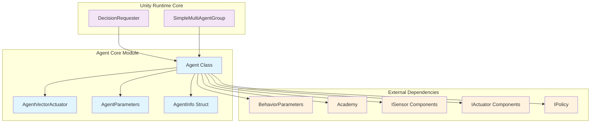
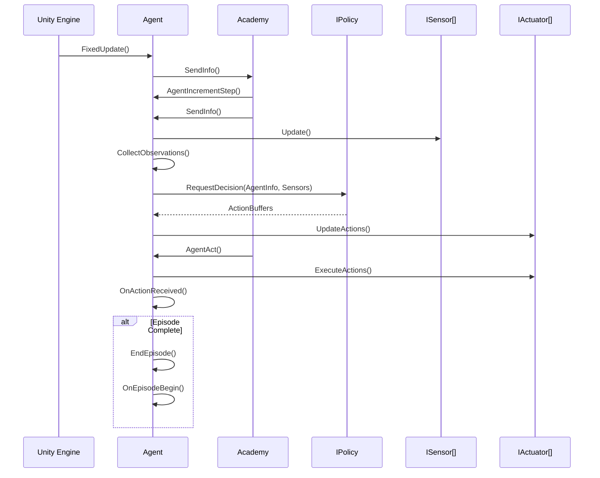
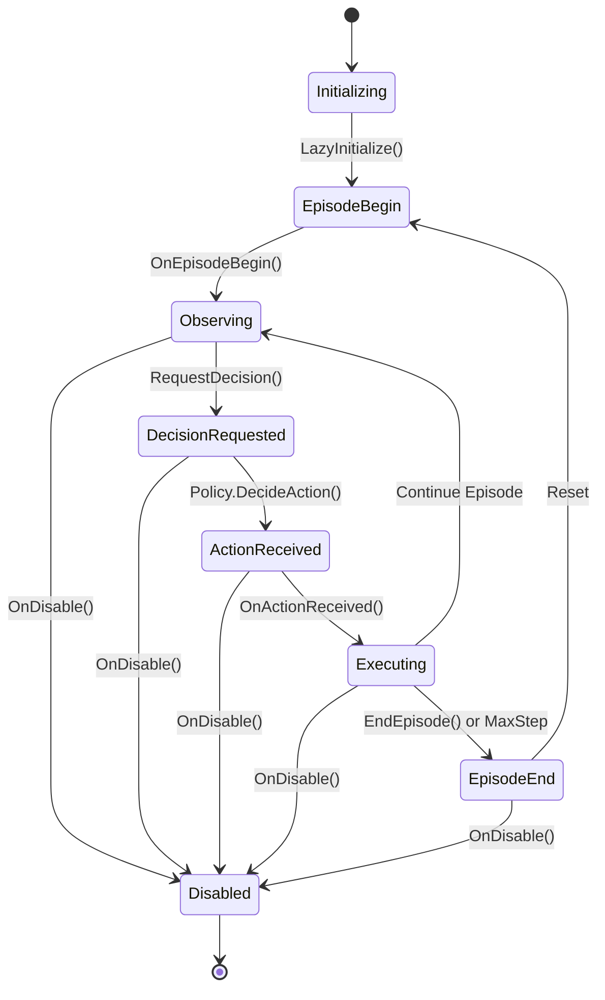

# Agent Core Module

The agent_core module forms the foundational layer of Unity ML-Agents, providing the core Agent class and essential components that enable intelligent behavior in Unity environments. This module serves as the primary interface between Unity GameObjects and the ML-Agents learning system.

## Overview

The agent_core module contains the fundamental building blocks for creating intelligent agents in Unity:

- **Agent**: The main class that Unity GameObjects inherit from to become ML-Agents
- **AgentVectorActuator**: Specialized actuator for agent vector actions
- **AgentParameters**: Configuration parameters for agent behavior
- **AgentInfo**: Data structure containing agent state information

This module acts as the bridge between Unity's GameObject system and the ML-Agents training pipeline, handling observation collection, action execution, and episode management.

## Architecture



## Core Components

### Agent Class

The `Agent` class is the central component that Unity GameObjects inherit from to participate in ML-Agents training and inference.

**Key Responsibilities:**
- **Observation Collection**: Gathers environmental data through sensors
- **Action Execution**: Receives and executes actions from policies
- **Episode Management**: Handles episode lifecycle (begin, step, end)
- **Reward Management**: Tracks and accumulates rewards
- **State Management**: Maintains agent state and metadata

**Core Methods:**
- `CollectObservations(VectorSensor)`: Implement to define agent observations
- `OnActionReceived(ActionBuffers)`: Implement to define action behavior
- `OnEpisodeBegin()`: Called at the start of each episode
- `Heuristic(ActionBuffers)`: Implement manual control logic
- `RequestDecision()`: Request a new decision from the policy
- `RequestAction()`: Request action execution with current decision

### AgentVectorActuator

A specialized wrapper around `VectorActuator` that provides agent-specific action handling.

**Features:**
- Inherits from `VectorActuator` for standard action processing
- Overrides `GetBuiltInActuatorType()` to return `AgentVectorActuator` type
- Enables distinction from standard vector actuators in the system

### AgentParameters

Internal configuration structure for agent behavior parameters.

**Properties:**
- `maxStep`: Maximum number of steps before episode termination

### AgentInfo

Data structure containing comprehensive agent state information for communication with the training system.

**Key Fields:**
- `storedActions`: Last actions taken by the agent
- `discreteActionMasks`: Masks for prohibited discrete actions
- `reward`: Current step reward
- `groupReward`: Group-based reward
- `done`: Episode completion status
- `maxStepReached`: Maximum step limit reached flag
- `episodeId`: Unique episode identifier
- `groupId`: Multi-agent group identifier

## Data Flow



## Episode Lifecycle



## Integration Points

### With Unity Runtime Core

The agent_core module integrates closely with other unity_runtime_core components:

- **[decision_management](decision_management.md)**: DecisionRequester drives agent decision timing
- **[multi_agent_coordination](multi_agent_coordination.md)**: SimpleMultiAgentGroup coordinates multiple agents

### With Unity Systems

- **[unity_sensors](unity_sensors.md)**: Provides observation capabilities through various sensor types
- **[unity_actuators](unity_actuators.md)**: Enables action execution through actuator components
- **[unity_policies](unity_policies.md)**: Receives decisions from different policy implementations

### With Training Pipeline

- **[training_core](training_core.md)**: Provides agent state information for training
- **[python_environment](python_environment.md)**: Communicates through Academy for external training

## Configuration

### Behavior Parameters

Agents are configured through the `BehaviorParameters` component:

```csharp
// Example agent configuration
public class MyAgent : Agent
{
    public override void Initialize()
    {
        // Set maximum steps for training episodes
        MaxStep = 1000;
    }
    
    public override void CollectObservations(VectorSensor sensor)
    {
        // Add observations
        sensor.AddObservation(transform.position);
        sensor.AddObservation(transform.rotation);
    }
    
    public override void OnActionReceived(ActionBuffers actions)
    {
        // Execute actions
        var movement = actions.ContinuousActions[0];
        var rotation = actions.ContinuousActions[1];
        
        // Apply movement and rotation
        transform.Translate(Vector3.forward * movement);
        transform.Rotate(Vector3.up * rotation);
    }
}
```

### Decision Timing

Agents can request decisions through multiple mechanisms:

1. **Manual Control**: Call `RequestDecision()` explicitly
2. **DecisionRequester Component**: Automatic decision requests at specified intervals
3. **Custom Logic**: Implement decision timing based on game state

## Performance Considerations

### Memory Management

- **Action Buffers**: Reused between steps to minimize allocations
- **Sensor Data**: Efficiently managed through sensor update cycles
- **State Information**: AgentInfo structure optimized for frequent updates

### Execution Optimization

- **Lazy Initialization**: Components initialized only when needed
- **Batch Processing**: Multiple agents processed together by Academy
- **Sensor Caching**: Observations cached and reused when possible

## Error Handling

The Agent class includes comprehensive error checking:

- **Initialization Validation**: Ensures proper setup before operation
- **Recursion Detection**: Prevents infinite loops in observation collection
- **NaN/Infinity Checks**: Validates reward values for numerical stability
- **State Consistency**: Maintains consistent agent state across episodes

## Best Practices

### Agent Implementation

1. **Always call base methods** when overriding Agent lifecycle functions
2. **Implement deterministic observations** for consistent training
3. **Use appropriate reward scaling** (typically -1 to 1 range)
4. **Handle episode termination** properly with `EndEpisode()`

### Performance Optimization

1. **Minimize allocations** in frequently called methods
2. **Cache expensive calculations** in observation collection
3. **Use efficient data structures** for agent state
4. **Batch agent operations** when possible

### Debugging Support

1. **Implement Heuristic methods** for manual testing
2. **Use appropriate logging** for state tracking
3. **Validate observation consistency** across episodes
4. **Test episode boundaries** thoroughly

## Related Documentation

- [decision_management](decision_management.md) - Decision timing and request handling
- [multi_agent_coordination](multi_agent_coordination.md) - Multi-agent group coordination
- [unity_sensors](unity_sensors.md) - Observation collection systems
- [unity_actuators](unity_actuators.md) - Action execution systems
- [unity_policies](unity_policies.md) - Decision-making policies
- [training_core](training_core.md) - Training system integration