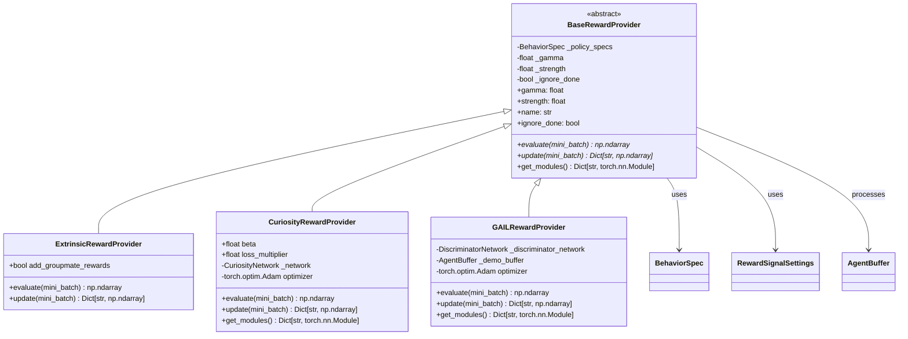
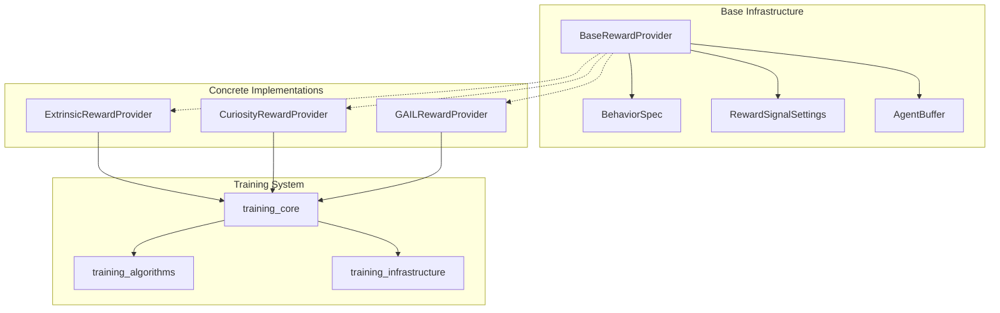
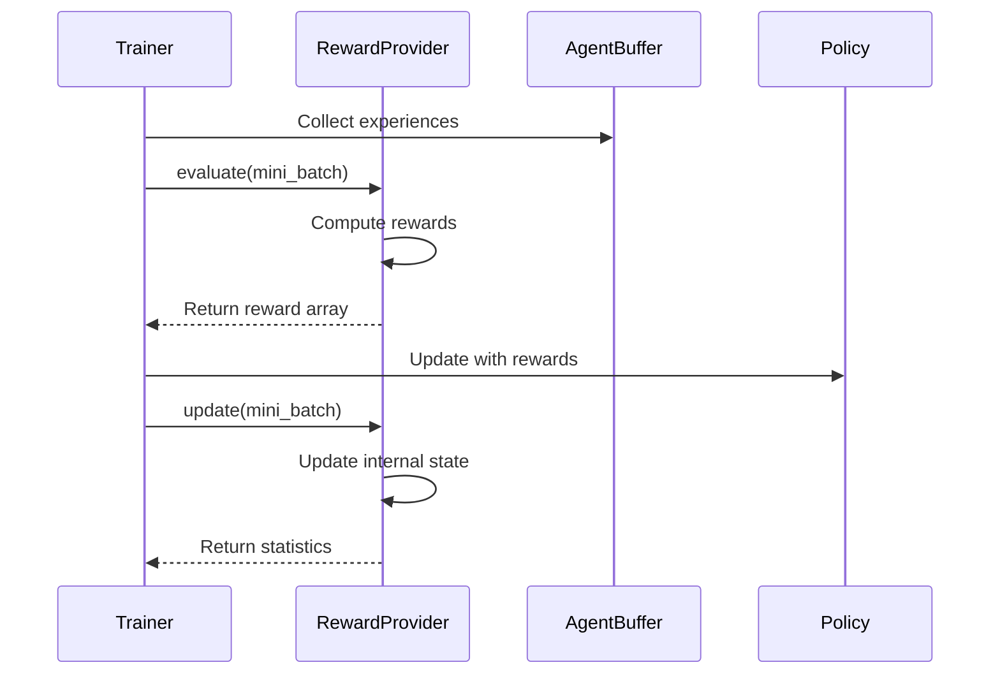
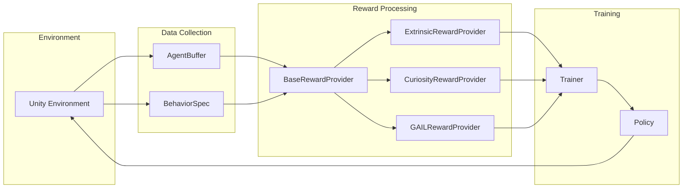

# Base Reward Infrastructure Module

## Overview

The `base_reward_infrastructure` module provides the foundational architecture for all reward systems in the ML-Agents framework. It defines the abstract base class `BaseRewardProvider` that establishes the contract and common functionality for all reward providers, enabling a pluggable and extensible reward system architecture.

This module serves as the cornerstone of the reward systems ecosystem, providing standardized interfaces for reward evaluation, updating, and configuration management across different reward types including extrinsic rewards, curiosity-driven rewards, and imitation learning rewards.

## Architecture

### Core Components

#### BaseRewardProvider (Abstract Base Class)

The `BaseRewardProvider` is an abstract base class that defines the fundamental interface and shared functionality for all reward providers in the ML-Agents framework.

**Key Responsibilities:**
- Defines the contract for reward evaluation and updating
- Manages common reward properties (gamma, strength, ignore_done)
- Provides standardized naming conventions
- Handles PyTorch module management for serialization

**Core Properties:**
- `gamma`: Discount factor for reward signal calculation
- `strength`: Multiplier for reward signal strength
- `name`: Identifier derived from class name for reporting
- `ignore_done`: Flag for handling episode termination in reward calculation

### Architecture Diagram



### Component Relationships



## Core Functionality

### Reward Provider Interface

The `BaseRewardProvider` defines two critical abstract methods that all concrete implementations must provide:

#### evaluate(mini_batch: AgentBuffer) → np.ndarray
- **Purpose**: Computes reward values for a batch of agent experiences
- **Input**: `AgentBuffer` containing agent experience data
- **Output**: NumPy array of reward values
- **Usage**: Called during policy evaluation and value function updates

#### update(mini_batch: AgentBuffer) → Dict[str, np.ndarray]
- **Purpose**: Updates internal reward provider state based on experience data
- **Input**: `AgentBuffer` containing training data
- **Output**: Dictionary of statistics for monitoring and logging
- **Usage**: Called during training to adapt reward mechanisms

### Configuration Management

The base class handles common configuration through `RewardSignalSettings`:

- **Gamma (γ)**: Discount factor for future rewards (0.0 to 1.0)
- **Strength**: Multiplier applied to reward signals for balancing multiple reward types
- **Ignore Done**: Controls whether episode termination affects reward calculation

### Module Management

The `get_modules()` method provides a standardized way to access PyTorch modules for:
- Model serialization and deserialization
- Parameter sharing across training components
- Checkpoint management

## Integration with ML-Agents Framework

### Training Pipeline Integration



### Data Flow Architecture



## Implementation Patterns

### Reward Provider Lifecycle

1. **Initialization**: Configure with `BehaviorSpec` and `RewardSignalSettings`
2. **Evaluation**: Process agent experiences to generate reward signals
3. **Update**: Adapt internal mechanisms based on training data
4. **Serialization**: Save/load state through module management

### Common Implementation Patterns

```python
class CustomRewardProvider(BaseRewardProvider):
    def __init__(self, specs: BehaviorSpec, settings: RewardSignalSettings):
        super().__init__(specs, settings)
        # Initialize custom components
        
    def evaluate(self, mini_batch: AgentBuffer) -> np.ndarray:
        # Extract relevant data from mini_batch
        # Compute reward values
        # Return as numpy array
        
    def update(self, mini_batch: AgentBuffer) -> Dict[str, np.ndarray]:
        # Update internal state
        # Return training statistics
        
    def get_modules(self) -> Dict[str, torch.nn.Module]:
        # Return PyTorch modules for serialization
```

## Dependencies and Relationships

### Internal Dependencies
- **[training_core](training_core.md)**: Integrates with trainer abstractions and policy systems
- **[training_infrastructure](training_infrastructure.md)**: Uses configuration and optimization infrastructure
- **[python_environment](python_environment.md)**: Receives data through environment interfaces

### External Dependencies
- **PyTorch**: Neural network modules and tensor operations
- **NumPy**: Numerical computations and array operations
- **ML-Agents Core**: Buffer management and behavior specifications

### Child Modules
- **[extrinsic_rewards](extrinsic_rewards.md)**: Environment-provided reward signals
- **[curiosity_rewards](curiosity_rewards.md)**: Intrinsic motivation through curiosity
- **[imitation_learning_rewards](imitation_learning_rewards.md)**: GAIL-based reward learning

## Configuration and Settings

### RewardSignalSettings Structure
```yaml
reward_signals:
  extrinsic:
    gamma: 0.99
    strength: 1.0
  curiosity:
    gamma: 0.99
    strength: 0.02
    learning_rate: 3.0e-4
  gail:
    gamma: 0.99
    strength: 1.0
    demo_path: "path/to/demonstrations"
```

### BehaviorSpec Integration
The base provider uses `BehaviorSpec` to understand:
- Observation space dimensions
- Action space configuration
- Agent behavior parameters

## Performance Considerations

### Memory Management
- Efficient batch processing through vectorized operations
- Minimal memory allocation during evaluation
- Proper cleanup of temporary tensors

### Computational Efficiency
- Abstract methods encourage optimized implementations
- Standardized interfaces enable caching and optimization
- Modular design supports selective reward computation

## Error Handling and Validation

### Input Validation
- Validates `AgentBuffer` structure and content
- Ensures compatibility with `BehaviorSpec`
- Checks configuration parameter ranges

### Error Recovery
- Graceful handling of malformed input data
- Fallback mechanisms for missing buffer keys
- Comprehensive error reporting for debugging

## Testing and Quality Assurance

### Unit Testing Patterns
```python
def test_reward_provider_interface():
    # Test abstract method enforcement
    # Validate property accessors
    # Check configuration handling

def test_reward_evaluation():
    # Test reward computation accuracy
    # Validate output shapes and types
    # Check edge cases and boundary conditions
```

### Integration Testing
- End-to-end reward pipeline validation
- Multi-agent scenario testing
- Performance benchmarking

## Future Extensibility

### Plugin Architecture
The abstract base class design enables:
- Custom reward provider implementations
- Third-party reward system integration
- Research experiment flexibility

### Planned Enhancements
- Advanced reward shaping mechanisms
- Multi-objective reward optimization
- Hierarchical reward structures
- Real-time reward adaptation

## Best Practices

### Implementation Guidelines
1. **Inherit from BaseRewardProvider**: Always extend the base class
2. **Implement Required Methods**: Provide concrete `evaluate()` and `update()` implementations
3. **Handle Edge Cases**: Validate inputs and handle empty batches
4. **Optimize Performance**: Use vectorized operations and efficient data structures
5. **Provide Statistics**: Return meaningful metrics from `update()` method

### Configuration Recommendations
- Set appropriate gamma values for reward horizons
- Balance strength parameters across multiple reward signals
- Consider ignore_done flag for continuous tasks
- Monitor reward statistics during training

## Troubleshooting

### Common Issues
1. **Shape Mismatches**: Ensure reward arrays match batch dimensions
2. **NaN Values**: Check for division by zero or invalid computations
3. **Memory Leaks**: Properly manage PyTorch tensors and gradients
4. **Configuration Errors**: Validate settings compatibility

### Debugging Tools
- Reward signal visualization
- Statistical monitoring
- Gradient flow analysis
- Performance profiling

This base reward infrastructure module provides the essential foundation for all reward mechanisms in ML-Agents, enabling flexible, extensible, and efficient reward system implementations across diverse reinforcement learning scenarios.