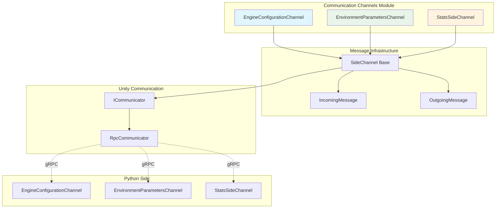
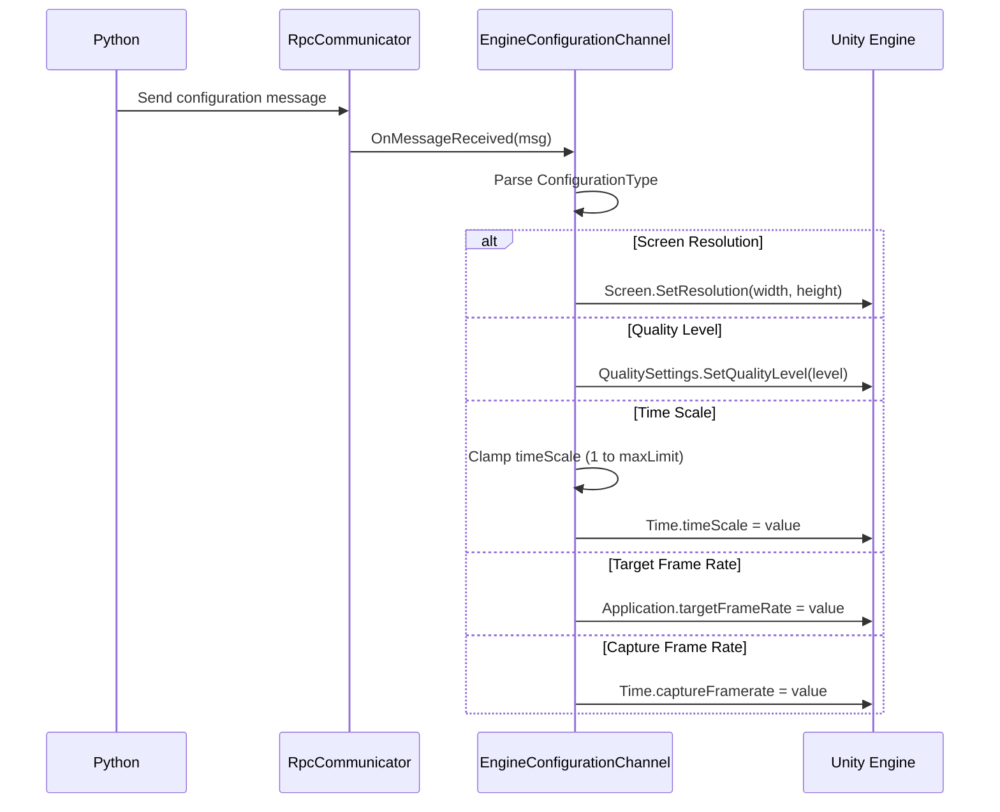
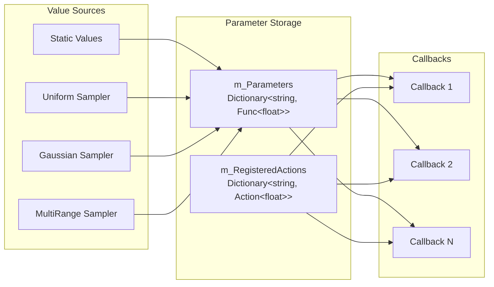
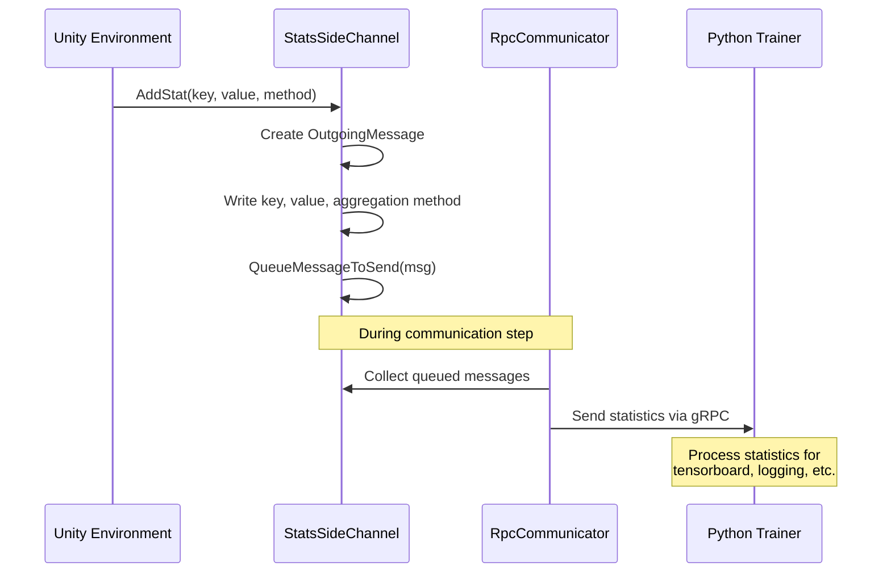
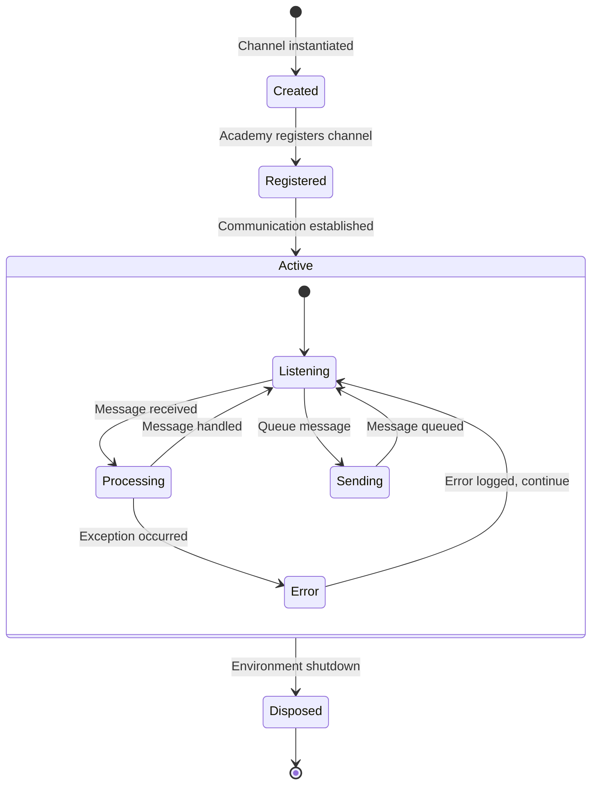

# Communication Channels Module

The communication_channels module provides specialized side channels for bidirectional communication between Unity environments and external Python training processes. This module implements three core channel types that handle engine configuration, environment parameters, and statistics reporting.

## Architecture Overview

The communication_channels module is part of the broader [unity_side_channels](unity_side_channels.md) system and works in conjunction with the [message_infrastructure](message_infrastructure.md) to enable real-time parameter exchange and control during ML training sessions.



## Core Components

### EngineConfigurationChannel

The `EngineConfigurationChannel` enables remote control of Unity engine settings during training, allowing Python scripts to dynamically adjust rendering and performance parameters.

**Key Features:**
- Screen resolution modification
- Quality level adjustment
- Time scale control with safety limits
- Frame rate configuration
- Capture frame rate settings

**Configuration Types:**
```csharp
internal enum ConfigurationType : int
{
    ScreenResolution = 0,    // Width/Height adjustment
    QualityLevel = 1,        // Unity quality settings
    TimeScale = 2,           // Simulation speed (clamped 1-100 in editor)
    TargetFrameRate = 3,     // Application target FPS
    CaptureFrameRate = 4     // Recording frame rate
}
```

**Message Processing Flow:**


### EnvironmentParametersChannel

The `EnvironmentParametersChannel` manages dynamic environment parameters that can be adjusted during training, supporting both static values and statistical samplers for curriculum learning and domain randomization.

**Supported Data Types:**
- **Float**: Static floating-point values
- **Sampler**: Statistical distributions for parameter randomization

**Sampler Types:**
```csharp
internal enum SamplerType
{
    Uniform = 0,           // Uniform distribution [min, max]
    Gaussian = 1,          // Normal distribution (mean, stddev)
    MultiRangeUniform = 2  // Multiple uniform ranges
}
```

**Parameter Management:**


**API Methods:**
- `GetWithDefault(string key, float defaultValue)`: Retrieve parameter value with fallback
- `RegisterCallback(string key, Action<float> action)`: Register parameter change callbacks
- `ListParameters()`: Get all registered parameter keys

### StatsSideChannel

The `StatsSideChannel` provides unidirectional statistics reporting from Unity to Python, enabling real-time monitoring of training metrics and environment state.

**Aggregation Methods:**
- **Average**: Mean value over summary period
- **MostRecent**: Latest value only (worker 0 in multi-environment setups)
- **Sum**: Cumulative sum over period
- **Histogram**: Distribution of values

**Statistics Flow:**


## Integration with Unity ML-Agents

### Dependency Relationships

The communication_channels module integrates with several other system components:

**Direct Dependencies:**
- [message_infrastructure](message_infrastructure.md): Uses `IncomingMessage` and `OutgoingMessage` for serialization
- [unity_communication](unity_communication.md): Channels are managed by `ICommunicator` implementations

**Related Systems:**
- [python_side_channels](python_side_channels.md): Python counterparts for bidirectional communication
- [training_core](training_core.md): Consumes statistics and provides environment parameters

### Channel Registration and Lifecycle



## Message Protocol

### Message Structure

All communication channels use a binary message protocol with type-specific payloads:

**EngineConfigurationChannel Messages:**
```
[ConfigurationType:int32] [Parameters...]

ScreenResolution: [width:int32] [height:int32]
QualityLevel: [level:int32]
TimeScale: [scale:float32]
TargetFrameRate: [fps:int32]
CaptureFrameRate: [fps:int32]
```

**EnvironmentParametersChannel Messages:**
```
[key:string] [type:int32] [TypeSpecificData...]

Float: [value:float32]
Sampler: [seed:int32] [samplerType:int32] [SamplerParameters...]
```

**StatsSideChannel Messages:**
```
[key:string] [value:float32] [aggregationMethod:int32]
```

### Error Handling

The communication channels implement robust error handling:

1. **Message Processing**: Exceptions are caught and logged without crashing the system
2. **Parameter Validation**: Invalid configurations are rejected with warnings
3. **Graceful Degradation**: Missing parameters return default values
4. **Version Compatibility**: Unknown message types generate compatibility warnings

## Performance Considerations

### Memory Management

- **Message Pooling**: `IncomingMessage` and `OutgoingMessage` implement `IDisposable` for proper cleanup
- **Queue Management**: Message queues are cleared after each communication step
- **Parameter Caching**: Environment parameters are cached as `Func<float>` delegates

### Threading Safety

- Channels are designed for single-threaded access from the main Unity thread
- Parameter callbacks are executed synchronously during message processing
- Statistics are queued immediately and sent during the next communication step

## Usage Examples

### Engine Configuration
```csharp
// Python side sends configuration
engine_channel.set_configuration_parameters(
    width=1920, height=1080,
    quality_level=3,
    time_scale=2.0
)
```

### Environment Parameters
```csharp
// Unity side retrieves parameters
float gravity = envParams.GetWithDefault("gravity", -9.81f);
float windSpeed = envParams.GetWithDefault("wind_speed", 0.0f);

// Register callback for dynamic updates
envParams.RegisterCallback("difficulty", (value) => {
    SetDifficultyLevel(value);
});
```

### Statistics Reporting
```csharp
// Report training statistics
statsChannel.AddStat("episode_reward", totalReward, StatAggregationMethod.Average);
statsChannel.AddStat("episode_length", stepCount, StatAggregationMethod.MostRecent);
statsChannel.AddStat("collision_count", collisions, StatAggregationMethod.Sum);
```

## Related Documentation

- [unity_side_channels](unity_side_channels.md) - Parent module overview
- [message_infrastructure](message_infrastructure.md) - Message serialization system
- [unity_communication](unity_communication.md) - Communication layer
- [python_side_channels](python_side_channels.md) - Python counterparts
- [training_core](training_core.md) - Training system integration