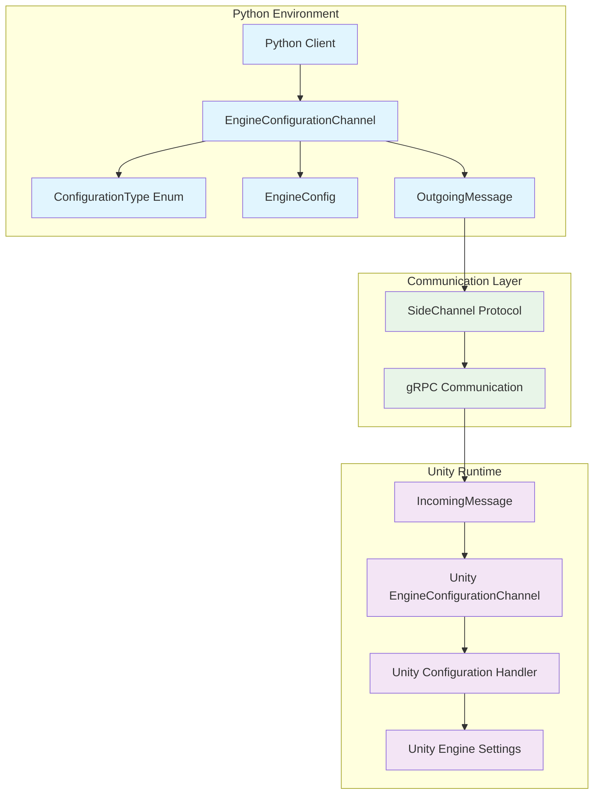
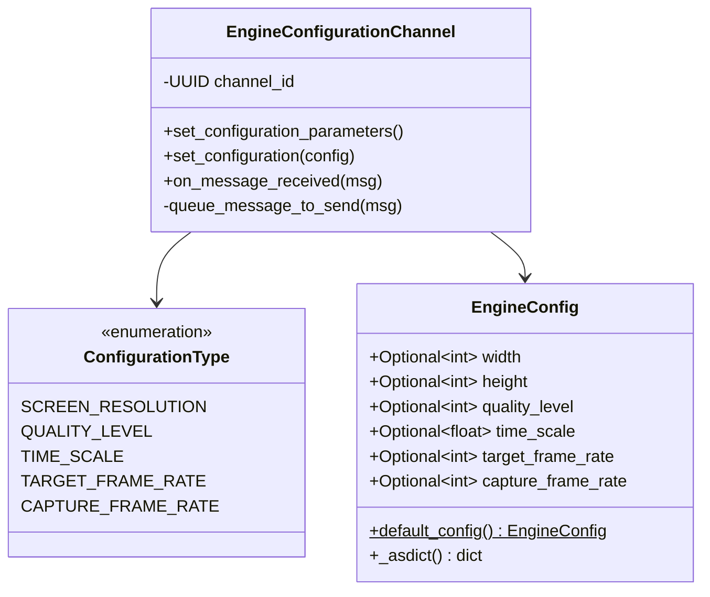
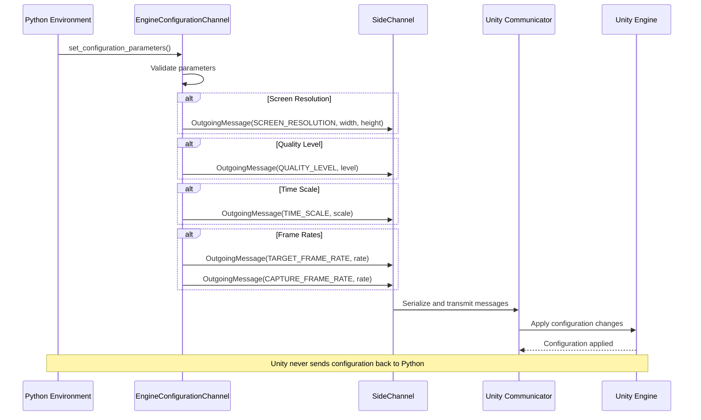
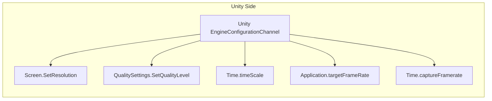

# Configuration Channels Module

The configuration_channels module provides engine configuration management capabilities within the ML-Agents side channel communication system. This module enables Python training environments to dynamically configure Unity engine parameters during runtime, including display settings, quality levels, time scaling, and frame rate controls.

## Module Overview

The configuration_channels module is part of the [python_side_channels](python_side_channels.md) system and serves as a specialized communication channel for engine configuration between Python training environments and Unity runtime. It implements a unidirectional configuration protocol where Python environments send configuration commands to Unity, but Unity never sends configuration data back to Python.

### Key Capabilities

- **Display Configuration**: Dynamic screen resolution adjustment
- **Quality Management**: Runtime quality level modification
- **Time Control**: Simulation time scaling for training acceleration
- **Frame Rate Management**: Target and capture frame rate configuration
- **Type-Safe Configuration**: Enumerated configuration types with validation

## Architecture



## Core Components

### ConfigurationType Enum

The `ConfigurationType` enum defines the supported engine configuration parameters:

```python
class ConfigurationType(IntEnum):
    SCREEN_RESOLUTION = 0    # Display width/height
    QUALITY_LEVEL = 1        # Graphics quality setting
    TIME_SCALE = 2           # Simulation time multiplier
    TARGET_FRAME_RATE = 3    # Target rendering frame rate
    CAPTURE_FRAME_RATE = 4   # Fixed timestep frame rate
```

### EngineConfig Data Structure



## Communication Protocol

### Message Flow



### Data Serialization

Each configuration parameter is serialized as a specific message format:

1. **Screen Resolution**: `[ConfigurationType.SCREEN_RESOLUTION, width, height]`
2. **Quality Level**: `[ConfigurationType.QUALITY_LEVEL, level]`
3. **Time Scale**: `[ConfigurationType.TIME_SCALE, scale]`
4. **Target Frame Rate**: `[ConfigurationType.TARGET_FRAME_RATE, rate]`
5. **Capture Frame Rate**: `[ConfigurationType.CAPTURE_FRAME_RATE, rate]`

## Integration Points

### Dependencies

The configuration_channels module depends on:

- **[message_infrastructure](unity_side_channels.md#message_infrastructure)**: For `OutgoingMessage` and `IncomingMessage` handling
- **[unity_communication](unity_communication.md)**: For gRPC-based message transmission
- **Base SideChannel Protocol**: For channel registration and message queuing

### Unity Runtime Integration



The Unity runtime counterpart processes incoming configuration messages and applies them to the appropriate Unity engine systems:

- **Screen Resolution**: Applied via `Screen.SetResolution()`
- **Quality Level**: Applied via `QualitySettings.SetQualityLevel()`
- **Time Scale**: Applied via `Time.timeScale` with validation
- **Frame Rates**: Applied via `Application.targetFrameRate` and `Time.captureFramerate`

## Usage Patterns

### Basic Configuration

```python
# Create channel and set basic configuration
config_channel = EngineConfigurationChannel()
config_channel.set_configuration_parameters(
    width=1920,
    height=1080,
    quality_level=2,
    time_scale=10.0
)
```

### Structured Configuration

```python
# Use EngineConfig for structured configuration
config = EngineConfig(
    width=800,
    height=600,
    quality_level=1,
    time_scale=5.0,
    target_frame_rate=60,
    capture_frame_rate=30
)
config_channel.set_configuration(config)
```

### Training Optimization

```python
# Optimize for fast training
config_channel.set_configuration_parameters(
    width=80,           # Low resolution for speed
    height=80,
    quality_level=0,    # Lowest quality
    time_scale=20.0,    # Accelerated time
    target_frame_rate=-1,  # Unlimited
    capture_frame_rate=60   # Fixed timestep
)
```

## Error Handling

### Validation Rules

1. **Screen Resolution**: Width and height must be set together or both omitted
2. **Time Scale**: Must be positive (Unity enforces minimum of 1.0)
3. **Quality Level**: Must be valid Unity quality setting index
4. **Frame Rates**: Must be positive integers or -1 for unlimited

### Exception Types

- `UnitySideChannelException`: Parameter validation failures
- `UnityCommunicationException`: Unexpected messages from Unity

## Performance Considerations

### Configuration Impact

- **Time Scale**: Higher values accelerate training but may cause physics instability
- **Quality Level**: Lower levels improve performance but reduce visual fidelity
- **Frame Rate**: Uncapped frame rates maximize training speed
- **Resolution**: Lower resolutions significantly improve performance for visual observations

### Best Practices

1. **Training Phase**: Use minimal quality settings and high time scale
2. **Evaluation Phase**: Use production-quality settings with normal time scale
3. **Visual Training**: Balance resolution with training speed requirements
4. **Batch Configuration**: Set all parameters together to minimize message overhead

## Related Modules

- **[parameter_channels](parameter_channels.md)**: For environment parameter configuration
- **[data_exchange_channels](data_exchange_channels.md)**: For runtime data exchange
- **[unity_side_channels](unity_side_channels.md)**: For Unity-side channel implementations
- **[python_environment](python_environment.md)**: For environment wrapper integration
- **[unity_communication](unity_communication.md)**: For underlying communication protocol

## Future Considerations

### Potential Enhancements

1. **Bidirectional Configuration**: Allow Unity to report current configuration state
2. **Dynamic Quality Adjustment**: Automatic quality scaling based on performance metrics
3. **Configuration Profiles**: Predefined configuration sets for different training phases
4. **Validation Feedback**: Unity-side validation with error reporting
5. **Extended Parameters**: Additional engine settings like physics timestep, rendering pipeline options