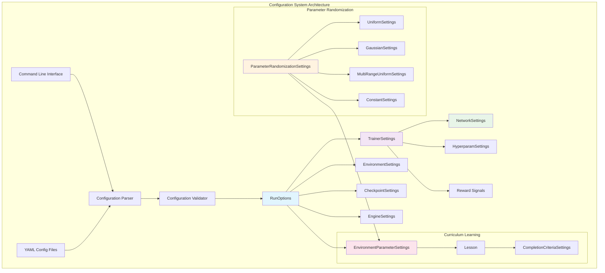
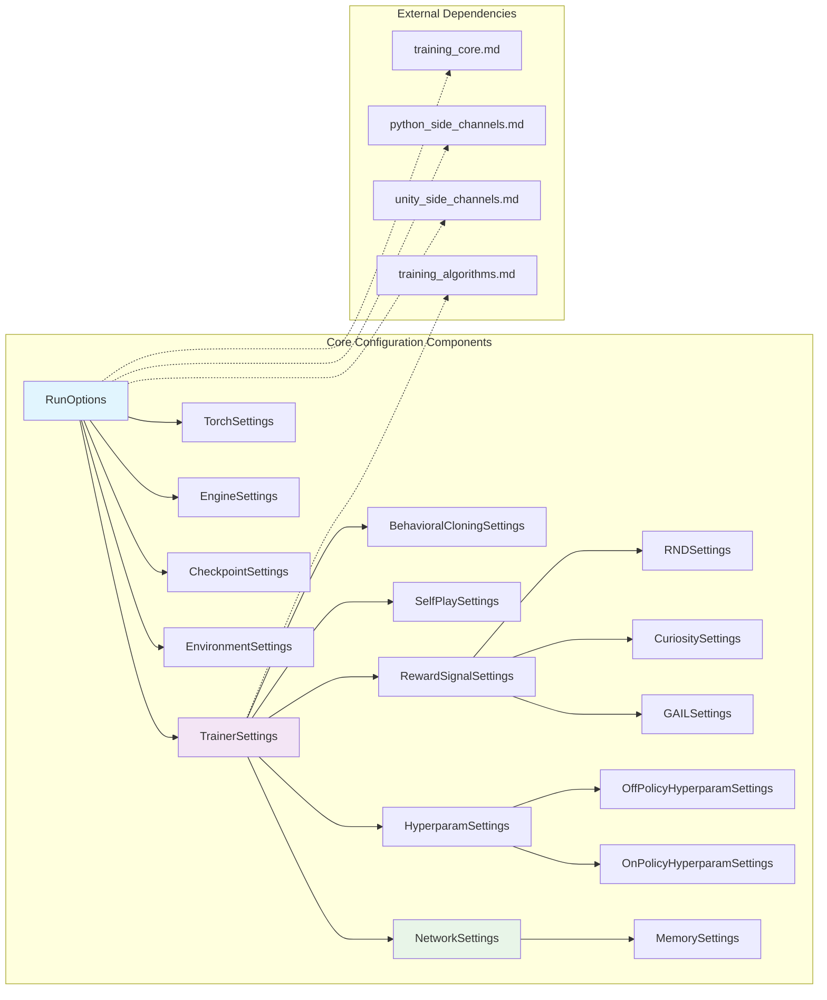
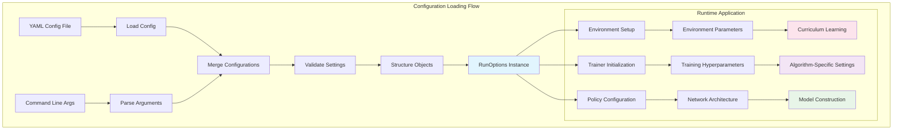
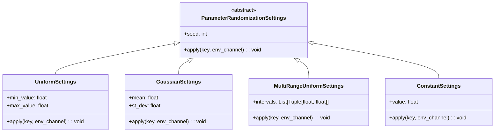
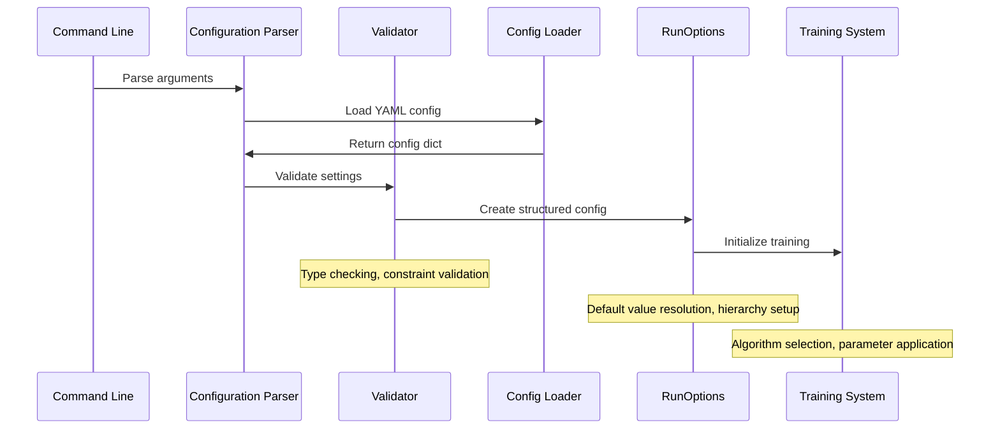

# Configuration System Documentation

## Introduction

The Configuration System module is a critical component of the ML-Agents training infrastructure that manages all configuration aspects for machine learning training workflows. It provides a comprehensive framework for defining, validating, and managing training parameters, hyperparameters, environment settings, and runtime options through a hierarchical configuration system built on YAML-based configuration files and command-line interfaces.

## Core Functionality

The configuration system enables:
- **Centralized Configuration Management**: Unified system for managing all training-related settings
- **Parameter Validation**: Comprehensive validation of configuration parameters with meaningful error messages
- **Hierarchical Configuration**: Support for nested configuration structures with inheritance and overrides
- **Runtime Flexibility**: Dynamic configuration loading with command-line argument precedence
- **Curriculum Learning**: Advanced configuration for progressive learning scenarios
- **Multi-Environment Support**: Configuration management for complex multi-agent and multi-environment setups

## Architecture Overview



## Component Relationships



## Data Flow Architecture



## Key Components

### RunOptions

The central configuration container that orchestrates all training settings:

- **Purpose**: Main configuration entry point containing all subsystem settings
- **Key Features**:
  - Hierarchical configuration structure
  - YAML and CLI argument integration
  - Validation and error handling
  - Default value management
- **Dependencies**: Integrates with [training_core.md](training_core.md) for trainer initialization

### TrainerSettings

Core trainer configuration management with algorithm-specific parameters:

- **Purpose**: Define training algorithm parameters and behavior-specific settings
- **Key Features**:
  - Algorithm-agnostic base configuration
  - Dynamic hyperparameter selection
  - Checkpoint and resumption settings
  - Reward signal configuration
- **Integration**: Works with [training_algorithms.md](training_algorithms.md) for algorithm-specific implementations

### NetworkSettings

Neural network architecture configuration:

- **Purpose**: Define network topology and training characteristics
- **Key Features**:
  - Layer configuration (hidden units, layers)
  - Memory settings for recurrent networks
  - Encoder type selection
  - Normalization options
- **Integration**: Connects with [network_architecture.md](network_architecture.md) for model construction

### Parameter Randomization System

Advanced parameter sampling for curriculum learning and domain randomization:



### Curriculum Learning Framework

Sophisticated curriculum learning system with adaptive progression:

- **EnvironmentParameterSettings**: Manages lesson sequences for environment parameters
- **Lesson**: Individual curriculum steps with completion criteria
- **CompletionCriteriaSettings**: Defines advancement conditions based on progress or reward thresholds

## Configuration Processing Flow



## Environment Integration

The configuration system integrates extensively with environment management:

- **Side Channels**: Configuration delivery via [unity_side_channels.md](unity_side_channels.md) and [python_side_channels.md](python_side_channels.md)
- **Parameter Application**: Dynamic environment parameter updates during training
- **Multi-Environment Coordination**: Settings for parallel environment management

## Error Handling and Validation

Comprehensive validation system ensuring configuration integrity:

- **TrainerConfigError**: Configuration-specific exception handling
- **Parameter Validation**: Type checking, range validation, dependency verification
- **Warning System**: Non-critical configuration issues with fallback options
- **Default Resolution**: Intelligent default value management with override capabilities

## Integration Points

### Training System Integration
- **Trainer Initialization**: Configuration-driven trainer instantiation via [training_core.md](training_core.md)
- **Algorithm Configuration**: Parameter passing to algorithm-specific trainers in [training_algorithms.md](training_algorithms.md)
- **Policy Setup**: Network configuration for policy construction

### Environment Integration
- **Unity Environment**: Configuration delivery through Unity communication channels
- **Python Environment**: Parameter management for Python-based environments
- **Multi-Agent Coordination**: Settings for complex multi-agent scenarios

### Infrastructure Integration
- **Checkpoint Management**: Resume and initialization configuration
- **Logging and Monitoring**: Metrics collection and reporting settings
- **Resource Management**: GPU/CPU allocation and optimization settings

## Advanced Features

### Dynamic Configuration
- Runtime parameter updates during training
- Curriculum progression based on performance metrics
- Adaptive hyperparameter scheduling

### Extensibility
- Plugin architecture for custom configuration types
- Custom validator registration
- Algorithm-specific parameter extensions

### Performance Optimization
- Efficient configuration caching
- Minimal overhead parameter application
- Optimized serialization for distributed training

## Best Practices

1. **Configuration Organization**: Structure YAML files hierarchically for maintainability
2. **Parameter Validation**: Implement comprehensive validation for custom parameters
3. **Default Management**: Provide sensible defaults with clear override mechanisms
4. **Documentation**: Maintain clear parameter documentation and examples
5. **Version Compatibility**: Handle configuration migration for system updates

## Configuration Examples

### Basic Training Configuration
```yaml
behaviors:
  MyBehavior:
    trainer_type: ppo
    hyperparameters:
      learning_rate: 0.0003
      batch_size: 1024
    network_settings:
      hidden_units: 512
      num_layers: 3
```

### Curriculum Learning Configuration
```yaml
environment_parameters:
  difficulty:
    curriculum:
      - name: "easy"
        value: 0.1
        completion_criteria:
          measure: reward
          threshold: 0.8
          min_lesson_length: 100
      - name: "hard"
        value: 0.9
```

The Configuration System serves as the foundation for flexible, maintainable, and robust machine learning training workflows in ML-Agents, providing the necessary abstractions and validation to ensure reliable training execution across diverse scenarios and environments.