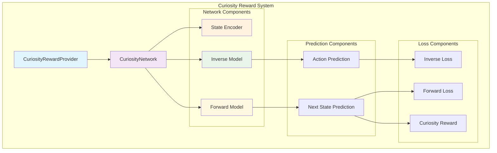
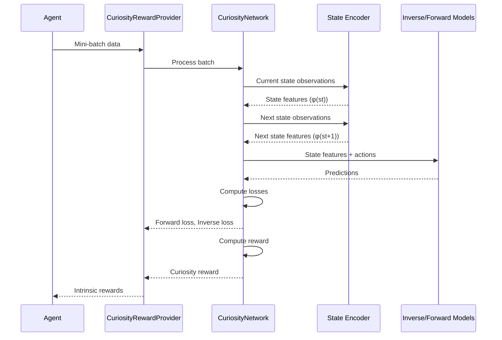
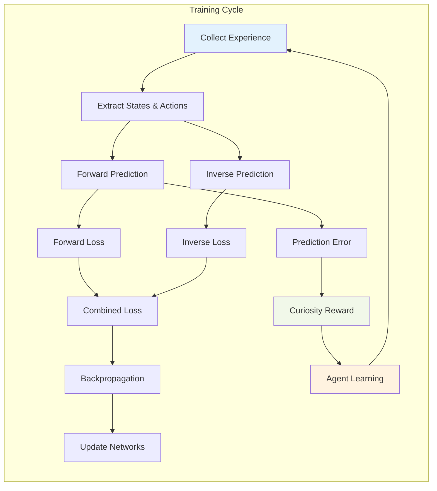

# Curiosity Rewards Module

The curiosity_rewards module implements intrinsic motivation through curiosity-driven exploration in reinforcement learning. It provides agents with internal rewards based on their ability to predict the consequences of their actions, encouraging exploration of novel states and behaviors.

## Overview

Curiosity-driven learning addresses the exploration problem in reinforcement learning by providing intrinsic rewards when agents encounter unexpected or novel situations. The module implements the Intrinsic Curiosity Module (ICM) approach, which uses prediction error as a proxy for novelty and generates rewards accordingly.

## Architecture



## Core Components

### CuriosityRewardProvider

The main interface for curiosity-based reward generation, extending the base reward provider framework.

**Key Features:**
- Implements intrinsic motivation through prediction error
- Manages curiosity network training and evaluation
- Integrates with the broader reward system architecture
- Provides configurable learning parameters

**Configuration Parameters:**
- `beta`: Balance between forward and inverse loss (default: 0.2)
- `loss_multiplier`: Scaling factor for loss computation (default: 10.0)
- `learning_rate`: Optimizer learning rate
- `strength`: Maximum reward scaling factor

### CuriosityNetwork

The neural network architecture implementing the Intrinsic Curiosity Module (ICM).

**Architecture Components:**

1. **State Encoder**: Processes observations into feature representations
2. **Inverse Model**: Predicts actions given current and next states
3. **Forward Model**: Predicts next state features given current state and action

## Data Flow



## Learning Process



## Component Interactions

### State Processing

The curiosity network processes agent observations through several stages:

1. **Feature Extraction**: Raw observations are encoded into feature representations
2. **State Comparison**: Current and next state features are compared
3. **Prediction Generation**: Models predict actions and next states
4. **Error Calculation**: Prediction errors generate curiosity signals

### Loss Computation

The system uses two complementary loss functions:

**Forward Loss**: Measures prediction error for next state features
```
L_forward = ||φ(st+1) - f(φ(st), at)||²
```

**Inverse Loss**: Measures prediction error for actions
```
L_inverse = ||at - g(φ(st), φ(st+1))||²
```

**Combined Loss**: Weighted combination of both losses
```
L_total = β * L_forward + (1-β) * L_inverse
```

## Integration Points

### Base Reward Infrastructure

The curiosity reward provider extends the [base_reward_infrastructure](base_reward_infrastructure.md) framework:

- Inherits from `BaseRewardProvider`
- Implements standard reward provider interface
- Integrates with reward aggregation systems
- Supports configuration through settings

### Training Infrastructure

Integrates with the [training_infrastructure](training_infrastructure.md) components:

- Uses PyTorch optimizers for network training
- Leverages network architecture components
- Integrates with training loop and batch processing
- Supports model serialization and loading

### Network Architecture

Utilizes components from [network_architecture](network_architecture.md):

- `NetworkBody` for observation processing
- `LinearEncoder` for feature transformation
- Standard layer utilities for model construction
- Action flattening for multi-modal action spaces

## Configuration

### CuriositySettings

The module is configured through `CuriositySettings` which includes:

- **Network Settings**: Architecture configuration for state encoder
- **Learning Rate**: Optimizer learning rate for curiosity network
- **Strength**: Scaling factor for curiosity rewards

### Memory Considerations

The curiosity network explicitly disables memory components:
- LSTM/GRU memory is not supported
- Warning issued if memory is specified in settings
- Stateless processing for efficiency

## Usage Patterns

### Training Integration

```python
# Curiosity rewards are automatically integrated during training
# Configuration through YAML settings:
curiosity:
  strength: 0.02
  learning_rate: 3.0e-4
  network_settings:
    hidden_units: 128
    num_layers: 2
```

### Reward Evaluation

The curiosity reward provider:
1. Processes mini-batches during training
2. Computes prediction errors as intrinsic rewards
3. Scales rewards by strength parameter
4. Returns rewards only after initial network update

### Loss Monitoring

Training metrics include:
- `Losses/Curiosity Forward Loss`: Next state prediction error
- `Losses/Curiosity Inverse Loss`: Action prediction error

## Performance Considerations

### Computational Efficiency

- State encoder shared between forward and inverse models
- Batch processing for efficient GPU utilization
- Gradient computation only during training updates
- Reward evaluation uses no-gradient context

### Memory Management

- Processes observations in batches
- Converts between NumPy and PyTorch tensors efficiently
- Uses default device for GPU acceleration
- Manages network parameters through PyTorch modules

## Dependencies

### Core Dependencies

- **PyTorch**: Neural network implementation and training
- **NumPy**: Numerical computations and data handling
- **Base Reward Provider**: Reward system integration
- **Network Components**: Architecture building blocks

### ML-Agents Integration

- **AgentBuffer**: Batch data management
- **BehaviorSpec**: Agent specification handling
- **ActionFlattener**: Multi-modal action processing
- **ModelUtils**: Tensor utilities and conversions

## Best Practices

### Configuration Guidelines

1. **Beta Parameter**: Balance exploration vs exploitation
   - Higher β emphasizes forward model accuracy
   - Lower β emphasizes inverse model accuracy
   - Default 0.2 works well for most environments

2. **Strength Parameter**: Control intrinsic reward magnitude
   - Should be smaller than extrinsic reward scale
   - Typical values: 0.01 - 0.1
   - Adjust based on environment reward scale

3. **Learning Rate**: Network training speed
   - Often lower than policy learning rate
   - Typical values: 1e-4 to 3e-4
   - Monitor loss convergence

### Environment Considerations

- Most effective in sparse reward environments
- Benefits exploration in complex state spaces
- May interfere with dense reward signals
- Consider reward scaling and normalization

## Troubleshooting

### Common Issues

1. **No Curiosity Rewards**: Check that network has been updated at least once
2. **Exploding Rewards**: Reduce strength parameter or loss multiplier
3. **Poor Exploration**: Increase strength or adjust beta parameter
4. **Memory Warnings**: Remove memory settings from network configuration

### Debugging Tools

- Monitor forward and inverse loss trends
- Visualize curiosity reward distributions
- Compare intrinsic vs extrinsic reward magnitudes
- Track prediction accuracy over training

## Related Modules

- [base_reward_infrastructure](base_reward_infrastructure.md): Core reward provider framework
- [extrinsic_rewards](extrinsic_rewards.md): Environment-provided rewards
- [training_infrastructure](training_infrastructure.md): Training system integration
- [network_architecture](network_architecture.md): Neural network components