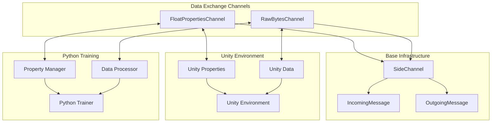
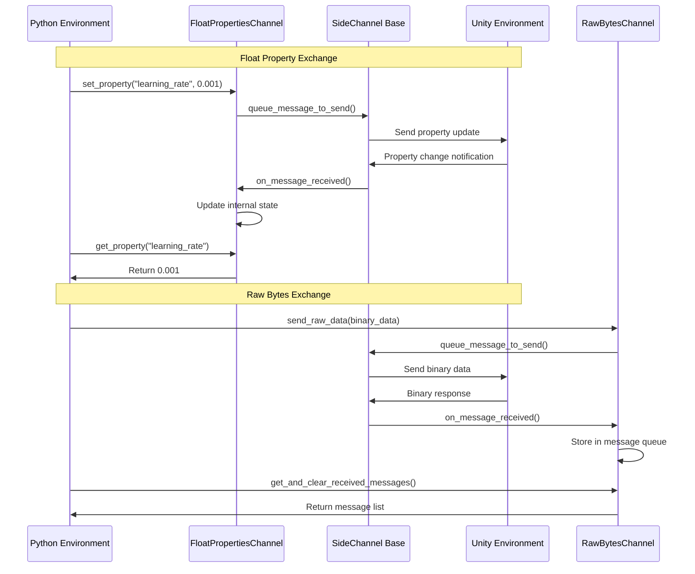
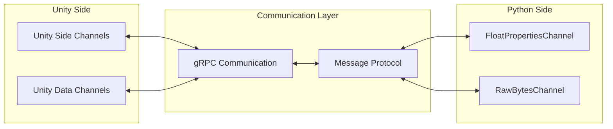
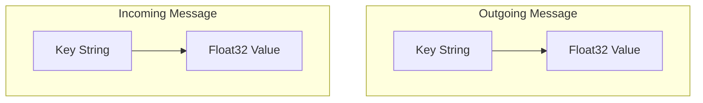
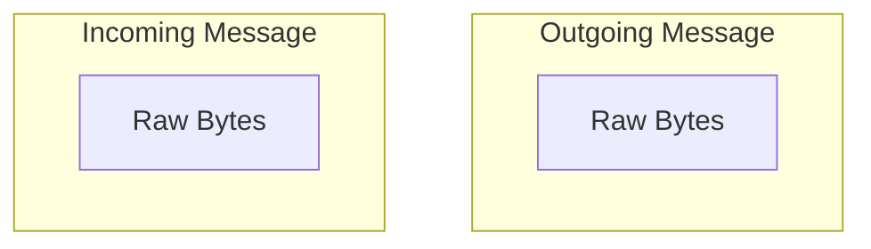

# Data Exchange Channels Module

The data_exchange_channels module provides specialized side channel implementations for exchanging different types of data between Unity environments and Python training processes in the ML-Agents framework.

## Overview

This module is part of the [python_side_channels](python_side_channels.md) system and implements concrete channel types for exchanging structured and unstructured data. It enables bidirectional communication of float properties and raw binary data between Unity and Python environments during training and inference.

## Architecture



## Core Components

### FloatPropertiesChannel

A specialized side channel for exchanging float properties between Unity and Python environments.

**Key Features:**
- **Property Management**: Set, get, and list float properties
- **Bidirectional Sync**: Automatic synchronization between Unity and Python
- **Type Safety**: Ensures all exchanged values are float type
- **Persistent Storage**: Maintains property state throughout training

**Core Methods:**
- `set_property(key, value)`: Sets a float property in Unity
- `get_property(key)`: Retrieves a property value
- `list_properties()`: Lists all available property keys
- `get_property_dict_copy()`: Returns a copy of all properties

### RawBytesChannel

A general-purpose side channel for exchanging arbitrary binary data.

**Key Features:**
- **Binary Data Exchange**: Handles raw byte arrays
- **Message Queuing**: Accumulates received messages
- **Flexible Format**: Supports any binary data format
- **Research Focus**: Designed for experimental use cases

**Core Methods:**
- `send_raw_data(data)`: Sends binary data to Unity
- `get_and_clear_received_messages()`: Retrieves and clears message queue

## Data Flow



## Integration with ML-Agents System

### Unity Communication Integration

The data exchange channels integrate with the broader [unity_communication](unity_communication.md) system:



### Training Integration

These channels support the [training_core](training_core.md) system by providing:

- **Hyperparameter Updates**: Dynamic adjustment of training parameters
- **Custom Data Exchange**: Research-specific data communication
- **Environment Configuration**: Runtime environment modifications

## Use Cases

### Float Properties Channel

1. **Dynamic Hyperparameter Tuning**
   ```python
   # Adjust learning rate during training
   channel.set_property("learning_rate", new_lr)
   ```

2. **Environment Configuration**
   ```python
   # Modify environment difficulty
   channel.set_property("difficulty_level", 0.8)
   ```

3. **Training Metrics Exchange**
   ```python
   # Get performance metrics from Unity
   fps = channel.get_property("frames_per_second")
   ```

### Raw Bytes Channel

1. **Custom Neural Network Weights**
   ```python
   # Send model weights to Unity
   channel.send_raw_data(serialized_weights)
   ```

2. **Research Data Collection**
   ```python
   # Collect experimental data
   data_samples = channel.get_and_clear_received_messages()
   ```

3. **Binary Protocol Implementation**
   ```python
   # Custom communication protocol
   channel.send_raw_data(protocol_message)
   ```

## Message Protocol

### Float Properties Protocol



### Raw Bytes Protocol



## Configuration and Setup

### Channel Initialization

```python
# Float Properties Channel with default UUID
float_channel = FloatPropertiesChannel()

# Raw Bytes Channel with custom UUID
import uuid
custom_id = uuid.uuid4()
bytes_channel = RawBytesChannel(custom_id)
```

### Environment Registration

Channels must be registered with the Unity environment:

```python
from mlagents_envs.environment import UnityEnvironment

env = UnityEnvironment()
env.register_side_channel(float_channel)
env.register_side_channel(bytes_channel)
```

## Error Handling and Best Practices

### Float Properties Channel

- **Type Validation**: Ensure values are float type before setting
- **Key Management**: Use consistent naming conventions for properties
- **State Synchronization**: Check property existence before retrieval

### Raw Bytes Channel

- **Memory Management**: Clear message queues regularly to prevent memory leaks
- **Data Validation**: Validate binary data format before processing
- **Message Ordering**: Handle potential message ordering issues

## Performance Considerations

### Optimization Strategies

1. **Batch Operations**: Group multiple property updates when possible
2. **Message Size**: Keep raw byte messages reasonably sized
3. **Frequency Control**: Limit high-frequency data exchanges
4. **Memory Usage**: Monitor memory consumption with large binary data

### Monitoring

```python
# Monitor channel performance
properties_count = len(float_channel.list_properties())
message_queue_size = len(bytes_channel._received_messages)
```

## Related Modules

- **[python_side_channels](python_side_channels.md)**: Parent module containing base side channel infrastructure
- **[unity_side_channels](unity_side_channels.md)**: Unity-side implementation of side channels
- **[unity_communication](unity_communication.md)**: Core communication infrastructure
- **[training_core](training_core.md)**: Training system that utilizes these channels
- **[configuration_channels](configuration_channels.md)**: Sibling module for configuration-specific channels
- **[parameter_channels](parameter_channels.md)**: Sibling module for parameter management channels

## Future Enhancements

- **Typed Data Channels**: Strongly typed channels for specific data structures
- **Compression Support**: Built-in compression for large binary data
- **Encryption**: Secure data exchange capabilities
- **Performance Metrics**: Built-in performance monitoring and reporting