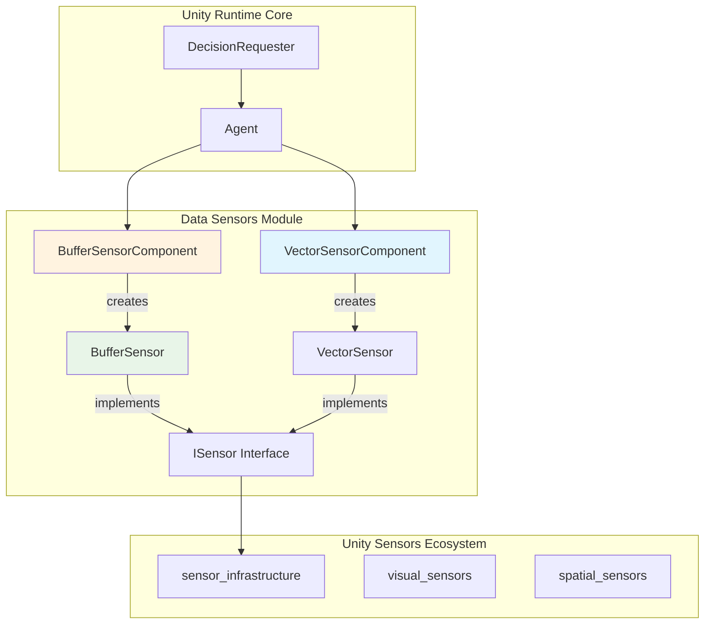
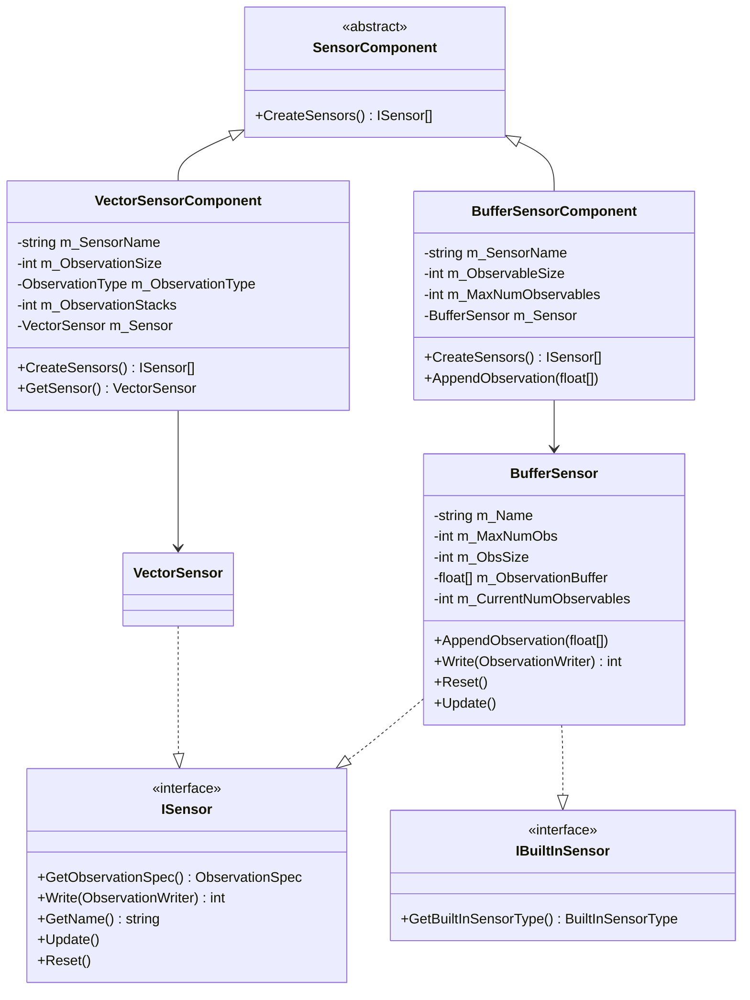
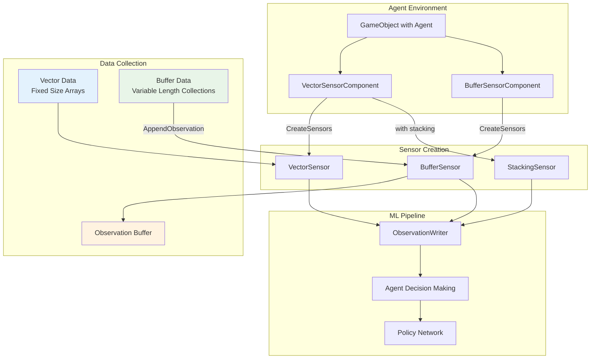

# Data Sensors Module

## Overview

The **data_sensors** module is a specialized component within the Unity ML-Agents framework that provides structured data collection capabilities for machine learning agents. This module focuses on capturing and managing numerical and variable-length observations that don't require spatial or visual processing, making it essential for agents that need to observe discrete entities, numerical states, or dynamic collections of data.

As part of the broader [unity_sensors](unity_sensors.md) ecosystem, the data_sensors module complements [visual_sensors](visual_sensors.md) and [spatial_sensors](spatial_sensors.md) by handling structured data observations that form the foundation of many reinforcement learning scenarios.

## Core Components

### VectorSensorComponent
A Unity component that creates and manages vector-based observations with fixed-size numerical data arrays.

### BufferSensor
A sensor implementation designed to handle variable-length observations, allowing agents to observe dynamic collections of entities or data points.

### BufferSensorComponent
A Unity component wrapper that provides easy integration of BufferSensor functionality into GameObjects.

## Architecture Overview



## Component Relationships



## Data Flow Architecture



## Key Features

### Vector Sensor Capabilities
- **Fixed-Size Observations**: Handles numerical data arrays of predetermined size
- **Observation Stacking**: Supports temporal stacking of observations for sequence learning
- **Type Flexibility**: Supports different observation types (Default, GoalSignal, etc.)
- **Runtime Configuration**: Allows dynamic sensor name and size configuration

### Buffer Sensor Capabilities
- **Variable-Length Data**: Manages dynamic collections of entities or observations
- **Entity Management**: Tracks current number of observables vs. maximum capacity
- **Automatic Reset**: Clears buffer between episodes for clean state management
- **Overflow Protection**: Gracefully handles attempts to exceed maximum capacity

## Integration Patterns

### Basic Vector Sensor Usage
```csharp
// Component setup in Unity Inspector
VectorSensorComponent vectorSensor;
vectorSensor.SensorName = "PlayerStats";
vectorSensor.ObservationSize = 10;
vectorSensor.ObservationType = ObservationType.Default;

// The sensor automatically provides data to the agent
```

### Dynamic Buffer Sensor Usage
```csharp
// Component setup
BufferSensorComponent bufferSensor;
bufferSensor.SensorName = "EnemyPositions";
bufferSensor.MaxNumObservables = 20;
bufferSensor.ObservableSize = 3; // x, y, z positions

// Runtime data collection
float[] enemyPosition = {x, y, z};
bufferSensor.AppendObservation(enemyPosition);
```

## Performance Considerations

### Memory Management
- **Buffer Allocation**: BufferSensor pre-allocates maximum buffer size to avoid runtime allocations
- **Observation Stacking**: VectorSensor stacking creates additional memory overhead
- **Reset Efficiency**: Array.Clear used for efficient buffer clearing

### Processing Efficiency
- **Direct Array Access**: Optimized write operations using direct buffer indexing
- **Minimal Copying**: Observations written directly to ML-Agents observation tensors
- **Capacity Checks**: Early returns prevent unnecessary processing when buffers are full

## Dependencies

### Internal Dependencies
- **[sensor_infrastructure](sensor_infrastructure.md)**: Provides base ISensor interface and ObservationSpec
- **[unity_runtime_core](unity_runtime_core.md)**: Integrates with Agent and DecisionRequester systems

### External Dependencies
- **Unity Engine**: MonoBehaviour and component system integration
- **ML-Agents Core**: ISensor interface and observation writing system

## Configuration Options

### VectorSensorComponent Configuration
- `SensorName`: Unique identifier for the sensor
- `ObservationSize`: Number of float values in each observation
- `ObservationType`: Classification of observation data type
- `ObservationStacks`: Number of previous observations to stack (temporal context)

### BufferSensorComponent Configuration
- `SensorName`: Unique identifier for the sensor
- `ObservableSize`: Number of float values per entity/observation
- `MaxNumObservables`: Maximum number of entities that can be observed

## Error Handling

### Buffer Sensor Validation
- **Size Mismatch**: Throws UnityAgentsException when observation size doesn't match expected size
- **Capacity Management**: Silently ignores observations when buffer is at maximum capacity
- **Array Bounds**: Protected against buffer overflow through capacity checks

### Vector Sensor Robustness
- **Null Safety**: Handles sensor creation and initialization safely
- **Stacking Validation**: Ensures proper StackingSensor creation when stacking is enabled

## Best Practices

### Sensor Design
1. **Size Planning**: Choose appropriate observation sizes based on data requirements
2. **Naming Convention**: Use descriptive sensor names for debugging and analysis
3. **Capacity Planning**: Set BufferSensor maximum capacity based on expected entity counts
4. **Stacking Usage**: Use observation stacking only when temporal context is needed

### Performance Optimization
1. **Buffer Reuse**: Leverage automatic reset functionality rather than manual clearing
2. **Batch Updates**: Collect all observations before decision requests when possible
3. **Memory Allocation**: Avoid frequent sensor recreation during runtime

## Related Modules

- **[visual_sensors](visual_sensors.md)**: Camera-based observation collection
- **[spatial_sensors](spatial_sensors.md)**: Ray-casting and spatial awareness sensors
- **[sensor_infrastructure](sensor_infrastructure.md)**: Core sensor interfaces and specifications
- **[unity_runtime_core](unity_runtime_core.md)**: Agent lifecycle and decision management
- **[unity_actuators](unity_actuators.md)**: Action execution counterpart to observation collection

The data_sensors module serves as the foundation for structured data observation in Unity ML-Agents, providing the essential building blocks for agents that need to process numerical states, entity collections, and temporal sequences in their decision-making processes.