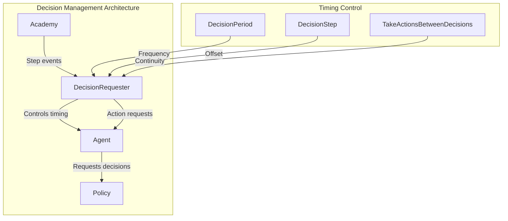
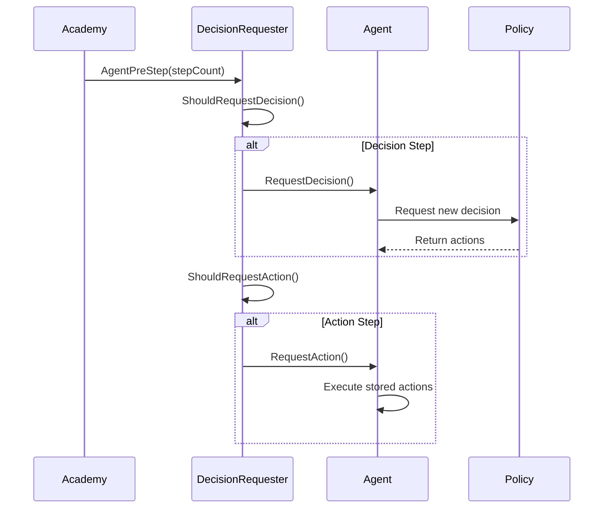
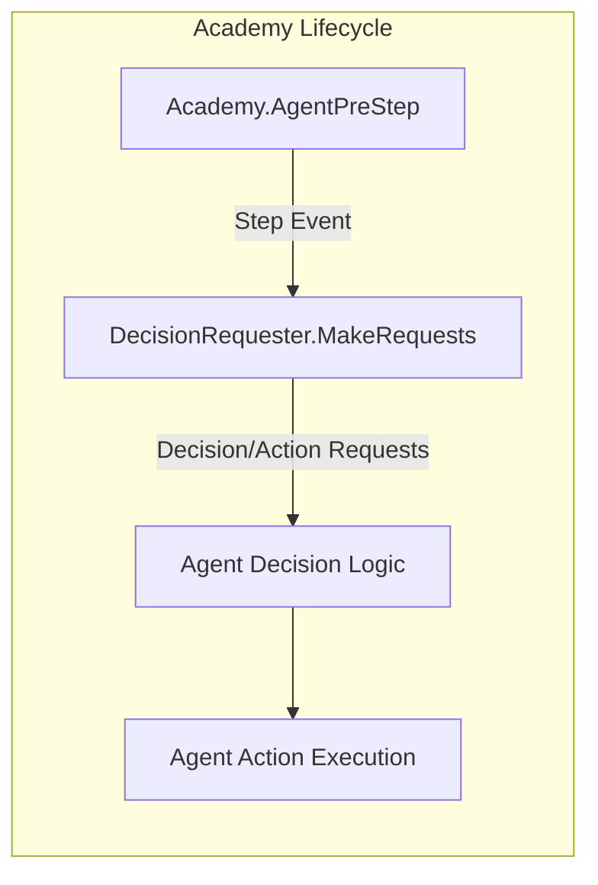
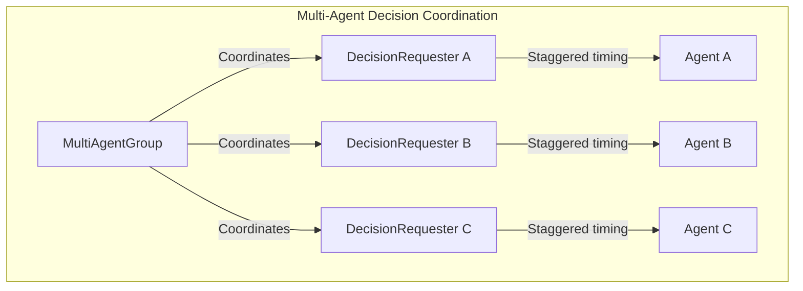

# Decision Management Module

## Overview

The Decision Management module is a critical component of the Unity ML-Agents framework responsible for orchestrating when and how agents request decisions from their policies. This module provides automated decision timing control through the `DecisionRequester` component, which manages the frequency and synchronization of agent decision-making processes within the ML-Agents ecosystem.

## Core Purpose

The Decision Management module serves as the temporal coordinator between agents and their decision-making policies, ensuring:

- **Automated Decision Timing**: Provides configurable intervals for agent decision requests
- **Performance Optimization**: Reduces computational overhead by controlling decision frequency
- **Synchronization Control**: Manages timing offsets between multiple agents
- **Action Continuity**: Handles action execution between decision points

## Architecture Overview



## Core Components

### DecisionRequester

The `DecisionRequester` is the primary component that automates the decision-making process for ML-Agents.

#### Key Features

- **Configurable Decision Frequency**: Controls how often agents request new decisions
- **Timing Offset Management**: Allows staggering of decision requests across agents
- **Action Continuity**: Manages action execution between decision points
- **Academy Integration**: Hooks into the Academy's step cycle for synchronized operation

#### Configuration Parameters

| Parameter | Type | Range | Description |
|-----------|------|-------|-------------|
| `DecisionPeriod` | int | 1-20 | Frequency of decision requests (in Academy steps) |
| `DecisionStep` | int | 0-19 | Timing offset for decision requests |
| `TakeActionsBetweenDecisions` | bool | - | Whether to execute actions between decisions |

## Decision Flow Process



## Integration with Core Systems

### Academy Integration

The DecisionRequester integrates with the [unity_runtime_core](unity_runtime_core.md) Academy system:



### Agent Coordination

Works closely with the [agent_core](agent_core.md) module for decision execution:

- **Decision Requests**: Triggers `Agent.RequestDecision()` at configured intervals
- **Action Requests**: Triggers `Agent.RequestAction()` for action continuity
- **Lifecycle Management**: Handles component initialization and cleanup

### Policy Integration

Coordinates with the [unity_policies](unity_policies.md) system:

- **Decision Timing**: Controls when policies are queried for new actions
- **Action Buffering**: Manages action storage between decision points
- **Performance Optimization**: Reduces policy evaluation frequency

## Decision Timing Strategies

### Fixed Interval Decisions

```mermaid
gantt
    title Agent Decision Timeline (DecisionPeriod=5)
    dateFormat X
    axisFormat %s
    
    section Agent A (DecisionStep=0)
    Decision    :milestone, 0, 0
    Action      :1, 4
    Decision    :milestone, 5, 5
    Action      :6, 9
    
    section Agent B (DecisionStep=2)
    Action      :0, 1
    Decision    :milestone, 2, 2
    Action      :3, 6
    Decision    :milestone, 7, 7
```



### Staggered Decision Timing

Multiple agents can be configured with different `DecisionStep` values to distribute computational load:

```csharp
// Agent A: Decides on steps 0, 5, 10, 15...
DecisionRequester agentA;
agentA.DecisionPeriod = 5;
agentA.DecisionStep = 0;

// Agent B: Decides on steps 2, 7, 12, 17...
DecisionRequester agentB;
agentB.DecisionPeriod = 5;
agentB.DecisionStep = 2;
```

## Performance Considerations

### Computational Optimization

The DecisionRequester provides several performance benefits:

1. **Reduced Policy Evaluations**: Limits expensive neural network inference calls
2. **Load Distribution**: Staggers decision requests across multiple agents
3. **Action Continuity**: Maintains smooth agent behavior between decisions

### Memory Management

- **Minimal Overhead**: Lightweight component with minimal memory footprint
- **Event-Driven**: Uses Academy events for efficient lifecycle management
- **No Action Storage**: Relies on Agent's internal action buffering

## Configuration Examples

### High-Frequency Decision Making

```csharp
// For precise control scenarios
DecisionRequester preciseControl;
preciseControl.DecisionPeriod = 1;  // Every step
preciseControl.DecisionStep = 0;
preciseControl.TakeActionsBetweenDecisions = true;
```

### Performance-Optimized Setup

```csharp
// For computationally expensive policies
DecisionRequester optimized;
optimized.DecisionPeriod = 10;  // Every 10 steps
optimized.DecisionStep = 0;
optimized.TakeActionsBetweenDecisions = true;  // Smooth movement
```

### Multi-Agent Coordination

```csharp
// Staggered decision timing for multiple agents
for (int i = 0; i < agentCount; i++)
{
    var requester = agents[i].GetComponent<DecisionRequester>();
    requester.DecisionPeriod = 5;
    requester.DecisionStep = i % 5;  // Distribute across period
    requester.TakeActionsBetweenDecisions = true;
}
```

## Advanced Usage Patterns

### Custom Decision Logic

The DecisionRequester can be extended for custom decision timing:

```csharp
public class CustomDecisionRequester : DecisionRequester
{
    protected override bool ShouldRequestDecision(DecisionRequestContext context)
    {
        // Custom logic for decision timing
        return CustomDecisionLogic(context.AcademyStepCount);
    }
    
    protected override bool ShouldRequestAction(DecisionRequestContext context)
    {
        // Custom logic for action timing
        return CustomActionLogic(context.AcademyStepCount);
    }
}
```

### Conditional Decision Requests

```csharp
public class ConditionalDecisionRequester : DecisionRequester
{
    public bool enableDecisions = true;
    
    protected override bool ShouldRequestDecision(DecisionRequestContext context)
    {
        return enableDecisions && base.ShouldRequestDecision(context);
    }
}
```

## Integration with Multi-Agent Systems

The Decision Management module works seamlessly with [multi_agent_coordination](multi_agent_coordination.md):



## Debugging and Monitoring

### Decision Timing Verification

```csharp
public class DecisionMonitor : MonoBehaviour
{
    private DecisionRequester requester;
    
    void Start()
    {
        requester = GetComponent<DecisionRequester>();
    }
    
    void Update()
    {
        var context = new DecisionRequester.DecisionRequestContext
        {
            AcademyStepCount = Academy.Instance.StepCount
        };
        
        if (requester.ShouldRequestDecision(context))
        {
            Debug.Log($"Decision requested at step {context.AcademyStepCount}");
        }
    }
}
```

### Performance Profiling

Monitor decision request patterns to optimize performance:

- Track decision frequency across agents
- Measure policy evaluation times
- Analyze action continuity effectiveness

## Best Practices

### Decision Period Selection

1. **High-Precision Tasks**: Use `DecisionPeriod = 1` for tasks requiring immediate responses
2. **Standard Scenarios**: Use `DecisionPeriod = 5` for balanced performance and responsiveness
3. **Complex Policies**: Use `DecisionPeriod = 10+` for computationally expensive models

### Multi-Agent Optimization

1. **Stagger Decision Steps**: Distribute decision requests across the decision period
2. **Group Similar Agents**: Use consistent periods for agents with similar roles
3. **Monitor Performance**: Track computational load and adjust periods accordingly

### Action Continuity

1. **Enable for Movement**: Always use `TakeActionsBetweenDecisions = true` for moving agents
2. **Disable for Discrete Actions**: Consider disabling for purely discrete action spaces
3. **Test Behavior**: Verify that action continuity produces desired agent behavior

## Related Modules

- **[unity_runtime_core](unity_runtime_core.md)**: Core Academy and Agent systems
- **[agent_core](agent_core.md)**: Agent implementation and lifecycle management
- **[unity_policies](unity_policies.md)**: Policy evaluation and action generation
- **[multi_agent_coordination](multi_agent_coordination.md)**: Multi-agent group coordination
- **[unity_actuators](unity_actuators.md)**: Action execution and buffering systems

## Conclusion

The Decision Management module provides essential timing control for ML-Agents decision-making processes. By automating decision requests and providing flexible configuration options, it enables developers to optimize performance while maintaining responsive agent behavior. The module's integration with the broader ML-Agents ecosystem ensures seamless operation across training and inference scenarios.