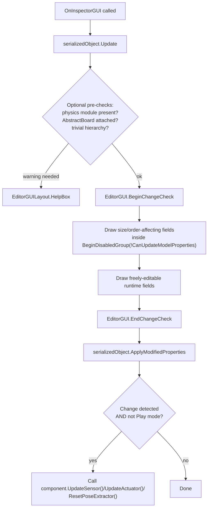
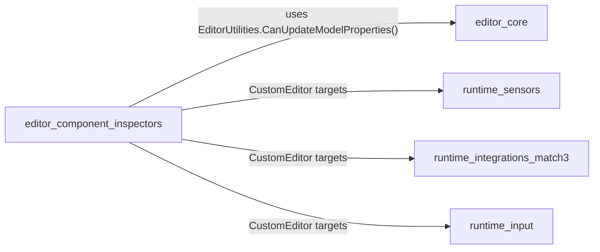

# Editor Component Inspectors

## 1. Purpose

The **Editor Component Inspectors** module provides the custom Unity Editor
`Inspector` UIs for the sensor and actuator `MonoBehaviour` components that
ship with the ML-Agents Unity package. Every sensor / actuator component that
a designer drags onto an `Agent` GameObject (Camera Sensor, Ray Perception
Sensor, Grid Sensor, Buffer Sensor, Vector Sensor, Render Texture Sensor,
Rigid Body Sensor, Match-3 Sensor/Actuator, Input Actuator, ...) has a
matching `UnityEditor.Editor` subclass in this module that:

- Renders the component's serialized fields in the Inspector window.
- Enforces which fields can be edited **only in Edit mode** (because changing
  them at Play mode would change observation/action sizes and break a
  loaded/trained model).
- Triggers component-specific re-initialization (`UpdateSensor()`,
  `UpdateActuator()`, `ResetPoseExtractor()`) when a relevant field changes.
- Surfaces helpful warnings (e.g. missing Physics module, missing
  `AbstractBoard` implementation, trivial `RigidBodySensorComponent`
  configuration).

This module is purely an **editor-time convenience layer** — none of its
code participates in the runtime game loop or in training. It exists to
make the runtime components documented in
[runtime_sensors](runtime_sensors.md) and
[runtime_integrations_match3](runtime_integrations_match3.md) easier and
safer to configure from the Unity Editor. It is a sibling of
[editor_core](editor_core.md), which contains the higher-level editors for
`Agent`, `BehaviorParameters`, `BrainParameters`, demonstration assets, and
build-time settings providers.

## 2. Architecture Overview

All inspectors in this module follow the same shape: a `[CustomEditor(typeof(...))]`
class deriving from `UnityEditor.Editor` (or a small shared base class for the
ray-perception family) that overrides `OnInspectorGUI()`. Each editor is bound
1:1 (or, for ray perception, 1:many via a shared base) to a runtime
`*Component` class living in `com.unity.ml-agents/Runtime/Sensors` or
`com.unity.ml-agents/Runtime/Integrations/Match3` or
`com.unity.ml-agents/Runtime/Input`.

```mermaid
graph TB
    subgraph "editor_component_inspectors (this module)"
        BSE[BufferSensorComponentEditor]
        CSE[CameraSensorComponentEditor]
        GSE[GridSensorComponentEditor]
        IAE[InputActuatorComponentEditor]
        M3AE[Match3ActuatorComponentEditor]
        M3SE[Match3SensorComponentEditor]
        RPBaseE[RayPerceptionSensorComponentBaseEditor]
        RP2DE[RayPerceptionSensorComponent2DEditor]
        RP3DE[RayPerceptionSensorComponent3DEditor]
        RTSE[RenderTextureSensorComponentEditor]
        RBSE[RigidBodySensorComponentEditor]
        VSE[VectorSensorComponentEditor]

        RPBaseE --> RP2DE
        RPBaseE --> RP3DE
    end

    subgraph "runtime_sensors"
        BSC[BufferSensorComponent]
        CSC[CameraSensorComponent]
        GSC[GridSensorComponent]
        RP2D[RayPerceptionSensorComponent2D]
        RP3D[RayPerceptionSensorComponent3D]
        RTSC[RenderTextureSensorComponent]
        RBSC[RigidBodySensorComponent]
        VSC[VectorSensorComponent]
    end

    subgraph "runtime_integrations_match3"
        M3AC[Match3ActuatorComponent]
        M3SC[Match3SensorComponent]
    end

    subgraph "runtime_input"
        IAC[InputActuatorComponent]
    end

    subgraph "editor_core"
        EU[EditorUtilities.CanUpdateModelProperties]
    end

    BSE -.edits.-> BSC
    CSE -.edits.-> CSC
    GSE -.edits.-> GSC
    RP2DE -.edits.-> RP2D
    RP3DE -.edits.-> RP3D
    RTSE -.edits.-> RTSC
    RBSE -.edits.-> RBSC
    VSE -.edits.-> VSC
    M3AE -.edits.-> M3AC
    M3SE -.edits.-> M3SC
    IAE -.edits.-> IAC

    BSE --> EU
    CSE --> EU
    GSE --> EU
    RPBaseE --> EU
    RTSE --> EU
    RBSE --> EU
    VSE --> EU
```

### Shared design pattern

Every inspector in this module follows the same recurring flow:

The key idea guarding all of them is `EditorUtilities.CanUpdateModelProperties()`
(defined in [editor_core](editor_core.md)), which returns `false` while the
game is in Play mode. Fields that affect the *shape* of an observation or
action (sensor name — which affects ordering — array sizes, ray counts,
observation stack counts, etc.) are wrapped in
`EditorGUI.BeginDisabledGroup(!CanUpdateModelProperties())` so they cannot be
changed while an Agent/Policy is actively running, which would silently
desync trained model input/output shapes from the live component.

## 3. Components

Because every inspector here is a small, self-contained, single-responsibility
class following an identical pattern, the module is documented as a single
cohesive unit rather than split into sub-modules. The table below groups the
inspectors by the kind of runtime component they configure.

### 3.1 Sensor Inspectors

| Editor Class | Target Component | Key Responsibilities |
|---|---|---|
| `BufferSensorComponentEditor` | `BufferSensorComponent` | Locks `m_SensorName`, `m_ObservableSize`, `m_MaxNumObservables` while running (they define observation size). |
| `CameraSensorComponentEditor` | `CameraSensorComponent` | Edits camera reference, resolution, grayscale, stacking, observation type, compression; calls `UpdateSensor()` on shape-relevant change. |
| `GridSensorComponentEditor` | `GridSensorComponent` | Warns if Physics module missing; edits cell scale/grid size (locked to 2D via `y=1`), detectable tags array, collider mask, buffer sizes, debug gizmo colors matched 1:1 to detectable tags. |
| `RayPerceptionSensorComponentBaseEditor` (+ `RayPerceptionSensorComponent2DEditor` / `3DEditor`) | `RayPerceptionSensorComponent2D` / `3D` | Shared base draws detectable tags, ray counts/angles, cast radius/length, layer mask, stacking, vertical offsets (3D only), batched raycasts (3D only), gizmo colors; concrete subclasses just forward `is3d`. |
| `RenderTextureSensorComponentEditor` | `RenderTextureSensorComponent` | Edits render texture reference, grayscale, stacking, compression. |
| `RigidBodySensorComponentEditor` | `RigidBodySensorComponent` | Warns on "trivial" configurations (no useful joints); draws collapsible body-hierarchy tree letting users toggle which poses are included; resets the pose extractor when hierarchy-affecting fields change. |
| `VectorSensorComponentEditor` | `VectorSensorComponent` | Locks sensor name, observation size, observation type, and stack count. |
| `Match3SensorComponentEditor` | `Match3SensorComponent` (see [runtime_integrations_match3](runtime_integrations_match3.md)) | Requires an `AbstractBoard` sibling component; edits sensor name and observation type. |

### 3.2 Actuator Inspectors

| Editor Class | Target Component | Key Responsibilities |
|---|---|---|
| `Match3ActuatorComponentEditor` | `Match3ActuatorComponent` (see [runtime_integrations_match3](runtime_integrations_match3.md)) | Requires an `AbstractBoard` sibling; edits actuator name, random seed, and a "force heuristic" toggle. |
| `InputActuatorComponentEditor` | `InputActuatorComponent` (see [runtime_input](runtime_input.md)) | Compiled only under the `MLA_INPUT_SYSTEM` define; read-only display of the derived `ActionSpec`. |

## 4. Cross-Module Relationships

- **[editor_core](editor_core.md)** — sibling module providing `AgentEditor`,
  `BehaviorParametersEditor`, `BrainParametersDrawer`, demonstration
  importer/editor, and the shared `EditorUtilities.CanUpdateModelProperties()`
  helper that every inspector in this module depends on to gate edits during
  Play mode.
- **[runtime_sensors](runtime_sensors.md)** — defines the `*SensorComponent`
  classes (`BufferSensorComponent`, `CameraSensorComponent`,
  `GridSensorComponent`, `RayPerceptionSensorComponent2D/3D`,
  `RenderTextureSensorComponent`, `RigidBodySensorComponent`,
  `VectorSensorComponent`) that the inspectors in this module render and
  drive via `UpdateSensor()`.
- **[runtime_integrations_match3](runtime_integrations_match3.md)** — defines
  `Match3SensorComponent` / `Match3ActuatorComponent`, edited by
  `Match3SensorComponentEditor` / `Match3ActuatorComponentEditor`.
- **[runtime_input](runtime_input.md)** — defines `InputActuatorComponent`,
  edited by `InputActuatorComponentEditor`.

## 5. Design Notes & Conventions

- **Play-mode safety**: any serialized field that changes an observation or
  action tensor's shape (name — because names affect sort order used for
  concatenation —, sizes, counts, ray numbers, stack counts) is wrapped in a
  disabled group during Play mode. Fields that only affect *values*, not
  shapes (e.g. camera reference, compression type, gizmo colors, runtime
  camera enable toggle), remain editable at all times.
- **Change detection → re-initialization**: most editors wrap their field
  drawing in `EditorGUI.BeginChangeCheck()` / `EndChangeCheck()` and, if any
  tracked field changed, call the target component's own
  `UpdateSensor()`/`UpdateActuator()`/`ResetPoseExtractor()` method so the
  runtime sensor/actuator object is rebuilt with the new configuration
  immediately, without requiring script recompilation or a scene reload.
- **Defensive conditional compilation**: `GridSensorComponentEditor` and the
  ray-perception base editor emit `HelpBox` warnings when the relevant Unity
  Physics/Physics2D module is not installed, since those sensors depend on
  physics APIs (`Physics.OverlapBox`, `Physics.Raycast`, etc.).
  `InputActuatorComponentEditor` is entirely compiled out unless the
  `MLA_INPUT_SYSTEM` define is present (i.e., the Input System package is
  installed).
- **Multi-object editing**: all inspectors except `RigidBodySensorComponentEditor`
  and `InputActuatorComponentEditor` are annotated `[CanEditMultipleObjects]`,
  allowing designers to tweak several selected GameObjects' sensors at once.
- **Board-dependent components**: the Match-3 editors first look up a sibling
  `AbstractBoard` component and short-circuit with a warning `HelpBox` if none
  is found, since both `Match3SensorComponent` and `Match3ActuatorComponent`
  require a board implementation to function.
