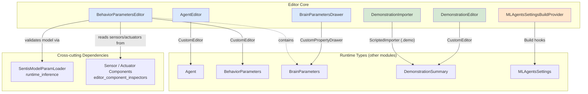
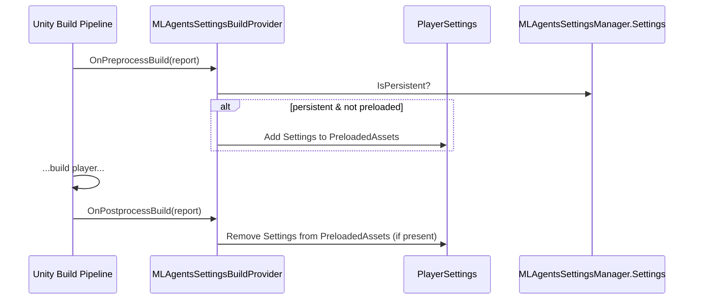
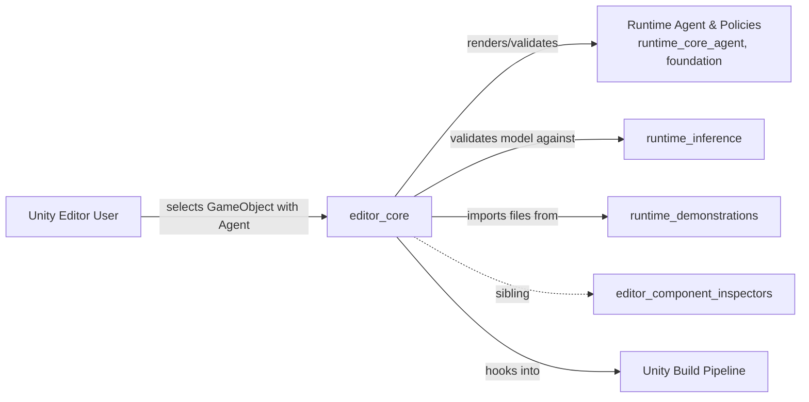

# Editor Core

## Introduction

**Editor Core** is the foundational set of Unity Editor extensions for the ML-Agents package's central data types. Where the sibling module [Editor Component Inspectors](editor_component_inspectors.md) supplies custom Inspectors for individual Sensor and Actuator *components*, `editor_core` provides the Editor-time tooling for the primary agent-configuration objects (`Agent`, `BehaviorParameters`, `BrainParameters`), for inspecting recorded demonstration files, and for integrating package-level settings into Unity's build pipeline.

This module is purely design-time (Editor-only) code — none of it ships in player builds (with the exception of the build pre/post-process hook, which only executes inside the Editor build pipeline). Its responsibilities are:

1. Rendering custom Inspector GUIs for `Agent` and `BehaviorParameters` `MonoBehaviour`s, including live validation of a `BehaviorParameters`' assigned neural network model against the Agent's sensors/actuators.
2. Drawing a custom property layout for the `BrainParameters` serialized struct (observation/action space sizes).
3. Importing and previewing `.demo` demonstration recording files as first-class Unity assets.
4. Ensuring the ML-Agents project-wide `MLAgentsSettings` asset is preloaded into player builds.

## Architecture Overview

## Sub-modules

Editor Core is organized into two focused sub-modules plus one standalone build-pipeline component.

### 1. Agent & Behavior Inspectors
Custom Editor GUIs for the two `MonoBehaviour`s (and one serialized struct) that define how an Agent perceives, decides, and acts: `AgentEditor`, `BehaviorParametersEditor`, and `BrainParametersDrawer`. This sub-module is also responsible for surfacing model/sensor compatibility warnings and errors at edit time by delegating to `SentisModelParamLoader` (see [Unity-Python Bridge & ML Integration](runtime_inference.md)).

➡ See [Editor Core: Agent & Behavior Inspectors](editor_core_agent_inspectors.md) for full details.

### 2. Demonstration Tooling
Asset pipeline integration for `.demo` recording files produced by `DemonstrationRecorder` (see [Runtime Demonstrations](runtime_demonstrations.md)): `DemonstrationImporter` parses the binary proto stream into a `DemonstrationSummary` asset, and `DemonstrationEditor` renders that summary in the Inspector.

➡ See [Editor Core: Demonstration Tooling](editor_core_demonstration_tooling.md) for full details.

### 3. Build Pipeline Integration

`MLAgentsSettingsBuildProvider` is a single, self-contained `IPreprocessBuildWithReport` / `IPostprocessBuildWithReport` implementation. It has no UI and is not an Inspector/Drawer, so it is documented directly here rather than as a separate sub-module.

**Responsibility:** Ensure the project's `MLAgentsSettings` asset (managed by `MLAgentsSettingsManager`) is available at runtime in player builds, without permanently polluting the project's Preloaded Assets list.

- `OnPreprocessBuild`: If the current `MLAgentsSettings.Settings` instance is a persisted asset (not memory-only) and it is not already listed in `PlayerSettings.GetPreloadedAssets()`, it is temporarily added to that list.
- `OnPostprocessBuild`: After the build completes, the temporarily-added asset is removed from the Preloaded Assets list again, restoring the project to its original state.

`callbackOrder` is `0`, meaning it runs at default priority relative to other build pre/post-processors.

## How This Module Fits Into the System

- **Upstream dependency:** `editor_core` inspects and edits runtime types defined in [Unity Agent & Environment Foundation](runtime_core_agent.md), [Unity-Python Bridge & ML Integration](runtime_inference.md) (model validation via `SentisModelParamLoader`), and [Runtime Demonstrations](runtime_demonstrations.md) (`DemonstrationSummary`).
- **Sibling module:** [Editor Component Inspectors](editor_component_inspectors.md) provides the analogous per-Sensor/Actuator-component Inspectors that `BehaviorParametersEditor` enumerates when validating model compatibility.
- **No downstream dependents:** As Editor-only tooling, no runtime or training code depends on this module.

## Key Design Notes

- All classes in this module are marked `internal`, since they are Editor extensions activated automatically by Unity via `[CustomEditor]`, `[CustomPropertyDrawer]`, or `[ScriptedImporter]` attributes rather than being part of the public API surface.
- `BehaviorParametersEditor` throttles expensive model-reload validation using a simple timer (`k_TimeBetweenModelReloads`) to avoid excessive re-parsing of the Sentis model on every GUI repaint.
- `DemonstrationImporter` only reads the first three delimited protobuf messages (`DemonstrationMetaProto`, `BrainParametersProto`, and a single `AgentInfoActionPairProto`) from the `.demo` file — it does not require loading the entire recording to produce a summary.
