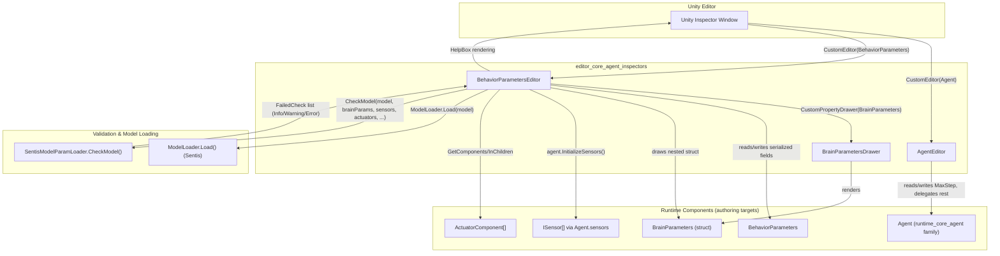
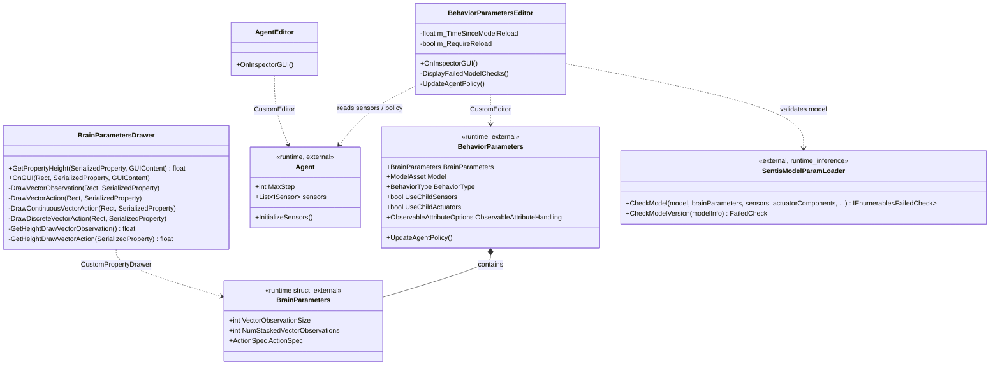
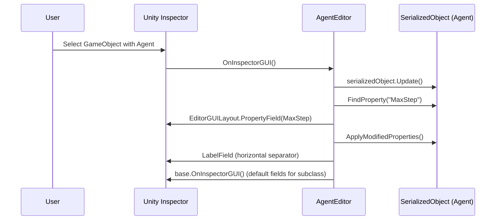
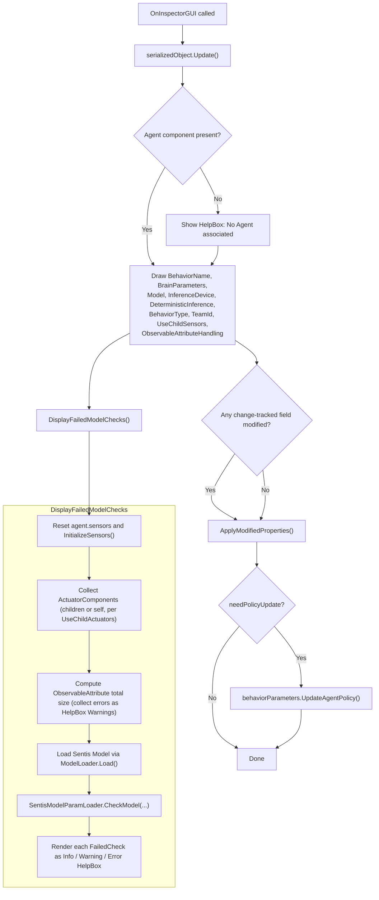
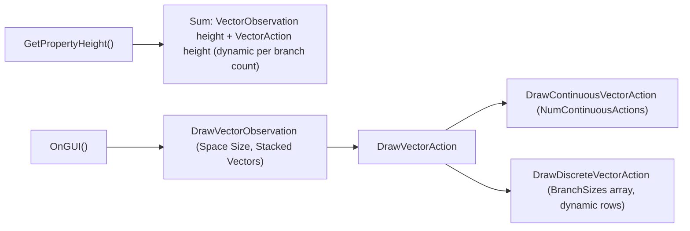
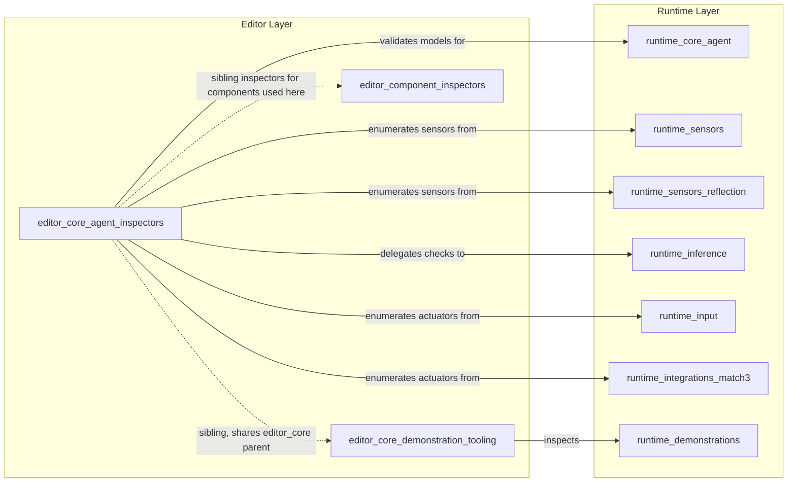

# Editor Core Agent Inspectors

## Introduction

The **Editor Core Agent Inspectors** module provides the custom Unity Editor Inspector UIs for the three foundational ML-Agents authoring components: `Agent`, `BehaviorParameters`, and `BrainParameters`. These inspectors give Unity developers a rich, validated, in-editor experience for configuring agents — surfacing configuration errors (such as mismatched model/observation shapes) before entering Play Mode or starting training.

This module is a child of [editor_core.md](editor_core.md) (Unity Editor Tooling core inspectors), alongside its sibling [editor_core_demonstration_tooling.md](editor_core_demonstration_tooling.md) (demonstration recording/import inspectors). Together with [editor_component_inspectors.md](editor_component_inspectors.md) (sensor/actuator component inspectors), these modules make up the full custom-editor surface described at the top level in the module tree.

The three components covered here work together during editor authoring:

- **`AgentEditor`** — Customizes the Inspector for any `Agent` subclass, exposing the `MaxStep` field and delegating remaining fields to the default inspector.
- **`BehaviorParametersEditor`** — Customizes the Inspector for `BehaviorParameters`, the component that links an `Agent` to a trained neural network model, a `BehaviorType`, and team/policy settings. It performs live compatibility checks between the assigned Sentis model and the agent's sensors/actuators.
- **`BrainParametersDrawer`** — A `PropertyDrawer` that renders the nested `BrainParameters` struct (vector observation size, stacked observations, continuous/discrete action layout) inside the `BehaviorParametersEditor` and other inspectors.

---

## Purpose and Core Functionality

| Component | Type | Responsibility |
|---|---|---|
| `AgentEditor` | `UnityEditor.Editor` (CustomEditor for `Agent`) | Adds a labeled `Max Step` field above the default inspector fields for any `Agent`-derived component. |
| `BehaviorParametersEditor` | `UnityEditor.Editor` (CustomEditor for `BehaviorParameters`) | Renders behavior name, brain parameters, model/inference device, behavior type, team ID, and sensor/actuator options. Runs model compatibility validation on every GUI update and surfaces `Info`/`Warning`/`Error` messages. Triggers policy updates on relevant field changes. |
| `BrainParametersDrawer` | `PropertyDrawer` (CustomPropertyDrawer for `BrainParameters`) | Renders the `BrainParameters` sub-object: vector observation size/stacking, continuous action count, and discrete action branch sizes, computing dynamic layout heights. |

### Key Behaviors

1. **Non-invasive field augmentation**: `AgentEditor` does not replace the default inspector; it prepends a custom field and then calls `base.OnInspectorGUI()` to preserve all serialized fields defined on `Agent` subclasses (including user-added fields).
2. **Live model/sensor validation**: `BehaviorParametersEditor.DisplayFailedModelChecks()` reconstructs the agent's sensors (`agent.InitializeSensors()`), gathers `ActuatorComponent`s (optionally including children), loads the assigned Sentis `Model`, and delegates to [`SentisModelParamLoader.CheckModel`](runtime_inference.md) to produce a list of `FailedCheck` objects rendered as Unity `HelpBox`es.
3. **Editability gating**: Certain fields (`BrainParameters`, `UseChildSensors`, `ObservableAttributeHandling`) are wrapped in `EditorGUI.BeginDisabledGroup(!EditorUtilities.CanUpdateModelProperties())` to prevent edits while a model dictates fixed shapes (e.g., during Play Mode inference).
4. **Change-driven policy refresh**: `BehaviorParametersEditor` tracks `EditorGUI.BeginChangeCheck()/EndChangeCheck()` around Behavior Name, Model/Inference Device, and Behavior Type fields; if any changed, it calls `behaviorParameters.UpdateAgentPolicy()` after applying serialized changes.
5. **Custom layout math for nested drawer**: `BrainParametersDrawer` manually computes pixel heights (`GetHeightDrawVectorObservation`, `GetHeightDrawVectorAction`) since the discrete action branch list has a variable number of rows.

---

## Architecture

---

## Component Relationships

---

## Data / Process Flow

### `AgentEditor` Rendering Flow

### `BehaviorParametersEditor` Validation Flow

### `BrainParametersDrawer` Layout Flow

---

## Integration with the Wider System

- **Parent module**: [editor_core.md](editor_core.md) groups this module together with [editor_core_demonstration_tooling.md](editor_core_demonstration_tooling.md), which provides the `DemonstrationEditor` and `DemonstrationImporter` inspectors for recorded demonstration files. Both are siblings under the broader Unity Editor Tooling tree.
- **Sibling module**: [editor_component_inspectors.md](editor_component_inspectors.md) documents the custom inspectors for individual `SensorComponent`/`ActuatorComponent` types (e.g., `CameraSensorComponentEditor`, `RayPerceptionSensorComponentBaseEditor`, `Match3ActuatorComponentEditor`). These sensor/actuator components are exactly what `BehaviorParametersEditor` enumerates via `GetComponentsInChildren<ActuatorComponent>()` and `agent.InitializeSensors()` when running model validation.
- **Runtime dependency — Perception & Sensing**: The `ISensor` instances validated here are produced by components documented in [runtime_sensors.md](runtime_sensors.md) and [runtime_sensors_reflection.md](runtime_sensors_reflection.md).
- **Runtime dependency — Inference**: The core validation logic (`SentisModelParamLoader.CheckModel`) lives in [runtime_inference.md](runtime_inference.md). This module's `BehaviorParametersEditor` is the primary editor-time consumer of that validation API, translating `FailedCheck` results into Unity `HelpBox` UI feedback.
- **Runtime dependency — Agent Foundation**: `Agent` and its `MaxStep`/`sensors` members, along with related concepts like `DecisionRequester`, are part of [runtime_core_agent.md](runtime_core_agent.md).
- **Actuation & Input**: `ActuatorComponent` instances gathered during validation may include specialized actuators such as `InputActuatorComponent` or `Match3ActuatorComponent`, documented in [runtime_input.md](runtime_input.md) and [runtime_integrations_match3.md](runtime_integrations_match3.md).

---

## Key Design Notes

- **Separation of concerns**: `AgentEditor` intentionally does minimal work (only `MaxStep`), relying on Unity's default reflection-based inspector for the rest of an `Agent` subclass's fields — this keeps the editor extensible for user-defined `Agent` subclasses without requiring them to implement their own editors.
- **Defensive coding for missing components**: `BehaviorParametersEditor` explicitly checks for a null `Agent` component and null `BrainParameters`/`Model` before running checks, avoiding null-reference exceptions in partially configured GameObjects during editing.
- **Model reload throttling**: `BehaviorParametersEditor` maintains `m_TimeSinceModelReload` and `k_TimeBetweenModelReloads` (2 seconds) intended to avoid over-eager reload cycles when fields are rapidly changing.
- **String-based `SerializedProperty` lookups**: All three editors use `const string` field-name constants (e.g., `k_BehaviorName`, `k_ModelName`) matching the private serialized field names in the runtime classes. Any rename of these backing fields in `Agent`, `BehaviorParameters`, or `BrainParameters` requires a corresponding update here, since these are not compile-time checked.
