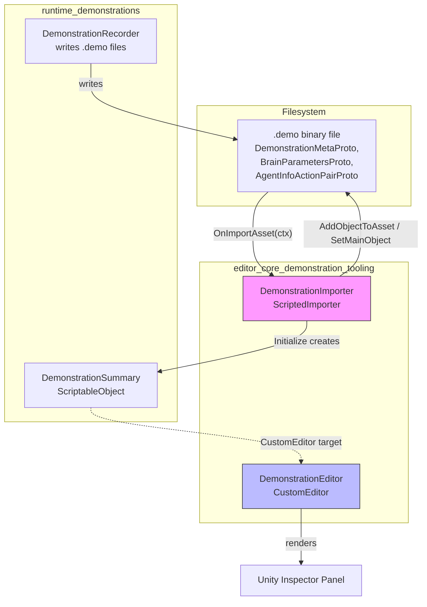
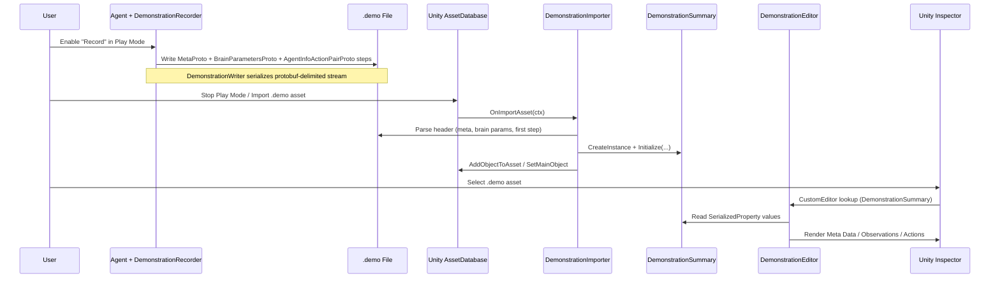
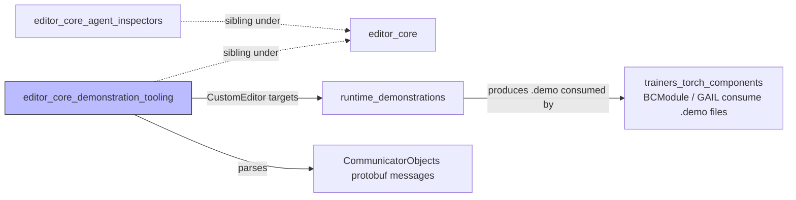

# Editor Core: Demonstration Tooling

## Introduction

The **Editor Core Demonstration Tooling** module provides the Unity Editor–side infrastructure for working with **imitation-learning demonstration files** (`.demo`) recorded from ML-Agents. It is responsible for:

- **Importing** raw `.demo` files into the Unity Asset pipeline as first-class assets (`DemonstrationImporter`).
- **Rendering** a human-readable Inspector view of a demonstration's metadata, observation shapes, and action space (`DemonstrationEditor`).

This module is a leaf child of [editor_core](editor_core.md) (sibling to [editor_core_agent_inspectors](editor_core_agent_inspectors.md)) and is part of the broader [Unity_Editor_Tooling](editor_core.md) tree. It bridges the gap between demonstrations recorded at runtime (see [runtime_demonstrations](runtime_demonstrations.md)) and the data consumed by offline training algorithms such as [Behavioral Cloning / GAIL](trainers_torch_components.md).

---

## Module Purpose

When a user records a demonstration in Play Mode using `DemonstrationRecorder` (part of [runtime_demonstrations](runtime_demonstrations.md)), a binary `.demo` file is written to disk containing:

1. A `DemonstrationMetaData` protobuf block (episode/step counts, mean reward, name).
2. A `BrainParametersProto` block (action space specification).
3. A stream of `AgentInfoActionPairProto` records (per-step observations and actions).

The **Demonstration Tooling** module makes this opaque binary format visible and manageable inside the Unity Editor by:

- Registering a `ScriptedImporter` so `.demo` files appear as native Unity assets with a custom icon.
- Parsing just enough of the file (metadata + brain parameters + first step) to build a lightweight `DemonstrationSummary` `ScriptableObject`.
- Supplying a `CustomEditor` (`DemonstrationEditor`) that renders that summary in the Inspector — without needing to load the entire (potentially large) demonstration file into memory.

---

## Component Overview

| Component | File | Responsibility |
|---|---|---|
| `DemonstrationImporter` | `DemonstrationImporter.cs` | `ScriptedImporter` for `.demo` extension. Parses the file header and creates a `DemonstrationSummary` sub-asset. |
| `DemonstrationEditor` | `DemonstrationDrawer.cs` | `CustomEditor` for `DemonstrationSummary`. Renders metadata, observation shapes, and action spec as read-only Inspector fields. |

Both components operate on `DemonstrationSummary`, a small serializable data-holder defined in [runtime_demonstrations](runtime_demonstrations.md), which decouples the Editor UI from the runtime demonstration format.

---

## Architecture

---

## Component Details

### `DemonstrationImporter`

- Decorated with `[ScriptedImporter(1, new[] { "demo" })]`, so Unity automatically routes any `.demo` asset through this importer whenever the asset is imported or reimported.
- **Import steps** (`OnImportAsset`):
  1. Open the asset file as a raw stream.
  2. Parse a `DemonstrationMetaProto` (delimited protobuf) → convert to `DemonstrationMetaData`.
  3. Seek past the fixed-size metadata block (`DemonstrationWriter.MetaDataBytes + 1`) and parse a `BrainParametersProto` → convert to `BrainParameters`.
  4. Attempt to parse the **first** `AgentInfoActionPairProto` to derive `ObservationSummary` shapes (wrapped in try/catch since a demonstration could theoretically have zero steps).
  5. Instantiate a `DemonstrationSummary` ScriptableObject and call `Initialize(...)` with the parsed data.
  6. Load a custom icon texture (`DemoIcon.png`) and register the summary as the **main object** of the imported asset via `ctx.AddObjectToAsset` / `ctx.SetMainObject`.
- Only reads the beginning of the file — it never loads full trajectory data into the Editor, keeping import fast even for large demonstration files.
- Failures are silently ignored (broad `catch`) so a malformed or partial `.demo` file does not break the AssetDatabase import pipeline.

### `DemonstrationEditor`

- `[CustomEditor(typeof(DemonstrationSummary))]`, `[CanEditMultipleObjects]` — renders whenever a `.demo` asset (or its generated `DemonstrationSummary` sub-asset) is selected.
- Caches `SerializedProperty` references to `brainParameters`, `metaData`, and `observationSummaries` in `OnEnable`.
- `OnInspectorGUI` renders three read-only sections:
  - **Meta Data** — demonstration name, number of steps, number of episodes, mean reward.
  - **Observations** — a comma-separated list of observation tensor shapes (e.g. `[ 3, 84, 84 ]`).
  - **Actions** — continuous action size and discrete action branch sizes, using the same `BrainParametersProto` layout consumed elsewhere by [editor_core_agent_inspectors](editor_core_agent_inspectors.md) (`BrainParametersDrawer`).
- Uses a helper `BuildIntArrayLabel` to format `SerializedProperty` int arrays (action branch sizes, observation shapes) into readable strings.
- All fields are presented as plain `EditorGUILayout.LabelField` calls — the editor is purely informational (no editable fields), reflecting that a demonstration file is an immutable recording.

---

## Data Flow: Recording to Inspection

---

## Dependency Relationships

- **[editor_core](editor_core.md)** — parent module; also hosts `AgentEditor`, `BehaviorParametersEditor`, and `MLAgentsSettingsBuildProvider`. `BrainParametersDrawer` (in [editor_core_agent_inspectors](editor_core_agent_inspectors.md)) uses the same `BrainParametersProto`-derived `BrainParameters` type rendered here, so the action-space label formatting is conceptually consistent across both editors.
- **[runtime_demonstrations](runtime_demonstrations.md)** — defines `DemonstrationRecorder` (writes `.demo` files at runtime) and `DemonstrationSummary` (the data object this module's editor renders). This module has no compile-time dependency on the recorder, only on the summary/data types and the protobuf message definitions used to parse the file header.
- **[trainers_core](trainers_core.md)** and **[trainers_torch_components](trainers_torch_components.md)** — `.demo` files produced and inspected via this tooling are later consumed by offline-learning components such as `BCModule` and `GAILRewardProvider` during training. This module has no direct link to training code; it purely provides Editor-side visibility into the artifact.

---

## Design Notes

- **Partial parsing for performance**: Rather than deserializing an entire demonstration (which can contain millions of steps), the importer only reads the fixed-size metadata block, the brain parameters block, and a single step — enough to summarize the file without expensive I/O.
- **Sub-asset pattern**: The `DemonstrationSummary` object is added as a sub-asset of the `.demo` file via `ctx.AddObjectToAsset`, allowing the raw binary file and its parsed summary to be version-controlled and inspected as a single Unity asset entry, complete with a custom icon (`DemoIcon.png`) for easy identification in the Project window.
- **Read-only Inspector**: `DemonstrationEditor` never writes back to `serializedObject` fields (aside from the standard `ApplyModifiedProperties()` call), reinforcing that demonstration data is an immutable recording artifact rather than an editable configuration asset (contrast with [editor_core_agent_inspectors](editor_core_agent_inspectors.md), where `AgentEditor`/`BehaviorParametersEditor` allow live editing of agent configuration).
- **Resilience**: Both components wrap risky operations (protobuf parsing, first-step extraction) in `try/catch` blocks so that partially written or corrupted `.demo` files (e.g., from a crashed recording session) still import gracefully with best-effort metadata instead of throwing pipeline-halting exceptions.
