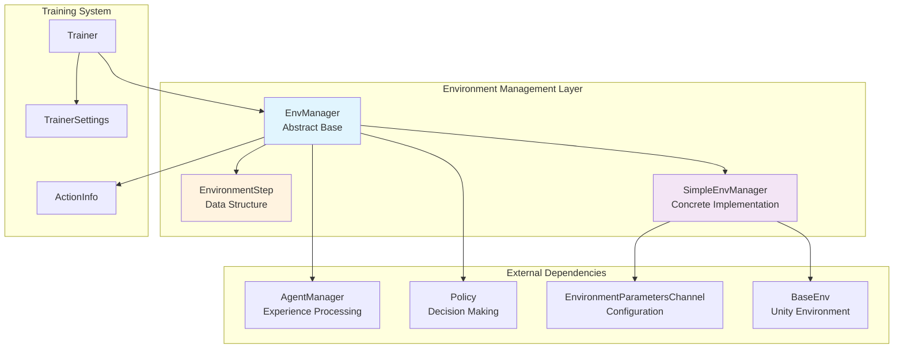
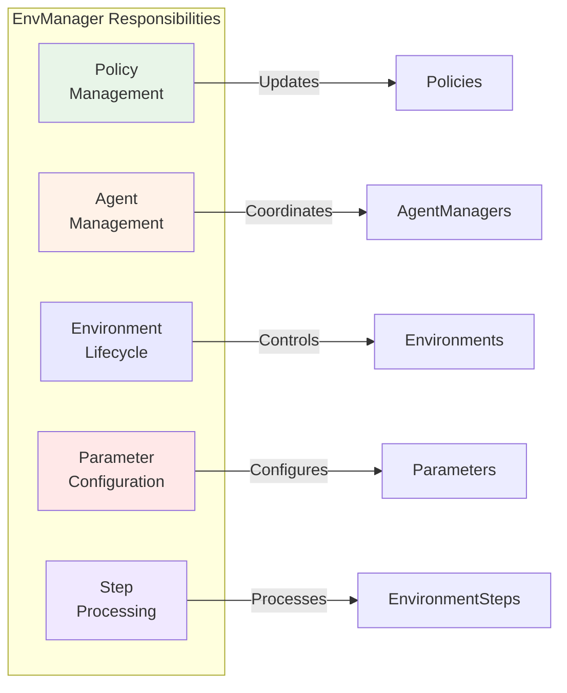
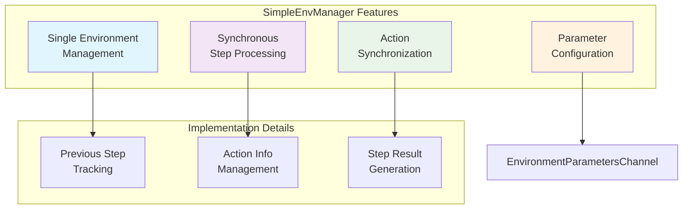
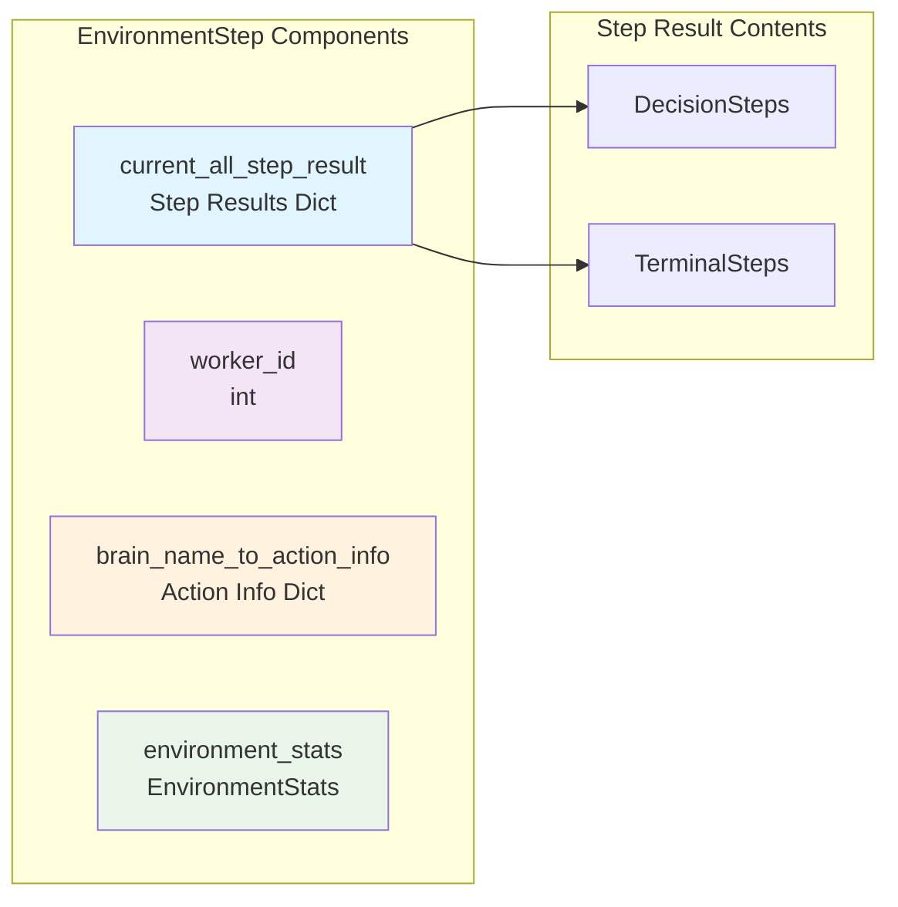
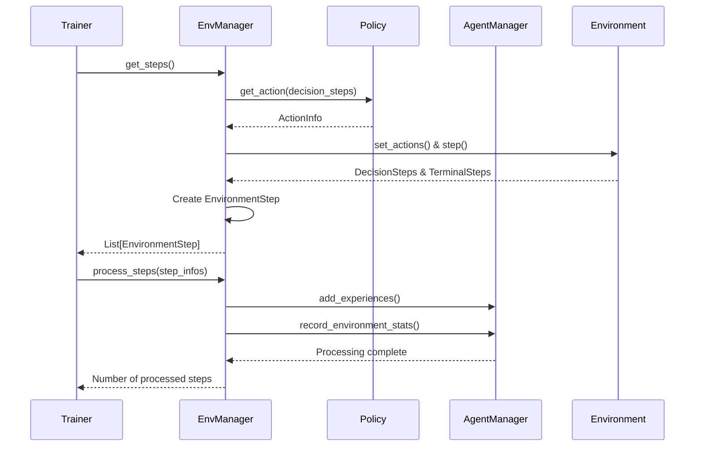
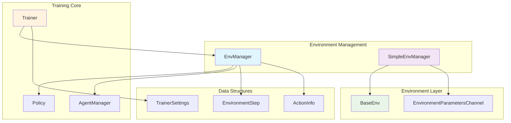
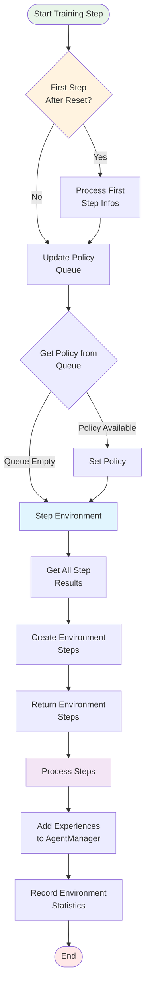
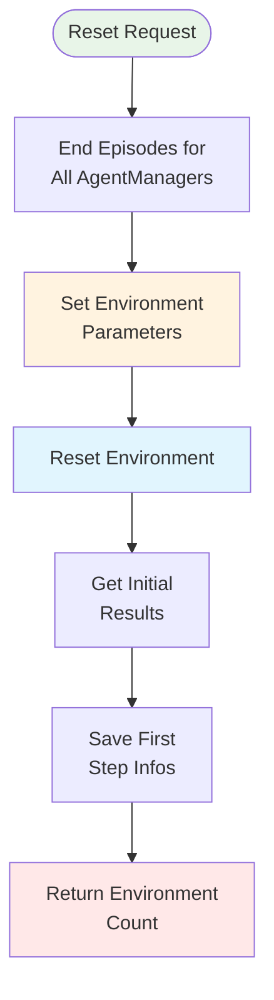
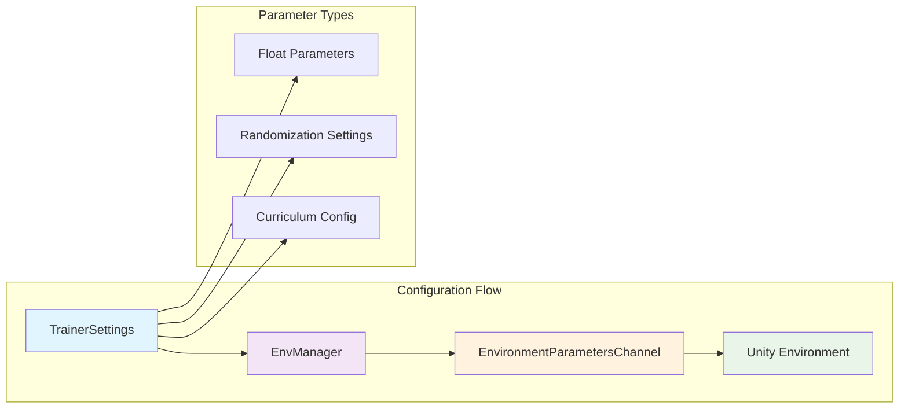

# Environment Management Module

The environment_management module is a critical component of the ML-Agents training system that manages the interaction between training environments and the training process. It provides an abstraction layer for handling multiple environments, coordinating agent actions, and processing environment steps during training.

## Overview

This module serves as the bridge between Unity environments and the training algorithms, managing the flow of observations, actions, and rewards. It handles environment lifecycle management, policy updates, and agent experience collection in a structured and efficient manner.

## Architecture



## Core Components

### EnvManager (Abstract Base Class)

The `EnvManager` is an abstract base class that defines the interface for environment management. It provides the core functionality for:

- **Policy Management**: Maintains a registry of policies for different behavior types
- **Agent Management**: Coordinates with AgentManager instances for experience processing
- **Environment Lifecycle**: Handles environment reset and step operations
- **Parameter Configuration**: Manages environment parameter updates

#### Key Responsibilities



#### Core Methods

- `set_policy()`: Associates a policy with a behavior name
- `set_agent_manager()`: Registers an agent manager for a behavior
- `reset()`: Resets environments and prepares for new episodes
- `get_steps()`: Retrieves and processes environment steps
- `process_steps()`: Processes step information through agent managers

### SimpleEnvManager (Concrete Implementation)

The `SimpleEnvManager` is a concrete implementation designed for single-environment scenarios, primarily used for testing and development.

#### Features



#### Key Characteristics

- **Single Environment**: Manages only one BaseEnv instance
- **Synchronous Operation**: Processes steps sequentially
- **Testing Focus**: Optimized for development and testing scenarios
- **Parameter Management**: Handles environment parameter updates via side channels

### EnvironmentStep (Data Structure)

The `EnvironmentStep` is a named tuple that encapsulates all information from a single environment step.

#### Structure



## Data Flow



## Integration with Other Modules

### Dependencies

- **[python_environment](python_environment.md)**: Interfaces with BaseEnv for Unity environment communication
- **[policy_system](policy_system.md)**: Utilizes Policy instances for agent decision making
- **[trainer_abstractions](trainer_abstractions.md)**: Integrates with Trainer and AgentManager components
- **[python_side_channels](python_side_channels.md)**: Uses EnvironmentParametersChannel for configuration

### Relationships



## Process Flow

### Environment Step Processing



### Environment Reset Process



## Configuration and Parameters

### Environment Parameters

The module supports dynamic environment parameter configuration through the EnvironmentParametersChannel:

- **Float Parameters**: Numerical configuration values
- **Randomization Settings**: Parameter randomization for curriculum learning
- **Runtime Updates**: Dynamic parameter changes during training

### Training Integration



## Performance Considerations

### Single Environment Limitations

The SimpleEnvManager is designed for single-environment scenarios and has inherent limitations:

- **Sequential Processing**: No parallel environment execution
- **Limited Scalability**: Not suitable for production training with multiple environments
- **Testing Focus**: Optimized for development and debugging rather than performance

### Memory Management

- **Step Information Caching**: Maintains previous step information for action generation
- **Policy Queue Management**: Handles policy updates without blocking environment steps
- **Agent Memory**: Coordinates with AgentManager for experience storage

## Error Handling and Logging

The module includes comprehensive error handling and logging:

- **Missing Agent Managers**: Warns when agent managers are not created for behavior IDs
- **Policy Queue Management**: Handles empty policy queues gracefully
- **Environment Statistics**: Processes and forwards environment statistics to reporting systems

## Usage Patterns

### Basic Environment Management

```python
# Create environment manager
env_manager = SimpleEnvManager(env, env_params_channel)

# Set up policies and agent managers
env_manager.set_policy(behavior_name, policy)
env_manager.set_agent_manager(behavior_name, agent_manager)

# Training loop
while training:
    # Get environment steps
    step_infos = env_manager.get_steps()
    
    # Process steps
    num_steps = env_manager.process_steps(step_infos)
    
    # Training logic here...
```

### Environment Reset and Configuration

```python
# Reset with configuration
config = {"parameter_name": 1.0}
num_envs = env_manager.reset(config)

# Update parameters during training
env_manager.set_env_parameters(new_config)
```

## Future Considerations

The environment_management module is designed to be extensible:

- **Multi-Environment Support**: The abstract EnvManager allows for implementations that handle multiple environments
- **Asynchronous Processing**: Future implementations could support asynchronous environment stepping
- **Advanced Parameter Management**: Enhanced support for complex parameter randomization and curriculum learning

This module forms a crucial part of the ML-Agents training pipeline, providing the necessary abstraction and coordination between environments and training algorithms while maintaining flexibility for different deployment scenarios.