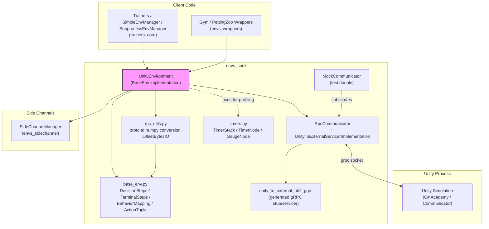
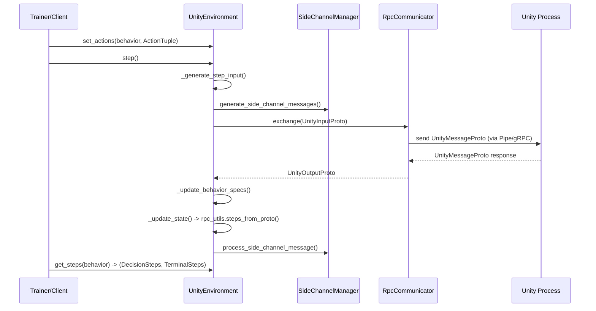

# Envs Core

## Introduction

`envs_core` is the foundational Python layer of the ML-Agents Toolkit that establishes and manages the low-level communication bridge between a Unity simulation process and a Python client. It provides:

- The **public simulation API** (`UnityEnvironment`) that trainers and users interact with to step, reset, and exchange observations/actions with a running Unity instance.
- The **data contracts** (`DecisionSteps`, `TerminalSteps`, `BehaviorMapping`, action tuples) that describe what an agent observes and how actions are structured.
- The **transport layer** (gRPC-based `RpcCommunicator`, generated protobuf service stubs) that physically moves bytes between the two processes.
- Supporting **utilities** for decoding wire-format protobuf messages into NumPy arrays (`rpc_utils`), a **mock communicator** for testing without a real Unity build, and a **hierarchical timer** framework for profiling.

This module sits at the very base of the Python side of the ML-Agents stack. Higher-level components — such as [envs_wrappers](envs_wrappers.md) (Gym/PettingZoo adapters), [envs_sidechannel](envs_sidechannel.md) (out-of-band data channels), [envs_registry](envs_registry.md) (pre-built environment registry), and the entire [Training Orchestration & Lifecycle Infrastructure](trainers_core.md) module — all depend on the primitives defined here.

## Architecture Overview

### Component Interaction (Step Cycle)

## Sub-modules

`envs_core` is organized into the following functional areas, each documented in detail:

| Sub-module | Description | Doc |
|---|---|---|
| **Environment API & Data Contracts** | `UnityEnvironment`, `base_env.py` types (`DecisionSteps`, `TerminalSteps`, `BehaviorMapping`, `ActionTuple`, `BehaviorSpec`) that define the public simulation interface and step data. | [envs_core_api.md](envs_core_api.md) |
| **Communication Transport** | `RpcCommunicator`, `UnityToExternalServicerImplementation`, generated gRPC stub (`unity_to_external_pb2_grpc.py`), and `MockCommunicator` test double — the plumbing that moves protobuf messages between Python and Unity. | [envs_core_communicator.md](envs_core_communicator.md) |
| **Wire Format & Profiling Utilities** | `rpc_utils.py` (protobuf to NumPy conversion, PNG decompression via `OffsetBytesIO`) and `timers.py` (`TimerStack`, `TimerNode`, `GaugeNode`) for hierarchical performance timing. | [envs_core_utils.md](envs_core_utils.md) |

## How It Fits into the Overall System

- **Downstream consumers**: [envs_wrappers](envs_wrappers.md) wraps `UnityEnvironment` to expose OpenAI Gym and PettingZoo-compatible interfaces. [envs_registry](envs_registry.md) uses `UnityEnvironment` construction parameters to instantiate registered environments. The [trainers_core](trainers_core.md) module (`SimpleEnvManager`, `SubprocessEnvManager`) drives `UnityEnvironment` instances directly during RL training loops.
- **Side channels**: `UnityEnvironment` embeds a `SideChannelManager` (see [envs_sidechannel](envs_sidechannel.md)) to exchange auxiliary, non-observation data (engine configuration, environment parameters, stats, analytics) alongside the main RL data stream.
- **Unity-side counterpart**: On the C# side, the `Academy`/`Communicator` classes implement the matching protocol (see the Unity-Python Bridge & ML Integration module documentation) that this module's `RpcCommunicator` talks to over gRPC.

## Key Design Points

- **Batched, Behavior-grouped data model**: Rather than one agent at a time, `DecisionSteps`/`TerminalSteps` batch all agents sharing a `BehaviorName` for efficient vectorized processing by trainers.
- **Version-gated compatibility**: `UnityEnvironment.API_VERSION` and a capabilities protobuf negotiate feature compatibility with the connected Unity build, failing fast on incompatible major versions.
- **Pluggable transport**: The `Communicator` abstract base (in `communicator.py`) allows `RpcCommunicator` (production gRPC transport) and `MockCommunicator` (in-process test double) to be interchanged transparently by `UnityEnvironment`.
- **Thread-local hierarchical timers**: `timers.py` provides zero-friction profiling (`@timed` decorator, `hierarchical_timer` context manager) used throughout `UnityEnvironment` and `rpc_utils` to measure communication and decoding overhead without cluttering business logic.
