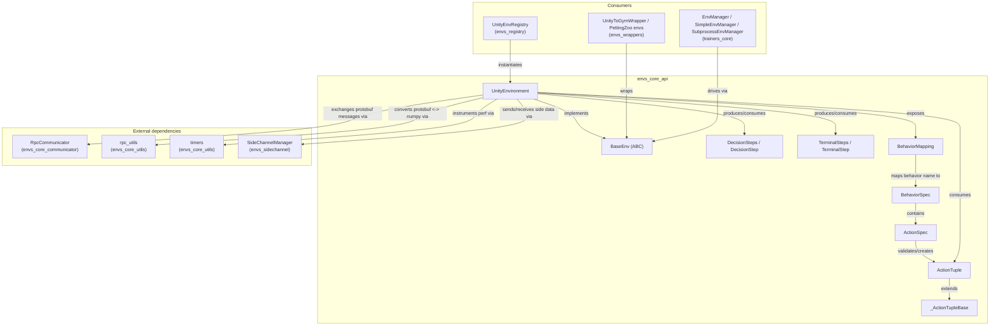
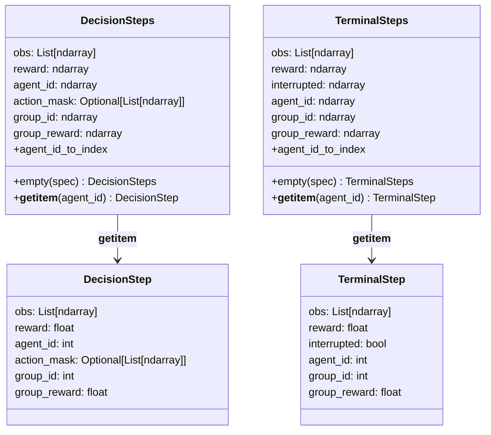
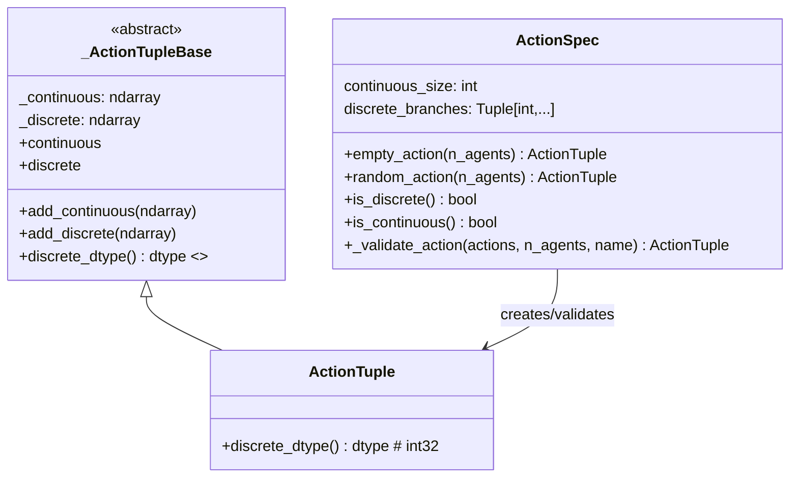
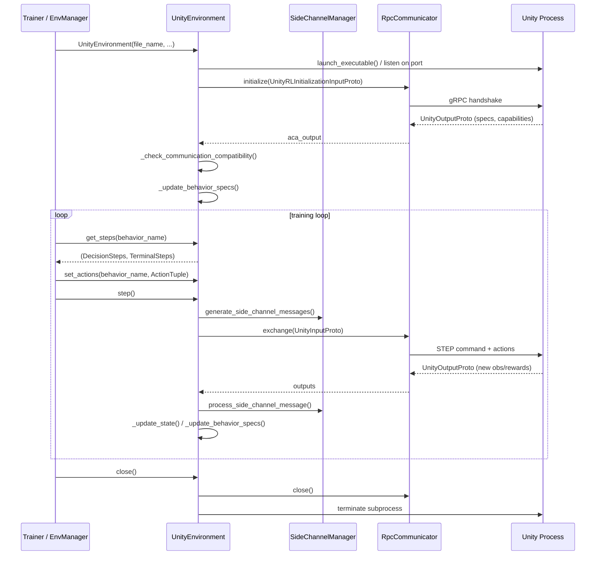
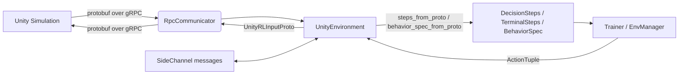

# Environment Core API (`envs_core_api`)

## 1. Purpose

`envs_core_api` is the foundational **Python-side contract** for interacting with a Unity
simulation in the ML-Agents Toolkit. It defines:

- The **abstract environment interface** (`BaseEnv`) and its concrete gRPC-backed
  implementation, `UnityEnvironment`.
- The **data structures** used to exchange observations, rewards, and actions between
  Python and Unity: `DecisionSteps`, `TerminalSteps`, `BehaviorMapping`, `BehaviorSpec`,
  `ActionSpec`, and `ActionTuple` (built on `_ActionTupleBase`).

Every other Python component that talks to a Unity process — RL trainers, Gym/PettingZoo
wrappers, the environment registry, and side-channel based configuration tools — is built
on top of the types defined here. This module is intentionally free of any RL-training
logic; it is a **pure environment/agent I/O layer**.

This module is a child of the broader `envs_core` module. Sibling modules that provide the
transport and support machinery consumed by `UnityEnvironment` are:

- [envs_core_communicator](envs_core_communicator.md) — gRPC communicator (`RpcCommunicator`)
  and the mock/test communicator used by `UnityEnvironment` to physically exchange protobuf
  messages with Unity.
- [envs_core_utils](envs_core_utils.md) — low-level helpers such as protobuf-to-numpy
  conversion (`rpc_utils`) and performance timers (`timers`) used internally by
  `UnityEnvironment`.
- [envs_sidechannel](envs_sidechannel.md) — the side channel infrastructure
  (`SideChannel`, `SideChannelManager`, `EngineConfigurationChannel`,
  `EnvironmentParametersChannel`, etc.) that `UnityEnvironment` uses for out-of-band,
  non-RL communication with Unity.

Consumers built on top of this API include:

- [envs_wrappers](envs_wrappers.md) — Gym and PettingZoo adapters (`UnityToGymWrapper`,
  `UnityAECEnv`, `UnityParallelEnv`) that translate the `BaseEnv` interface into
  standard RL library interfaces.
- [envs_registry](envs_registry.md) — a catalog (`UnityEnvRegistry`) of pre-built Unity
  environments that can be instantiated as `UnityEnvironment` instances.
- [trainers_core](trainers_core.md) (Training Orchestration module) — `EnvManager`,
  `SimpleEnvManager`, and `SubprocessEnvManager` drive one or more `UnityEnvironment` (or
  compatible `BaseEnv`) instances during training, consuming `DecisionSteps`/`TerminalSteps`
  and producing `ActionTuple`s.
- On the Unity/C# side, the counterpart runtime pieces that speak the same wire protocol
  are documented under [runtime_communicator](runtime_communicator.md) and
  [runtime_sidechannels](runtime_sidechannels.md).

## 2. Architecture Overview

`envs_core_api` has two files with a clear separation of concerns:

- **`base_env.py`** — protocol/data-model layer. Defines the abstract `BaseEnv` contract
  and all the plain-data types that flow across that contract. It has no knowledge of
  gRPC, sockets, or Unity processes.
- **`environment.py`** — concrete implementation layer. `UnityEnvironment` implements
  `BaseEnv` by launching/connecting to a Unity process and translating between the
  protobuf wire format and the `base_env` data model.

## 3. Core Concepts & Components

### 3.1 `BaseEnv` — the environment contract

`BaseEnv` (defined alongside the data types in `base_env.py`) is an `ABC` with four
abstract members that every concrete environment (real Unity connection, mock, or
wrapper-friendly adapter) must implement:

| Member | Description |
|---|---|
| `step()` | Advances the simulation by one step, using previously-set actions. |
| `reset()` | Resets the simulation to a new episode. |
| `close()` | Terminates the connection/simulation. |
| `behavior_specs` | Property returning a `Mapping[str, BehaviorSpec]` describing every currently known behavior. |
| `set_actions(behavior_name, action)` | Sets a batch of actions for all agents under a behavior. |
| `set_action_for_agent(behavior_name, agent_id, action)` | Sets the action for a single agent. |
| `get_steps(behavior_name)` | Returns the `(DecisionSteps, TerminalSteps)` pair for a behavior. |

This interface decouples every downstream consumer (trainers, Gym/PettingZoo wrappers,
registry) from the transport mechanism. Any object satisfying `BaseEnv` — a live
`UnityEnvironment`, a `MockCommunicator`-backed test double (see
[envs_core_communicator](envs_core_communicator.md)), or a custom simulator — can be used
interchangeably by trainers.

### 3.2 Step data model: `DecisionSteps` / `TerminalSteps`

At every simulation step, agents that need a decision are batched into a `DecisionSteps`
object, and agents whose episode just ended are batched into a `TerminalSteps` object.
Both are read-only `Mapping[AgentId, *Step]` collections that support:

- `len(...)` — number of agents in the batch.
- `steps[agent_id]` — extraction of the single-agent `DecisionStep`/`TerminalStep`
  (unbatches the per-agent slice from the batched numpy arrays).
- Iteration over agent ids.
- `DecisionSteps.empty(spec)` / `TerminalSteps.empty(spec)` — construct an empty batch
  matching a given `BehaviorSpec` (used when no agents of a behavior reported this step).

Internally, data is stored as batched numpy arrays (`obs`, `reward`, `agent_id`,
`group_id`, `group_reward`, and optionally `action_mask`), and a lazily-built
`agent_id_to_index` dict provides O(1) lookup by agent id.

`group_id` and `group_reward` support **multi-agent groups** (e.g. cooperative teams via
`SimpleMultiAgentGroup`, see the Unity-side
[runtime_core_agent](runtime_core_agent.md) module), allowing group-level reward
aggregation to be threaded through to trainers such as POCA (see
[trainers_poca](trainers_poca.md)).

### 3.3 Behavior description: `BehaviorSpec` / `BehaviorMapping`

- `ObservationSpec` describes a single observation's shape, per-dimension properties
  (`DimensionProperty`: none / translational-equivariant / variable-size), and
  `ObservationType` (default vs. goal-signal).
- `ActionSpec` describes the action space of a behavior — a continuous size and a tuple of
  discrete branch sizes — and provides utilities: `empty_action`, `random_action`,
  `is_discrete`/`is_continuous`, and internal validation (`_validate_action`) used by
  `UnityEnvironment` before actions are sent to Unity.
- `BehaviorSpec` bundles a list of `ObservationSpec` with one `ActionSpec` for a group of
  agents sharing the same behavior.
- `BehaviorMapping` is a read-only `Mapping[BehaviorName, BehaviorSpec]` exposed via
  `UnityEnvironment.behavior_specs`; new behaviors can appear as new policies are
  instantiated on the Unity side.

### 3.4 Actions: `_ActionTupleBase` / `ActionTuple`

`_ActionTupleBase` is an abstract base holding a pair of numpy arrays — `continuous`
(`float32`, shape `(n_agents, continuous_size)`) and `discrete` (shape
`(n_agents, discrete_size)`, dtype defined by the abstract `discrete_dtype` property).
Adding either component auto-fills the other with a zero-width array so that both fields
are always well-formed for a hybrid action space.

`ActionTuple` is the concrete subclass used throughout the toolkit, fixing
`discrete_dtype` to `int32`. `ActionSpec.empty_action`/`random_action` construct
`ActionTuple` instances, and `ActionSpec._validate_action` enforces the expected shapes
before `UnityEnvironment.set_actions`/`set_action_for_agent` forwards them to Unity.

### 3.5 `UnityEnvironment` — the concrete `BaseEnv`

`UnityEnvironment` is the primary implementation of `BaseEnv`. It either **launches** a
Unity executable as a subprocess or **connects** to an already-running Unity Editor
instance, then communicates over gRPC using protobuf messages.

Key responsibilities:

1. **Lifecycle management**: launches the executable (`env_utils.launch_executable`),
   opens a communicator (`RpcCommunicator`, from
   [envs_core_communicator](envs_core_communicator.md)), performs an initial handshake
   (`_send_academy_parameters`) exchanging `UnityRLInitializationInputProto` /
   `UnityOutputProto`, and registers an `atexit` hook plus explicit `close()`/`_close()` to
   guarantee the subprocess and socket are cleaned up.
2. **Protocol version negotiation**: `API_VERSION` (currently `1.5.0`) is checked against
   the Unity package's communication version via
   `_check_communication_compatibility`/`_raise_version_exception`, and a
   `UnityRLCapabilitiesProto` capability handshake (`_get_capabilities_proto`) advertises
   supported features (hybrid actions, variable-length observations, multi-agent groups,
   training analytics, etc.).
3. **Step/reset exchange**: `step()`/`reset()` build a `UnityRLInputProto`
   (`_generate_step_input`/`_generate_reset_input`), embed any pending side-channel
   messages, and exchange it with Unity through the communicator. Responses populate
   `_env_state` (`DecisionSteps`/`TerminalSteps` per behavior, produced via
   `steps_from_proto` from [envs_core_utils](envs_core_utils.md)) and update
   `_env_specs`/`behavior_specs` (`_update_behavior_specs`, using
   `behavior_spec_from_proto`).
4. **Action buffering**: `set_actions`/`set_action_for_agent` validate and stage actions
   in `_env_actions`; unset behaviors are auto-filled with empty actions before the next
   `step()`.
5. **Side channels**: a `SideChannelManager` (see
   [envs_sidechannel](envs_sidechannel.md)) wraps user-supplied `SideChannel`s plus an
   automatically-injected `DefaultTrainingAnalyticsSideChannel`, handling
   serialization/deserialization of out-of-band messages piggy-backed on every
   step/reset exchange.
6. **Process supervision**: `_poll_process` checks whether the Unity subprocess has died
   unexpectedly and raises `UnityEnvironmentException`; `_returncode_to_env_message`
   translates POSIX signals into human-readable shutdown reasons.

## 4. Data Flow Summary

## 5. Relationship to the Rest of the System

- **Upstream (transport & support)**: `UnityEnvironment` relies on
  [envs_core_communicator](envs_core_communicator.md) for the actual gRPC transport and
  test doubles, and on [envs_core_utils](envs_core_utils.md) for protobuf⇄numpy
  conversion (`rpc_utils`) and timing instrumentation (`timers`). Side, non-RL
  communication is delegated to [envs_sidechannel](envs_sidechannel.md).
- **Downstream (consumers of `BaseEnv`)**:
  - [envs_wrappers](envs_wrappers.md) adapts `BaseEnv`/`UnityEnvironment` to the OpenAI
    Gym and PettingZoo APIs for use with third-party RL libraries.
  - [envs_registry](envs_registry.md) provides discoverable, named
    `UnityEnvironment`-producing factories for common example environments.
  - [trainers_core](trainers_core.md) (part of the Training Orchestration module) is the
    primary in-house consumer: `EnvManager`/`SimpleEnvManager`/`SubprocessEnvManager`
    drive `UnityEnvironment` instances, collect `DecisionSteps`/`TerminalSteps` into
    trajectories, and dispatch `ActionTuple`s produced by policies (see
    [trainers_policy](trainers_policy.md)).
- **Counterpart on the Unity side**: The C# runtime components that implement the other
  half of this same wire protocol (Academy, communicators, side channels) are documented
  in [runtime_communicator](runtime_communicator.md) and
  [runtime_sidechannels](runtime_sidechannels.md), while agent/behavior concepts mirrored
  by `BehaviorSpec`/multi-agent groups are documented in
  [runtime_core_agent](runtime_core_agent.md).

## 6. Summary

`envs_core_api` is a small but critical module: it establishes the single, stable
vocabulary (`BehaviorSpec`, `DecisionSteps`, `TerminalSteps`, `ActionTuple`) that every
Python-side component — whether a hand-written script, a Gym wrapper, or a full PPO/SAC/
POCA trainer — uses to talk to a Unity simulation, and it supplies the one first-party
implementation of that contract, `UnityEnvironment`, which manages the process lifecycle,
protocol handshake, and per-step data marshalling against the Unity gRPC service.
