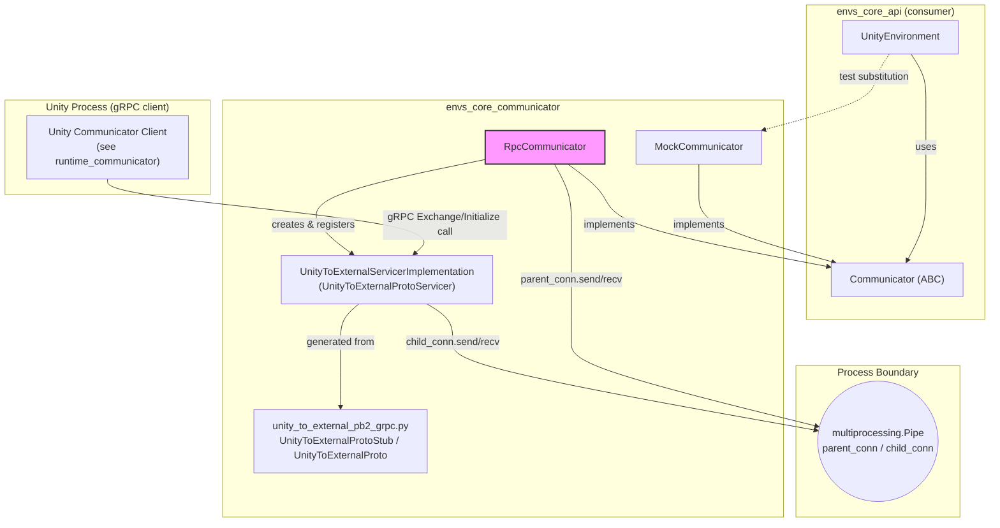
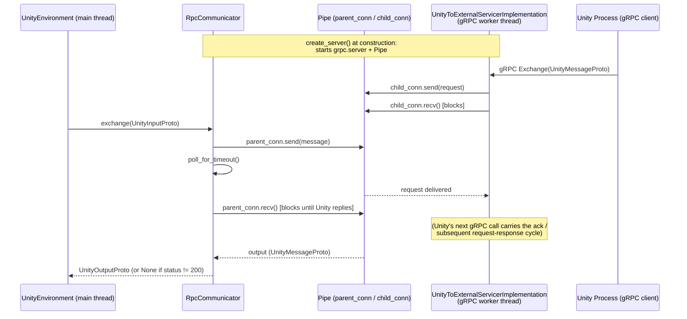
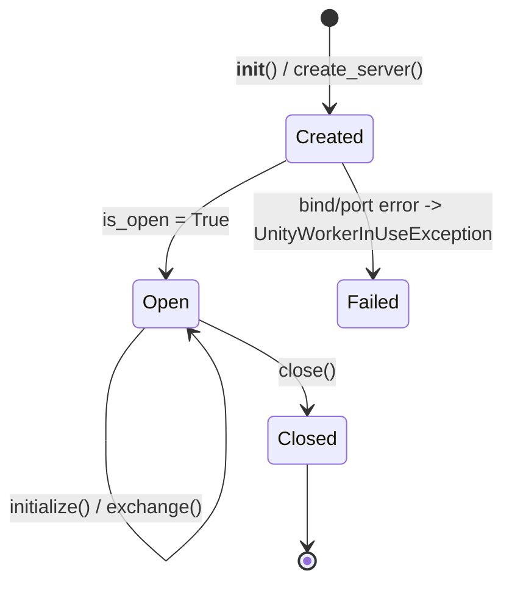
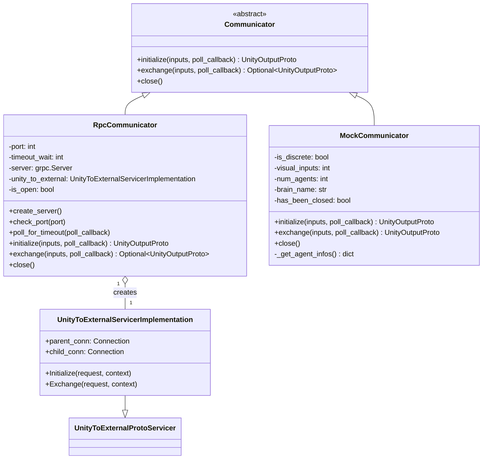
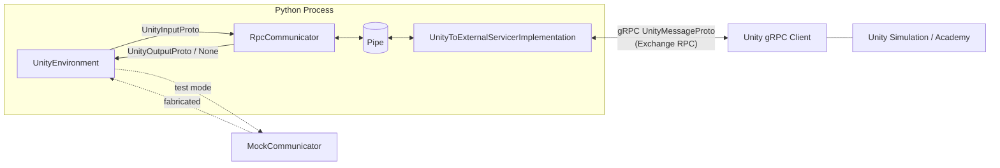

# Environment Core Communicator (`envs_core_communicator`)

## 1. Purpose

`envs_core_communicator` implements the **transport layer** that physically moves
protobuf-encoded messages between the Python trainer process and a running Unity
simulation. It is the lowest layer of the ML-Agents Python stack — a thin, protocol-agnostic
plumbing module with no knowledge of RL semantics (observations, rewards, actions). Its sole
job is to reliably deliver opaque `UnityInputProto` / `UnityOutputProto` messages across the
process boundary and back.

The module provides two concrete implementations of the abstract `Communicator` interface:

- **`RpcCommunicator`** — the production transport, which starts a gRPC server in the
  Python process (Python acts as the **server**, Unity as the **client**) and bridges gRPC
  calls to a `multiprocessing.Pipe` consumed synchronously by `UnityEnvironment`.
- **`MockCommunicator`** — an in-process test double that fabricates plausible
  `UnityOutputProto` responses (agent infos, brain parameters) without requiring a real Unity
  build, used extensively in unit tests.

It also contains the **generated gRPC service definitions**
(`unity_to_external_pb2_grpc.py`) that define the `UnityToExternalProto` service contract
shared by the Python server and the Unity gRPC client.

This module is a child of [envs_core](envs_core.md), sitting alongside its sibling modules:

- [envs_core_api](envs_core_api.md) — defines `UnityEnvironment` (the sole consumer of this
  module) and the `Communicator` abstract base class that both `RpcCommunicator` and
  `MockCommunicator` implement.
- [envs_core_utils](envs_core_utils.md) — protobuf⇄numpy conversion and hierarchical timing
  utilities used by `UnityEnvironment` once data has been delivered by this module.

On the Unity/C# side, the counterpart client implementation that connects to the gRPC server
started by `RpcCommunicator` is documented in
[runtime_communicator](runtime_communicator.md) (`UnityRLInputParameters` and the C#
communicator client that talks the same `UnityToExternalProto.Exchange` RPC).

## 2. Architecture Overview

### Why a `Pipe` in a single process?

`RpcCommunicator` runs its gRPC server on background threads (via a `ThreadPoolExecutor`)
inside the same Python process as `UnityEnvironment`. To hand data from the gRPC servicer
thread (which receives Unity's RPC call) back to the main thread (where `UnityEnvironment`
is calling `exchange`/`initialize` synchronously), it uses a `multiprocessing.Pipe`:

- `UnityToExternalServicerImplementation` owns both ends of the pipe (`parent_conn`,
  `child_conn`) at construction time.
- The gRPC-invoked methods (`Initialize`, `Exchange`) run on a worker thread and write the
  incoming message to `child_conn`, then block on `child_conn.recv()` for the reply.
- `RpcCommunicator`'s public methods (`initialize`, `exchange`) run on the caller's thread
  and read from `parent_conn`, then write the reply back — effectively synchronizing the
  async gRPC callback with the synchronous `UnityEnvironment` API.

## 3. Core Components

### 3.1 `Communicator` (imported base class, defined in `envs_core_api`'s sibling `communicator.py`)

Both concrete communicators implement this simple contract:

| Method | Responsibility |
|---|---|
| `__init__(worker_id, base_port)` | Store connection parameters (port offset for parallel environments). |
| `initialize(inputs, poll_callback) -> UnityOutputProto` | One-time handshake: exchange `UnityRLInitializationInputProto`-wrapped `UnityInputProto` for the initial `UnityOutputProto` describing behaviors/capabilities. |
| `exchange(inputs, poll_callback) -> Optional[UnityOutputProto]` | Per-step exchange: send actions/side-channel data, receive new observations. Returns `None` if the environment reported an error/shutdown. |
| `close()` | Signal shutdown and release transport resources. |

`poll_callback` is an optional zero-argument callable (typically `UnityEnvironment._poll_process`)
invoked periodically while waiting for a response, used to detect a dead Unity subprocess
sooner than a full timeout.

### 3.2 `RpcCommunicator`

The production, gRPC-based transport. Python is the **gRPC server**; the Unity Editor/Player
is the **gRPC client**.

**Construction / server setup** (`__init__`, `create_server`):

- Computes the listen `port = base_port + worker_id`, enabling multiple environment
  instances to run in parallel without port collisions (this scheme mirrors
  `UnityEnvironment.BASE_ENVIRONMENT_PORT`/`worker_id` in
  [envs_core_api](envs_core_api.md)).
- `check_port` proactively binds a throwaway socket to detect if the port is already in use,
  raising `UnityWorkerInUseException` early with an actionable message rather than letting
  gRPC fail more obscurely later. On Linux, `SO_REUSEADDR` is set to avoid `TIME_WAIT`
  false positives.
- Creates a `grpc.server` with a 10-worker `ThreadPoolExecutor` and `grpc.so_reuseport`
  enabled (needed for Docker port sharing), registers a
  `UnityToExternalServicerImplementation`, binds to `[::]:<port>` (all interfaces, so
  containerized Unity builds can connect), and starts the server. Any failure here is
  wrapped as `UnityWorkerInUseException`.

**Timeout-safe polling** (`poll_for_timeout`):

- Rather than blocking forever on `parent_conn.recv()`, `RpcCommunicator` first polls the
  pipe with a bounded deadline (`timeout_wait` seconds total, checked in
  `timeout_wait // 10` increments). If no data arrives before the deadline, it raises
  `UnityTimeOutException` with guidance covering the most common causes (headless mode,
  Behavior Type misconfiguration, version mismatch). Between poll intervals, the optional
  `poll_callback` is invoked so the caller can detect a crashed Unity process and raise its
  own, more specific exception before the generic timeout fires.

**Handshake** (`initialize`):

1. `poll_for_timeout` guards against a Unity process that never connects.
2. Reads the first message from `parent_conn` (Unity's initial `unity_output`).
3. Wraps the caller's `UnityInputProto` in a `UnityMessageProto` with `header.status = 200`
   and sends it back down the pipe as the acknowledgement/initialization payload.
4. Performs one more blocking `recv()` to complete the handshake round-trip.
5. Returns the previously captured `aca_param` (the Unity-reported initialization output).

**Per-step exchange** (`exchange`):

1. Wraps `inputs` in a `UnityMessageProto` (`status = 200`) and sends it via `parent_conn`.
2. Waits (with timeout) for Unity's reply.
3. If `output.header.status != 200`, returns `None` — signaling to
   `UnityEnvironment.step()`/`reset()` that the communicator has stopped
   (`UnityCommunicatorStoppedException` is raised on the caller side).
4. Otherwise returns `output.unity_output`.

**Shutdown** (`close`):

- Sends a `UnityMessageProto` with `header.status = 400` (a shutdown signal Unity's
  communicator recognizes), closes the pipe, and stops the gRPC server
  (`server.stop(False)` — non-graceful, immediate stop). Idempotent via the `is_open` flag.

### 3.3 `UnityToExternalServicerImplementation`

The gRPC servicer that fulfills the `UnityToExternalProtoServicer` contract generated from
the `.proto` definition. It is deliberately minimal: both `Initialize` and `Exchange` gRPC
methods perform the identical bridge operation — forward the incoming request onto
`child_conn` and block for the reply on the same pipe. All protocol-specific behavior
(status codes, handshake sequencing) lives in `RpcCommunicator`, keeping the servicer a pure
pipe-to-gRPC adapter.

> Note: The gRPC service technically only exposes a single RPC, `Exchange` (see
> `unity_to_external_pb2_grpc.py` below); `Initialize` on the servicer class is legacy/extra
> surface not wired into the generated `add_UnityToExternalProtoServicer_to_server` handler
> map, so in practice all Unity-originated calls arrive through `Exchange`.

### 3.4 `unity_to_external_pb2_grpc.py` — Generated gRPC Service Code

Auto-generated by the gRPC protobuf compiler from the `UnityToExternalProto` service
definition (not hand-maintained — "DO NOT EDIT" per file header). Defines:

| Symbol | Role |
|---|---|
| `UnityToExternalProtoServicer` | Server-side base class with the `Exchange(request, context)` method that `UnityToExternalServicerImplementation` overrides. |
| `add_UnityToExternalProtoServicer_to_server(servicer, server)` | Registers the unary-unary `Exchange` RPC handler (serializing/deserializing `UnityMessageProto`) with a `grpc.server` instance — called by `RpcCommunicator.create_server`. |
| `UnityToExternalProtoStub` | Client-side stub (constructed from a `grpc.Channel`) that Unity's C# gRPC client conceptually mirrors to invoke `Exchange` — used for testing/reference from Python, not by `RpcCommunicator` itself (Python is the server, not the client, in this protocol). |
| `UnityToExternalProto` | Experimental static-call helper wrapping `grpc.experimental.unary_unary` for one-off calls without an explicit stub/channel object. |

The single RPC, **`Exchange(UnityMessageProto) -> UnityMessageProto`**, carries both
initialization and step-exchange traffic — `RpcCommunicator` differentiates the two
conceptually (`initialize` vs `exchange` methods) purely through message sequencing and
`header.status`, not through distinct RPC endpoints.

### 3.5 `MockCommunicator`

A `Communicator` implementation used purely for **testing** `UnityEnvironment` and
higher-level trainer code without launching a real Unity process. It fabricates protobuf
responses deterministically based on constructor parameters:

| Parameter | Effect |
|---|---|
| `discrete_action` | If `True`, returns an `ActionSpecProto` with `num_discrete_actions=2, discrete_branch_sizes=[3, 2]`; otherwise `num_continuous_actions=2`. |
| `visual_inputs` | Number of dummy compressed (`PNG`) visual `ObservationProto` entries generated per agent, in addition to one uncompressed vector observation. |
| `num_agents` | Number of `AgentInfoProto` entries returned per exchange (agent `i == 2` is always marked `done`, simulating episode termination). |
| `brain_name` | Name used both for the `BrainParametersProto` and as the dictionary key for agent infos. |
| `vec_obs_size` | (Stored but the mocked vector observation is currently fixed to `[1, 2, 3]`.) |

Behavior of its `Communicator` interface methods:

- **`initialize`**: builds a `BrainParametersProto`/`UnityRLInitializationOutputProto`
  (mirroring what `UnityEnvironment._update_behavior_specs` expects) using
  `UnityEnvironment.API_VERSION` as the reported communication version, bundled with a
  `UnityRLOutputProto` containing fabricated agent infos.
- **`exchange`**: returns a fresh `UnityRLOutputProto` (fabricated agent infos) wrapped in a
  `UnityOutputProto`, simulating a normal step response every time (never returns `None`).
- **`close`**: merely records `has_been_closed = True` for test assertions — no real
  resources to release.

## 4. Error Handling

The module raises two purpose-built exceptions (defined in `mlagents_envs.exception`,
consumed by `UnityEnvironment` in [envs_core_api](envs_core_api.md)):

| Exception | Raised by | Meaning |
|---|---|---|
| `UnityWorkerInUseException` | `RpcCommunicator.check_port` / `create_server` | The requested `worker_id`'s port is already bound — typically a previous environment instance wasn't closed properly, or two trainers used the same `worker_id`. |
| `UnityTimeOutException` | `RpcCommunicator.poll_for_timeout` | No response arrived from Unity within `timeout_wait` seconds — usually indicates a Unity build that isn't launching correctly, has the wrong Behavior Type, needs user interaction, or is version-incompatible. |

`UnityEnvironment` catches `UnityTimeOutException` during construction to clean up
partially-started resources before re-raising, and treats an `exchange()` result of `None`
as `UnityCommunicatorStoppedException` (raised in `envs_core_api`, not here).

## 5. Data Flow Summary

## 6. How It Fits into the Overall System

- **Direct consumer**: [envs_core_api](envs_core_api.md)'s `UnityEnvironment` is the only
  production caller of this module — it selects `RpcCommunicator` via the overridable
  `_get_communicator` static method, making it straightforward for tests to monkeypatch in
  `MockCommunicator` instead.
- **Peer utility modules**: Once `RpcCommunicator`/`MockCommunicator` deliver a raw
  `UnityOutputProto`, [envs_core_utils](envs_core_utils.md) takes over to decode observation
  bytes into NumPy arrays (`rpc_utils.steps_from_proto`) and to time the exchange
  (`timers.hierarchical_timer`).
- **Unity-side counterpart**: The gRPC client that connects to the server started by
  `RpcCommunicator.create_server` and issues `Exchange` calls lives in the C# codebase,
  documented under [runtime_communicator](runtime_communicator.md)
  (`UnityRLInputParameters` and the surrounding Academy/Communicator runtime).
- **Indirect consumers**: Everything built on top of `UnityEnvironment` — the
  [envs_wrappers](envs_wrappers.md) Gym/PettingZoo adapters, the
  [envs_registry](envs_registry.md) environment catalog, and the
  [Training Orchestration & Lifecycle Infrastructure](trainers_core.md) module's
  `SimpleEnvManager`/`SubprocessEnvManager` — depend transitively on this module for actual
  network I/O, but never import it directly.
- **Testing**: `MockCommunicator` is widely used across the `ml-agents-envs` and
  `ml-agents` test suites to construct `UnityEnvironment`-like behavior deterministically,
  without spawning a Unity subprocess, enabling fast CI runs for higher-level modules
  (trainers, wrappers) that otherwise depend on this transport.

## 7. Key Design Points

- **Server/client role reversal**: Unlike typical client-server RL setups, here **Python is
  the gRPC server** and **Unity is the gRPC client** — this lets a single Python process
  listen on a well-known port and lets multiple/parallel Unity instances (subprocess or
  Editor) dial in, which simplifies subprocess-based parallel training
  (`SubprocessEnvManager`, see [trainers_core](trainers_core.md)).
- **Thread-to-pipe bridging**: The `multiprocessing.Pipe` inside
  `UnityToExternalServicerImplementation` is used purely as a thread-safe, blocking
  hand-off primitive within a single process — not for actual inter-process
  communication — decoupling the gRPC thread pool's callback-style API from
  `UnityEnvironment`'s synchronous call/response usage pattern.
- **Fail-fast port management**: Proactive `check_port` socket binding surfaces port
  conflicts as an actionable `UnityWorkerInUseException` before the more opaque gRPC bind
  failure would occur.
- **Bounded, interruptible waits**: `poll_for_timeout`'s chunked polling (rather than a
  single blocking `recv()`) allows an external liveness check (`poll_callback`) to abort a
  wait early when the Unity process has already died, rather than waiting out the full
  timeout.
- **Status-coded protocol framing**: A simple `header.status` convention (`200` = normal
  exchange, `400` = shutdown) layered on top of the single gRPC `Exchange` RPC keeps the
  wire protocol minimal while still supporting handshake, steady-state exchange, and
  graceful shutdown signaling.
- **Swappable transport for testing**: Because both `RpcCommunicator` and
  `MockCommunicator` implement the same narrow `Communicator` interface, `UnityEnvironment`
  and all downstream code remain transport-agnostic, enabling fast, deterministic unit
  tests via `MockCommunicator` without any code changes to production logic.
