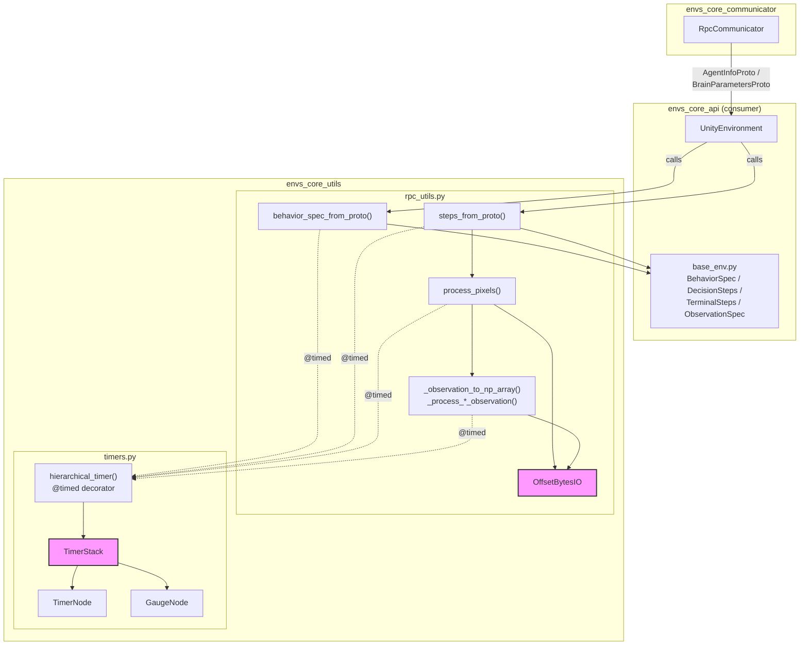
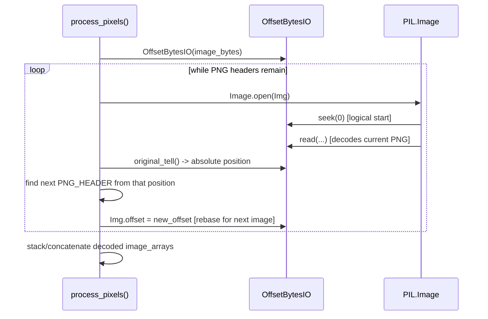
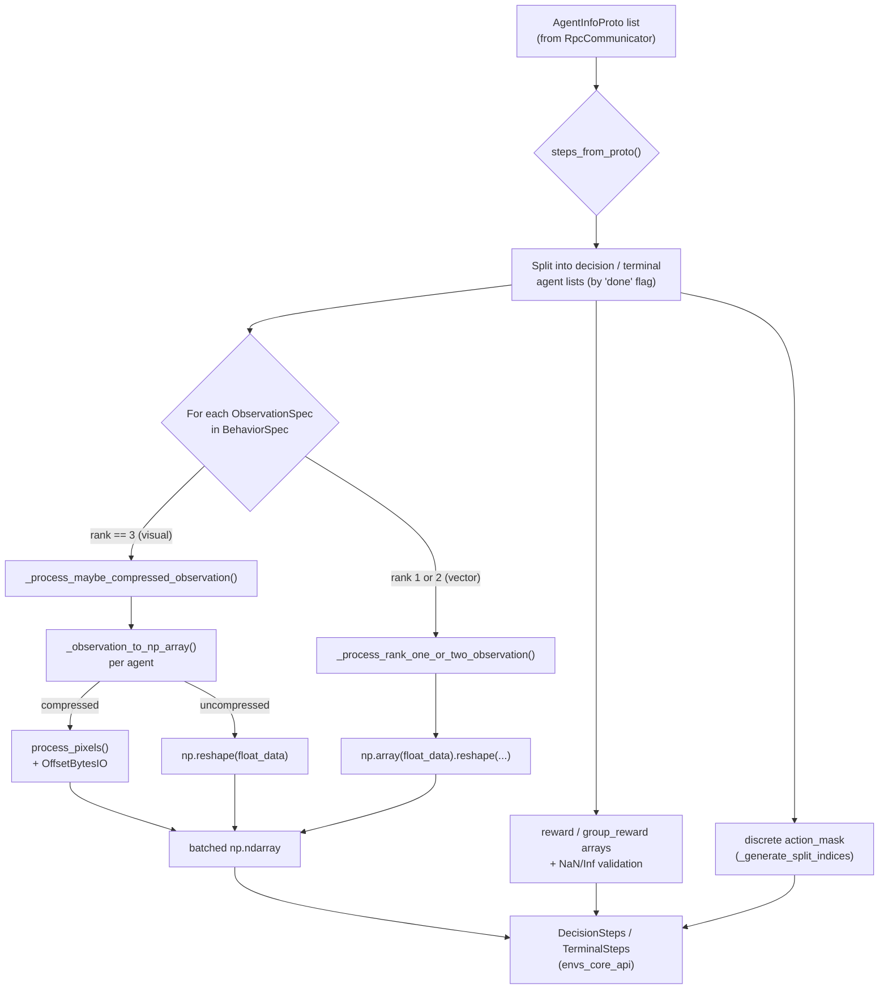
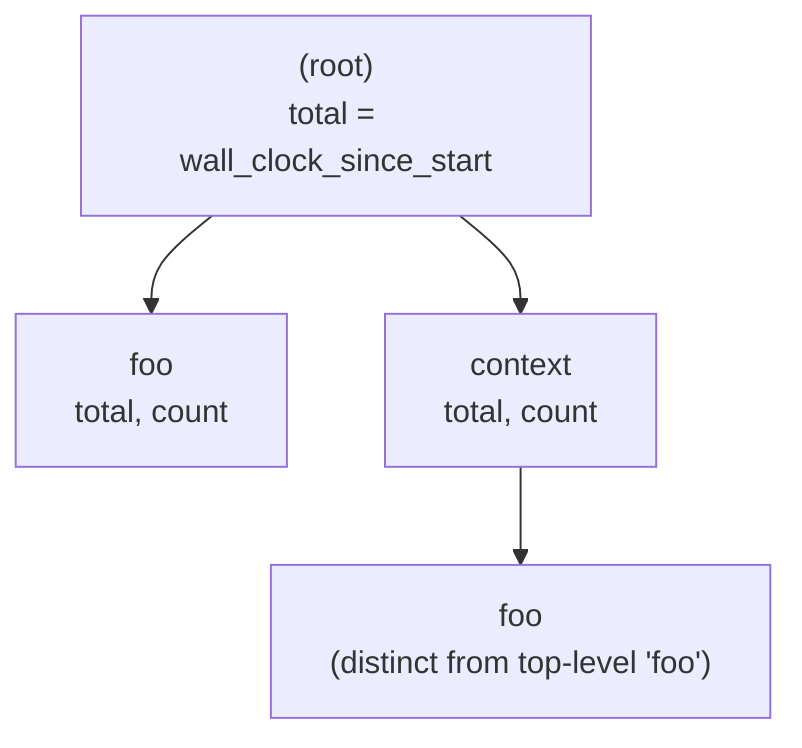
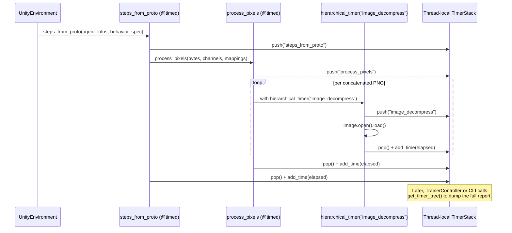

# Environment Core Utilities (`envs_core_utils`)

## 1. Purpose

`envs_core_utils` provides the **low-level, protocol-agnostic support utilities** used
throughout the Python side of the ML-Agents Toolkit. It has two distinct responsibilities,
each implemented in its own file:

- **`rpc_utils.py`** — Converts wire-format Protobuf messages (`AgentInfoProto`,
  `ObservationProto`, `BrainParametersProto`) received from Unity into the NumPy-based
  data structures (`BehaviorSpec`, `DecisionSteps`, `TerminalSteps`) consumed by trainers
  and wrappers. This includes decompressing PNG-encoded visual observations (including the
  concatenated multi-image format Unity uses for >3 channel visual observations) via the
  `OffsetBytesIO` helper class.
- **`timers.py`** — A lightweight, dependency-free, hierarchical, thread-local profiling
  framework (`TimerNode`, `TimerStack`, `GaugeNode`) used to measure time spent in nested
  code blocks (e.g., communication overhead vs. observation decoding vs. training step) via
  a `@timed` decorator and `hierarchical_timer` context manager.

Both files are pure utility modules with **no dependency on RL training logic** — they only
depend on `mlagents_envs.base_env` (data classes) and generated protobuf types. This makes
`envs_core_utils` a foundational, widely-reused building block across the entire Python
`mlagents_envs` package and the higher-level `mlagents` trainer package.

This module is a child of [envs_core](envs_core.md), alongside its sibling modules:

- [envs_core_api](envs_core_api.md) — defines `UnityEnvironment`, `BehaviorSpec`,
  `DecisionSteps`, `TerminalSteps`, and `BehaviorMapping`. `rpc_utils` in this module
  produces instances of exactly these types, and `UnityEnvironment` calls into
  `rpc_utils.steps_from_proto` / `behavior_spec_from_proto` on every step/reset.
- [envs_core_communicator](envs_core_communicator.md) — the gRPC transport
  (`RpcCommunicator`) that delivers the raw `AgentInfoProto`/`BrainParametersProto` messages
  that `rpc_utils` decodes.

## 2. Architecture Overview



## 3. Sub-components

### 3.1 `rpc_utils.py` — Protobuf → NumPy Conversion

This file bridges the wire format (Protobuf, as delivered by
[envs_core_communicator](envs_core_communicator.md)) and the in-memory data model used by
Python trainers and environment wrappers (defined in
[envs_core_api](envs_core_api.md)'s `base_env.py`).

#### Key Functions

| Function | Responsibility |
|---|---|
| `behavior_spec_from_proto(brain_param_proto, agent_info)` | Builds a `BehaviorSpec` (observation specs + action spec) from a `BrainParametersProto` and a sample `AgentInfoProto`. Handles both the modern `action_spec` proto field and the deprecated `vector_action_*` fields for backward compatibility with older Unity builds. |
| `steps_from_proto(agent_info_list, behavior_spec)` | The main entry point used by `UnityEnvironment` on every step/reset. Splits a batch of `AgentInfoProto` into "done" vs "not done" agents, decodes all observations for each group, and returns a `(DecisionSteps, TerminalSteps)` tuple. Also computes action masks for discrete action spaces and validates rewards/observations for NaN/Infinite values. |
| `process_pixels(image_bytes, expected_channels, mappings=None)` | Decodes one or more concatenated PNG images from a single byte buffer into a normalized `float32` NumPy array (`C×H×W`, values in `[0, 1]`). Supports the legacy "first N channels" behavior and the newer explicit `compressed_channel_mapping` scheme for combining multiple grayscale/RGB PNGs into an arbitrary-channel observation. |
| `_process_images_mapping(image_arrays, mappings)` | Combines decoded images according to an explicit per-channel mapping (each output channel is the mean of all images mapped to it). |
| `_process_images_num_channels(image_arrays, expected_channels)` | Legacy path: converts to grayscale if 1 channel expected, otherwise concatenates and truncates to `expected_channels`. |
| `_observation_to_np_array(obs, expected_shape=None)` | Converts a single `ObservationProto` (compressed or raw float data) into a NumPy array, validating shape consistency. |
| `_process_maybe_compressed_observation(...)` / `_process_rank_one_or_two_observation(...)` | Batch across a list of agents for visual (rank 3) vs. vector/rank-1-2 observations respectively, producing the batched arrays stored in `DecisionSteps`/`TerminalSteps`. |
| `_check_observations_match_spec(...)` | Produces a descriptive `UnityObservationException` when an agent's observation shape doesn't match the expected `ObservationSpec`, instead of letting NumPy raise a cryptic `ValueError`. |
| `_raise_on_nan_and_inf(data, source)` | Cheap NaN/Inf detection via `np.mean()`, raising `RuntimeError` if triggered — guards against corrupted training data silently propagating into trainers. |
| `_generate_split_indices(dims)` | Computes cumulative split points for `np.split`, used to break a combined discrete action-mask array back into per-branch masks. |

#### `OffsetBytesIO`

```python
class OffsetBytesIO:
    __slots__ = ["fp", "offset"]
```

A minimal file-like wrapper around `io.BytesIO` that supports an artificial "start offset."
This exists to solve a specific problem: Unity can pack **multiple concatenated PNG images**
into a single byte buffer (used when an observation has more channels than a single PNG can
encode, e.g. more than 4 channels). `Pillow`'s `Image.open()` always calls `seek(0)` when it
starts parsing an image, which would normally force callers to physically copy each
sub-image's bytes into a new buffer.

`OffsetBytesIO` instead lets the caller **logically re-base "position 0"** to the start of
the next PNG in the buffer (by setting `self.offset`) without any copying:

| Method | Behavior |
|---|---|
| `seek(offset, whence=SEEK_SET)` | Only `SEEK_SET` is supported; seeks to `offset + self.offset` in the underlying buffer, but reports the position relative to `self.offset` to callers (i.e., relative to the current "logical" image start). |
| `tell()` | Returns position relative to `self.offset` (what Pillow expects — a position local to the current logical image). |
| `read(size=-1)` | Delegates directly to the underlying `BytesIO`. |
| `original_tell()` | Returns the true, absolute position in the full buffer — used by `process_pixels` to search for the *next* PNG header without being confused by the logical offset. |

**Usage pattern** (see `process_pixels`):



This design avoids O(n²) byte-copying when many small PNGs are packed together, at the cost
of a small amount of bookkeeping complexity.

#### Observation Decoding Data Flow



### 3.2 `timers.py` — Hierarchical Profiling

A self-contained, zero-external-dependency timing framework used to profile nested sections
of code without threading timing logic through every function signature. It is used
pervasively by `rpc_utils.py` (via the `@timed` decorator) and by `UnityEnvironment`
(via `hierarchical_timer` context manager blocks) to break down where time is spent during
each environment step (communication, decoding, side-channel processing, etc.). It is also
used by [trainers_core](trainers_core.md) (`TrainerController`) to produce the timer output
written at the end of a training run.

#### Core Classes

**`TimerNode`** — Represents accumulated time spent in one named block of code.

```python
class TimerNode:
    __slots__ = ["children", "total", "count", "is_parallel"]
```

| Member/Method | Purpose |
|---|---|
| `children: Dict[str, TimerNode]` | Nested named sub-blocks (a tree, keyed by block name — no name stored on the node itself). |
| `total`, `count` | Cumulative elapsed seconds and number of times entered. |
| `is_parallel` | Marks a node that ran concurrently with siblings (set during `merge`), so tree consumers know not to expect `self` time ≥ 0 assumptions to hold cleanly. |
| `get_child(name)` | Lazily creates/returns a named child node. |
| `add_time(elapsed)` | Accumulates elapsed time and increments the invocation count. |
| `merge(other, root_name=None, is_parallel=True)` | Recursively merges another `TimerNode` tree into this one — used to combine timing data collected in separate processes/threads (e.g., worker subprocesses in `SubprocessEnvManager`, see [trainers_core](trainers_core.md)) into a single report. |

**`GaugeNode`** — Tracks the most recent value of a scalar metric (analogous to a StatsD gauge), independent of the timer tree.

```python
class GaugeNode:
    __slots__ = ["value", "min_value", "max_value", "count", "_timestamp"]
```

| Method | Purpose |
|---|---|
| `update(new_value)` | Updates `value`, expands `min_value`/`max_value`, increments `count`, refreshes internal timestamp. |
| `merge(other)` | Combines two gauges (e.g., from different processes), keeping the value with the later timestamp and the widest min/max range. |
| `as_dict()` | Serializes to `{value, min, max, count}` for reporting. |

**`TimerStack`** — Owns the root of the timer tree, the current "call stack" of active timers, gauges, and run metadata; one instance exists per thread.

```python
class TimerStack:
    __slots__ = ["root", "stack", "start_time", "gauges", "metadata"]
```

| Method | Purpose |
|---|---|
| `push(name)` / `pop()` | Enter/exit a named block, maintaining `self.stack` as the active nesting path. |
| `get_root()` | Refreshes and returns the root node's `total` (wall-clock time since the stack was created) and `count = 1`. |
| `get_timing_tree(node=None)` | Recursively serializes the tree into a plain `dict` (with `total`, `count`, `self` time, `children`, and — at the root — `gauges` and `metadata`). `self` time is computed as `total` minus the sum of children's `total`. |
| `set_gauge(name, value)` | Creates or updates a named `GaugeNode` (NaN values are silently ignored). |
| `add_metadata(key, value)` | Attaches a free-form string annotation to the run (e.g., command-line args), included in the root of the serialized tree. |
| `reset()` | Clears the tree/gauges/metadata and restarts the wall-clock baseline — used between training runs or test cases. |
| `_add_default_metadata()` | Auto-populates `timer_format_version`, `start_time_seconds`, `python_version`, `command_line_arguments`. |

#### Thread-Local Singleton Pattern

Rather than requiring callers to manage `TimerStack` instances explicitly, the module
maintains a **per-thread global stack**:

```python
_thread_timer_stacks: Dict[int, TimerStack] = {}
```

`_get_thread_timer()` looks up (or lazily creates) the `TimerStack` for
`threading.get_ident()`. All the module-level convenience functions
(`hierarchical_timer`, `timed`, `set_gauge`, `add_metadata`, `get_timer_tree`,
`get_timer_root`, `reset_timers`) default to this thread-local stack when no explicit
`timer_stack` argument is given. This makes profiling safe across `SubprocessEnvManager`
worker threads/processes without any locking, and `get_timer_stack_for_thread(t)` allows a
parent (e.g., a test or a coordinator) to introspect a specific worker thread's stack for
merging (see `TimerNode.merge`).

#### Public API

| Function | Purpose |
|---|---|
| `hierarchical_timer(name, timer_stack=None)` | Context manager: pushes `name` on entry, records elapsed wall time and pops on exit (even on exception). This is the primary building block used throughout `rpc_utils.py` (e.g., `"image_decompress"` block in `process_pixels`). |
| `timed(func)` | Decorator equivalent of `hierarchical_timer`, using `func.__qualname__` as the block name. Applied directly to `process_pixels`, `_observation_to_np_array`, `_process_maybe_compressed_observation`, `_process_rank_one_or_two_observation`, and `steps_from_proto` in `rpc_utils.py`. |
| `set_gauge(name, value, timer_stack=None)` | Records/updates a scalar metric outside the timer tree. |
| `merge_gauges(gauges, timer_stack=None)` | Merges an externally-collected gauge dict into a stack (cross-process aggregation). |
| `add_metadata(key, value, timer_stack=None)` | Attaches metadata to the current (or specified) stack. |
| `get_timer_tree(timer_stack=None)` | Returns the full serialized timing tree as a `dict`, suitable for JSON output. |
| `get_timer_root(timer_stack=None)` | Returns the raw root `TimerNode` (with `total`/`count` refreshed). |
| `reset_timers(timer_stack=None)` | Resets a stack's tree/gauges/metadata and wall-clock baseline. |

#### Timing Tree Example



As shown in the module docstring's example, blocks with the same name but different call
paths (`foo` at the root vs. `context.foo`) are tracked as **separate nodes**, giving
precise, path-sensitive breakdowns rather than aggregate per-function-name totals.

#### Typical Sequence in `envs_core_utils`



## 4. How It Fits into the Overall System

- **`rpc_utils`** is invoked exclusively by `UnityEnvironment` (in
  [envs_core_api](envs_core_api.md)) immediately after `RpcCommunicator.initialize`/`exchange`
  (in [envs_core_communicator](envs_core_communicator.md)) returns raw protobuf data. It is
  the sole translator between the wire format and the `BehaviorSpec`/`DecisionSteps`/
  `TerminalSteps` types that all downstream consumers — [envs_wrappers](envs_wrappers.md),
  [envs_registry](envs_registry.md), and [trainers_core](trainers_core.md) — operate on.
- **`timers`** has no direct data dependency on the rest of `envs_core` but is woven through
  it (and the rest of the codebase) as a cross-cutting concern. Notably, the
  `SubprocessEnvManager` in [trainers_core](trainers_core.md) merges per-worker
  `TimerNode`/`GaugeNode` trees (collected via `get_timer_stack_for_thread`) back into the
  main process's stack so that a single, unified timing report can be produced by
  `TrainerController` at the end of training, even though environment stepping happens in
  separate worker processes/threads.
- Because both files avoid importing anything from the training-specific parts of the
  codebase, `envs_core_utils` can be (and is) reused directly by the `mlagents_envs` package
  consumers that don't perform training at all (e.g., the Gym/PettingZoo wrappers in
  [envs_wrappers](envs_wrappers.md), which rely on `UnityEnvironment` having already used
  `rpc_utils` internally, and any external script that wants to profile custom code with
  `hierarchical_timer`).

## 5. Key Design Points

- **No external dependencies for timing**: `timers.py` uses only the Python standard library
  (`time`, `threading`, `contextlib`), making it safe to use in any context (including
  environments where heavier profiling libraries aren't available), and fast enough to wrap
  hot per-step code paths with negligible overhead.
- **Thread-local isolation, explicit merge**: Rather than a single global mutable timer
  (which would corrupt data under multi-threaded env stepping), each thread gets its own
  `TimerStack`; explicit `merge()` on `TimerNode`/`GaugeNode` is used when a unified report
  is needed (e.g., aggregating `SubprocessEnvManager` workers).
- **Zero-copy handling of concatenated PNGs**: `OffsetBytesIO` avoids buffer copying when
  decoding Unity's packed multi-PNG visual observations, trading a small amount of seek/tell
  bookkeeping complexity for better performance on high-channel-count visual observations.
- **Defensive validation over cryptic failures**: Both `_check_observations_match_spec` and
  `_raise_on_nan_and_inf` intentionally trade a small amount of extra computation for much
  more actionable error messages when Unity sends malformed or numerically unstable data —
  critical for diagnosing environment authoring bugs early rather than deep in a trainer's
  numeric pipeline.
- **Backward compatibility in proto decoding**: `behavior_spec_from_proto` explicitly
  supports both the current `action_spec` proto fields and the deprecated
  `vector_action_size`/`vector_action_space_type` fields, allowing newer `mlagents_envs`
  Python code to talk to older Unity builds that haven't been rebuilt against the latest
  communicator protocol.
