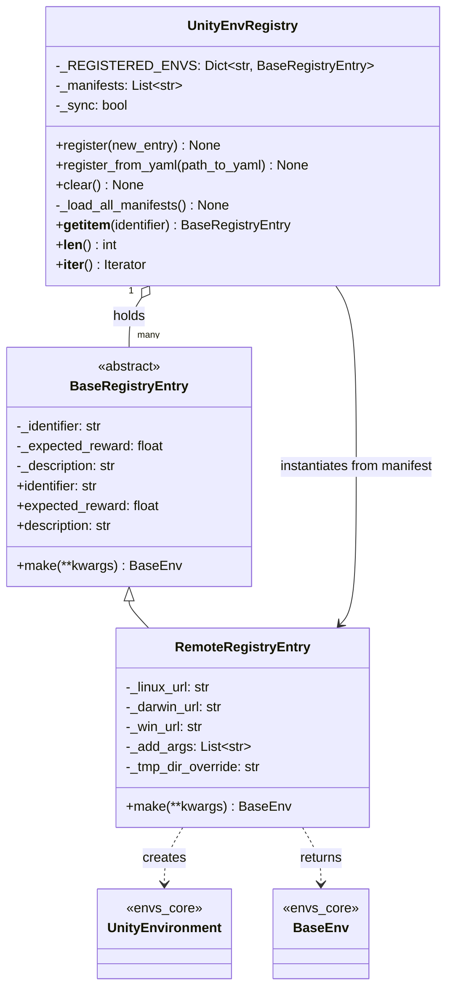
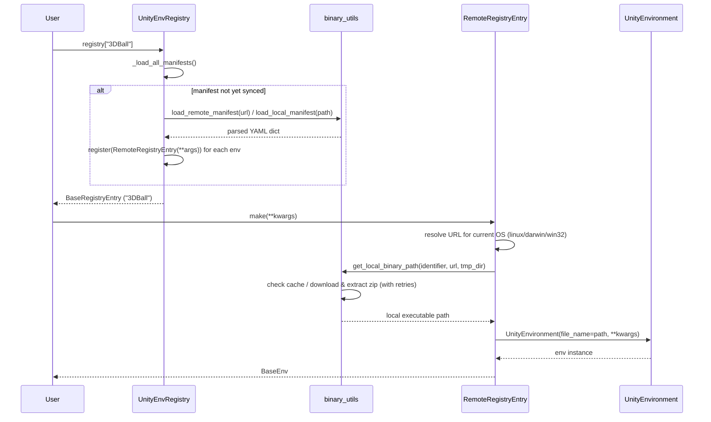
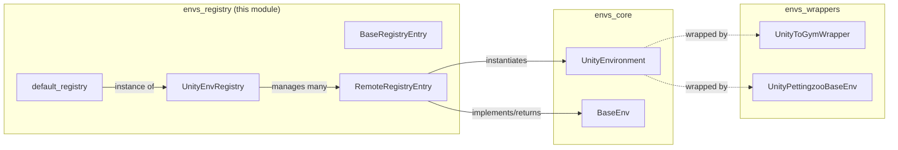

# Envs Registry Module

## Introduction

The **envs_registry** module provides a lightweight, dictionary-like catalog of pre-built Unity environments that can be launched programmatically, without requiring the Unity Editor to be installed. It is part of the Python-side `mlagents_envs` package and sits alongside [envs_core](envs_core.md) (which defines `UnityEnvironment` and the `BaseEnv` API) and [envs_wrappers](envs_wrappers.md) (which adapts environments to Gym/PettingZoo interfaces).

The registry's primary use case is enabling quick experimentation and testing: a user (or automated test) can request an environment by name (e.g. `"3DBall"`), and the registry will transparently download the correct platform-specific Unity executable, cache it locally, and instantiate a `UnityEnvironment` wrapping it.

Typical usage:

```python
from mlagents_envs.registry import default_registry

env = default_registry["3DBall"].make()
```

## Purpose and Core Functionality

- **Cataloging environments**: Maintain a mapping from a human-readable identifier (e.g. `"3DBall"`) to metadata describing the environment (expected reward, description, and platform-specific download URLs).
- **Lazy manifest loading**: Environment definitions are described in YAML "manifest" files that can be hosted remotely or stored locally. These manifests are only parsed when the registry is actually queried, minimizing unnecessary network/file I/O.
- **Binary management**: For entries backed by a downloadable Unity executable, the registry handles downloading, extracting, and caching the binary so that repeated `make()` calls reuse the same local copy.
- **Uniform construction interface**: Regardless of how an entry is implemented, calling `.make()` on it returns a ready-to-use `BaseEnv` (typically a `UnityEnvironment`), abstracting away platform detection and file management from the caller.

## Architecture Overview

The module follows a simple **Abstract Factory + Registry (Mapping)** pattern:

- `BaseRegistryEntry` is an abstract base class defining the contract for any registry entry: it exposes `identifier`, `expected_reward`, `description`, and an abstract `make()` factory method.
- `RemoteRegistryEntry` is the concrete implementation used for entries backed by a Unity executable hosted online. It resolves the correct URL for the current OS, downloads/caches the binary via helper utilities, and constructs a `UnityEnvironment`.
- `UnityEnvRegistry` implements Python's `collections.abc.Mapping` interface, acting as the central catalog. It supports registering entries directly (`register`) or in bulk via YAML manifests (`register_from_yaml`), and lazily materializes `RemoteRegistryEntry` objects from manifest data the first time the registry is accessed.
- A module-level singleton, `default_registry`, is pre-populated with a manifest URL pointing to Unity's officially hosted set of example environments, providing an out-of-the-box catalog for users.



### Manifest Loading & Entry Resolution Flow



## Core Components

### `BaseRegistryEntry`
*File: `ml-agents-envs/mlagents_envs/registry/base_registry_entry.py`*

Abstract base class that defines the minimal contract for any entry in the registry:

| Property/Method | Description |
|---|---|
| `identifier` | Unique string key used to look up the entry in the registry. |
| `expected_reward` | Optional cumulative reward considered "solved" for this task — useful for benchmarking/testing trained agents. |
| `description` | Optional human-readable text describing the environment's observations, actions, agents, and any special `make()` arguments. |
| `make(**kwargs)` | Abstract factory method that must be overridden to return a `BaseEnv` instance (see [envs_core](envs_core.md)). Raises `NotImplementedError` if not overridden. |

This class allows the registry to be extended with alternative entry types beyond remote-downloaded binaries (e.g. custom in-process environment factories), as long as they conform to this interface.

### `RemoteRegistryEntry`
*File: `ml-agents-envs/mlagents_envs/registry/remote_registry_entry.py`*

Concrete `BaseRegistryEntry` implementation representing an environment distributed as a **platform-specific zipped Unity executable** hosted at a URL. Key responsibilities:

- Stores separate download URLs for Linux (`linux_url`), macOS (`darwin_url`), and Windows (`win_url`), plus optional `additional_args` to pass to the executable and an optional `tmp_dir` override for caching.
- **Platform detection**: `make()` inspects `sys.platform` to select the appropriate URL. Raises `FileNotFoundError` if no URL is available for the current platform.
- **Binary retrieval**: Delegates to `get_local_binary_path` (from `mlagents_envs.registry.binary_utils`) to download the zip (with retry logic), extract it, and cache the resulting executable — reusing the cached copy on subsequent calls.
- **Environment construction**: Merges any user-supplied `additional_args` with the entry's own `additional_args`, strips a redundant `file_name` kwarg if present, and instantiates `UnityEnvironment(file_name=path, **kwargs)` — connecting directly into the [envs_core](envs_core.md) API surface.

> Note: The `binary_utils` helper module (`get_local_binary_path`, `load_local_manifest`, `load_remote_manifest`) is a supporting utility not listed as a core component, but it is essential plumbing for both binary caching (file-locked download with retries) and YAML manifest fetching (local file read or HTTP download to a temp file).

### `UnityEnvRegistry`
*File: `ml-agents-envs/mlagents_envs/registry/unity_env_registry.py`*

The central catalog class, implemented as a `collections.abc.Mapping` so it can be used with standard dict-like semantics (`registry[id]`, `len(registry)`, `for id in registry`, `identifier in registry`, etc.).

Key behaviors:

- **`register(new_entry)`**: Directly adds/overwrites a `BaseRegistryEntry` in the internal dictionary, keyed by its `identifier`. Later registrations override earlier ones with the same identifier.
- **`register_from_yaml(path_to_yaml)`**: Queues a manifest (local path or URL) for **lazy** loading — it doesn't parse the file immediately, only marks the registry as "out of sync" (`_sync = False`).
- **`_load_all_manifests()`** (private): Invoked automatically before any read operation (`__getitem__`, `__len__`, `__iter__`). If not already synced, it fetches every pending manifest (via `load_remote_manifest` for URLs starting with `http`, or `load_local_manifest` otherwise), and constructs a `RemoteRegistryEntry` per entry found, registering each one.
- **`clear()`**: Resets the registry to an empty state, discarding both registered entries and pending manifests.
- **Mapping protocol**: `__getitem__` raises `KeyError` for unknown identifiers; `__iter__` and `__len__` trigger manifest sync before reporting registry state.

#### Manifest YAML Format

```yaml
environments:
  - 3DBall:
      expected_reward: 100
      description: |
        A description of the 3DBall environment...
      linux_url: https://.../3DBall_linux.zip
      darwin_url: https://.../3DBall_darwin.zip
      win_url: https://.../3DBall_win.zip
  - GridWorld:
      ...
```

Each top-level key under `environments` becomes the `identifier`, and its nested fields are passed as constructor kwargs to `RemoteRegistryEntry`.

### `default_registry` (module-level singleton)

An instance of `UnityEnvRegistry` pre-configured with `register_from_yaml` pointing at Unity's officially hosted manifest (`https://storage.googleapis.com/mlagents-test-environments/1.1.0/manifest.yaml`). This is the primary entry point most users interact with:

```python
from mlagents_envs.registry import default_registry
env = default_registry["GridWorld"].make()
```

## Relationships to Other Modules



- **[envs_core](envs_core.md)**: Provides `UnityEnvironment` (the concrete class instantiated by `RemoteRegistryEntry.make()`) and the `BaseEnv` abstract interface that all registry entries ultimately produce. The registry module has a direct dependency on `envs_core` but not vice versa.
- **[envs_wrappers](envs_wrappers.md)**: Environments obtained from the registry (as raw `UnityEnvironment`/`BaseEnv` instances) can subsequently be wrapped with Gym or PettingZoo adapters from this module for use in standard RL training loops.
- **[envs_sidechannel](envs_sidechannel.md)**: Any side channels needed for a given environment (e.g. engine configuration, environment parameters) are typically configured by the caller and passed through `**kwargs` to `make()`, which forwards them to the underlying `UnityEnvironment` constructor.
- **[Training_Orchestration_&_Lifecycle_Infrastructure](trainers_core.md)**: Training infrastructure such as `SimpleEnvManager`/`SubprocessEnvManager` typically construct environments directly via file paths or the registry when running benchmark/test suites, rather than depending on the registry at the core trainer level.

## Summary

The envs_registry module offers a minimal but extensible mechanism for discovering and instantiating ready-made Unity environments by name, removing the friction of manually locating, downloading, and configuring executables. Its clean separation between the abstract entry contract (`BaseRegistryEntry`), the concrete remote-binary implementation (`RemoteRegistryEntry`), and the mapping-based catalog (`UnityEnvRegistry`) makes it straightforward to extend with new entry types (e.g., programmatically-built environments) while keeping the consumer-facing API (`registry[id].make()`) constant.
