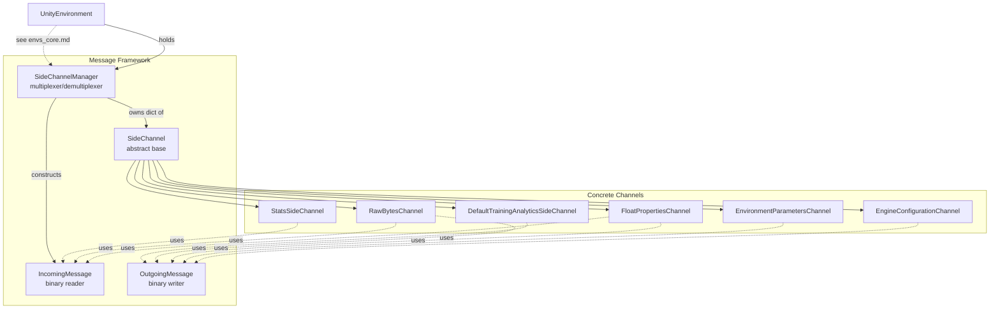
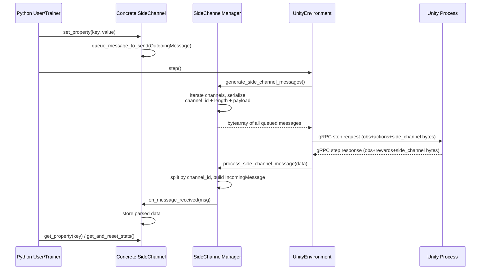

# Side Channel Module (`envs_sidechannel`)

## 1. Purpose

The **Side Channel** module is the low-level, out-of-band communication mechanism used by `mlagents_envs` to exchange auxiliary data between the Python trainer/user process and the Unity simulation, *separate* from the main observation/action RL loop.

While the RL step loop (handled by [`envs_core`](envs_core.md) / `UnityEnvironment`) exchanges observations, rewards, and actions once per simulation step, side channels carry **out-of-band metadata** such as:

- Engine/display configuration (resolution, quality, time scale)
- Environment parameter values used for curriculum learning / domain randomization
- Arbitrary float properties and raw bytes for custom research use cases
- Aggregated statistics computed inside Unity (e.g., custom reward components)
- One-time analytics events describing the training run (anonymized)

Side channels are registered when a `UnityEnvironment` is constructed and are transparently multiplexed over the same gRPC connection used for the RL step loop — every call to `step()`/`reset()` also flushes and dispatches any pending side channel messages in both directions.

## 2. Architecture Overview

The module is organized around a small, generic messaging framework (`SideChannel`, `IncomingMessage`, `OutgoingMessage`, `SideChannelManager`) and a set of concrete channel implementations that each own a fixed UUID identifying their "wire protocol".

### Data flow per environment step

## 3. Sub-modules

This module is a single, cohesive Python package (`mlagents_envs/side_channel/`) with no natural file-level sub-packages. Given its manageable size and tight coupling (every concrete channel depends directly on the same three primitives: `SideChannel`, `IncomingMessage`, `OutgoingMessage`), it is documented as **two logical groupings** rather than split into separate files-based sub-modules:

| Sub-module | Documentation | Contents |
|---|---|---|
| Messaging framework | [envs_sidechannel_framework.md](envs_sidechannel_framework.md) | `SideChannel`, `IncomingMessage`, `OutgoingMessage`, `SideChannelManager` |
| Built-in channels | [envs_sidechannel_channels.md](envs_sidechannel_channels.md) | `EngineConfigurationChannel`, `EnvironmentParametersChannel`, `FloatPropertiesChannel`, `RawBytesChannel`, `StatsSideChannel`, `DefaultTrainingAnalyticsSideChannel` |

## 4. Relationship to Other Modules

- **[envs_core.md](envs_core.md)** — `UnityEnvironment` owns a `SideChannelManager` and is the only component that actually reads/writes raw side channel bytes over the gRPC connection (`RpcCommunicator`). All side channel instances are supplied by the caller at `UnityEnvironment` construction time.
- **[envs_wrappers.md](envs_wrappers.md)** — Gym/PettingZoo wrappers pass side channels through to the underlying `UnityEnvironment` unchanged; they do not interact with the side channel protocol directly.
- **[trainers_core.md](trainers_core.md)** — `TrainingAnalyticsSideChannel` (in `mlagents.trainers`) subclasses `DefaultTrainingAnalyticsSideChannel` from this module to send anonymized training-run metadata (run options, trainer settings) to Unity for analytics logging, reusing the exact same channel UUID.
- **Unity C# runtime** — The `com.unity.ml-agents/Runtime/SideChannels/*` C# classes (see [Unity-Python_Bridge_&_ML_Integration](runtime_sidechannels.md)) are the counterpart implementations of `FloatPropertiesChannel` and `RawBytesChannel` on the Unity side, using the identical binary wire format described here.

## 5. Design Notes

- **Channel identity**: Every channel is identified by a stable `uuid.UUID` (often generated once via `uuid.uuid5` against a namespace string and then hard-coded). This UUID must match on both the Python and C# sides for messages to be routed correctly.
- **Wire format**: Messages are framed as `channel_id (16 bytes) + payload_length (int32) + payload bytes`, repeated back-to-back in a single byte blob per step. `SideChannelManager` handles this framing transparently.
- **Directionality conventions**: Most built-in channels are one-directional by convention (e.g., `EngineConfigurationChannel` and `EnvironmentParametersChannel` only send Python→Unity and raise `UnityCommunicationException` if a message is unexpectedly received back), while `FloatPropertiesChannel`, `RawBytesChannel`, and `StatsSideChannel` support bidirectional or Unity→Python communication.
- **No transport logic here**: This module has no knowledge of gRPC, sockets, or processes — it only defines message framing/parsing and per-channel semantics. Actual transport is delegated to `UnityEnvironment`/`RpcCommunicator` in [envs_core.md](envs_core.md).
