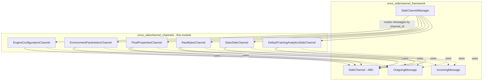
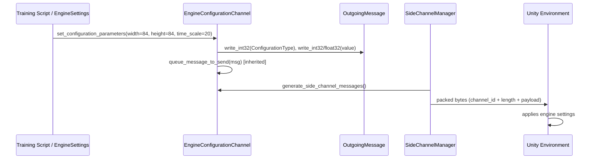
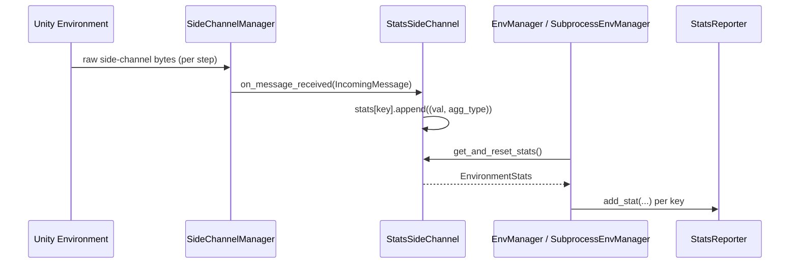
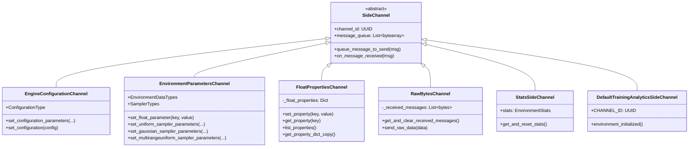
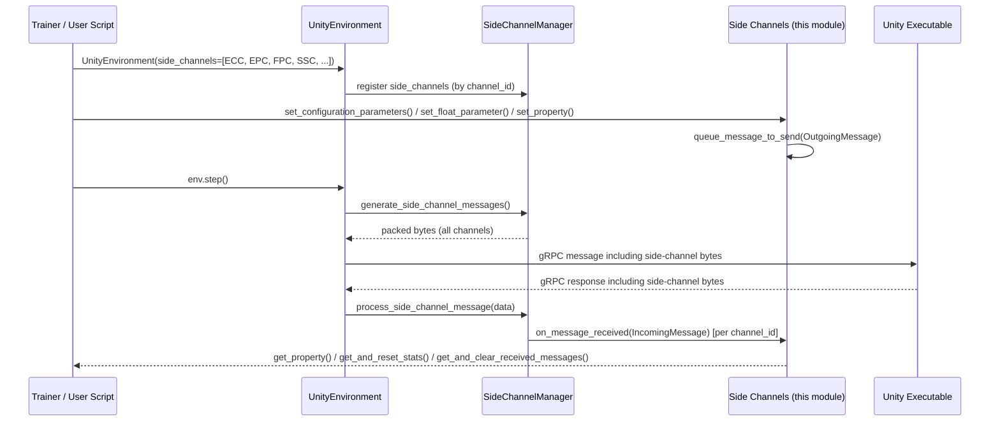

# Side Channel Implementations (`envs_sidechannel_channels`)

## Introduction

This module contains the **concrete SideChannel implementations** used by the ML-Agents Python-Unity communication layer. Side channels are auxiliary, out-of-band communication pipes that run alongside the main reinforcement-learning data exchange (observations/actions), allowing Python and Unity to exchange metadata such as engine configuration, environment parameters, custom float properties, raw bytes, statistics, and analytics events.

All channels in this module inherit from the abstract `SideChannel` base class and rely on the `IncomingMessage`/`OutgoingMessage` serialization utilities defined in the parent [envs_sidechannel_framework](envs_sidechannel_framework.md) module. Message routing and multiplexing across all registered channels is performed by the `SideChannelManager`, also part of that framework module.

This document covers:
1. The purpose and responsibilities of each side channel implementation
2. How channels plug into the broader side-channel framework and communication stack
3. Data flow and message-format diagrams
4. How these channels are consumed by downstream modules (training orchestration, environment wrappers)

## Module Position in the System

`envs_sidechannel_channels` is a child of `envs_sidechannel`, which itself lives under the [Python_Environment_Interface_Layer](envs_core.md) area of the system. It is a sibling of `envs_sidechannel_framework`, which supplies the abstract plumbing (`SideChannel`, `IncomingMessage`, `OutgoingMessage`, `SideChannelManager`) that every channel in this module depends on.



See [envs_sidechannel_framework](envs_sidechannel_framework.md) for details on the abstract `SideChannel` contract and message wire format, and [envs_core](envs_core.md) for how `UnityEnvironment` registers side channels and drives the overall step loop.

## Core Components

| Component | Direction | Purpose |
|---|---|---|
| `EngineConfigurationChannel` | Python → Unity | Configures Unity engine runtime settings (screen resolution, quality, time scale, frame rates) |
| `EnvironmentParametersChannel` | Python → Unity | Sends environment/curriculum parameters, including fixed values and randomization samplers |
| `FloatPropertiesChannel` | Bidirectional | Generic key/float property exchange, readable and writable from both sides |
| `RawBytesChannel` | Bidirectional | Generic raw-byte message exchange for custom research use cases |
| `StatsSideChannel` | Unity → Python | Collects arbitrary (string, float) statistics emitted by the Unity environment for reporting |
| `DefaultTrainingAnalyticsSideChannel` | Python → Unity | Sends anonymized training-environment initialization analytics to Unity |

Each channel is uniquely identified by a fixed `uuid.UUID` (`channel_id`), which the `SideChannelManager` uses to route incoming byte blobs to the correct handler and to tag outgoing messages.

### EngineConfigurationChannel

Configures Unity's rendering/simulation engine. It is **write-only from Python's perspective** — Unity never sends the engine configuration back, so `on_message_received` always raises `UnityCommunicationException` if invoked.

Key API:
- `set_configuration_parameters(width, height, quality_level, time_scale, target_frame_rate, capture_frame_rate)` — queues one `OutgoingMessage` per non-`None` parameter, each tagged with an `EngineConfigurationChannel.ConfigurationType` enum discriminator (`SCREEN_RESOLUTION`, `QUALITY_LEVEL`, `TIME_SCALE`, `TARGET_FRAME_RATE`, `CAPTURE_FRAME_RATE`).
- `set_configuration(config: EngineConfig)` — convenience wrapper around a `NamedTuple` bundling all engine settings, with `EngineConfig.default_config()` providing sane defaults (80x80, quality 1, time_scale 20.0, uncapped target frame rate, 60 capture frame rate).



### EnvironmentParametersChannel

Used to push environment/curriculum parameters (fixed floats or randomization samplers) into the Unity simulation, commonly driven by `EnvironmentParameterManager` in the [trainers_core](trainers_core.md) module.

Key API:
- `set_float_parameter(key, value)` — sends a fixed float value tagged as `EnvironmentDataTypes.FLOAT`.
- `set_uniform_sampler_parameters(key, min_value, max_value, seed)` — configures a uniform-distribution sampler (`SamplerTypes.UNIFORM`).
- `set_gaussian_sampler_parameters(key, mean, st_dev, seed)` — configures a Gaussian sampler (`SamplerTypes.GAUSSIAN`).
- `set_multirangeuniform_sampler_parameters(key, intervals, seed)` — configures a multi-interval uniform sampler (`SamplerTypes.MULTIRANGEUNIFORM`), flattening the interval tuples before writing as a float list.

Like `EngineConfigurationChannel`, this channel is write-only from Python; any inbound message triggers `UnityCommunicationException`.

```mermaid
flowchart LR
    A[EnvironmentParameterManager] -->|set_float_parameter / set_*_sampler_parameters| B(EnvironmentParametersChannel)
    B -->|OutgoingMessage: key, DataType, [seed, SamplerType], values| C[SideChannelManager]
    C -->|serialized bytes| D[Unity Environment]
    D -->|applies curriculum / randomization each episode| D
```

### FloatPropertiesChannel

A general-purpose, **bidirectional** key→float store shared between Python and Unity. Unlike the configuration channels, it maintains local state (`_float_properties` dict) so Python can also read values pushed by Unity.

Key API:
- `set_property(key, value)` — updates local cache and sends an `OutgoingMessage`.
- `get_property(key)` — reads from local cache (returns `None` if unknown).
- `list_properties()` — lists all known keys.
- `get_property_dict_copy()` — snapshot of the full dict.
- `on_message_received(msg)` — parses `(string, float32)` pairs sent by Unity and updates the cache.

Note there is a Unity-side (C#) counterpart of the same name (`FloatPropertiesChannel` in [runtime_sidechannels](runtime_sidechannels.md)) implementing the mirrored behavior in C#.

### RawBytesChannel

A minimal, general-research channel for exchanging arbitrary byte payloads. It buffers all received messages in `_received_messages` until drained via `get_and_clear_received_messages()`. Sending is via `send_raw_data(data: bytearray)`. Unlike the other channels, its `channel_id` is **not fixed** — it must be supplied by the caller, allowing multiple independent raw-byte channels to coexist. This mirrors the C# `RawBytesChannel` in [runtime_sidechannels](runtime_sidechannels.md).

### StatsSideChannel

Receives arbitrary `(string key, float value, StatsAggregationMethod)` triples emitted by the Unity environment (e.g., custom reward diagnostics, environment-side metrics) and buffers them for later consumption.

- `StatsAggregationMethod` enum defines how repeated values within a summary window should be combined: `AVERAGE`, `MOST_RECENT`, `SUM`, `HISTOGRAM`.
- `stats: EnvironmentStats` is a `defaultdict(list)` mapping key → list of `(value, aggregation_method)` tuples.
- `get_and_reset_stats()` atomically returns and clears the buffer — typically called once per training step by the environment manager so accumulated stats can be forwarded to `StatsReporter` (see [trainers_core](trainers_core.md)).



### DefaultTrainingAnalyticsSideChannel

Sends a one-time `TrainingEnvironmentInitialized` protobuf analytics event to Unity when a training session starts, containing Python/mlagents_envs version info. It deliberately **shares the same fixed `channel_id`** as `TrainingAnalyticsSideChannel` (see [trainers_core](trainers_core.md)) — only one of the two is normally registered in a given run, letting the trainer package substitute a richer implementation (with actual `mlagents` version and torch device info) when available, while `mlagents_envs` alone still provides a working default.

- `environment_initialized()` — packs a `TrainingEnvironmentInitialized` protobuf message into a `google.protobuf.Any`, serializes it, and queues it as raw bytes via `OutgoingMessage.set_raw_bytes`.
- Like the configuration channels, it is write-only; receiving a message from Unity raises `UnityCommunicationException`.



## End-to-End Data Flow

The diagram below shows how these channels fit into the overall Python↔Unity communication cycle, orchestrated by `UnityEnvironment` and `SideChannelManager` (both in [envs_core](envs_core.md)).



## Wire Format Recap

Every message queued by a channel is a raw byte buffer built with `OutgoingMessage`. When gathered by `SideChannelManager.generate_side_channel_messages()`, each message is framed as:

```
[16 bytes: channel_id (UUID, little-endian)] [4 bytes: message length (int32)] [message bytes...]
```

Multiple framed messages from multiple channels are concatenated together into a single payload sent over the gRPC/communicator transport (see `RpcCommunicator` in [envs_core_communicator](envs_core.md)). On the receiving side, `SideChannelManager.process_side_channel_message()` walks the buffer, extracts each frame by `channel_id`, and dispatches it via `on_message_received`.

## Usage in the Broader System

- **Training orchestration**: `EnvironmentParameterManager` and `EngineSettings`/`RunOptions` (in [trainers_core](trainers_core.md)) use `EnvironmentParametersChannel` and `EngineConfigurationChannel` to drive curriculum learning and control simulation speed/quality during training.
- **Statistics pipeline**: `StatsSideChannel` output feeds into `StatsReporter` writers (`ConsoleWriter`, `TensorboardWriter`) documented in [trainers_core](trainers_core.md).
- **Analytics**: `DefaultTrainingAnalyticsSideChannel` is the fallback used when the fuller `TrainingAnalyticsSideChannel` (in [trainers_core](trainers_core.md)) is not present; both share a channel ID so Unity only needs a single consumer implementation.
- **Environment wrappers**: Gym/PettingZoo wrappers in [envs_wrappers](envs_wrappers.md) construct `UnityEnvironment` instances that may be pre-configured with these channels (e.g., to fix engine settings or pass environment parameters at construction time).
- **Unity-side counterparts**: `EngineConfigurationChannel`, `FloatPropertiesChannel`, and `RawBytesChannel` have matching C# implementations under [runtime_sidechannels](runtime_sidechannels.md), completing the cross-language protocol.

## Related Documentation

- [envs_sidechannel_framework](envs_sidechannel_framework.md) — abstract `SideChannel` base class, `IncomingMessage`/`OutgoingMessage` serialization primitives, and `SideChannelManager` routing logic.
- [envs_core](envs_core.md) — `UnityEnvironment` and communicator layer that transports side-channel bytes between Python and Unity.
- [envs_wrappers](envs_wrappers.md) — Gym/PettingZoo environment wrappers that consume `UnityEnvironment` (and therefore these channels).
- [trainers_core](trainers_core.md) — `EnvironmentParameterManager`, `StatsReporter`, and `TrainingAnalyticsSideChannel`, the primary Python-side consumers of these channels during training.
- [runtime_sidechannels](runtime_sidechannels.md) — C#/Unity-side counterparts of `FloatPropertiesChannel` and `RawBytesChannel`.
