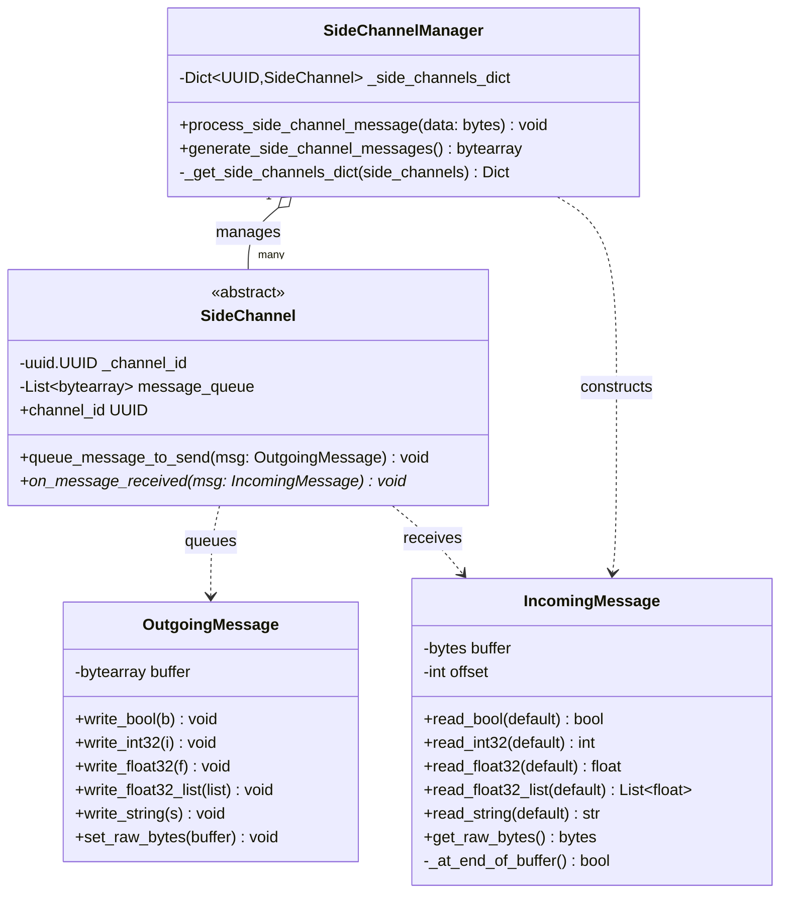
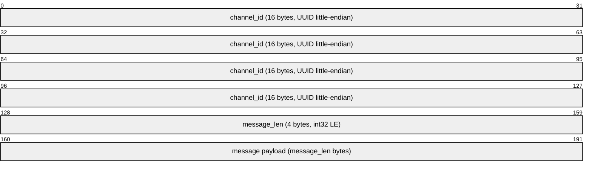
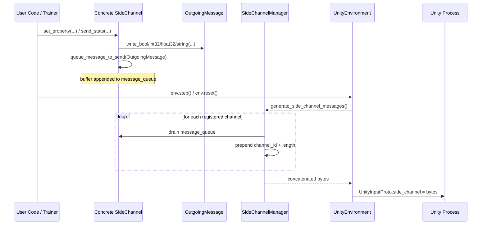
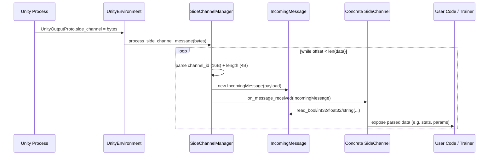
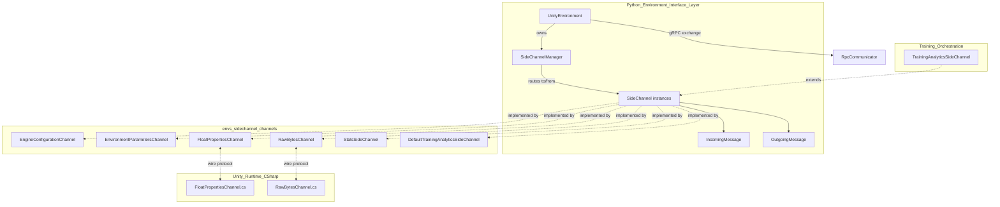

# Side Channel Framework (`envs_sidechannel_framework`)

## Introduction

The **Side Channel Framework** is the foundational messaging layer that allows Python and Unity to exchange **out-of-band, non-reinforcement-learning data** alongside the main observation/action loop of ML-Agents. While the main RL loop (observations, rewards, actions) flows through the gRPC-based [`UnityEnvironment`](envs_core_api.md) communication channel on every `step()`/`reset()` call, side channels provide a parallel, typed, byte-oriented messaging pipe for things like:

- Engine/runtime configuration (time scale, resolution, quality level)
- Environment parameter sampling/curriculum values
- Custom float properties or raw byte payloads
- Training statistics and analytics events

This module defines the **core abstractions** of that system:

| Component | Responsibility |
|---|---|
| `SideChannel` | Abstract base class that all concrete side channels implement |
| `IncomingMessage` | Binary reader utility for decoding messages sent from Unity |
| `OutgoingMessage` | Binary writer utility for encoding messages sent to Unity |
| `SideChannelManager` | Multiplexer/demultiplexer that routes raw bytes to/from the correct `SideChannel` instance by UUID |

Concrete side channel implementations (engine configuration, environment parameters, stats, etc.) build on top of these primitives and are documented separately in [`envs_sidechannel_channels`](envs_sidechannel_channels.md).

---

## Purpose & Core Functionality

Side channels solve a specific problem: the primary Unity↔Python communication protocol (defined by protobuf messages in `UnityInputProto`/`UnityOutputProto`, see [`envs_core_api`](envs_core_api.md)) is purpose-built for RL step data and is not easily extensible without breaking protocol compatibility. Side channels avoid this by:

1. **Piggybacking** a single opaque `bytes` blob (the `side_channel` field) on every `UnityInputProto`/`UnityOutputProto` message.
2. **Self-describing** that blob as a sequence of `(channel_id, length, payload)` frames, so multiple independent channels can share the same wire message.
3. Letting each channel interpret its own payload however it likes, using the shared `IncomingMessage`/`OutgoingMessage` helpers for a common primitive-serialization format (little-endian bools, int32s, float32s, float32 lists, and ascii strings).

Each `SideChannel` is identified by a stable `uuid.UUID` (the `channel_id`), which **must match** the identifier used by the corresponding C# implementation in Unity (see [`runtime_sidechannels`](runtime_sidechannels.md)) — this is how a message is routed to the correct handler on either side.

---

## Architecture

### Class Overview

### Wire Format

Each `SideChannelManager` frame within the shared `side_channel` byte blob has the following layout:

Multiple such frames are concatenated back-to-back to form the full `side_channel` bytes field sent in a single `UnityInputProto` (Python→Unity) or `UnityOutputProto` (Unity→Python) message.

Within a payload, `OutgoingMessage`/`IncomingMessage` encode primitives as:

| Type | Encoding |
|---|---|
| `bool` | 1 byte, `struct` format `<?` |
| `int32` | 4 bytes, `<i` |
| `float32` | 4 bytes, `<f` |
| `float32` list | `int32` length prefix + N `float32` values |
| `string` | `int32` length prefix (encoded byte length) + ascii-encoded bytes |

---

## Component Details

### `SideChannel` (Abstract Base Class)

`SideChannel` (`side_channel.py`) is the contract every concrete channel must implement:

- **Construction**: Takes a `uuid.UUID channel_id` that uniquely identifies the channel type. This id must match the GUID used on the C# side.
- **`queue_message_to_send(msg: OutgoingMessage)`**: Appends the message's raw buffer to an internal `message_queue` list. Queued messages are *not* sent immediately — they accumulate until the next `SideChannelManager.generate_side_channel_messages()` call (typically triggered once per `UnityEnvironment.step()`/`reset()`).
- **`on_message_received(msg: IncomingMessage)`** *(abstract)*: Subclasses must implement this to handle inbound data. This may be invoked multiple times per step if several messages targeted the same channel arrived in one batch.
- **`channel_id`** *(property)*: Read-only access to the channel's UUID.

Concrete subclasses (e.g., `EngineConfigurationChannel`, `EnvironmentParametersChannel`, `FloatPropertiesChannel`, `RawBytesChannel`, `StatsSideChannel`, `DefaultTrainingAnalyticsSideChannel`) live in the sibling module [`envs_sidechannel_channels`](envs_sidechannel_channels.md) and add domain-specific read/write methods on top of this base, typically calling `queue_message_to_send` for outbound data and parsing `IncomingMessage` content inside `on_message_received`.

### `OutgoingMessage`

A thin, stateful byte-buffer builder used by channel implementations to **serialize** data before queuing it. All writes append to an internal `bytearray` in a fixed little-endian format. `set_raw_bytes()` allows a full overwrite (with a warning if data already exists), useful for very simple binary channels like `RawBytesChannel`.

### `IncomingMessage`

The mirror-image **deserializer**. It wraps a `bytes` buffer plus a cursor (`offset`) and exposes typed `read_*` methods that advance the cursor. Every read method accepts a `default_value` used when the buffer is exhausted — this provides basic forward/backward compatibility: older messages missing trailing optional fields won't crash newer readers (and vice versa, within reason).

### `SideChannelManager`

The `SideChannelManager` is the **only** consumer of the raw `side_channel` bytes field found in the gRPC protobuf messages. It is owned by [`UnityEnvironment`](envs_core_api.md) (see `environment.py`), constructed once with the list of `SideChannel` instances passed by the user (plus an automatically-injected `DefaultTrainingAnalyticsSideChannel` if none is supplied).

Its two responsibilities are symmetric:

- **`process_side_channel_message(data: bytes)`** — Called after every Unity exchange (inside `UnityEnvironment._update_state`). Walks the byte blob frame-by-frame, extracts each `channel_id` + payload, wraps the payload in an `IncomingMessage`, and dispatches it to the matching registered `SideChannel.on_message_received()`. Unknown channel ids are logged and skipped (forward-compatible with newer Unity builds sending channels the Python side doesn't know about). Malformed data raises `UnityEnvironmentException`.
- **`generate_side_channel_messages()`** — Called before every Unity exchange (inside `UnityEnvironment._generate_step_input` / `_generate_reset_input`). Iterates all registered channels, drains their `message_queue`, and concatenates everything into the outbound `side_channel` bytes field. Each channel's queue is cleared after being flushed.

`_get_side_channels_dict` validates that no two channels share the same `channel_id`, raising `UnityEnvironmentException` on collision — this guards against accidental duplicate channel registration by the user.

---

## Data Flow

### Outbound (Python → Unity)

### Inbound (Unity → Python)

---

## Integration in the Broader System

- **[`envs_core_api`](envs_core_api.md)** — `UnityEnvironment` is the primary consumer of this module: it instantiates a `SideChannelManager` from the user-supplied `side_channels` list and calls `process_side_channel_message` / `generate_side_channel_messages` on every `step()`/`reset()` cycle, embedding the resulting bytes in the `UnityRLInputProto`/`UnityRLOutputProto.side_channel` field exchanged via [`RpcCommunicator`](envs_core_communicator.md).
- **[`envs_sidechannel_channels`](envs_sidechannel_channels.md)** — Contains all concrete `SideChannel` subclasses shipped with `mlagents_envs` (engine configuration, environment parameters, float properties, raw bytes, stats, and the default training-analytics channel). These build directly on the abstractions documented here.
- **[Training_Orchestration_&_Lifecycle_Infrastructure](trainers_core.md)** — `TrainingAnalyticsSideChannel` in the trainer package extends `SideChannel` to push training-run metadata into Unity for editor-side analytics.
- **[Unity-Python_Bridge_&_ML_Integration](runtime_sidechannels.md)** — The C# counterparts (`FloatPropertiesChannel.cs`, `RawBytesChannel.cs`) implement the same UUID-keyed framing protocol on the Unity side, and must stay byte-format compatible with the Python `IncomingMessage`/`OutgoingMessage` encodings described above.

---

## Design Notes & Guarantees

- **Ordering**: Within a single channel, messages must be read in the exact order they were written (`IncomingMessage` state is a monotonically advancing cursor; there is no random access or message boundary framing beyond what the channel format itself defines within a payload).
- **Batching per step**: All queued outgoing messages across all channels are flushed together once per `step()`/`reset()` call — side channels are not a real-time/async transport, they are batched with the RL exchange cycle.
- **Extensibility without protocol version bumps**: New side channels can be added to a project without changing the Unity↔Python gRPC/protobuf schema, since they only consume the shared `side_channel` bytes field already present in the wire protocol (see `UnityRLInputParameters` in [`runtime_communicator`](runtime_communicator.md)).
- **Robustness**: Unknown channel IDs are silently logged and skipped, allowing forward/backward compatible evolution between Unity and Python package versions. Truncated/malformed frames raise `UnityEnvironmentException` to fail fast on protocol corruption.
- **Duplicate protection**: `SideChannelManager` raises `UnityEnvironmentException` at construction if two channels share the same `channel_id`.
