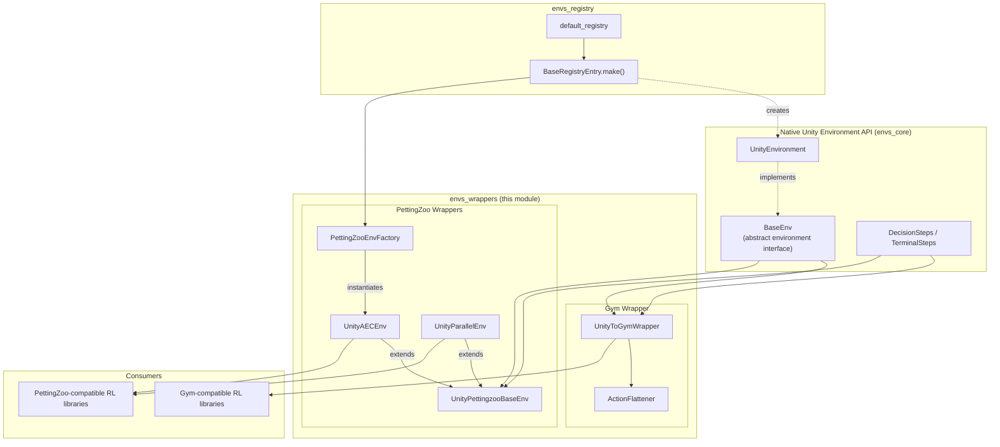
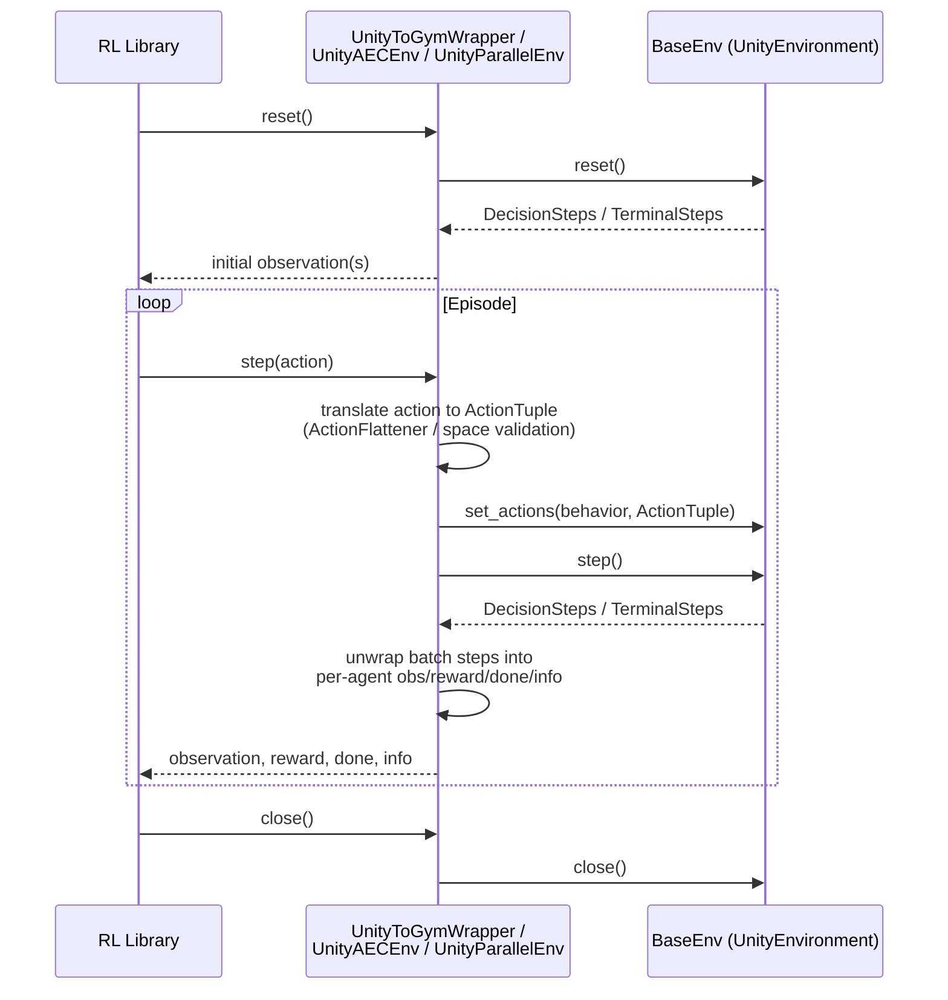

# Environment Wrappers Module (`envs_wrappers`)

## 1. Purpose

The `envs_wrappers` module adapts the native Unity ML-Agents `BaseEnv` API (defined in [envs_core](envs_core.md)) to the interfaces expected by popular third-party multi-agent and single-agent reinforcement learning ecosystems:

- **OpenAI Gym** — via `UnityToGymWrapper`, exposing a single-agent Unity environment as a standard `gym.Env`.
- **PettingZoo** — via `UnityAECEnv` (Agent-Environment-Cycle API) and `UnityParallelEnv` (Parallel API), exposing multi-agent Unity environments using PettingZoo's two standard multi-agent conventions.
- **Unity Environment Registry integration** — via `PettingZooEnvFactory`, which builds ready-to-use PettingZoo environments directly from the [Unity environment registry](envs_registry.md) (`default_registry`), automatically handling port allocation and default side channels.

This module is the primary integration point for users who want to train or evaluate Unity ML-Agents environments using third-party RL libraries (e.g. Stable-Baselines3, RLlib, CleanRL) that expect a Gym or PettingZoo interface, rather than the native `mlagents_envs` API used internally by the [Training Orchestration module](trainers_core.md).

## 2. Architecture Overview

The module is organized around a **common base class for multi-agent (PettingZoo) wrappers**, and a **separate, self-contained single-agent (Gym) wrapper**. Both wrapper families sit on top of the `BaseEnv` abstraction and its `DecisionSteps` / `TerminalSteps` batch step results, all defined in [envs_core_api](envs_core.md).

### Key design points

- **Single point of coupling to `BaseEnv`**: every wrapper only depends on the small, stable `BaseEnv` surface (`reset`, `step`, `get_steps`, `set_actions`, `behavior_specs`, `close`), which decouples this module from the low-level gRPC/communicator machinery in [envs_core](envs_core.md).
- **Shared multi-agent bookkeeping**: `UnityAECEnv` and `UnityParallelEnv` do not duplicate logic — they both delegate agent-lifecycle management (observations, rewards, dones, action buffering) to `UnityPettingzooBaseEnv`, differing only in their step-loop semantics (turn-based vs. simultaneous).
- **Action space translation**: both the Gym and PettingZoo wrappers must translate Unity's `ActionSpec` (continuous/discrete/hybrid, possibly multi-branch discrete) into the target framework's native space types (`gym.spaces.*`). The Gym wrapper additionally supports flattening multi-branch discrete actions into a single `Discrete` space via `ActionFlattener`.
- **One-agent constraint for Gym**: because `gym.Env` models exactly one agent, `UnityToGymWrapper` enforces (via `_check_agents`) that the wrapped Unity environment/behavior contains exactly one agent instance at a time; this restriction does not apply to the PettingZoo wrappers, which are designed for multi-agent scenarios.
- **Registry-driven environment creation**: `PettingZooEnvFactory` removes the need for users to manually instantiate `UnityEnvironment`, resolve executable paths, or manage port conflicts — it resolves environments by ID from the [environment registry](envs_registry.md) and retries with incrementing ports if a `UnityWorkerInUseException` occurs.

## 3. Sub-modules

| Sub-module | Description | Documentation |
|---|---|---|
| **Gym Wrapper** | Wraps a single-agent Unity `BaseEnv` as a `gym.Env`, including observation/action space derivation, visual/vector observation handling, and discrete action-space flattening. | [envs_wrappers_gym.md](envs_wrappers_gym.md) |
| **PettingZoo Wrappers** | Wraps a (typically multi-agent) Unity `BaseEnv` using PettingZoo's AEC and Parallel APIs, plus a factory for building these environments from the Unity environment registry. | [envs_wrappers_pettingzoo.md](envs_wrappers_pettingzoo.md) |

## 4. Data Flow

The following diagram illustrates the typical lifecycle of a wrapped environment, showing how a `step()` call flows from the wrapper down to the native Unity API and back.

## 5. Relationship to Other Modules

- [**envs_core**](envs_core.md) — Provides the `BaseEnv`, `DecisionSteps`, `TerminalSteps`, and `UnityEnvironment` types that every wrapper in this module builds on.
- [**envs_registry**](envs_registry.md) — Supplies `default_registry`, which `PettingZooEnvFactory` uses to construct environments by ID without requiring direct executable paths.
- [**envs_sidechannel**](envs_sidechannel.md) — `EngineConfigurationChannel`, `EnvironmentParametersChannel`, and `StatsSideChannel` are attached by default by `PettingZooEnvFactory` and are exposed to users through `UnityPettingzooBaseEnv.side_channel`.
- [**trainers_core**](trainers_core.md) — The internal ML-Agents trainer stack does *not* use these wrappers directly (it consumes `BaseEnv` through `EnvManager`/`SimpleEnvManager`/`SubprocessEnvManager`); this module exists specifically to serve *external* consumers of Unity environments through standardized third-party interfaces.
