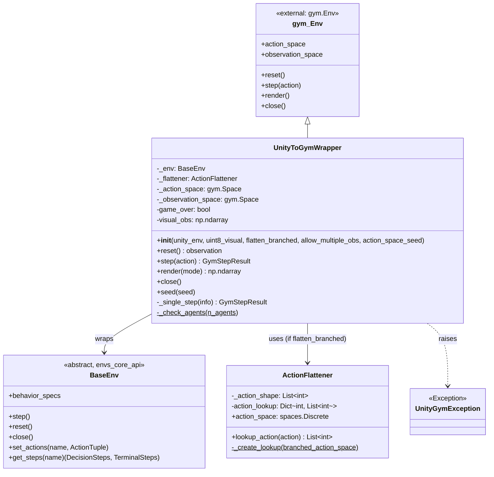
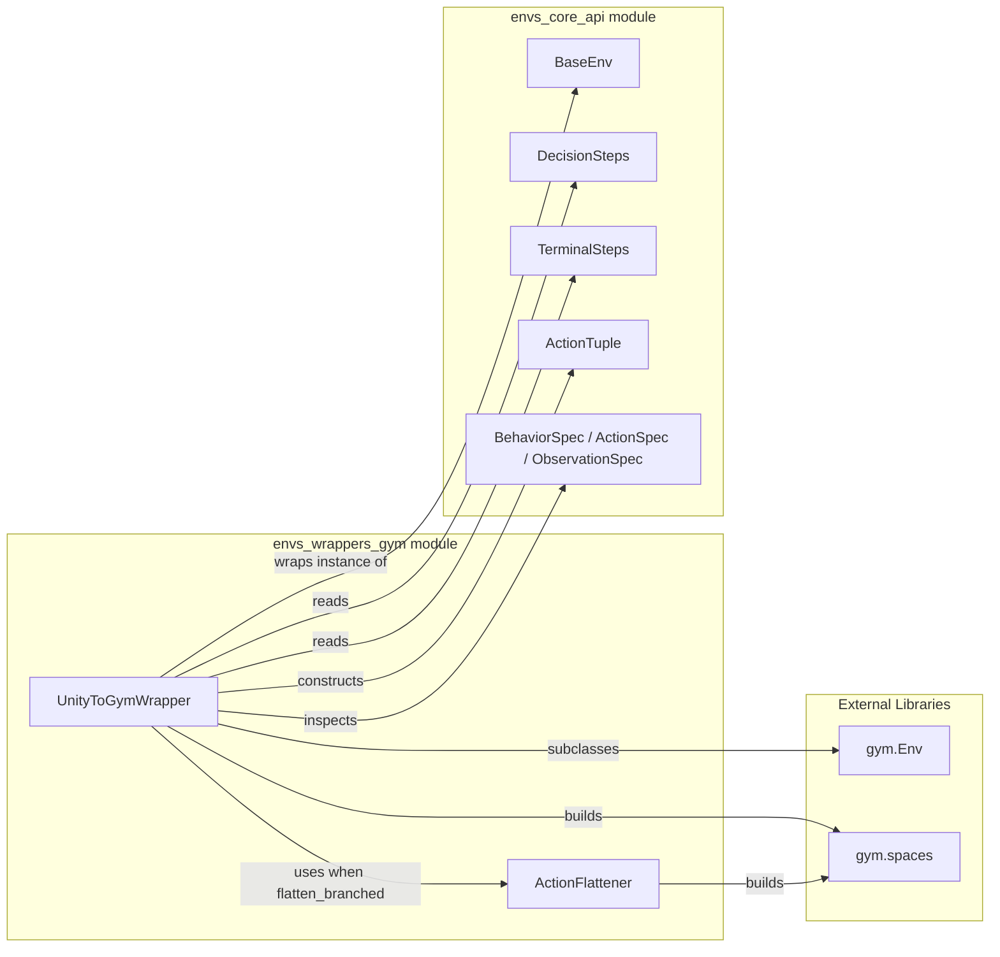
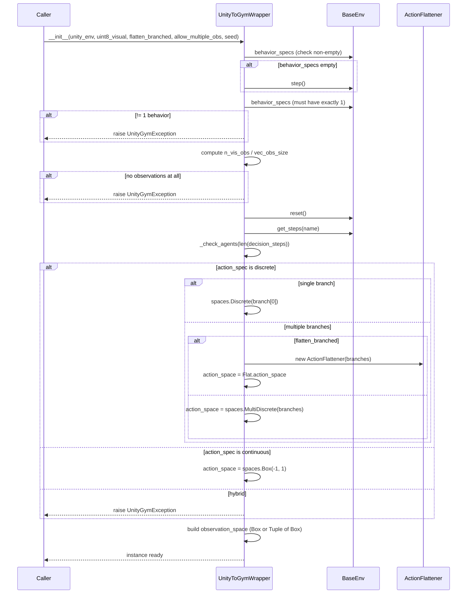
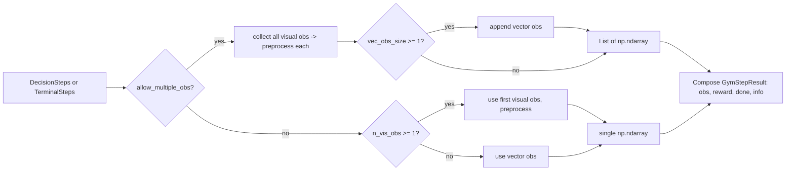
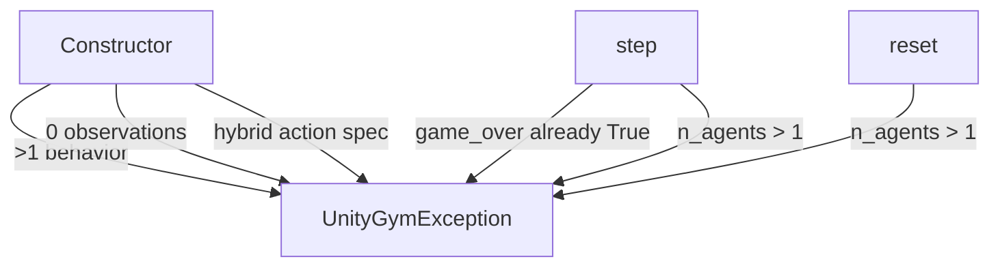
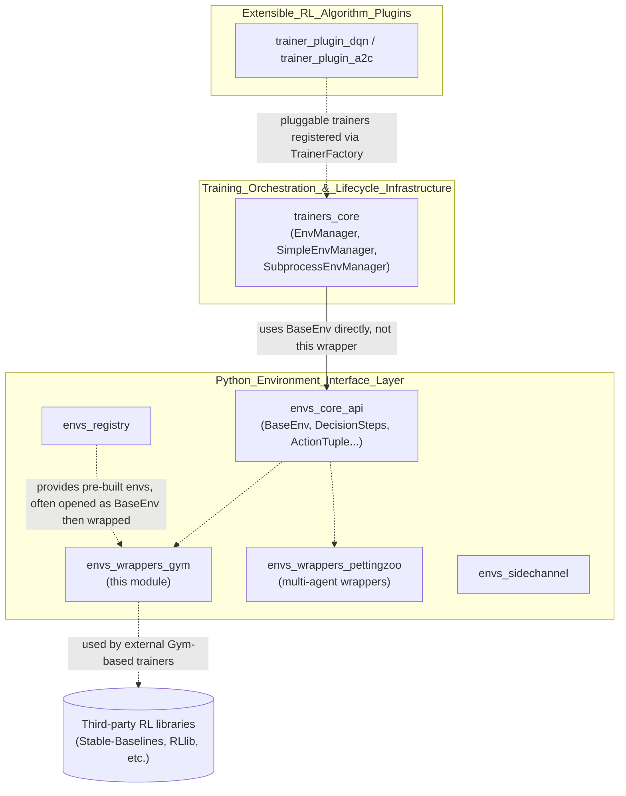

# `envs_wrappers_gym` — OpenAI Gym Wrapper for Unity Environments

## Introduction

The `envs_wrappers_gym` module provides a **single-agent OpenAI Gym compatible interface** to Unity ML-Agents environments. It bridges the [`BaseEnv`](envs_core_api.md) abstraction used throughout the ML-Agents Python ecosystem with the widely-adopted `gym.Env` API, allowing Unity environments to be used directly with the large ecosystem of Gym-compatible RL libraries (e.g. Stable-Baselines, RLlib) without requiring those libraries to understand ML-Agents' native multi-agent, multi-behavior data structures.

This module lives inside the broader [`envs_wrappers`](envs_wrappers.md) module of the [Python Environment Interface Layer](envs_core.md), sitting alongside the [PettingZoo multi-agent wrappers](envs_wrappers_pettingzoo.md) as an alternative, simpler, single-agent adaptation layer.

The module contains exactly two components:

| Component | Type | Responsibility |
|---|---|---|
| `UnityToGymWrapper` | `gym.Env` subclass | Wraps a `BaseEnv` instance, translating Gym API calls (`reset`, `step`, `render`, `close`) into ML-Agents API calls, and converting ML-Agents step results into Gym's `(observation, reward, done, info)` tuples. |
| `ActionFlattener` | Utility class | Converts a branched `MultiDiscrete` action space into a single flat `Discrete` action space (and back), for use with algorithms that only support `Discrete` action spaces. |

---

## Purpose & Core Functionality

### Why this module exists

ML-Agents' native `BaseEnv` API ([documented in `envs_core_api`](envs_core_api.md)) is designed to support:
- Multiple simultaneous behaviors (types of agents) per environment
- Multiple, variably-sized agents within a behavior at any timestep (via `DecisionSteps`/`TerminalSteps`)
- Hybrid continuous/discrete/branched-discrete action spaces
- Multiple observations per agent (visual + vector)

Most external RL libraries built around OpenAI Gym expect:
- A single agent
- A single, static, well-known `action_space` / `observation_space`
- A synchronous `step(action) -> (obs, reward, done, info)` loop

`UnityToGymWrapper` performs this **impedance-matching**, enforcing single-agent/single-behavior constraints and performing the necessary space conversions, while `ActionFlattener` solves the specific sub-problem of encoding branched discrete actions (`MultiDiscrete`) as a flat `Discrete` space when required by the target algorithm.

### Key responsibilities of `UnityToGymWrapper`

1. **Environment validation** — On construction, ensures the wrapped `BaseEnv` exposes exactly one behavior (raises `UnityGymException` otherwise) and that it produces at least one observation.
2. **Action space derivation** — Inspects the behavior's `ActionSpec` (from `BehaviorSpec`, see [`envs_core_api`](envs_core_api.md)) to build the appropriate `gym.spaces` object:
   - Single discrete branch → `spaces.Discrete`
   - Multiple discrete branches → `spaces.MultiDiscrete`, or `spaces.Discrete` if `flatten_branched=True` (via `ActionFlattener`)
   - Continuous → `spaces.Box(-1, 1)`
   - Raises `UnityGymException` for actions that are both continuous and discrete (hybrid), since Gym does not support that natively.
3. **Observation space derivation** — Builds a `gym.spaces.Box` (or `spaces.Tuple` of `Box` if `allow_multiple_obs=True`) from the behavior's `ObservationSpec` list, separating visual (rank-3/4) and vector (rank-1/2) observations.
4. **Step translation** — Converts a Gym `action` into an `ActionTuple`, calls `BaseEnv.set_actions` + `BaseEnv.step`, retrieves `DecisionSteps`/`TerminalSteps` via `BaseEnv.get_steps`, and reduces the batch of size ≤1 (single agent enforced) down to a single Gym step result.
5. **Single-agent enforcement** — `_check_agents` raises `UnityGymException` if more than one agent is detected in a given step, since Gym has no native multi-agent notion.
6. **Episode termination handling** — Tracks `game_over` state; raises `UnityGymException` if `step()` is called again after a terminal step without an intervening `reset()`.

### Key responsibilities of `ActionFlattener`

- Builds a lookup table mapping every integer in `range(prod(branch_sizes))` to the corresponding tuple of per-branch discrete actions (Cartesian product of each branch's possible values).
- Exposes a `gym.spaces.Discrete(len(lookup))` action space.
- `lookup_action(scalar) -> List[int]` performs the reverse mapping used by `UnityToGymWrapper.step()` before actions are sent back to Unity.

---

## Architecture



### Dependency on `envs_core_api`

`UnityToGymWrapper` depends directly on the core data types defined in [`envs_core_api`](envs_core_api.md):

- **`BaseEnv`** — the abstract environment interface being wrapped (could be a live `UnityEnvironment` or any other `BaseEnv` implementation, e.g. a test double).
- **`DecisionSteps` / `TerminalSteps`** — batched per-step data (`obs`, `reward`, `agent_id`, etc.) returned by `BaseEnv.get_steps()`; the wrapper unwraps the batch of size 1 into scalar Gym-style results.
- **`ActionTuple`** (built on `_ActionTupleBase`) — the container type into which the wrapper packs the Gym `action` before calling `BaseEnv.set_actions()`.
- **`BehaviorSpec` / `ActionSpec` / `ObservationSpec`** — inspected once at construction time (via `unity_env.behavior_specs`) to build the static Gym `action_space` / `observation_space`.



---

## Initialization Flow

The constructor performs validation and one-time space setup. Understanding this sequence is important since many `UnityGymException`s are raised here (fail-fast behavior).



---

## Step / Reset Data Flow

```mermaid
flowchart TD
    A[Gym caller: env.step(action)] --> B{game_over?}
    B -- yes --> C[raise UnityGymException]
    B -- no --> D{_flattener set?}
    D -- yes --> E[action = flattener.lookup_action(action)]
    D -- no --> F[use action as-is]
    E --> G[reshape to (1, action_size)]
    F --> G
    G --> H[build ActionTuple continuous/discrete]
    H --> I[BaseEnv.set_actions(name, action_tuple)]
    I --> J[BaseEnv.step]
    J --> K[BaseEnv.get_steps(name) -> DecisionSteps, TerminalSteps]
    K --> L[_check_agents]
    L --> M{terminal_step non-empty?}
    M -- yes --> N[game_over = True]
    N --> O[_single_step(terminal_step)]
    M -- no --> P[_single_step(decision_step)]
    O --> Q[return obs, reward, done=True, info]
    P --> R[return obs, reward, done=False, info]
```

### Observation assembly (`_single_step`)



- **`_preprocess_single`**: if `uint8_visual=True`, scales float visual observation `[0,1]` to `uint8` `[0,255]`.
- `done` is simply `isinstance(info, TerminalSteps)`.
- `info` dict in the Gym tuple always contains the raw ML-Agents step (`{"step": info}`) for advanced consumers who need the original object.

---

## `ActionFlattener` Detail

Used only when the underlying behavior has **multiple discrete action branches** (`MultiDiscrete`) and the caller requests `flatten_branched=True` (common requirement for algorithms/libraries that only support `Discrete` action spaces, e.g. many implementations of DQN — see [`trainer_plugin_dqn`](trainer_plugin_dqn.md) for an ML-Agents-native DQN implementation that works with this kind of discrete space natively).

```mermaid
flowchart TD
    A[branched_action_space e.g. 2,3,3] --> B[itertools.product over ranges]
    B --> C[enumerate all combinations]
    C --> D[action_lookup: int -> List of int]
    D --> E[action_space = spaces.Discrete(len(lookup))]
    F[Gym scalar action] -->|lookup_action| D
    D --> G[branched action list, e.g. 1,2,0]
```

Example: branches `[2, 3]` produce 6 combinations: `{0:[0,0], 1:[0,1], 2:[0,2], 3:[1,0], 4:[1,1], 5:[1,2]}`.

---

## Constructor Options Reference

| Parameter | Type | Effect |
|---|---|---|
| `unity_env` | `BaseEnv` | The environment instance to wrap (e.g. a `UnityEnvironment`, see [`envs_core_api`](envs_core_api.md)). Closed automatically when the wrapper is closed. |
| `uint8_visual` | `bool` | If `True`, visual observations are returned as `uint8` in `[0,255]` instead of `float32` in `[0,1]`. Ignored with a warning if there are no visual observations. |
| `flatten_branched` | `bool` | If `True` and the action space is multi-branch discrete, collapses it into a single `Discrete` space via `ActionFlattener`. Ignored (with warning) for continuous actions. |
| `allow_multiple_obs` | `bool` | If `True`, returns a list/`Tuple` space combining all visual observations followed by the concatenated vector observation. If `False` (default), only the first observation is exposed and a warning is logged if more exist. |
| `action_space_seed` | `Optional[int]` | If provided, seeds the constructed `gym.Space` for reproducibility. |

---

## Error Handling

`UnityGymException` (subclass of `gym.error.Error`) is raised for:

- More than one behavior present in the wrapped environment.
- Zero observations available.
- Hybrid (simultaneous continuous + discrete) action spaces — unsupported by Gym.
- More than one agent detected at any step (`_check_agents`) — Gym wrapper is strictly single-agent.
- Calling `step()` again after episode termination without calling `reset()`.



---

## Usage Example

```python
from mlagents_envs.environment import UnityEnvironment
from mlagents_envs.envs.unity_gym_env import UnityToGymWrapper

unity_env = UnityEnvironment(file_name="MyUnityBuild")
env = UnityToGymWrapper(
    unity_env,
    uint8_visual=False,
    flatten_branched=True,     # collapse MultiDiscrete -> Discrete
    allow_multiple_obs=False,
)

obs = env.reset()
done = False
while not done:
    action = env.action_space.sample()
    obs, reward, done, info = env.step(action)

env.close()
```

This is the typical entry point used by third-party Gym-compatible trainers; contrast with the ML-Agents-native training stack described in [`trainers_core`](trainers_core.md), which consumes `BaseEnv` directly (via [`SimpleEnvManager`](trainers_core.md) / [`SubprocessEnvManager`](trainers_core.md)) rather than through this Gym adapter.

---

## Relationship to Other Modules



Key notes:
- The **native ML-Agents training loop** ([`trainers_core`](trainers_core.md), and algorithm implementations in [`Built-in_RL_Algorithms`](trainers_ppo.md)) does **not** use this wrapper — it consumes `BaseEnv` directly through `EnvManager` implementations for full multi-agent support.
- `envs_wrappers_gym` is intended for **external consumption**: exposing Unity environments to the broader Gym ecosystem, or for quick single-agent prototyping/testing.
- For multi-agent scenarios, see the sibling module [`envs_wrappers_pettingzoo`](envs_wrappers_pettingzoo.md), which wraps `BaseEnv` using the PettingZoo AEC/Parallel APIs instead of Gym's single-agent API.
- Environments obtained from the [`envs_registry`](envs_registry.md) (pre-built Unity environments) are commonly wrapped with `UnityToGymWrapper` for benchmarking against standard Gym-based algorithms.

---

## Summary

`envs_wrappers_gym` is a thin, focused adaptation layer with two responsibilities:
1. **`UnityToGymWrapper`** enforces ML-Agents' `BaseEnv` single-behavior/single-agent constraints required by Gym, and performs bidirectional translation of actions/observations/spaces between the two APIs.
2. **`ActionFlattener`** provides the specific space-conversion logic needed to expose branched discrete action spaces as a flat `Discrete` space.

Together they let any Unity ML-Agents environment (behind `BaseEnv`, e.g. produced by [`UnityEnvironment`](envs_core_api.md) or [`UnityEnvRegistry`](envs_registry.md)) act as a drop-in standard Gym environment for the wider single-agent RL ecosystem.
