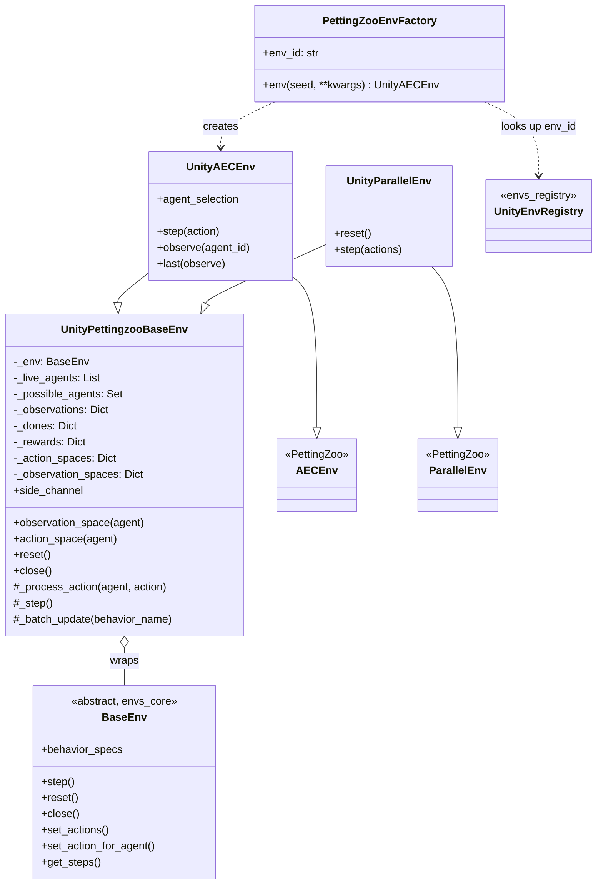
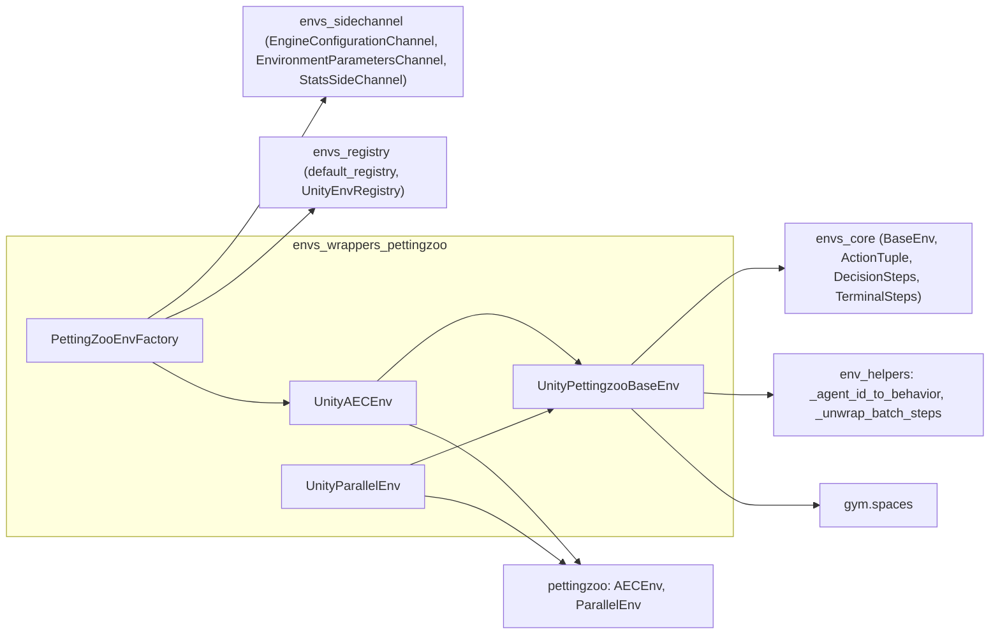
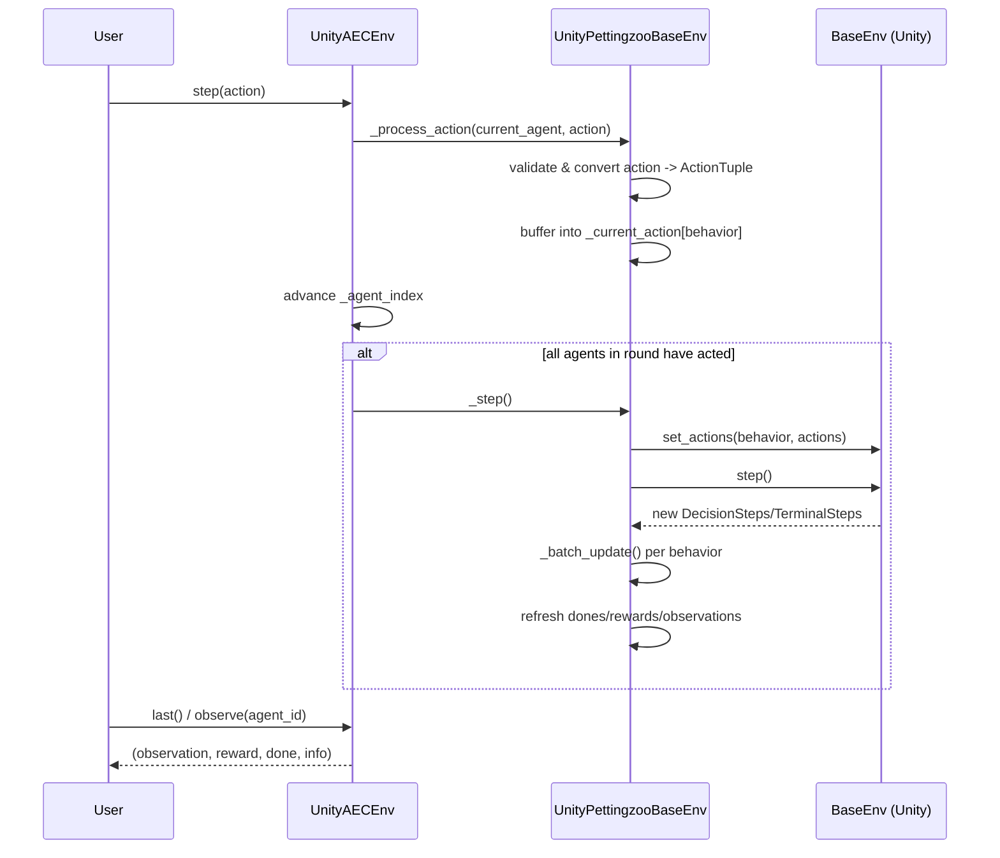
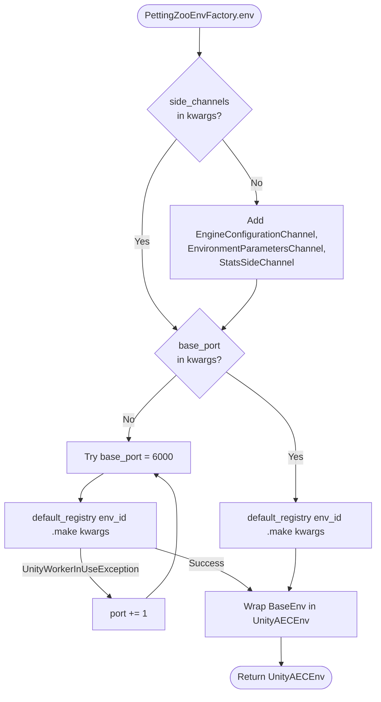
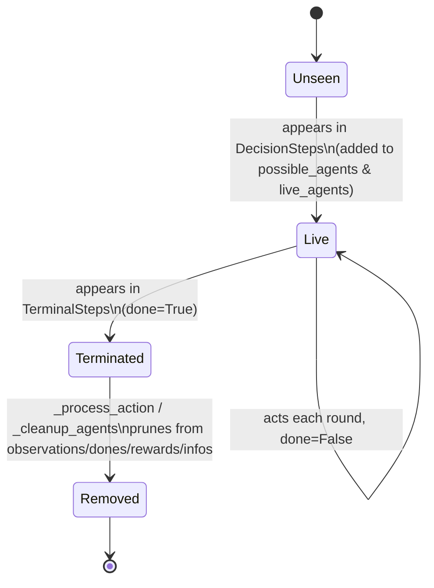
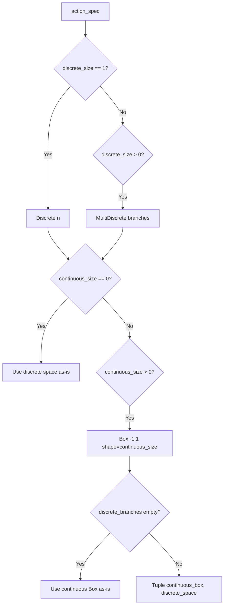

# envs_wrappers_pettingzoo

## Introduction

The `envs_wrappers_pettingzoo` module adapts Unity ML-Agents multi-agent environments to the [PettingZoo](https://pettingzoo.farama.org/) API — the de-facto standard interface for multi-agent reinforcement learning (MARL) environments in the Python RL ecosystem. It exposes Unity's native `BaseEnv` interface (defined in [envs_core](envs_core.md)) through both of PettingZoo's supported paradigms:

- **AEC (Agent Environment Cycle)** — agents act one at a time in a turn-based loop (`UnityAECEnv`).
- **Parallel** — all agents act simultaneously each step (`UnityParallelEnv`).

A shared base class, `UnityPettingzooBaseEnv`, implements all the bookkeeping common to both paradigms (observation/action space construction, agent lifecycle tracking, reward and stepping logic), while `PettingZooEnvFactory` provides a convenience entry point for instantiating registry-based environments already wrapped as `UnityAECEnv`.

This module is a sibling of [envs_wrappers_gym](envs_wrappers_gym.md) (which adapts Unity environments to the single-agent OpenAI Gym API) and sits within the broader [Python_Environment_Interface_Layer](envs_core.md) alongside the environment registry ([envs_registry](envs_registry.md)) and side-channel communication layer ([envs_sidechannel](envs_sidechannel.md)).

---

## Module Purpose & Core Functionality

| Responsibility | Description |
|---|---|
| **Protocol translation** | Converts Unity's batched, behavior-oriented stepping model (`DecisionSteps`/`TerminalSteps`) into per-agent PettingZoo semantics (`agent_selection`, `last()`, `observe()`, dict-based `step()`/`reset()`). |
| **Agent lifecycle management** | Tracks `live_agents`, `possible_agents`, per-agent dones/rewards/infos across the variable-length agent population typical of Unity multi-agent scenes. |
| **Space construction** | Derives Gym-style `observation_space` / `action_space` objects per behavior from Unity's `BehaviorSpec` (continuous, discrete, multi-discrete, and tuple/hybrid action spaces). |
| **Action validation & dispatch** | Validates and converts external actions into Unity's `ActionTuple` format, and buffers them per-agent before pushing to the simulation. |
| **Convenience environment creation** | `PettingZooEnvFactory` builds ready-to-use `UnityAECEnv` instances directly from the Unity environment registry, handling port allocation and default side-channels. |

---

## Components

### `UnityPettingzooBaseEnv`
File: `ml-agents-envs/mlagents_envs/envs/unity_pettingzoo_base_env.py`

The shared engine underlying both PettingZoo wrapper flavors. It is **not** itself a PettingZoo environment (it doesn't inherit `AECEnv`/`ParallelEnv`) — it is mixed into the two concrete wrapper classes below, which add API compliance and paradigm-specific `step()`/`reset()` semantics.

Key internal state:
- `_live_agents` — agents currently alive.
- `_agents` — agents present in the current step (including terminated ones).
- `_possible_agents` — the superset of every agent ID ever observed.
- `_agent_id_to_index` — maps agent IDs to their row index within a Unity `DecisionSteps` batch.
- `_observations`, `_dones`, `_rewards`, `_cumm_rewards`, `_infos` — per-agent step outputs.
- `_action_spaces` / `_observation_spaces` — per-**behavior** Gym spaces (shared by all agents under the same behavior name).
- `_current_action` — buffered `ActionTuple` to submit for each behavior on the next Unity step.

Key methods:
- `_update_observation_spaces()` / `_update_action_spaces()` — inspect `BehaviorSpec.observation_specs` / `action_spec` and build corresponding `gym.spaces.Box`, `Discrete`, `MultiDiscrete`, or `Tuple` objects.
- `_process_action(agent, action)` — validates an external action against the agent's action space, converts it to an `ActionTuple`, and writes it into the correct row of `_current_action`. If the agent is already done, it is instead purged from tracking dictionaries.
- `_step()` — pushes all buffered actions via `env.set_actions()`, calls `env.step()`, resets internal per-step state, and re-populates dones/rewards from fresh Unity steps.
- `_batch_update(behavior_name)` — pulls `DecisionSteps`/`TerminalSteps` for a behavior via `env.get_steps()` and unwraps them into flat per-agent dictionaries using the `env_helpers` utilities (`_unwrap_batch_steps`, `_agent_id_to_behavior`).
- `reset()` — resets the underlying Unity environment and internal state, repopulating `_possible_agents`.
- `side_channel` — dict access to the environment's configured side channels (see [envs_sidechannel](envs_sidechannel.md)).
- `close()` / `__del__()` — releases the Unity environment; registered via `atexit` to guarantee cleanup.

### `UnityAECEnv`
File: `ml-agents-envs/mlagents_envs/envs/unity_aec_env.py`

Implements PettingZoo's `AECEnv` interface by combining `UnityPettingzooBaseEnv` with turn-based stepping:

- `step(action)` — applies the action for the **currently selected** agent (`self._agent_index`), advances the turn pointer, and only triggers an actual Unity simulation step (`self._step()`) once every live agent has acted in the current "round".
- `agent_selection` — property returning the ID of the agent whose turn it currently is.
- `observe(agent_id)` — returns `(observation, cumulative_reward, done, info)` for a given agent.
- `last(observe=True)` — PettingZoo convenience method returning the tuple for the currently selected agent.

### `UnityParallelEnv`
File: `ml-agents-envs/mlagents_envs/envs/unity_parallel_env.py`

Implements PettingZoo's `ParallelEnv` interface, where all agents submit actions simultaneously:

- `reset()` — resets the environment and returns a dict of initial observations keyed by agent ID.
- `step(actions: Dict[str, Any])` — processes every agent's action in `actions`, resets rewards, performs a single Unity `_step()`, cleans up agents that are done (`_cleanup_agents()`), and returns `(observations, rewards, dones, infos)` dictionaries.

### `PettingZooEnvFactory`
File: `ml-agents-envs/mlagents_envs/envs/pettingzoo_env_factory.py`

A factory for creating `UnityAECEnv` instances from the Unity [environment registry](envs_registry.md) (`default_registry`), commonly used by benchmarking and RL-library integration code that expects a `make_env()`-style callable.

- `__init__(env_id)` — stores the registry key for the target environment.
- `env(seed=None, **kwargs)`:
  1. If no `side_channels` are supplied, defaults to `EngineConfigurationChannel`, `EnvironmentParametersChannel`, and `StatsSideChannel` (see [envs_sidechannel](envs_sidechannel.md)).
  2. If no `base_port` is given, probes ports starting at 6000, retrying on `UnityWorkerInUseException` until a free port is found — enabling parallel environment instances without manual port management.
  3. Instantiates the environment via `default_registry[env_id].make(**kwargs)`.
  4. Wraps the resulting `BaseEnv` in `UnityAECEnv` and returns it.

---

## Architecture



---

## Dependencies



Notable relationships:
- `envs_wrappers_pettingzoo` depends on [envs_core](envs_core.md) for `BaseEnv`, `ActionTuple`, `DecisionSteps`, and `TerminalSteps` — the raw Unity-side stepping protocol.
- `PettingZooEnvFactory` depends on [envs_registry](envs_registry.md) to resolve environment IDs to concrete Unity builds, and on [envs_sidechannel](envs_sidechannel.md) for default communication channels.
- The sibling module [envs_wrappers_gym](envs_wrappers_gym.md) solves an analogous problem for single-agent Gym compatibility, sharing the same underlying `BaseEnv` contract but not code with this module.
- Downstream, PettingZoo-wrapped environments are typically consumed by third-party MARL libraries or custom training loops rather than by ml-agents' own [Training_Orchestration_&_Lifecycle_Infrastructure](trainers_core.md), which instead consumes `BaseEnv` directly via `EnvManager` implementations (e.g. `SimpleEnvManager`, `SubprocessEnvManager`).

---

## Data Flow: Stepping Sequence

### AEC (turn-based) step flow



### Parallel step flow

```mermaid
sequenceDiagram
    participant User
    participant Par as UnityParallelEnv
    participant Base as UnityPettingzooBaseEnv
    participant Unity as BaseEnv (Unity)

    User->>Par: step({agent_id: action, ...})
    loop for each agent, action
        Par->>Base: _process_action(agent, action)
    end
    Par->>Base: _step()
    Base->>Unity: set_actions() + step()
    Unity-->>Base: new DecisionSteps/TerminalSteps
    Base->>Base: _batch_update() per behavior
    Par->>Base: _cleanup_agents()
    Par-->>User: (observations, rewards, dones, infos)
```

---

## Environment Construction via Factory



---

## Agent State Lifecycle

Each agent transitions through observable states tracked by `UnityPettingzooBaseEnv`:



- **AEC** removes a terminated agent lazily, inside `_process_action`, right after its final action/observation cycle.
- **Parallel** removes terminated agents in bulk via `_cleanup_agents()` after each synchronous step.

---

## Action Space Derivation

Unity's `BehaviorSpec.action_spec` (continuous size + discrete branches) is translated into Gym spaces as follows:



This mirrors the analogous, but Gym-single-agent-specific, `ActionFlattener` logic used in [envs_wrappers_gym](envs_wrappers_gym.md), except here spaces are kept per-behavior and may remain hybrid (`Tuple`) rather than flattened into a single discrete space.

---

## Usage Notes

- **Determinism**: Call `seed()` before `reset()` to make discrete/continuous action space sampling deterministic; the seed is propagated to constructed `gym.spaces` objects during `_update_action_spaces()`.
- **Rendering**: `render()` is a no-op — Unity rendering is controlled by the Editor/standalone build itself, not by this wrapper.
- **Side channels**: Access configured channels at runtime through `env.side_channel["EngineConfigurationChannel"]`, etc. See [envs_sidechannel](envs_sidechannel.md) for channel APIs.
- **Cleanup**: Both wrapper classes register `close()` with `atexit`, but explicit `close()` calls are recommended in long-running training scripts to release Unity's ports and processes promptly.

---

## Related Modules

- [envs_core](envs_core.md) — `BaseEnv`, `UnityEnvironment`, `ActionTuple`, `DecisionSteps`/`TerminalSteps` that this module wraps.
- [envs_wrappers_gym](envs_wrappers_gym.md) — Sibling wrapper module targeting the single-agent OpenAI Gym API.
- [envs_registry](envs_registry.md) — Backing registry used by `PettingZooEnvFactory` to resolve and build named environments.
- [envs_sidechannel](envs_sidechannel.md) — Side channel implementations used for engine configuration, environment parameters, and stats reporting.
- [trainers_core](trainers_core.md) — Training-side environment management (`EnvManager`, `SimpleEnvManager`, `SubprocessEnvManager`) that consumes `BaseEnv` directly rather than through PettingZoo wrappers.
