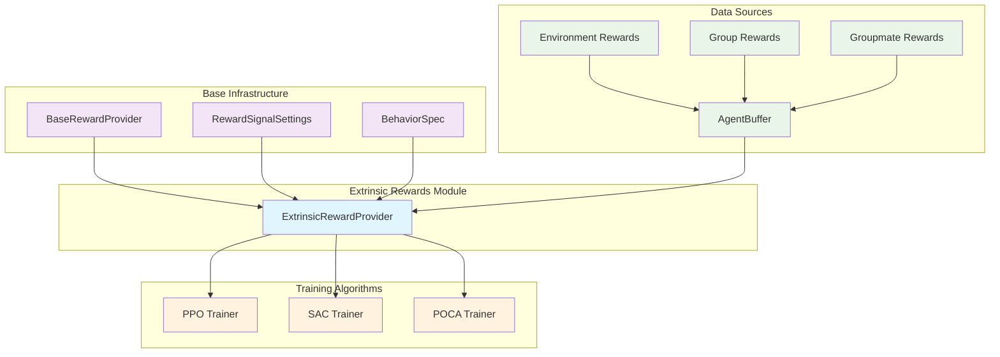
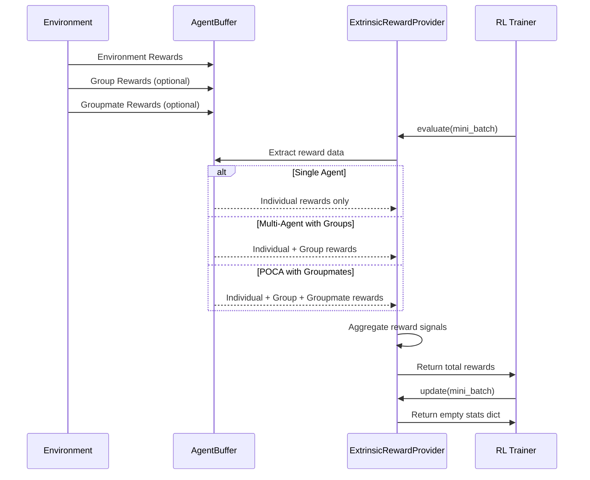
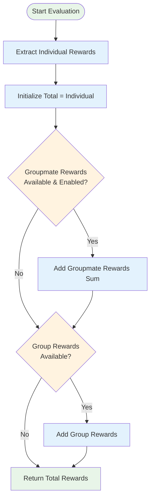
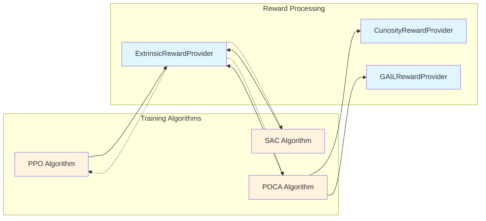

# Extrinsic Rewards Module

## Overview

The **extrinsic_rewards** module is a specialized component within the ML-Agents reward systems that handles the evaluation and processing of environment-provided rewards. As part of the broader [reward_systems](reward_systems.md) architecture, this module focuses specifically on extrinsic rewards - rewards that come directly from the environment rather than being generated internally by the training system.

The module implements reward aggregation strategies for both single-agent and multi-agent scenarios, with special support for team-based learning algorithms like POCA (Partially Observable Cooperative Agents). It serves as the primary interface between environment rewards and the training algorithms, ensuring proper reward signal processing for reinforcement learning.

## Architecture



## Core Components

### ExtrinsicRewardProvider

The `ExtrinsicRewardProvider` class is the central component that evaluates extrinsic rewards from environment data. It extends the [base_reward_infrastructure](reward_systems.md#base-reward-infrastructure) to provide specialized handling of environment-sourced rewards.

**Key Features:**
- **Individual Reward Processing**: Handles standard per-agent rewards from the environment
- **Team Reward Aggregation**: Supports group-based rewards for cooperative learning
- **Groupmate Reward Integration**: Optionally includes rewards from other team members
- **Multi-Agent Coordination**: Seamlessly integrates with [multi_agent_coordination](unity_runtime_core.md#multi-agent-coordination) systems

**Configuration:**
- Inherits gamma (discount factor) and strength (multiplier) from base settings
- Configurable groupmate reward inclusion via `add_groupmate_rewards` flag
- Supports all standard [RewardSignalSettings](training_infrastructure.md#configuration-system) parameters

## Data Flow



## Reward Aggregation Strategy

The module implements a hierarchical reward aggregation approach:



### Reward Components

1. **Individual Rewards** (`BufferKey.ENVIRONMENT_REWARDS`)
   - Base rewards provided by the environment for each agent
   - Always included in the final reward calculation
   - Sourced directly from environment step responses

2. **Group Rewards** (`BufferKey.GROUP_REWARD`)
   - Shared rewards given to all members of a group
   - Automatically added when available in the buffer
   - Supports team-based learning objectives

3. **Groupmate Rewards** (`BufferKey.GROUPMATE_REWARDS`)
   - Individual rewards of other agents in the same group
   - Only included when `add_groupmate_rewards` is enabled
   - Summed across all groupmates before addition

## Integration Points

### Training Algorithms Integration

The module integrates seamlessly with all ML-Agents training algorithms:



### Buffer System Integration

The module works closely with the [AgentBuffer](training_core.md#agent-buffer) system:

- **Data Extraction**: Reads reward data from structured buffer keys
- **Batch Processing**: Operates on mini-batches for efficient training
- **Type Safety**: Leverages buffer key validation for data integrity

### Multi-Agent Support

Special integration with [multi_agent_coordination](unity_runtime_core.md#multi-agent-coordination):

- **Group Management**: Automatically handles group-based reward structures
- **Agent Coordination**: Supports reward sharing between cooperative agents
- **Scalable Architecture**: Efficiently processes rewards for large agent groups

## Configuration

### Basic Configuration

```yaml
reward_signals:
  extrinsic:
    gamma: 0.99        # Discount factor
    strength: 1.0      # Reward signal strength
```

### Advanced Multi-Agent Configuration

```yaml
reward_signals:
  extrinsic:
    gamma: 0.99
    strength: 1.0
    # Groupmate rewards automatically enabled for POCA
    
behavioral_parameters:
  # Enable group rewards in environment
  group_rewards: true
```

## Performance Characteristics

### Computational Complexity
- **Time Complexity**: O(n) where n is the batch size
- **Space Complexity**: O(n) for reward aggregation
- **Memory Efficiency**: Minimal overhead beyond base reward provider

### Scalability
- **Agent Count**: Linear scaling with number of agents
- **Group Size**: Efficient handling of large cooperative groups
- **Batch Processing**: Optimized for large training batches

## Usage Examples

### Single-Agent Environment

```python
# Environment provides individual rewards only
# ExtrinsicRewardProvider automatically processes them
rewards = provider.evaluate(mini_batch)
# Returns: individual_rewards
```

### Multi-Agent Cooperative Environment

```python
# Environment provides individual + group rewards
# Both are automatically aggregated
rewards = provider.evaluate(mini_batch)
# Returns: individual_rewards + group_rewards
```

### POCA with Groupmate Rewards

```python
# POCA algorithm with groupmate reward sharing
provider.add_groupmate_rewards = True
rewards = provider.evaluate(mini_batch)
# Returns: individual_rewards + group_rewards + sum(groupmate_rewards)
```

## Error Handling

The module implements robust error handling:

- **Missing Buffer Keys**: Gracefully handles optional reward components
- **Data Type Validation**: Ensures proper numpy array formatting
- **Batch Size Consistency**: Validates reward array dimensions

## Dependencies

### Core Dependencies
- **[base_reward_infrastructure](reward_systems.md#base-reward-infrastructure)**: Inherits base reward provider functionality
- **[training_core](training_core.md)**: AgentBuffer and training integration
- **[training_infrastructure](training_infrastructure.md)**: Configuration and settings management

### Runtime Dependencies
- **[unity_runtime_core](unity_runtime_core.md)**: BehaviorSpec and agent parameters
- **[python_environment](python_environment.md)**: Environment communication and data flow

## Related Modules

- **[curiosity_rewards](reward_systems.md#curiosity-rewards)**: Intrinsic motivation rewards
- **[imitation_learning_rewards](reward_systems.md#imitation-learning-rewards)**: GAIL-based reward signals
- **[training_algorithms](training_algorithms.md)**: Algorithm-specific reward processing
- **[multi_agent_coordination](unity_runtime_core.md#multi-agent-coordination)**: Group and team management

## Future Considerations

### Potential Enhancements
- **Reward Normalization**: Automatic reward scaling and normalization
- **Temporal Reward Processing**: Support for time-based reward decay
- **Custom Aggregation Functions**: Pluggable reward combination strategies
- **Reward Debugging Tools**: Enhanced logging and visualization capabilities

### Performance Optimizations
- **Vectorized Operations**: Further optimization of reward aggregation
- **Memory Pooling**: Reduced memory allocation for large batches
- **Parallel Processing**: Multi-threaded reward evaluation for large environments