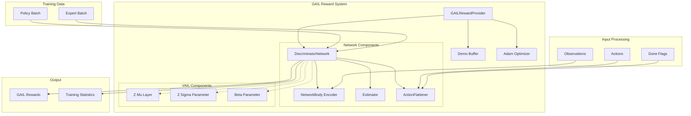
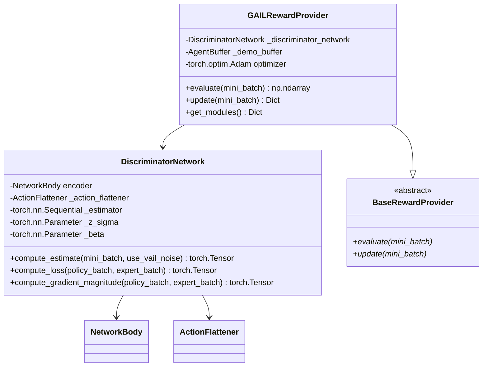
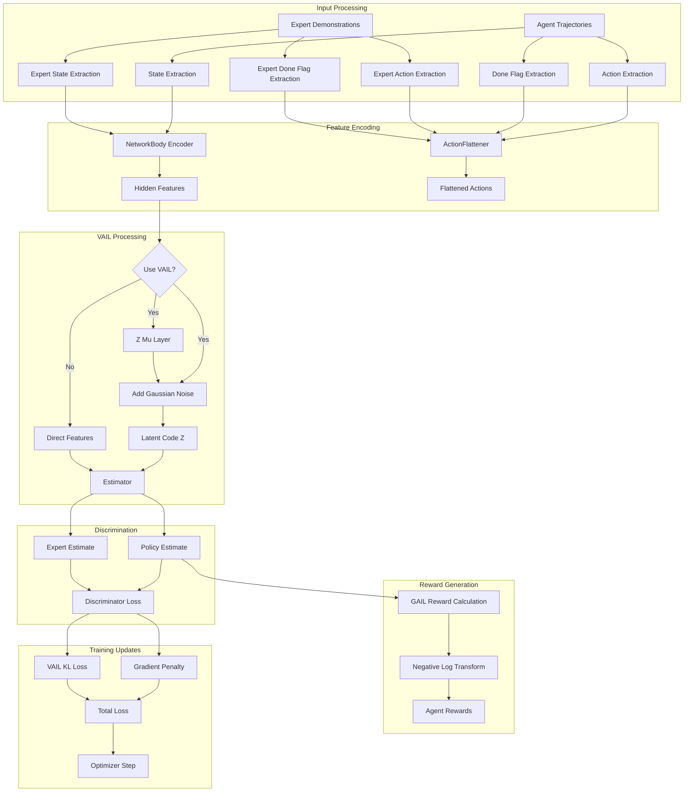
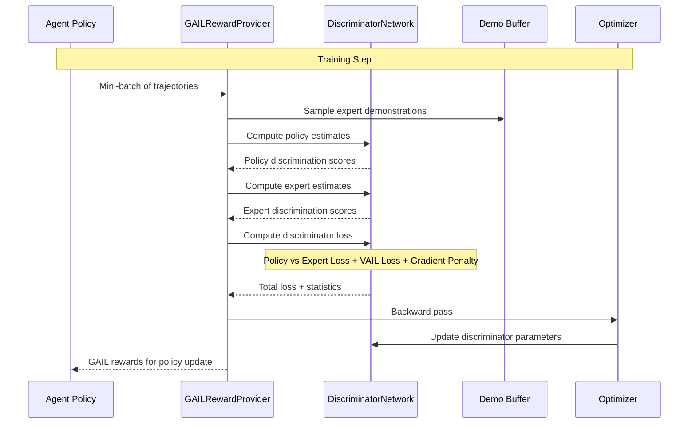

# Imitation Learning Rewards Module

## Overview

The imitation learning rewards module implements Generative Adversarial Imitation Learning (GAIL) reward mechanisms for ML-Agents. This module enables agents to learn behaviors by imitating expert demonstrations through adversarial training, where a discriminator network learns to distinguish between expert and policy-generated trajectories, providing reward signals that guide the agent toward expert-like behavior.

## Core Architecture

The module centers around the `GAILRewardProvider` class, which implements the GAIL algorithm with optional Variational Adversarial Imitation Learning (VAIL) extensions. The system uses a discriminator network to evaluate trajectory authenticity and provides intrinsic rewards based on how closely agent behavior matches expert demonstrations.

## Component Relationships

## Data Flow Architecture

## Training Process Flow

## Key Features

### GAIL Implementation
- **Adversarial Training**: Discriminator learns to distinguish between expert and policy trajectories
- **Reward Signal**: Provides intrinsic rewards based on trajectory authenticity
- **Flexible Input**: Supports both state-only and state-action discrimination

### VAIL Extension
- **Variational Approach**: Optional latent variable modeling for improved stability
- **Information Bottleneck**: Regularizes latent representations through KL divergence
- **Adaptive Beta**: Automatic adjustment of information constraint strength

### Gradient Penalty
- **Training Stability**: Implements Wasserstein GAN gradient penalty for stable training
- **Interpolation**: Uses random interpolation between policy and expert samples
- **Regularization**: Prevents discriminator from becoming too confident

## Configuration

The module is configured through `GAILSettings` which includes:

- **demo_path**: Path to expert demonstration files
- **learning_rate**: Discriminator learning rate
- **use_actions**: Whether to include actions in discrimination
- **use_vail**: Enable VAIL extension
- **network_settings**: Neural network architecture configuration

## Integration Points

### Dependencies
- **[base_reward_infrastructure](base_reward_infrastructure.md)**: Inherits from `BaseRewardProvider`
- **[training_infrastructure](training_infrastructure.md)**: Uses `NetworkBody` for feature encoding
- **[training_core](training_core.md)**: Integrates with trainer update cycles

### Data Sources
- **Expert Demonstrations**: Loaded from demonstration files via `demo_to_buffer`
- **Policy Trajectories**: Received from training algorithms during updates
- **Network Architecture**: Configured through training infrastructure settings

## Performance Characteristics

### Computational Complexity
- **Forward Pass**: O(batch_size × network_depth) for discrimination
- **Backward Pass**: Additional gradient penalty computation increases cost
- **Memory Usage**: Stores expert demonstration buffer and discriminator parameters

### Training Dynamics
- **Convergence**: Requires careful balance between discriminator and policy updates
- **Stability**: VAIL and gradient penalty improve training stability
- **Sample Efficiency**: Can learn from limited expert demonstrations

## Usage Patterns

### Typical Workflow
1. Load expert demonstrations during initialization
2. Receive policy trajectories during training updates
3. Sample expert batch matching policy batch size
4. Compute discriminator estimates for both batches
5. Calculate adversarial loss and update discriminator
6. Provide GAIL rewards to guide policy learning

### Best Practices
- **Demonstration Quality**: Ensure expert demonstrations are high-quality and diverse
- **Hyperparameter Tuning**: Balance discriminator learning rate with policy updates
- **Monitoring**: Track discriminator estimates to ensure proper adversarial balance

## Error Handling

The module includes robust error handling for:
- **Invalid Demonstrations**: Validates demonstration file format and compatibility
- **Network Configuration**: Warns about unsupported settings (e.g., memory networks)
- **Numerical Stability**: Uses epsilon values to prevent log(0) operations

## Future Considerations

- **Multi-Modal Demonstrations**: Support for multiple expert behavior modes
- **Online Demonstration**: Integration with real-time expert feedback
- **Hierarchical GAIL**: Extension to hierarchical policy structures
- **Improved Efficiency**: Optimizations for large-scale demonstration datasets