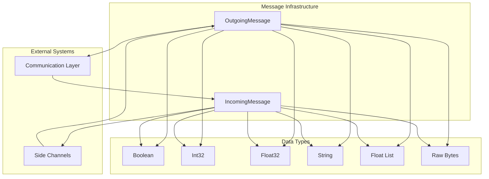
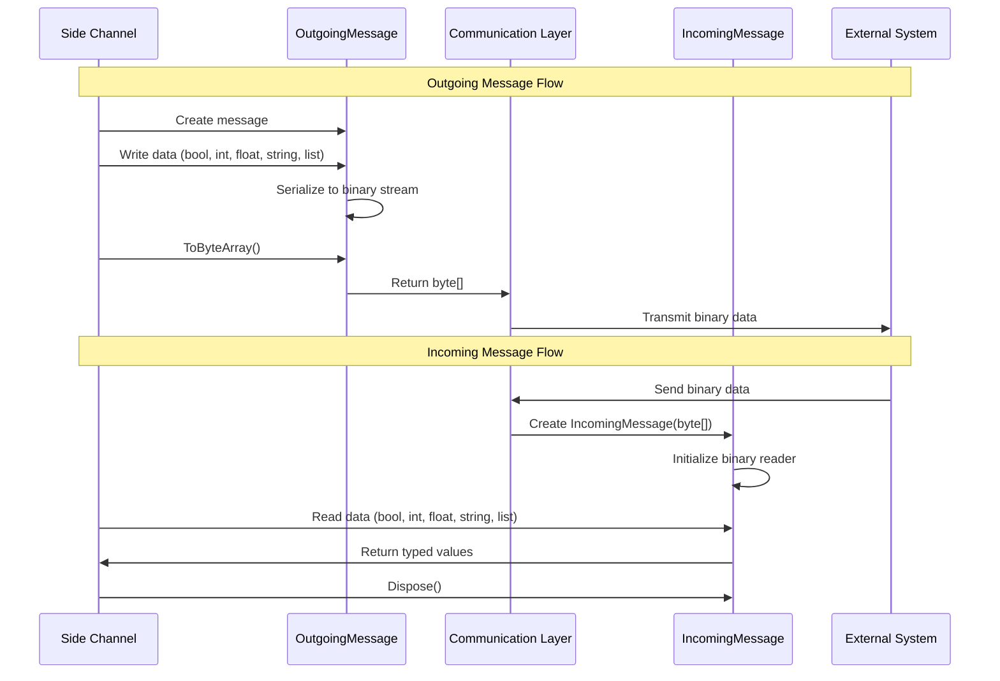
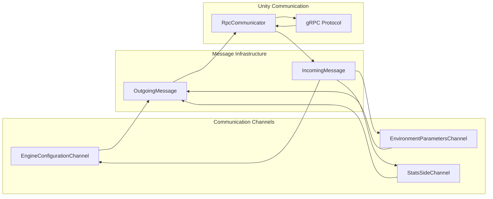

# Message Infrastructure Module

## Overview

The Message Infrastructure module provides the foundational messaging system for Unity ML-Agents side channel communication. This module implements binary message serialization and deserialization capabilities that enable structured data exchange between Unity environments and external Python training processes.

As a core component of the [unity_side_channels](unity_side_channels.md) system, this module handles the low-level message formatting and parsing that supports higher-level communication channels like engine configuration, environment parameters, and statistics reporting.

## Architecture

The module consists of two primary components that work together to provide bidirectional message handling:



## Core Components

### IncomingMessage

The `IncomingMessage` class provides deserialization capabilities for messages received from external systems.

**Key Features:**
- **Binary Stream Reading**: Utilizes `BinaryReader` and `MemoryStream` for efficient binary data parsing
- **Type-Safe Deserialization**: Supports reading boolean, integer, float, string, and float list data types
- **Default Value Handling**: Provides fallback values when message data is exhausted
- **Resource Management**: Implements `IDisposable` for proper cleanup of internal streams

**Supported Data Types:**
- `bool` - Boolean values
- `int` - 32-bit integers
- `float` - 32-bit floating-point numbers
- `string` - ASCII-encoded strings with length prefixes
- `IList<float>` - Variable-length float arrays
- `byte[]` - Raw binary data access

### OutgoingMessage

The `OutgoingMessage` class handles serialization of data for transmission to external systems.

**Key Features:**
- **Binary Stream Writing**: Uses `BinaryWriter` and `MemoryStream` for efficient binary data construction
- **Type-Safe Serialization**: Supports writing all standard data types with consistent formatting
- **Dynamic Buffer Management**: Automatically manages memory stream capacity
- **Raw Data Override**: Allows direct byte array injection for specialized use cases

**Serialization Format:**
- Strings are length-prefixed with ASCII encoding
- Float lists include count prefix followed by sequential float values
- All numeric types use little-endian binary representation

## Data Flow



## Integration with Side Channels

The message infrastructure integrates seamlessly with the communication channel system:



## Usage Patterns

### Creating and Sending Messages

```csharp
// Create outgoing message
using (var message = new OutgoingMessage())
{
    message.WriteString("parameter_name");
    message.WriteFloat32(1.5f);
    message.WriteBoolean(true);
    
    // Send via side channel
    sideChannel.QueueMessageToSend(message.ToByteArray());
}
```

### Receiving and Processing Messages

```csharp
// Process incoming message
using (var message = new IncomingMessage(receivedBytes))
{
    var paramName = message.ReadString();
    var value = message.ReadFloat32();
    var enabled = message.ReadBoolean();
    
    // Process the data...
}
```

## Error Handling and Safety

The message infrastructure implements several safety mechanisms:

- **Bounds Checking**: `CanReadMore()` prevents reading beyond message boundaries
- **Default Values**: All read operations support fallback values for graceful degradation
- **Resource Management**: Proper disposal of streams and readers prevents memory leaks
- **Type Safety**: Strongly-typed read/write operations prevent data corruption

## Performance Considerations

- **Memory Efficiency**: Uses `MemoryStream` for in-memory binary operations
- **Streaming Operations**: Sequential read/write operations minimize memory allocation
- **Capacity Management**: Dynamic buffer sizing reduces memory fragmentation
- **Inline Optimization**: Critical path methods use `MethodImplOptions.AggressiveInlining`

## Dependencies

This module has minimal dependencies and serves as a foundation for:

- **[Communication Channels](communication_channels.md)**: Higher-level channel implementations
- **[Unity Communication](unity_communication.md)**: Network transport layer
- **[Python Side Channels](python_side_channels.md)**: Python-side message handling

## Thread Safety

The message classes are **not thread-safe** and should be used within single-threaded contexts or with appropriate synchronization mechanisms when accessed from multiple threads.

## Future Considerations

- **Compression Support**: Potential for message compression to reduce network overhead
- **Schema Validation**: Message format validation for enhanced robustness
- **Versioning**: Protocol versioning support for backward compatibility
- **Performance Metrics**: Built-in profiling for message serialization performance