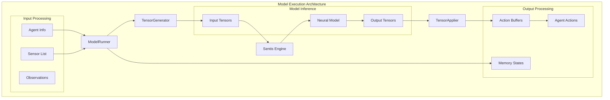
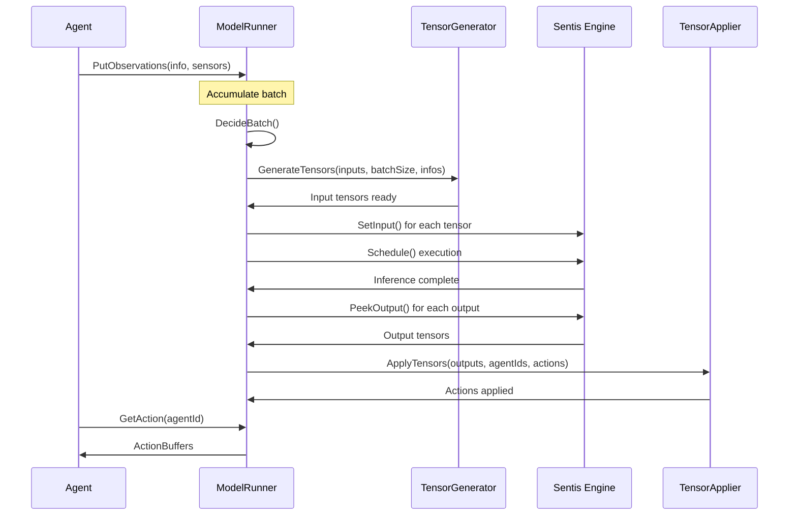
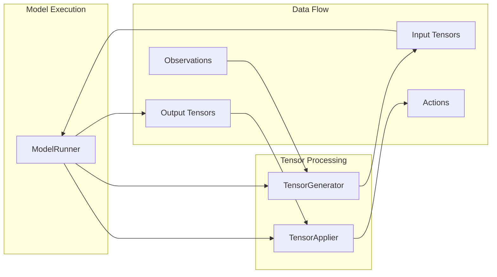
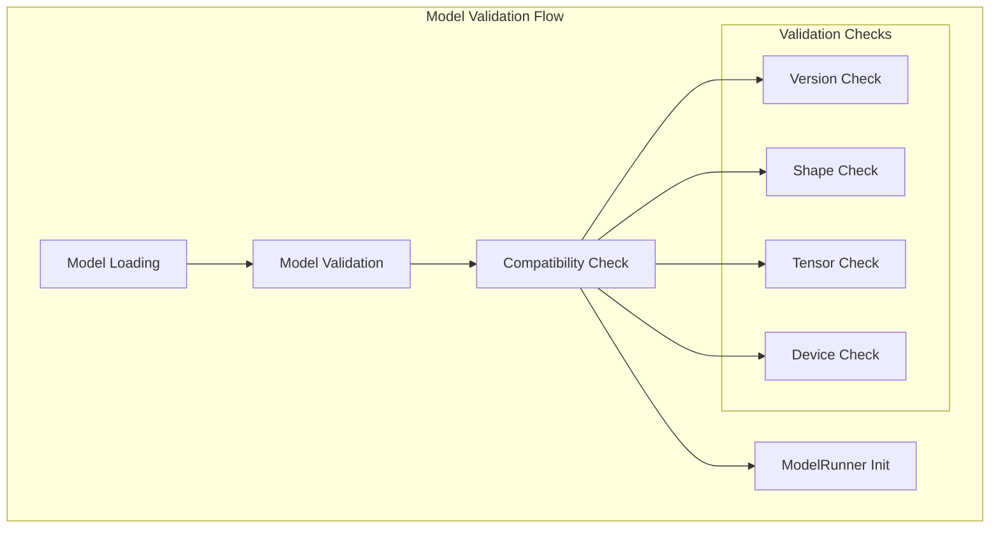
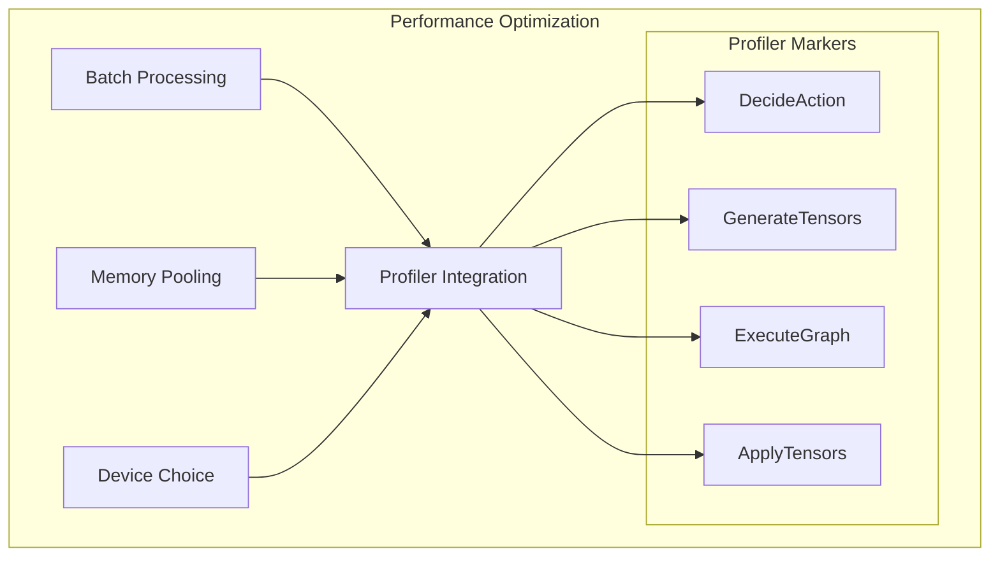
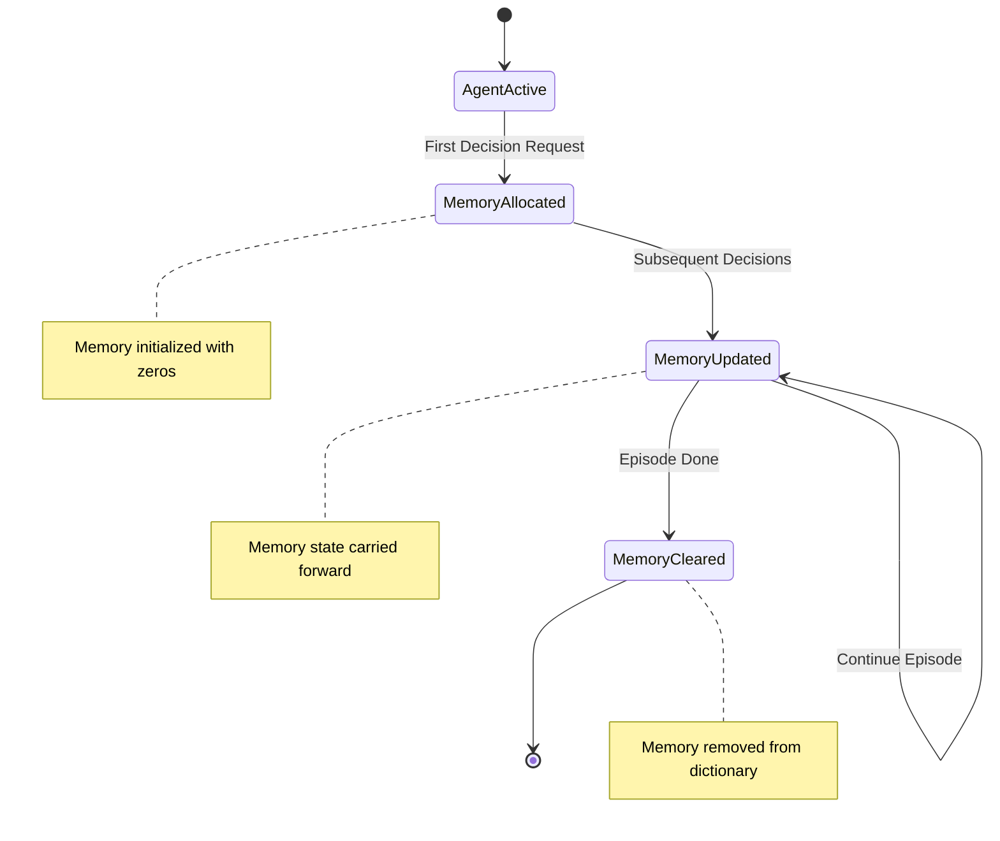

# Model Execution Module

The model_execution module is the core inference engine component within Unity ML-Agents that orchestrates the execution of trained neural network models for agent decision-making. This module serves as the bridge between Unity's runtime environment and the Sentis inference engine, managing the complete lifecycle of model inference from input preparation to action output.

## Architecture Overview

The model_execution module operates as a centralized inference coordinator that manages batch processing of agent observations, executes neural network models, and distributes computed actions back to agents. It integrates tightly with the [tensor_processing](tensor_processing.md) module for data transformation and the [unity_policies](unity_policies.md) module for policy execution.



## Core Components

### ModelRunner

The `ModelRunner` class is the central orchestrator that manages the complete inference pipeline:

**Key Responsibilities:**
- **Batch Management**: Collects agent observations and manages batch processing for efficient inference
- **Model Lifecycle**: Initializes and manages Sentis inference engine instances
- **Memory Management**: Maintains agent memory states for recurrent neural networks
- **Device Abstraction**: Handles different inference devices (CPU, GPU Compute, GPU Pixel)
- **Action Distribution**: Distributes computed actions back to requesting agents

**Core Data Structures:**
```csharp
// Agent information paired with sensor data
internal struct AgentInfoSensorsPair
{
    public AgentInfo agentInfo;
    public List<ISensor> sensors;
}

// Key internal collections
List<AgentInfoSensorsPair> m_Infos;                    // Batch of agents requesting decisions
Dictionary<int, ActionBuffers> m_LastActionsReceived;  // Agent action history
List<int> m_OrderedAgentsRequestingDecisions;         // Decision request ordering
Dictionary<int, List<float>> m_Memories;              // RNN memory states
```

## Inference Pipeline

The model execution follows a structured pipeline that processes agent observations through neural network inference to produce actions:



## Integration with Tensor Processing

The model_execution module has a tight dependency relationship with the [tensor_processing](tensor_processing.md) module:



**TensorGenerator Integration:**
- Converts agent observations and sensor data into model-compatible tensor formats
- Handles different observation types (vector, visual, ray perception)
- Manages batch dimension and sequence length for RNN models

**TensorApplier Integration:**
- Processes model output tensors into agent-actionable formats
- Handles both continuous and discrete action spaces
- Updates agent memory states for recurrent models

## Model Validation and Compatibility

The module integrates with [model_validation](model_validation.md) to ensure model compatibility:



## Device and Performance Management

The ModelRunner supports multiple inference devices with automatic optimization:

**Supported Devices:**
- **CPU (Burst)**: Default option, optimized for most ML-Agents models
- **GPU Compute**: Compute shader execution for parallel processing
- **GPU Pixel**: Pixel shader execution for specialized workloads

**Performance Features:**
- **Batch Processing**: Processes multiple agents simultaneously for efficiency
- **Memory Pooling**: Reuses tensor allocations to minimize garbage collection
- **Profiler Integration**: Built-in Unity Profiler markers for performance analysis



## Memory Management for Recurrent Models

For agents using recurrent neural networks (RNNs), the ModelRunner maintains persistent memory states:

**Memory Features:**
- **Per-Agent Memory**: Individual memory states tracked by episode ID
- **Automatic Cleanup**: Memory cleared when agents complete episodes
- **State Persistence**: Memory maintained across decision requests within episodes



## Error Handling and Diagnostics

The module provides comprehensive error handling and diagnostic capabilities:

**Validation Errors:**
- Model version compatibility issues
- Tensor shape mismatches
- Missing required inputs/outputs
- Device compatibility problems

**Runtime Errors:**
- Inference execution failures
- Memory allocation issues
- Batch size inconsistencies

**Diagnostic Features:**
- Sensor shape validation in debug builds
- Detailed error messages with remediation suggestions
- Performance profiling markers

## Integration Points

### Unity Runtime Core
- Receives agent observations through [agent_core](agent_core.md)
- Coordinates with [decision_management](decision_management.md) for timing
- Supports [multi_agent_coordination](multi_agent_coordination.md) scenarios

### Unity Policies
- Implements inference backend for [unity_policies](unity_policies.md)
- Provides model execution for RemotePolicy and SentisPolicy
- Integrates with policy switching mechanisms

### Unity Sensors
- Processes observations from all [unity_sensors](unity_sensors.md) types
- Handles visual, vector, and spatial sensor data
- Validates sensor compatibility with model requirements

## Configuration and Initialization

ModelRunner initialization requires several key parameters:

```csharp
public ModelRunner(
    ModelAsset model,              // Sentis model asset
    ActionSpec actionSpec,         // Action space specification
    InferenceDevice inferenceDevice, // Execution device
    int seed = 0,                  // Random seed for deterministic behavior
    bool deterministicInference = false // Deterministic action selection
)
```

**Initialization Process:**
1. **Model Loading**: Load and validate Sentis model
2. **Device Setup**: Configure inference backend
3. **Tensor Setup**: Initialize input/output tensor specifications
4. **Component Creation**: Create TensorGenerator and TensorApplier instances
5. **Validation**: Perform compatibility checks

## Best Practices

### Performance Optimization
- **Batch Size**: Optimize batch sizes for your target hardware
- **Device Selection**: Use CPU for most scenarios unless GPU benefits are proven
- **Memory Management**: Monitor memory usage for large agent populations
- **Profiling**: Use Unity Profiler to identify bottlenecks

### Model Compatibility
- **Version Alignment**: Ensure model and runtime versions are compatible
- **Tensor Validation**: Validate tensor shapes match sensor configurations
- **Action Space**: Verify action specifications match model outputs
- **Memory Requirements**: Consider RNN memory overhead for large populations

### Error Prevention
- **Sensor Validation**: Validate sensor configurations before deployment
- **Model Testing**: Test models with representative agent configurations
- **Device Testing**: Validate performance across target devices
- **Memory Monitoring**: Monitor memory usage patterns during development

## Related Documentation

- [tensor_processing](tensor_processing.md) - Tensor data transformation pipeline
- [model_validation](model_validation.md) - Model compatibility and validation
- [unity_policies](unity_policies.md) - Policy execution framework
- [unity_sensors](unity_sensors.md) - Observation data sources
- [agent_core](agent_core.md) - Agent runtime components