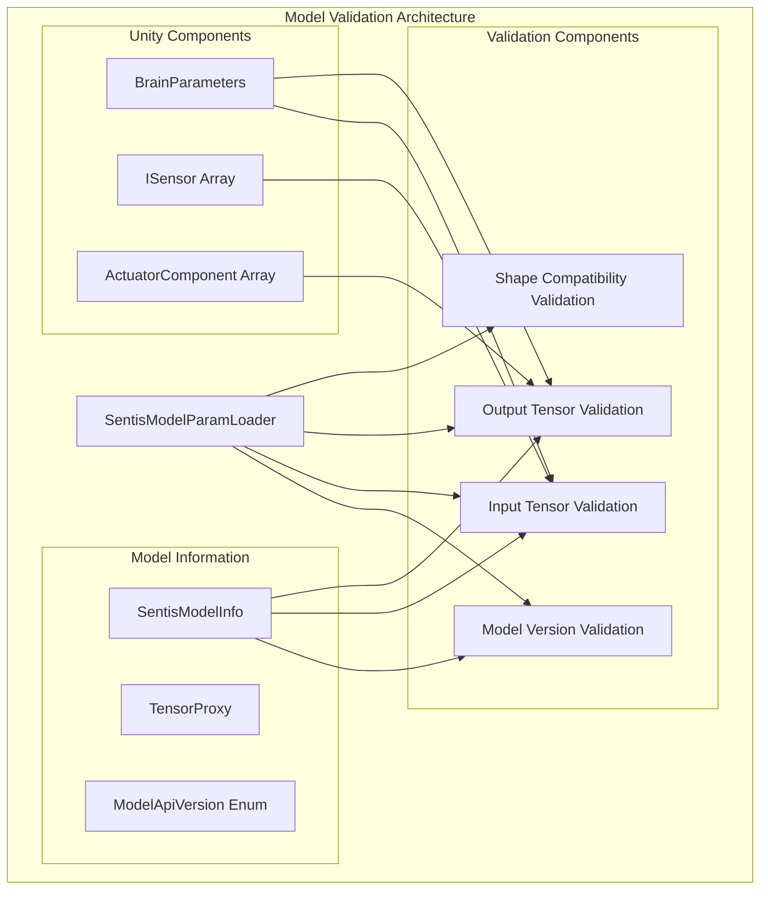
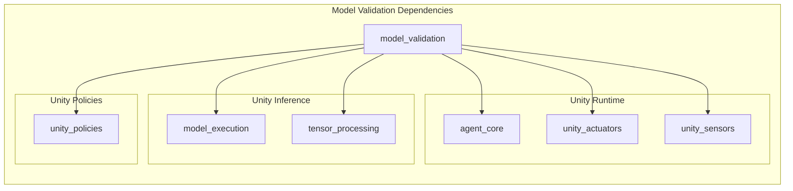
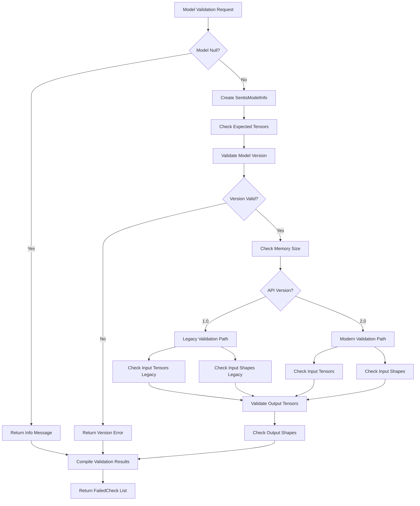
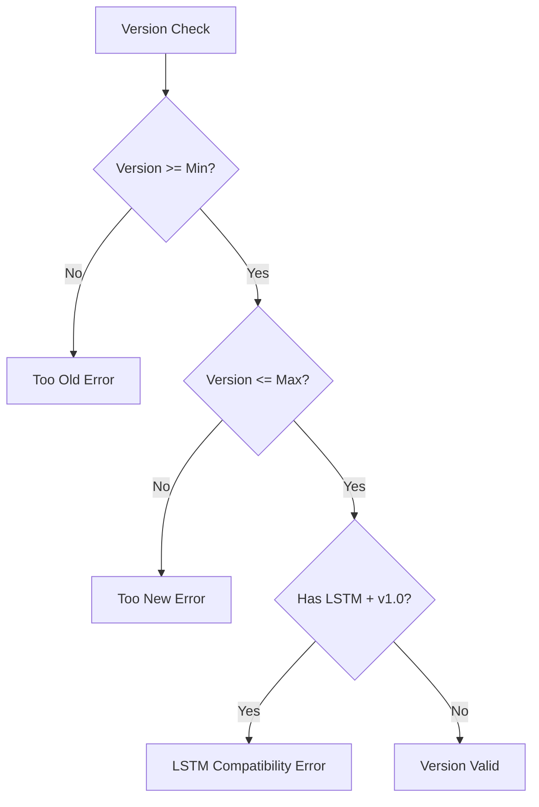
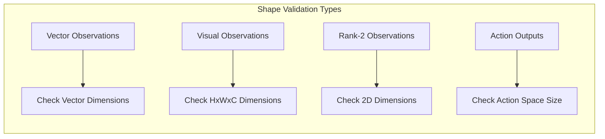
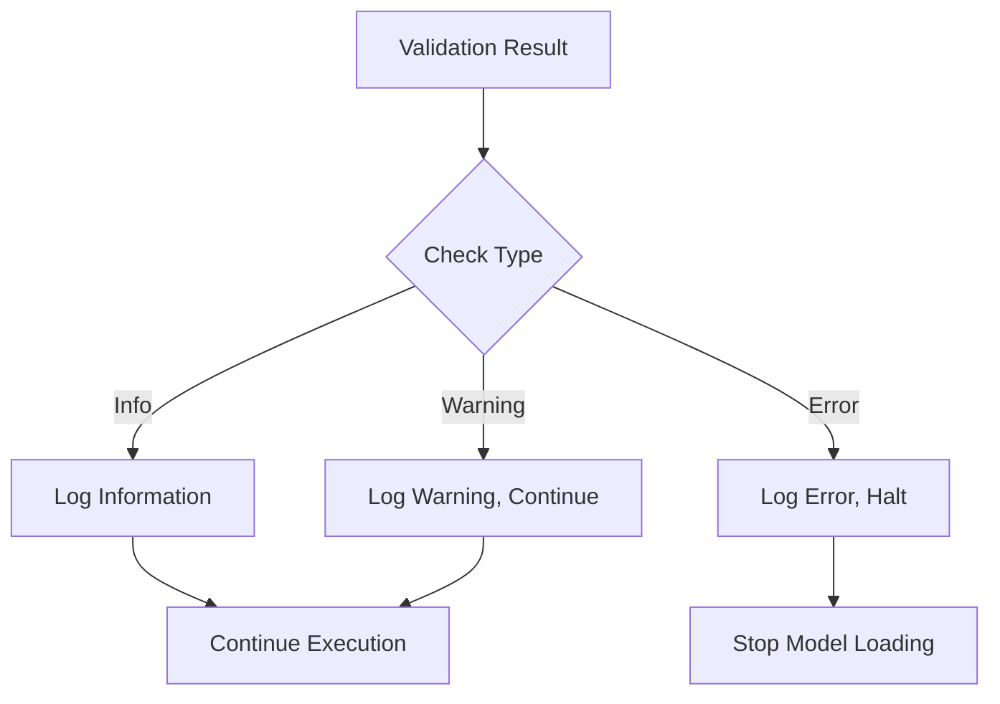

# Model Validation Module

## Overview

The Model Validation module is a critical component of Unity ML-Agents' inference system that ensures compatibility between trained neural network models and the Unity runtime environment. This module validates model parameters, tensor shapes, input/output specifications, and API versions to prevent runtime errors and ensure proper model execution.

## Core Purpose

The module serves as a comprehensive validation layer that:
- Verifies model API version compatibility
- Validates tensor shapes and dimensions
- Ensures input/output tensor presence and compatibility
- Checks sensor and actuator component alignment with model expectations
- Provides detailed error reporting for debugging model integration issues

## Architecture Overview



## Component Dependencies



## Core Components

### SentisModelParamLoader

The primary validation class that orchestrates all model compatibility checks.

**Key Responsibilities:**
- Model version validation
- Tensor presence and shape validation
- Input/output compatibility verification
- Error reporting and diagnostics

**API Versions Supported:**
- **MLAgents1_0 (Version 2)**: Legacy format with separate vector/visual observations and Sentis-managed LSTM
- **MLAgents2_0 (Version 3)**: Unified observation format with manual LSTM management

### ModelApiVersion Enum

Defines supported model API versions and compatibility ranges:

```csharp
internal enum ModelApiVersion
{
    MLAgents1_0 = 2,        // Legacy format
    MLAgents2_0 = 3,        // Current format
    MinSupportedVersion = MLAgents1_0,
    MaxSupportedVersion = MLAgents2_0
}
```

### FailedCheck Class

Structured error reporting system with severity levels:
- **Info**: Informational messages
- **Warning**: Non-critical compatibility issues
- **Error**: Critical failures preventing model execution

## Validation Process Flow



## Validation Categories

### 1. Version Validation

Ensures model compatibility with current ML-Agents version:



### 2. Input Tensor Validation

Verifies presence and compatibility of input tensors:

**Legacy Format (v1.0):**
- Vector observation placeholder
- Visual observation placeholders (indexed)
- Action mask placeholder
- Recurrent inputs (_h, _c)

**Modern Format (v2.0):**
- Observation placeholders (obs_0, obs_1, ...)
- Action mask placeholder
- Recurrent input placeholder

### 3. Output Tensor Validation

Ensures required output tensors are present:
- Action outputs (continuous/discrete)
- Recurrent outputs (for memory-enabled models)
- Value estimates (if applicable)

### 4. Shape Validation

Validates tensor dimensions match expected specifications:



## Integration with Unity ML-Agents

### Sensor Integration

The module validates compatibility with various sensor types:
- **Vector Sensors**: Dimension and stacking validation
- **Visual Sensors**: Height, width, and channel validation
- **Ray Perception Sensors**: Ray configuration validation
- **Buffer Sensors**: Buffer size and format validation

For detailed sensor specifications, see [unity_sensors.md](unity_sensors.md).

### Actuator Integration

Validates action space compatibility:
- **Continuous Actions**: Size matching
- **Discrete Actions**: Branch size validation
- **Hybrid Actions**: Combined validation

For actuator details, see [unity_actuators.md](unity_actuators.md).

### Policy Integration

Works with policy systems to ensure model compatibility:
- **Remote Policy**: Network model validation
- **Heuristic Policy**: Fallback validation
- **Sentis Policy**: Direct model validation

For policy information, see [unity_policies.md](unity_policies.md).

## Error Handling and Diagnostics

### Validation Result Types



### Common Validation Errors

1. **Version Mismatch**: Model trained with incompatible ML-Agents version
2. **Tensor Shape Mismatch**: Observation or action dimensions don't match
3. **Missing Tensors**: Required input/output tensors not found in model
4. **LSTM Compatibility**: Legacy LSTM models incompatible with newer versions
5. **Action Space Mismatch**: Discrete/continuous action counts don't align

## Performance Considerations

### Validation Timing

- **Initialization**: Validation occurs during policy initialization
- **Runtime**: No validation overhead during inference
- **Memory**: Temporary SentisModelInfo objects are disposed properly

### Optimization Strategies

- Early validation failure detection
- Efficient tensor shape comparison
- Minimal memory allocation during validation
- Comprehensive error batching

## Usage Examples

### Basic Model Validation

```csharp
var failedChecks = SentisModelParamLoader.CheckModel(
    model: sentisModel,
    brainParameters: agentBrainParams,
    sensors: attachedSensors,
    actuatorComponents: attachedActuators,
    observableAttributeTotalSize: observableSize,
    behaviorType: BehaviorType.InferenceOnly,
    deterministicInference: true
);

foreach (var check in failedChecks)
{
    switch (check.CheckType)
    {
        case FailedCheck.CheckTypeEnum.Error:
            Debug.LogError(check.Message);
            break;
        case FailedCheck.CheckTypeEnum.Warning:
            Debug.LogWarning(check.Message);
            break;
        case FailedCheck.CheckTypeEnum.Info:
            Debug.Log(check.Message);
            break;
    }
}
```

### Version-Specific Validation

```csharp
var versionCheck = SentisModelParamLoader.CheckModelVersion(modelInfo);
if (versionCheck != null)
{
    Debug.LogError($"Model version incompatible: {versionCheck.Message}");
    return;
}
```

## Future Considerations

### Extensibility

The validation system is designed to accommodate:
- New model API versions
- Additional tensor types
- Enhanced sensor/actuator validation
- Custom validation rules

### Integration Points

- **Model Execution**: Validated models proceed to [model_execution.md](model_execution.md)
- **Tensor Processing**: Shape validation feeds into [tensor_processing.md](tensor_processing.md)
- **Policy Management**: Validation results influence policy selection in [unity_policies.md](unity_policies.md)

## Related Documentation

- [unity_inference.md](unity_inference.md) - Parent inference system
- [model_execution.md](model_execution.md) - Model execution after validation
- [tensor_processing.md](tensor_processing.md) - Tensor operations and processing
- [unity_sensors.md](unity_sensors.md) - Sensor system integration
- [unity_actuators.md](unity_actuators.md) - Actuator system integration
- [unity_policies.md](unity_policies.md) - Policy system integration