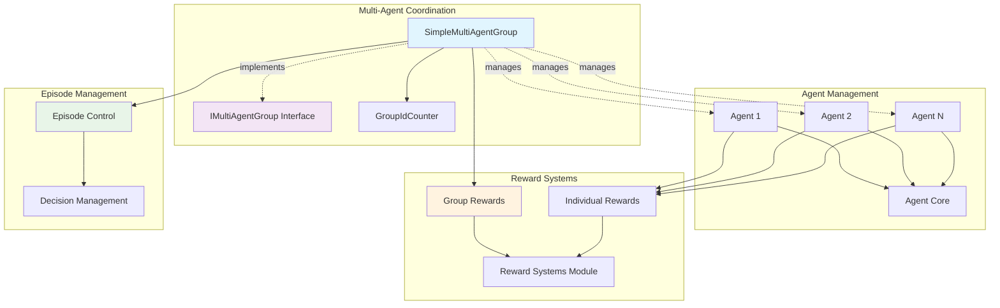
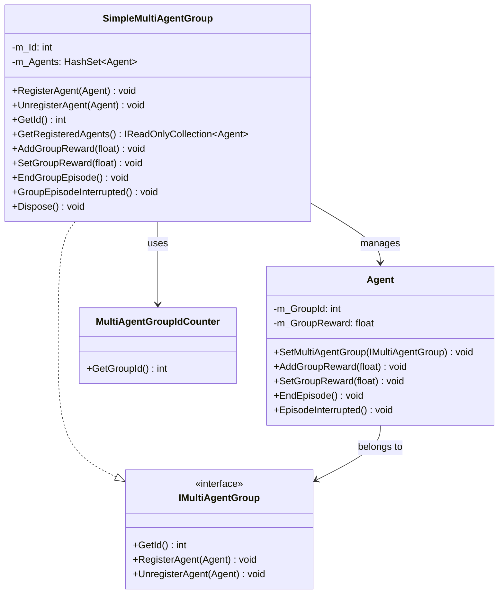
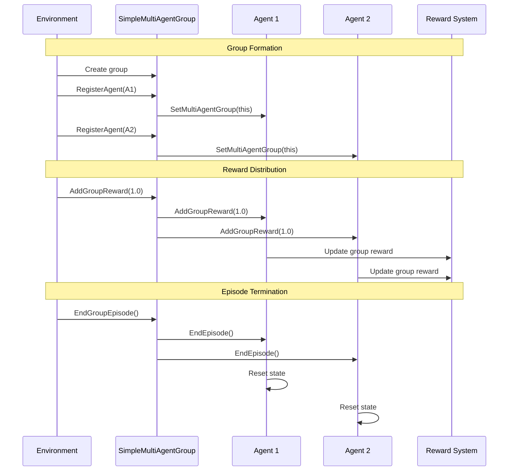

# Multi-Agent Coordination Module

## Overview

The Multi-Agent Coordination module provides the foundational infrastructure for managing groups of agents that need to work together in Unity ML-Agents environments. This module enables coordinated behavior, shared rewards, and synchronized episode management across multiple agents, making it essential for scenarios involving team-based learning, cooperative tasks, and multi-agent reinforcement learning.

## Core Components

### SimpleMultiAgentGroup

The `SimpleMultiAgentGroup` class is the primary implementation of multi-agent coordination, providing a concrete implementation of the `IMultiAgentGroup` interface. It manages collections of agents and coordinates their behavior through shared rewards and synchronized episode control.

**Key Features:**
- Agent registration and lifecycle management
- Group-wide reward distribution
- Synchronized episode termination
- Automatic cleanup and disposal
- Unique group identification

**Core Methods:**
- `RegisterAgent(Agent)` - Adds an agent to the group
- `UnregisterAgent(Agent)` - Removes an agent from the group
- `AddGroupReward(float)` - Distributes incremental rewards to all group members
- `SetGroupReward(float)` - Sets absolute reward values for all group members
- `EndGroupEpisode()` - Terminates episodes for all agents in the group
- `GroupEpisodeInterrupted()` - Handles episode interruption for the entire group

## Architecture



## Component Relationships



## Data Flow



## Integration with Unity ML-Agents

### Agent Core Integration

The multi-agent coordination module integrates seamlessly with the [agent_core](agent_core.md) module through the `Agent` class's built-in group management capabilities:

- **Group Assignment**: Agents can be assigned to groups via `SetMultiAgentGroup()`
- **Reward Propagation**: Group rewards are automatically distributed to individual agents
- **Episode Synchronization**: Group-level episode control coordinates with individual agent lifecycles

### Decision Management Integration

Works with the [decision_management](decision_management.md) module to ensure coordinated decision-making:

- **Synchronized Decisions**: Group members can be coordinated through shared episode boundaries
- **Collective Action Spaces**: Supports scenarios where agents need to act in coordination

### Reward Systems Integration

Integrates with [reward_systems](reward_systems.md) to provide group-based reward mechanisms:

- **Group Rewards**: Separate from individual agent rewards, processed by training algorithms
- **Collective Objectives**: Enables training for team-based goals and cooperative behaviors

## Usage Patterns

### Basic Group Setup

```csharp
// Create a multi-agent group
var group = new SimpleMultiAgentGroup();

// Register agents
group.RegisterAgent(agent1);
group.RegisterAgent(agent2);
group.RegisterAgent(agent3);

// Distribute group rewards
group.AddGroupReward(1.0f);

// End episode for all agents
group.EndGroupEpisode();
```

### Cooperative Task Management

```csharp
public class CooperativeEnvironment : MonoBehaviour
{
    private SimpleMultiAgentGroup teamA;
    private SimpleMultiAgentGroup teamB;
    
    void Start()
    {
        teamA = new SimpleMultiAgentGroup();
        teamB = new SimpleMultiAgentGroup();
        
        // Register team members
        foreach (var agent in teamAAgents)
            teamA.RegisterAgent(agent);
            
        foreach (var agent in teamBAgents)
            teamB.RegisterAgent(agent);
    }
    
    void OnTeamAchievement()
    {
        teamA.AddGroupReward(10.0f);
        teamB.AddGroupReward(-5.0f);
    }
}
```

### Dynamic Group Management

```csharp
public class DynamicGroupManager : MonoBehaviour
{
    private SimpleMultiAgentGroup currentGroup;
    
    public void FormNewGroup(List<Agent> agents)
    {
        // Clean up existing group
        currentGroup?.Dispose();
        
        // Create new group
        currentGroup = new SimpleMultiAgentGroup();
        
        // Register new members
        foreach (var agent in agents)
        {
            currentGroup.RegisterAgent(agent);
        }
    }
    
    public void DisbandGroup()
    {
        currentGroup?.Dispose();
        currentGroup = null;
    }
}
```

## Training Considerations

### Group Reward Design

- **Shared Objectives**: Group rewards should reflect collective goals rather than individual achievements
- **Balance**: Ensure group rewards complement rather than overshadow individual rewards
- **Timing**: Consider when to apply group rewards for maximum learning effectiveness

### Episode Management

- **Synchronization**: Use group episode control when agents need to learn coordinated behaviors
- **Individual vs. Group**: Balance between individual agent autonomy and group coordination
- **Termination Conditions**: Design clear criteria for when groups should end episodes

### Scalability

- **Group Size**: Consider computational overhead with large groups
- **Memory Management**: Proper disposal of groups prevents memory leaks
- **Performance**: Monitor performance impact of group operations during training

## Best Practices

### Group Formation

1. **Clear Objectives**: Define specific goals that require coordination
2. **Appropriate Sizing**: Keep groups small enough for effective coordination
3. **Stable Membership**: Avoid frequent group membership changes during training

### Reward Distribution

1. **Meaningful Rewards**: Ensure group rewards represent genuine collective achievements
2. **Proportional Scaling**: Scale group rewards appropriately relative to individual rewards
3. **Consistent Application**: Apply group rewards consistently across similar situations

### Lifecycle Management

1. **Proper Disposal**: Always dispose of groups when no longer needed
2. **Exception Handling**: Handle agent disconnections gracefully
3. **State Consistency**: Maintain consistent group state across episodes

## Performance Considerations

### Memory Management

- Groups automatically clean up when disposed
- Agents are automatically unregistered when disabled
- Use `using` statements for temporary groups when possible

### Computational Overhead

- Group operations scale linearly with group size
- Reward distribution is O(n) where n is the number of agents
- Episode termination requires coordination across all group members

### Optimization Tips

- Minimize frequent group membership changes
- Batch group operations when possible
- Consider group size limits for large-scale environments

## Related Modules

- **[agent_core](agent_core.md)**: Provides the base Agent class that groups manage
- **[decision_management](decision_management.md)**: Coordinates decision-making processes
- **[reward_systems](reward_systems.md)**: Processes group and individual rewards
- **[training_algorithms](training_algorithms.md)**: Implements algorithms that can leverage group rewards
- **[unity_runtime_core](unity_runtime_core.md)**: Parent module containing core Unity ML-Agents functionality

## Future Enhancements

The multi-agent coordination module provides a foundation for advanced multi-agent scenarios and could be extended with:

- **Hierarchical Groups**: Support for nested group structures
- **Dynamic Membership**: Runtime group membership changes
- **Communication Channels**: Inter-agent communication within groups
- **Advanced Reward Schemes**: More sophisticated group reward distribution mechanisms
- **Performance Metrics**: Group-level performance tracking and analytics