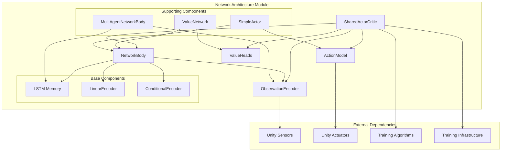
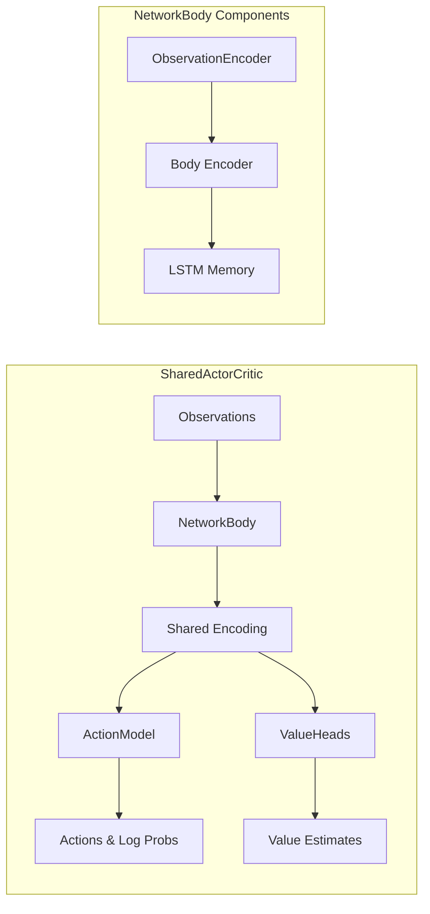
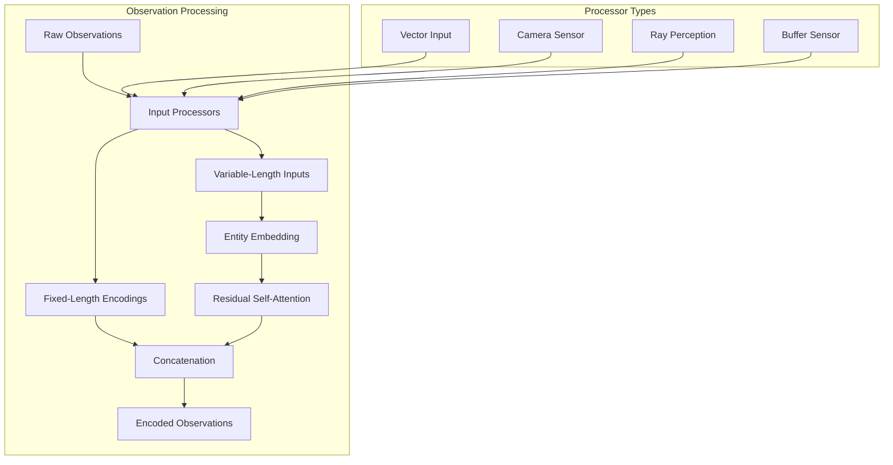
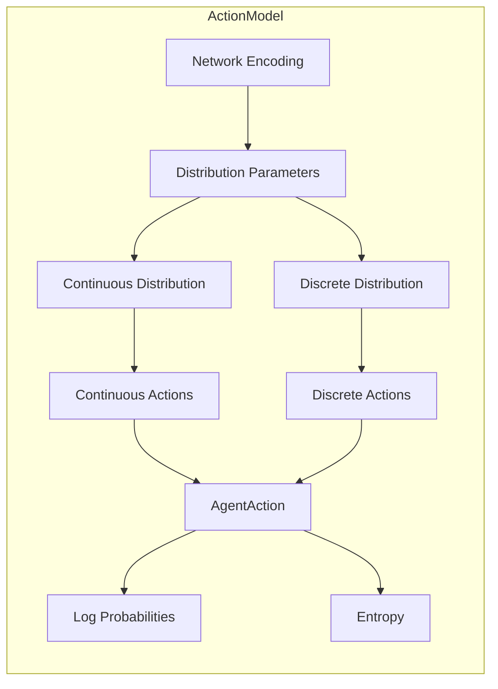
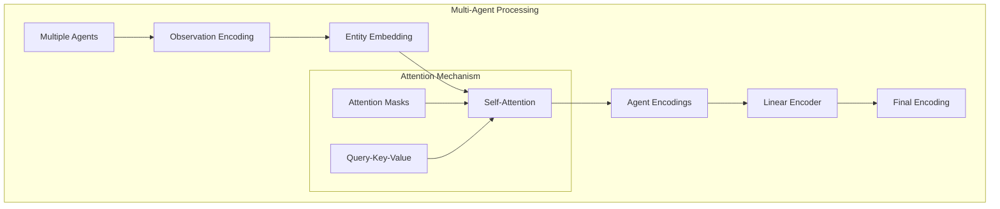
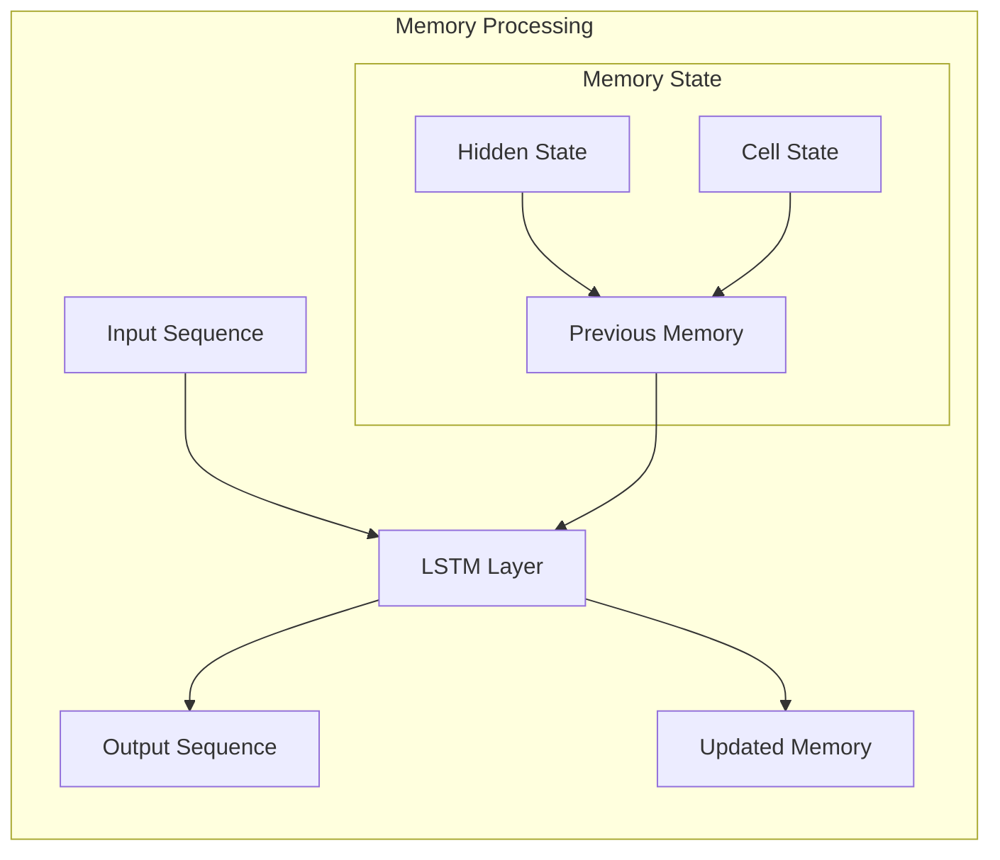
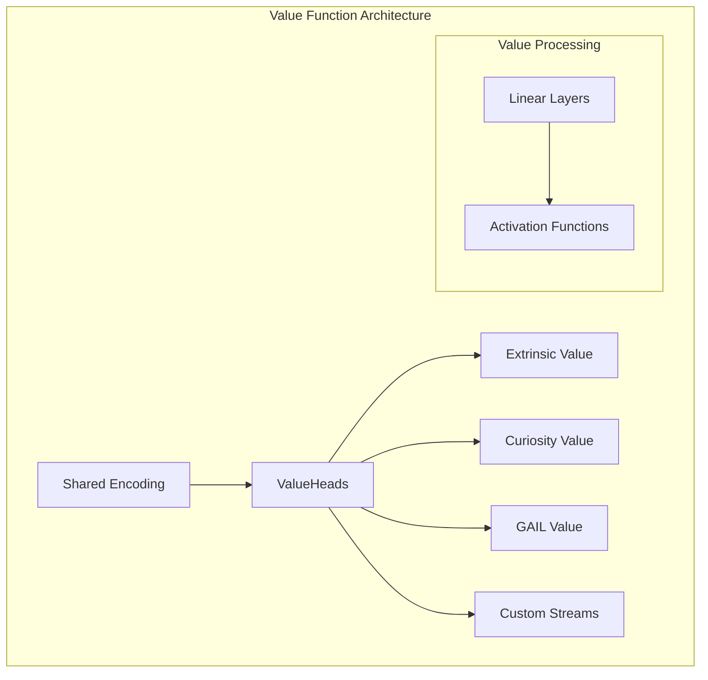
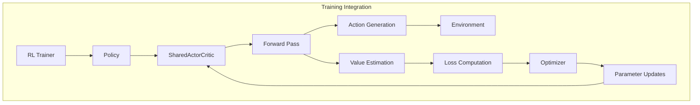
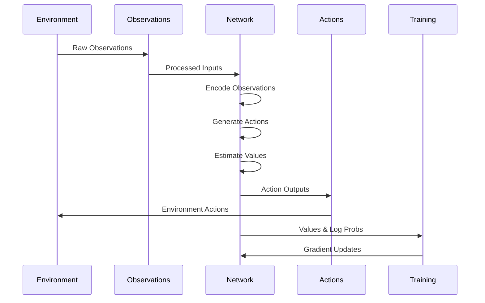

# Network Architecture Module

The network_architecture module is the core neural network infrastructure of the ML-Agents training system, providing the fundamental building blocks for deep reinforcement learning models. This module implements the SharedActorCritic architecture and supporting network components that enable agents to learn from observations and generate actions.

## Overview

The network_architecture module serves as the neural network backbone for ML-Agents training algorithms, implementing actor-critic architectures with support for:

- **Multi-modal observation processing** through flexible encoder systems
- **Hybrid action spaces** supporting both continuous and discrete actions  
- **Memory-augmented networks** with LSTM support for partially observable environments
- **Multi-agent coordination** through attention mechanisms
- **Value function approximation** for reinforcement learning algorithms

This module integrates closely with the [training_algorithms](training_algorithms.md) module to provide the neural network foundations for PPO, SAC, and POCA trainers, while leveraging components from [unity_sensors](unity_sensors.md) for observation processing and [unity_actuators](unity_actuators.md) for action generation.

## Architecture Overview



## Core Components

### SharedActorCritic

The `SharedActorCritic` class is the primary network architecture that combines both actor and critic functionality in a single network with shared parameters.

**Key Features:**
- **Shared Encoding**: Uses a common network body to encode observations for both policy and value estimation
- **Dual Functionality**: Implements both Actor and Critic interfaces for complete RL functionality
- **Memory Support**: Integrates LSTM memory for handling partially observable environments
- **Multi-stream Values**: Supports multiple value streams for different reward signals

**Architecture Flow:**


### ObservationEncoder

The `ObservationEncoder` processes diverse observation types into unified tensor representations.

**Capabilities:**
- **Multi-modal Processing**: Handles vector, visual, and variable-length observations
- **Attention Mechanisms**: Uses Residual Self-Attention (RSA) for variable-length inputs
- **Goal Conditioning**: Special handling for goal-conditioned observations
- **Normalization**: Optional input normalization for stable training

**Processing Pipeline:**


### NetworkBody

The `NetworkBody` serves as the core encoding infrastructure that processes observations and optional actions into feature representations.

**Components:**
- **Observation Encoding**: Integrates ObservationEncoder for multi-modal input processing
- **Conditional Encoding**: Supports goal-conditioned policies through ConditionalEncoder
- **Memory Integration**: Optional LSTM for temporal dependencies
- **Action Conditioning**: Can incorporate previous actions for improved learning

### ActionModel

The `ActionModel` generates actions from network encodings, supporting both continuous and discrete action spaces.

**Action Generation Flow:**


## Multi-Agent Support

### MultiAgentNetworkBody

The `MultiAgentNetworkBody` extends the standard architecture to handle variable numbers of agents through attention mechanisms.

**Key Features:**
- **Variable Agent Count**: Handles dynamic numbers of agents in the environment
- **Self-Attention**: Uses attention mechanisms to process agent interactions
- **Shared Parameters**: All agents share the same network parameters
- **Scalable Architecture**: Efficiently scales to large numbers of agents

**Multi-Agent Processing:**


## Memory and Temporal Processing

### LSTM Integration

The module supports memory-augmented networks through LSTM integration for handling partially observable environments.

**Memory Architecture:**


## Value Function Architecture

### ValueHeads

The `ValueHeads` component implements multiple value function heads for different reward streams.

**Multi-Stream Values:**


## Integration with Training System

### Training Algorithm Integration

The network architecture integrates seamlessly with the training algorithms:



### Data Flow

The complete data flow through the network architecture:



## Configuration and Settings

The network architecture is configured through the [configuration_system](configuration_system.md) module:

- **NetworkSettings**: Defines architecture parameters (hidden units, layers, memory)
- **EncoderType**: Specifies visual encoder types (CNN, ResNet, etc.)
- **ConditioningType**: Controls goal conditioning mechanisms
- **Memory Settings**: Configures LSTM memory parameters

## Performance Considerations

### Optimization Features

- **Parameter Sharing**: Efficient memory usage through shared encoders
- **Attention Mechanisms**: Scalable processing for variable-length inputs
- **Gradient Clipping**: Stable training through action and gradient clipping
- **Normalization**: Input normalization for training stability

### Scalability

- **Multi-Agent Support**: Efficient scaling to hundreds of agents
- **Memory Management**: Optimized memory usage for large networks
- **Batch Processing**: Efficient batch processing for training throughput

## Export and Deployment

The network architecture supports model export for deployment:

- **ONNX Export**: Compatible with Unity's Sentis inference engine
- **Version Management**: Model versioning for compatibility
- **Deterministic Inference**: Support for deterministic action selection

## Dependencies

The network_architecture module depends on several other modules:

- **[unity_sensors](unity_sensors.md)**: For observation processing components
- **[unity_actuators](unity_actuators.md)**: For action space definitions
- **[training_infrastructure](training_infrastructure.md)**: For optimization components
- **[configuration_system](configuration_system.md)**: For network settings

## Usage Examples

### Basic Actor-Critic Setup

```python
# Create SharedActorCritic network
network = SharedActorCritic(
    observation_specs=obs_specs,
    network_settings=network_settings,
    action_spec=action_spec,
    stream_names=["extrinsic"]
)

# Forward pass for training
action, stats, memories = network.get_action_and_stats(
    inputs=observations,
    memories=previous_memories
)

# Value estimation
values, critic_memories = network.critic_pass(
    inputs=observations,
    memories=previous_memories
)
```

### Multi-Agent Configuration

```python
# Multi-agent network body
ma_network = MultiAgentNetworkBody(
    observation_specs=obs_specs,
    network_settings=network_settings,
    action_spec=action_spec
)

# Process multiple agents
encoding, memories = ma_network(
    obs_only=observations_only,
    obs=observations_with_actions,
    actions=agent_actions,
    memories=previous_memories
)
```

This network architecture module provides the foundational neural network infrastructure that enables ML-Agents to learn complex behaviors across diverse environments and agent configurations.