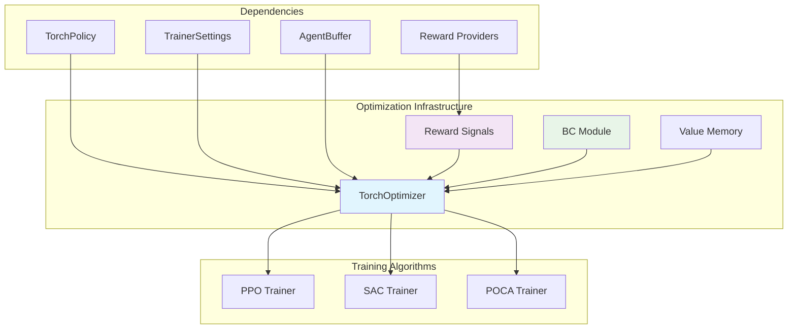
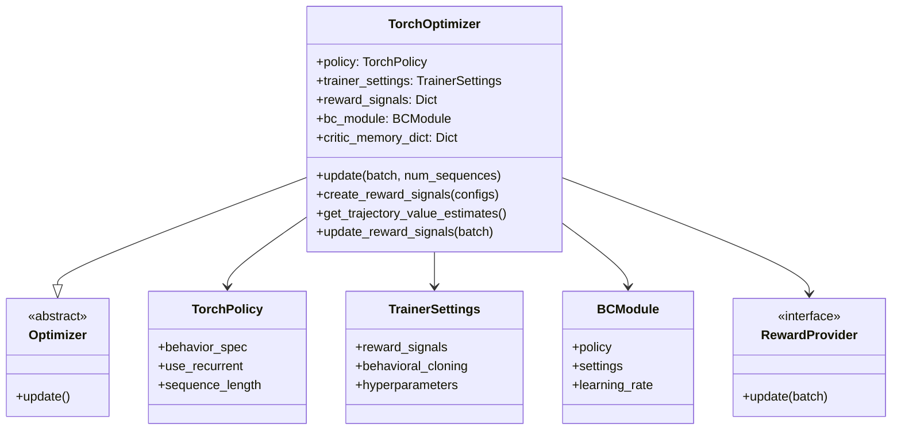
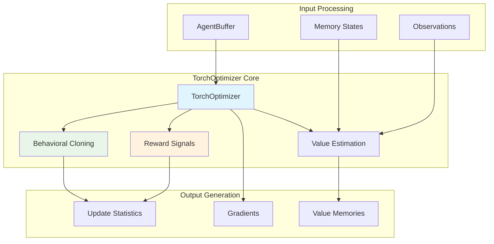
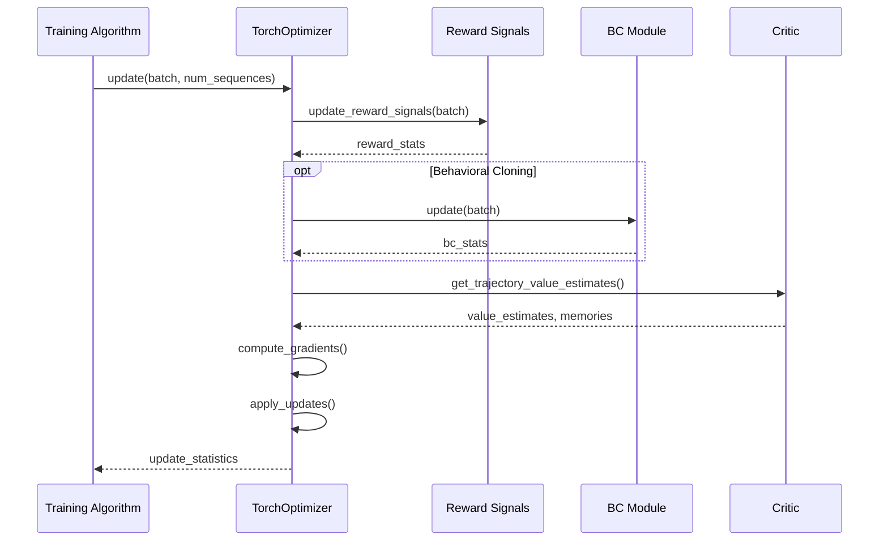

# Optimization Infrastructure Module

The optimization infrastructure module provides the foundational optimization framework for ML-Agents training algorithms. It serves as the bridge between training policies and the underlying PyTorch optimization mechanisms, handling gradient computation, parameter updates, and reward signal processing.

## Core Components

### TorchOptimizer
The `TorchOptimizer` class is the central component that extends the base `Optimizer` interface to provide PyTorch-specific optimization capabilities. It manages the optimization process for neural network policies, handles reward signals, and coordinates with behavioral cloning modules.

## Architecture Overview



## Component Relationships



## Data Flow Architecture



## Key Functionality

### 1. Optimization Management
- **Abstract Base**: Extends the base `Optimizer` class to provide PyTorch-specific implementations
- **Policy Integration**: Manages the relationship with `TorchPolicy` instances
- **Parameter Updates**: Coordinates gradient computation and parameter updates across neural networks

### 2. Reward Signal Processing
- **Multi-Signal Support**: Handles multiple reward signals simultaneously (extrinsic, curiosity, GAIL, etc.)
- **Dynamic Creation**: Creates reward providers based on configuration settings
- **Update Coordination**: Manages reward signal updates and statistics collection

### 3. Memory Management
- **Recurrent Networks**: Handles LSTM memory states for recurrent policies
- **Sequence Processing**: Manages trajectory sequences for proper memory propagation
- **Memory Persistence**: Maintains critic memory states across trajectory evaluations

### 4. Value Estimation
- **Trajectory Processing**: Computes value estimates for complete trajectories
- **Bootstrap Handling**: Manages value bootstrapping for non-terminal trajectories
- **Sequence Evaluation**: Handles sequence-by-sequence evaluation for recurrent networks

## Integration Points

### Training Algorithms Integration
The optimization infrastructure integrates with specific training algorithms:

- **[PPO Algorithm](ppo_algorithm.md)**: Provides optimization foundation for Proximal Policy Optimization
- **[SAC Algorithm](sac_algorithm.md)**: Supports Soft Actor-Critic optimization requirements
- **[POCA Algorithm](poca_algorithm.md)**: Enables multi-agent cooperative optimization

### Policy System Integration
- **[Policy System](policy_system.md)**: Works directly with TorchPolicy instances
- **[Network Architecture](network_architecture.md)**: Optimizes SharedActorCritic networks
- **[Configuration System](configuration_system.md)**: Uses TrainerSettings for optimization parameters

### Reward Systems Integration
- **[Reward Systems](reward_systems.md)**: Manages various reward providers and their updates
- Creates and coordinates multiple reward signals based on configuration

## Process Flow



## Configuration and Settings

### Optimizer Configuration
The optimizer is configured through `TrainerSettings` which includes:
- **Hyperparameters**: Learning rates, batch sizes, optimization parameters
- **Reward Signals**: Configuration for multiple reward signal types
- **Behavioral Cloning**: Optional imitation learning settings
- **Network Settings**: Architecture and memory configuration

### Memory Configuration
For recurrent policies:
- **Sequence Length**: Determines LSTM sequence processing length
- **Memory Size**: Configures the size of recurrent memory states
- **Memory Persistence**: Manages memory state lifecycle across episodes

## Performance Considerations

### Memory Efficiency
- **Gradient Management**: Uses `torch.no_grad()` contexts for inference operations
- **Memory Cleanup**: Properly manages critic memory dictionary to prevent memory leaks
- **Sequence Batching**: Efficiently processes variable-length sequences with padding

### Computational Optimization
- **Batch Processing**: Processes trajectories in batches for efficiency
- **Tensor Operations**: Leverages PyTorch tensor operations for performance
- **Memory Reuse**: Reuses memory states across trajectory evaluations

## Error Handling and Validation

### Input Validation
- **Buffer Validation**: Ensures AgentBuffer contains required fields
- **Sequence Validation**: Validates sequence lengths for recurrent processing
- **Memory Validation**: Checks memory state consistency

### Graceful Degradation
- **Memory Fallback**: Handles missing memory states with zero initialization
- **Reward Signal Fallback**: Continues operation even if individual reward signals fail
- **Sequence Padding**: Properly handles incomplete sequences at trajectory ends

## Dependencies

### Core Dependencies
- **PyTorch**: Fundamental tensor operations and gradient computation
- **NumPy**: Numerical operations and array handling
- **Collections**: Data structure utilities (defaultdict)

### ML-Agents Dependencies
- **[Training Core](training_core.md)**: Base Optimizer class and training infrastructure
- **[Training Infrastructure](training_infrastructure.md)**: Settings and configuration classes
- **[Reward Systems](reward_systems.md)**: Reward provider implementations
- **[Policy System](policy_system.md)**: TorchPolicy integration

### Internal Components
- **Buffer System**: AgentBuffer and AgentBufferField for data management
- **Torch Entities**: Neural network components and utilities
- **Behavioral Cloning**: Optional imitation learning module

## Usage Patterns

### Basic Optimization
```python
# Typical usage in training algorithms
optimizer = TorchOptimizer(policy, trainer_settings)
update_stats = optimizer.update(batch, num_sequences)
```

### Value Estimation
```python
# Get value estimates for trajectory
value_estimates, next_values, memories = optimizer.get_trajectory_value_estimates(
    batch, next_obs, done, agent_id
)
```

### Reward Signal Management
```python
# Update all reward signals
reward_stats = optimizer.update_reward_signals(batch)
```

This optimization infrastructure module serves as the foundation for all ML-Agents training algorithms, providing a unified interface for PyTorch-based optimization while handling the complexities of multi-signal rewards, recurrent networks, and behavioral cloning integration.