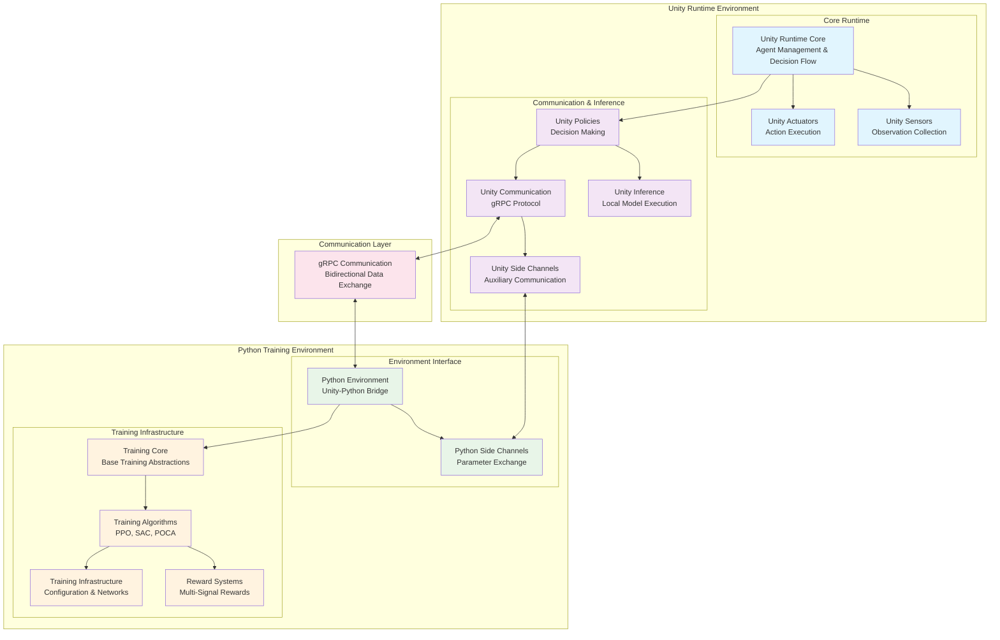
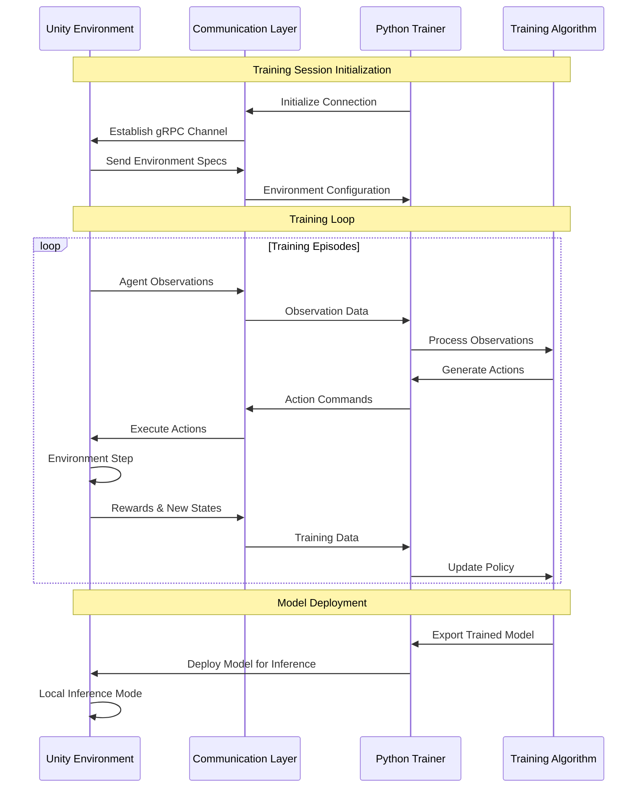
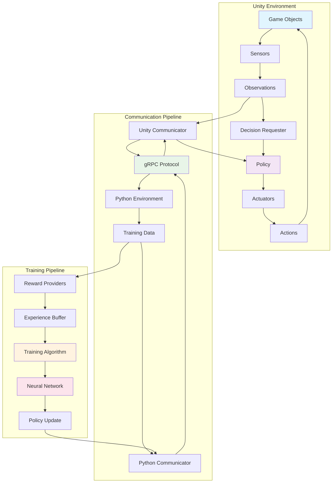

# Unity ML-Agents Repository Overview

## Purpose

The Unity ML-Agents repository is a comprehensive machine learning framework that enables the creation, training, and deployment of intelligent agents within Unity environments. This toolkit bridges the gap between Unity's game engine capabilities and state-of-the-art reinforcement learning algorithms, providing researchers, developers, and educators with a powerful platform for developing AI-driven applications, games, and simulations.

The repository serves multiple purposes:
- **Research Platform**: Enables academic and industrial research in reinforcement learning, multi-agent systems, and AI behavior
- **Game Development Tool**: Provides game developers with intelligent NPC behaviors and adaptive gameplay mechanics
- **Educational Resource**: Offers a hands-on learning environment for understanding machine learning concepts
- **Production Framework**: Supports deployment of trained AI models in commercial Unity applications

## End-to-End Architecture

The Unity ML-Agents framework follows a distributed architecture that separates the Unity runtime environment from the Python-based training infrastructure, connected through a robust communication layer.

### High-Level System Architecture

### Training Workflow Architecture

### Data Flow Architecture

## Core Modules Documentation

The Unity ML-Agents repository is organized into several interconnected modules, each serving specific functions within the overall framework:

### Unity Runtime Modules

#### [Unity Runtime Core](unity_runtime_core.md)
The foundational module providing agent management, decision coordination, and multi-agent support. Contains the core Agent class, DecisionRequester, and SimpleMultiAgentGroup components that form the backbone of the ML-Agents runtime system.

#### [Unity Actuators](unity_actuators.md)
Handles action execution and management, providing the bridge between ML policies and agent behavior. Includes ActionSpec, ActionBuffers, and VectorActuator components for structured action processing.

#### [Unity Sensors](unity_sensors.md)
Manages environmental perception through various sensor types including visual, spatial, and data sensors. Provides CameraSensor, RayPerceptionSensor, VectorSensor, and BufferSensor implementations for comprehensive environment observation.

#### [Unity Communication](unity_communication.md)
Implements the gRPC-based communication protocol between Unity and Python environments. Features RpcCommunicator and protocol buffer integration for reliable, high-performance data exchange.

#### [Unity Policies](unity_policies.md)
Provides decision-making infrastructure with multiple policy implementations including HeuristicPolicy for manual control, RemotePolicy for training, and SentisPolicy for local inference.

#### [Unity Inference](unity_inference.md)
Handles local neural network model execution using Unity's Sentis engine. Includes ModelRunner, TensorGenerator, and TensorApplier for efficient on-device inference.

#### [Unity Side Channels](unity_side_channels.md)
Enables auxiliary communication for engine configuration, environment parameters, and statistics reporting through specialized channels like EngineConfigurationChannel and EnvironmentParametersChannel.

### Python Training Modules

#### [Python Environment](python_environment.md)
Provides the primary interface between Python ML frameworks and Unity environments. Features BaseEnv abstraction, UnityToGymWrapper for OpenAI Gym compatibility, and comprehensive environment management.

#### [Python Side Channels](python_side_channels.md)
Python-side implementation of auxiliary communication channels for dynamic environment control and parameter exchange during training sessions.

#### [Training Core](training_core.md)
Foundational training abstractions including base Trainer classes, environment management, and policy coordination. Provides the framework for implementing various training algorithms.

#### [Training Algorithms](training_algorithms.md)
Implements state-of-the-art reinforcement learning algorithms including PPO (Proximal Policy Optimization), SAC (Soft Actor-Critic), and POCA (Posthumous Credit Assignment) for different learning scenarios.

#### [Training Infrastructure](training_infrastructure.md)
Configuration management, network architectures, and optimization frameworks that support the training pipeline. Includes TrainerSettings, NetworkSettings, and shared neural network components.

#### [Reward Systems](reward_systems.md)
Flexible reward signal generation supporting extrinsic rewards, curiosity-driven exploration, and imitation learning through GAIL. Enables multi-objective learning with configurable reward providers.

## Key Features

- **Multi-Algorithm Support**: PPO, SAC, and POCA algorithms for different learning scenarios
- **Multi-Agent Learning**: Comprehensive support for cooperative and competitive multi-agent environments
- **Flexible Observation Types**: Visual, vector, and spatial observations through various sensor types
- **Cross-Platform Deployment**: Training in Python with deployment to Unity across multiple platforms
- **Real-Time Inference**: Local model execution using Unity's Sentis engine for production deployment
- **Extensible Architecture**: Plugin-based design for custom algorithms, sensors, and reward systems
- **Curriculum Learning**: Progressive difficulty adjustment and parameter scheduling
- **Imitation Learning**: Learn from expert demonstrations using GAIL and behavioral cloning

This comprehensive framework enables the development of sophisticated AI agents that can learn, adapt, and perform complex behaviors within Unity environments, making it an invaluable tool for researchers, developers, and educators working at the intersection of machine learning and interactive applications.