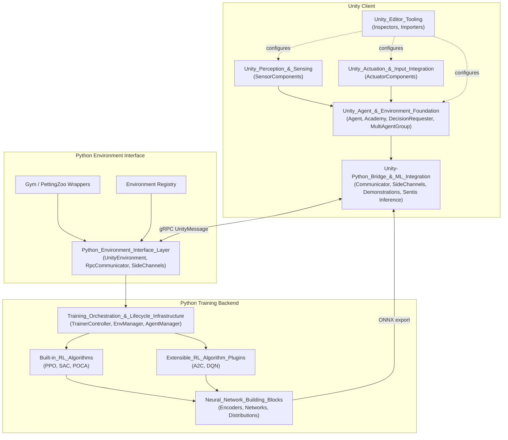
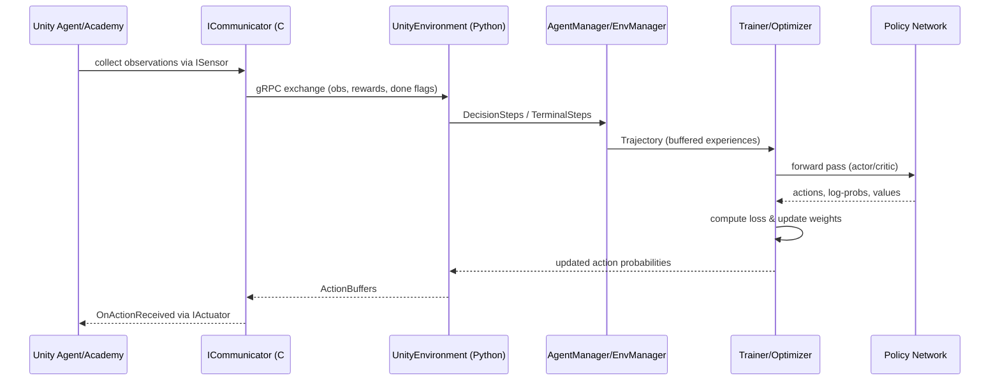
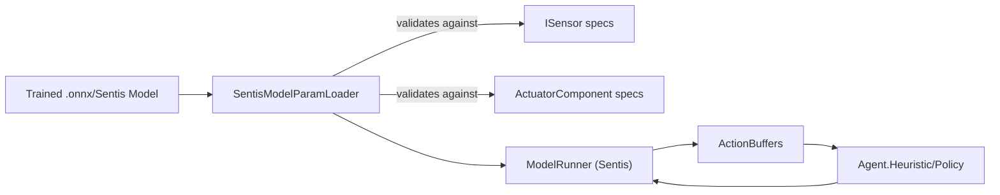

# ML-Agents Repository Overview

## 1. Purpose

The **ML-Agents Toolkit** is an end-to-end platform for training intelligent agents inside Unity-based simulations using reinforcement learning (RL), imitation learning (IL), and self-play. It bridges a Unity game/simulation client with a Python training backend, enabling:

- **Authoring agents in Unity** — attaching sensors (visual, ray-perception, physics, grid, buffer/vector), actuators (continuous/discrete actions, Input System bindings, Match-3 moves), and behavior configuration (`Agent`, `BehaviorParameters`) via Editor tooling.
- **Communicating over gRPC** — exchanging observations/actions/side-channel data between the Unity runtime and a Python process each simulation step.
- **Training with pluggable RL algorithms** — PPO, SAC, and MA-POCA out of the box, plus an extensible plugin mechanism (A2C, DQN examples) built atop a shared PyTorch neural-network library.
- **Running trained models on-device** — validating and executing exported models via Unity Sentis for embedded inference, with no Python dependency at runtime.

The repository is organized as a **Unity package** (`com.unity.ml-agents`) paired with a **Python monorepo** (`ml-agents`, `ml-agents-envs`, `ml-agents-trainer-plugin`), connected by a versioned communication protocol.

## 2. End-to-End Architecture

### 2.1 System-Level Data Flow

```mermaid
graph TB
    subgraph Unity["Unity Client"]
        direction TB
        Editor["Unity_Editor_Tooling<br/>(Inspectors, Importers)"]
        Sensing["Unity_Perception_&_Sensing<br/>(SensorComponents)"]
        Actuation["Unity_Actuation_&_Input_Integration<br/>(ActuatorComponents)"]
        Foundation["Unity_Agent_&_Environment_Foundation<br/>(Agent, Academy, DecisionRequester, MultiAgentGroup)"]
        Bridge["Unity-Python_Bridge_&_ML_Integration<br/>(Communicator, SideChannels, Demonstrations, Sentis Inference)"]
    end

    subgraph PythonEnv["Python Environment Interface"]
        EnvsCore["Python_Environment_Interface_Layer<br/>(UnityEnvironment, RpcCommunicator, SideChannels)"]
        Wrappers["Gym / PettingZoo Wrappers"]
        Registry["Environment Registry"]
    end

    subgraph Training["Python Training Backend"]
        Orchestration["Training_Orchestration_&_Lifecycle_Infrastructure<br/>(TrainerController, EnvManager, AgentManager)"]
        NNBlocks["Neural_Network_Building_Blocks<br/>(Encoders, Networks, Distributions)"]
        Algorithms["Built-in_RL_Algorithms<br/>(PPO, SAC, POCA)"]
        Plugins["Extensible_RL_Algorithm_Plugins<br/>(A2C, DQN)"]
    end

    Editor -.configures.-> Sensing
    Editor -.configures.-> Actuation
    Editor -.configures.-> Foundation
    Sensing --> Foundation
    Actuation --> Foundation
    Foundation --> Bridge
    Bridge <-->|gRPC UnityMessage| EnvsCore
    EnvsCore --> Orchestration
    Wrappers --> EnvsCore
    Registry --> EnvsCore
    Orchestration --> Algorithms
    Orchestration --> Plugins
    Algorithms --> NNBlocks
    Plugins --> NNBlocks
    NNBlocks -->|ONNX export| Bridge
```

### 2.2 Per-Step Training Loop

```mermaid
sequenceDiagram
    participant Agent as Unity Agent/Academy
    participant Comm as ICommunicator (C#)
    participant Env as UnityEnvironment (Python)
    participant Mgr as AgentManager/EnvManager
    participant Trainer as Trainer/Optimizer
    participant Net as Policy Network

    Agent->>Comm: collect observations via ISensor
    Comm->>Env: gRPC exchange (obs, rewards, done flags)
    Env->>Mgr: DecisionSteps / TerminalSteps
    Mgr->>Trainer: Trajectory (buffered experiences)
    Trainer->>Net: forward pass (actor/critic)
    Net-->>Trainer: actions, log-probs, values
    Trainer->>Trainer: compute loss & update weights
    Trainer-->>Env: updated action probabilities
    Env-->>Comm: ActionBuffers
    Comm-->>Agent: OnActionReceived via IActuator
```

### 2.3 Inference-Only Path (No Python)

```mermaid
flowchart LR
    Model["Trained .onnx/Sentis Model"] --> Loader["SentisModelParamLoader"]
    Loader -->|validates against| Sensors["ISensor specs"]
    Loader -->|validates against| Actuators["ActuatorComponent specs"]
    Loader --> Runner["ModelRunner (Sentis)"]
    Agent["Agent.Heuristic/Policy"] --> Runner
    Runner --> Actions["ActionBuffers"]
    Actions --> Agent
```

## 3. Core Modules Documentation

| Module | Layer | Description |
|---|---|---|
| **[Unity_Editor_Tooling](Unity_Editor_Tooling.md)** | Unity (Design-time) | Custom Inspectors/Importers for sensors, actuators, Agent/BehaviorParameters, demonstration assets, and build-pipeline hooks. |
| **[Unity_Perception_&_Sensing](Unity_Perception_&_Sensing.md)** | Unity (Runtime) | Built-in `SensorComponent` catalog (camera, ray-perception, grid, physics, buffer/vector) plus reflection-based `[Observable]` sensors. |
| **[Unity_Actuation_&_Input_Integration](Unity_Actuation_&_Input_Integration.md)** | Unity (Runtime) | Domain-specific actuator/sensor integrations: Unity Input System bridging and Match-3 puzzle game support. |
| **[Unity_Agent_&_Environment_Foundation](Unity_Agent_&_Environment_Foundation.md)** | Unity (Runtime) | Decision cadence control (`DecisionRequester`), multi-agent grouping (`SimpleMultiAgentGroup`), and environment replication (`TrainingAreaReplicator`). |
| **[Unity-Python_Bridge_&_ML_Integration](Unity-Python_Bridge_&_ML_Integration.md)** | Unity ↔ Python Boundary | Communicator protocol, side channels, demonstration recording, analytics, and Sentis model validation. |
| **[Python_Environment_Interface_Layer](Python_Environment_Interface_Layer.md)** | Python | `UnityEnvironment`/`BaseEnv` API, gRPC transport, side channels, Gym/PettingZoo wrappers, and environment registry. |
| **[Training_Orchestration_&_Lifecycle_Infrastructure](Training_Orchestration_&_Lifecycle_Infrastructure.md)** | Python | Configuration, environment management, data pipeline, trainer lifecycle, checkpointing, self-play (ghost) orchestration. |
| **[Neural_Network_Building_Blocks](Neural_Network_Building_Blocks.md)** | Python | Reusable PyTorch modules: encoders, attention, distributions, composite networks, reward providers, ONNX export. |
| **[Built-in_RL_Algorithms](Built-in_RL_Algorithms.md)** | Python | PPO, SAC, and MA-POCA trainer/optimizer implementations shipped with the toolkit. |
| **[Extensible_RL_Algorithm_Plugins](Extensible_RL_Algorithm_Plugins.md)** | Python | Example out-of-tree algorithm plugins (A2C, DQN) demonstrating the `TrainerFactory` extension mechanism. |

## 4. Key Design Themes

- **Separation of Component vs. Runtime object**: Unity `MonoBehaviour` `*Component` classes (Inspector-configurable) lazily construct plain-C# `ISensor`/`IActuator` runtime objects — a pattern repeated across sensing, actuation, and Match-3/Input integrations.
- **Protocol-driven decoupling**: The `ICommunicator`/`RpcCommunicator` gRPC contract and side-channel framework let Unity and Python evolve independently as long as the wire protocol and capability negotiation stay compatible.
- **Algorithm-agnostic core**: `Trainer`/`RLTrainer`/`Optimizer` abstractions in `Training_Orchestration_&_Lifecycle_Infrastructure` and reusable network primitives in `Neural_Network_Building_Blocks` allow PPO/SAC/POCA and third-party plugins (A2C/DQN) to share identical infrastructure.
- **Train-once, infer-anywhere**: Models exported via `ModelSerializer` (ONNX) are validated by `SentisModelParamLoader` and run natively in Unity via Sentis, requiring no Python process at inference time.