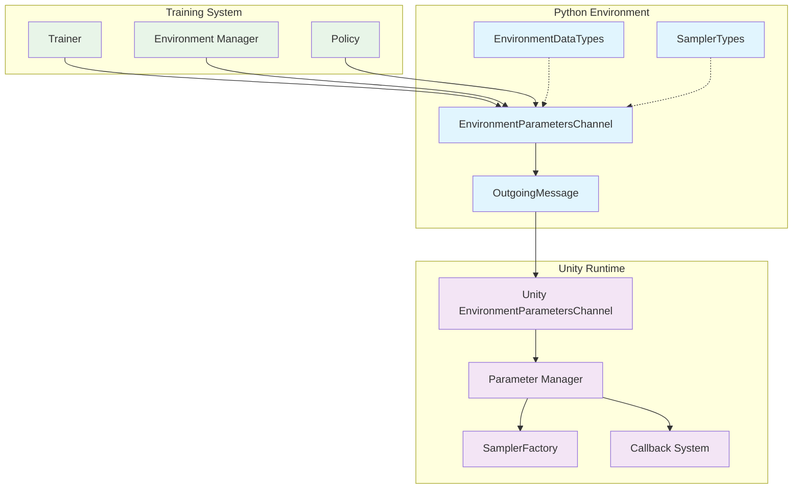
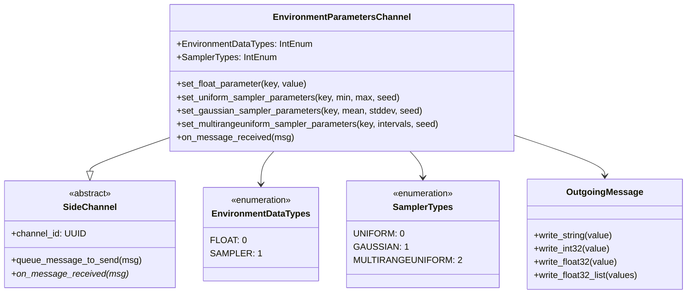
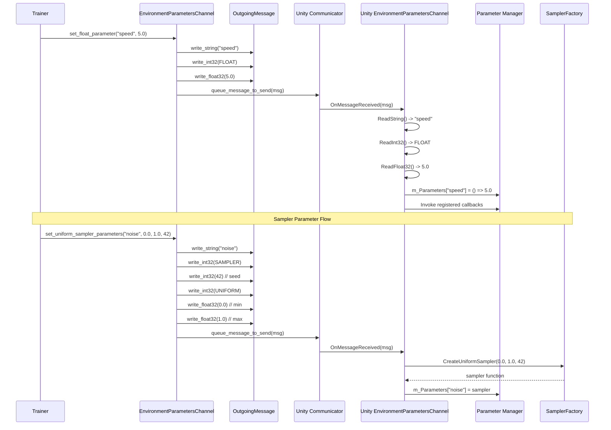
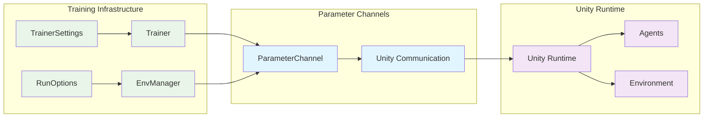

# Parameter Channels Module

The parameter_channels module provides a specialized communication channel for dynamically configuring environment parameters during ML-Agents training and inference. This module enables real-time parameter adjustment without requiring environment restarts, supporting both static values and dynamic sampling distributions.

## Core Components

### EnvironmentDataTypes
An enumeration defining the types of data that can be transmitted through the environment parameters channel:
- `FLOAT (0)`: Static floating-point values
- `SAMPLER (1)`: Dynamic sampling distributions for parameter randomization

## Architecture Overview

The parameter_channels module implements a bidirectional communication system between Python training environments and Unity runtime environments, enabling dynamic parameter configuration during training sessions.



## Component Relationships



## Data Flow Architecture



## Parameter Types and Usage

### Static Float Parameters
Used for fixed configuration values that remain constant during an episode:

```python
# Set a static parameter
env_channel.set_float_parameter("gravity", -9.81)
env_channel.set_float_parameter("max_speed", 10.0)
```

### Uniform Distribution Samplers
Generate random values from a uniform distribution:

```python
# Set uniform sampler for randomized spawn positions
env_channel.set_uniform_sampler_parameters(
    key="spawn_x", 
    min_value=-5.0, 
    max_value=5.0, 
    seed=123
)
```

### Gaussian Distribution Samplers
Generate random values from a normal distribution:

```python
# Set gaussian sampler for noise injection
env_channel.set_gaussian_sampler_parameters(
    key="observation_noise",
    mean=0.0,
    st_dev=0.1,
    seed=456
)
```

### Multi-Range Uniform Samplers
Generate random values from multiple uniform distributions:

```python
# Set multi-range uniform sampler for complex parameter spaces
intervals = [(0.0, 2.0), (5.0, 7.0), (10.0, 12.0)]
env_channel.set_multirangeuniform_sampler_parameters(
    key="difficulty_level",
    intervals=intervals,
    seed=789
)
```

## Integration with Training Systems

The parameter_channels module integrates seamlessly with various ML-Agents training components:

### Training Core Integration
- **Trainers**: Use parameter channels to adjust learning rates, exploration parameters, and environment difficulty
- **Environment Managers**: Configure multi-environment parameters for curriculum learning
- **Policies**: Adjust policy-specific parameters during training

### Communication Flow


## Unity Runtime Integration

The Unity side of the parameter channel system provides:

### Parameter Management
- **Dynamic Parameter Storage**: Maintains a dictionary of parameter keys and their value generators
- **Callback System**: Allows Unity components to register for parameter change notifications
- **Sampler Integration**: Creates and manages various sampling distributions

### Usage in Unity
```csharp
// Get parameter with default value
float speed = Academy.Instance.EnvironmentParameters.GetWithDefault("speed", 1.0f);

// Register callback for parameter changes
Academy.Instance.EnvironmentParameters.RegisterCallback("difficulty", OnDifficultyChanged);

// List all available parameters
var parameterKeys = Academy.Instance.EnvironmentParameters.ListParameters();
```

## Error Handling and Validation

The parameter_channels module implements robust error handling:

### Communication Errors
- **Unidirectional Communication**: Python-to-Unity only; incoming messages trigger exceptions
- **Type Validation**: Ensures proper data type handling for parameters and samplers
- **Message Format Validation**: Validates message structure and content

### Best Practices
1. **Parameter Naming**: Use descriptive, consistent parameter names
2. **Seed Management**: Use different seeds for different samplers to ensure independence
3. **Range Validation**: Ensure parameter ranges are appropriate for the environment
4. **Performance Considerations**: Minimize parameter updates during training for optimal performance

## Dependencies

The parameter_channels module depends on several core ML-Agents components:

- **[unity_side_channels](unity_side_channels.md)**: Base side channel infrastructure and message handling
- **[unity_communication](unity_communication.md)**: Communication protocol between Python and Unity
- **[python_environment](python_environment.md)**: Python environment management and coordination

## Use Cases

### Curriculum Learning
Gradually increase environment difficulty by adjusting parameters:
```python
# Increase obstacle density over time
current_density = 0.1 + (episode / max_episodes) * 0.4
env_channel.set_float_parameter("obstacle_density", current_density)
```

### Domain Randomization
Randomize environment parameters to improve policy robustness:
```python
# Randomize physics parameters
env_channel.set_uniform_sampler_parameters("friction", 0.1, 0.9, seed)
env_channel.set_gaussian_sampler_parameters("mass", 1.0, 0.2, seed)
```

### A/B Testing
Compare different parameter configurations:
```python
# Test different reward scaling factors
if experiment_group == "A":
    env_channel.set_float_parameter("reward_scale", 1.0)
else:
    env_channel.set_float_parameter("reward_scale", 2.0)
```

## Performance Considerations

- **Message Batching**: Parameter updates are queued and sent in batches to minimize communication overhead
- **Sampling Efficiency**: Unity-side samplers are optimized for real-time performance
- **Memory Management**: Parameter dictionaries are efficiently managed to prevent memory leaks
- **Thread Safety**: Parameter access is thread-safe for multi-threaded Unity environments

The parameter_channels module provides a powerful and flexible system for dynamic environment configuration, enabling sophisticated training scenarios and robust policy development in ML-Agents environments.