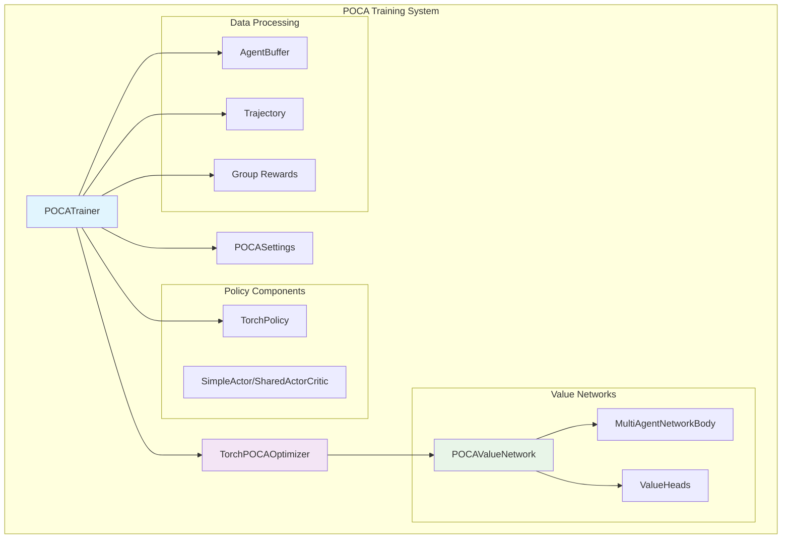
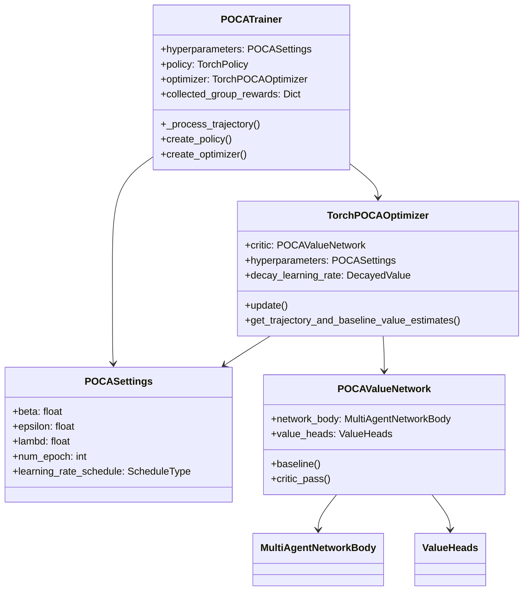
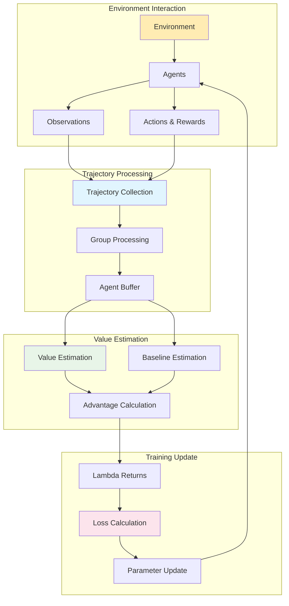
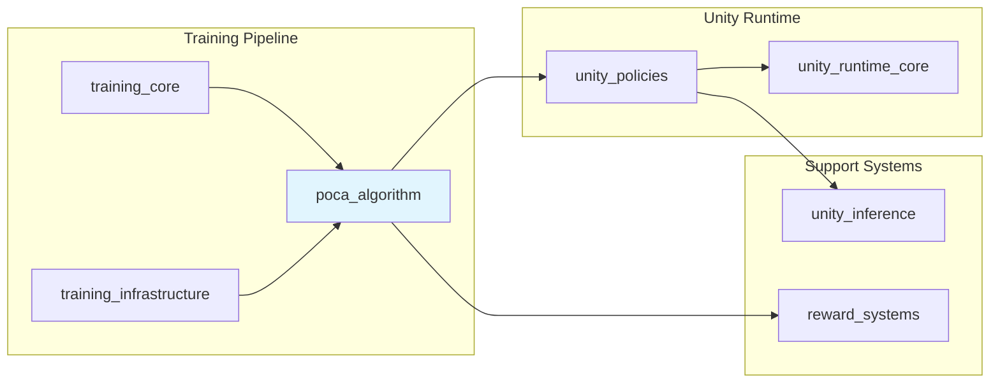

# POCA Algorithm Module

## Overview

The POCA (Partially Observable Cooperative Agents) algorithm module implements the MA-POCA (Multi-Agent POCA) training algorithm for Unity ML-Agents. This module provides a specialized on-policy reinforcement learning approach designed for multi-agent cooperative environments where agents have partial observability and need to learn coordinated behaviors.

POCA extends traditional actor-critic methods by incorporating group rewards and baseline estimation that accounts for the actions of other agents in the group. This enables agents to learn both individual and cooperative behaviors effectively in partially observable multi-agent settings.

## Core Components

### POCATrainer
- **Purpose**: Main trainer class implementing the MA-POCA algorithm
- **Type**: On-policy trainer extending `OnPolicyTrainer`
- **Key Features**:
  - Group reward collection and processing
  - Trajectory processing with baseline and value estimation
  - Integration with PyTorch-based policy and optimizer

### POCASettings
- **Purpose**: Configuration class for POCA hyperparameters
- **Type**: Settings class extending `OnPolicyHyperparamSettings`
- **Key Parameters**:
  - `beta`: Entropy regularization coefficient (default: 5.0e-3)
  - `epsilon`: PPO clipping parameter (default: 0.2)
  - `lambd`: GAE lambda parameter (default: 0.95)
  - `num_epoch`: Number of training epochs per update (default: 3)

### TorchPOCAOptimizer
- **Purpose**: PyTorch-based optimizer implementing POCA-specific loss functions
- **Key Features**:
  - Centralized value function with decentralized baseline
  - Multi-agent network body for variable group sizes
  - Trust region policy and value updates

## Architecture



## Component Relationships



## Data Flow



## Integration with ML-Agents System

### Dependencies

The POCA algorithm module integrates with several other ML-Agents modules:

- **[training_core](training_core.md)**: Inherits from `OnPolicyTrainer` base class
- **[training_infrastructure](training_infrastructure.md)**: Uses `TrainerSettings`, `NetworkSettings`, and `TorchOptimizer`
- **[unity_policies](unity_policies.md)**: Creates and manages `TorchPolicy` instances
- **[reward_systems](reward_systems.md)**: Integrates with reward signal providers, especially `ExtrinsicRewardProvider`

### System Integration



## Key Features

### Multi-Agent Coordination
- **Group Reward Processing**: Collects and processes rewards at both individual and group levels
- **Variable Group Sizes**: Supports dynamic group compositions through `MultiAgentNetworkBody`
- **Cooperative Learning**: Agents learn to optimize both individual and collective performance

### Value Function Architecture
- **Centralized Critic**: Uses observations from all group members for value estimation
- **Decentralized Baseline**: Marginalizes individual agent actions for baseline computation
- **Dual Memory Systems**: Separate memory tracking for value and baseline networks

### Training Optimization
- **Trust Region Updates**: Implements PPO-style clipping for stable policy updates
- **Advantage Estimation**: Uses Generalized Advantage Estimation (GAE) with configurable lambda
- **Entropy Regularization**: Maintains exploration through entropy bonuses

## Configuration

### Hyperparameters

```python
@attr.s(auto_attribs=True)
class POCASettings(OnPolicyHyperparamSettings):
    beta: float = 5.0e-3              # Entropy coefficient
    epsilon: float = 0.2              # PPO clipping parameter
    lambd: float = 0.95               # GAE lambda
    num_epoch: int = 3                # Training epochs per update
    learning_rate_schedule: ScheduleType = ScheduleType.LINEAR
    beta_schedule: ScheduleType = ScheduleType.LINEAR
    epsilon_schedule: ScheduleType = ScheduleType.LINEAR
```

### Training Process

1. **Trajectory Collection**: Gather experiences from multiple agents in cooperative groups
2. **Group Processing**: Aggregate individual and group rewards
3. **Value Estimation**: Compute centralized values and decentralized baselines
4. **Advantage Calculation**: Use GAE to compute advantages for policy updates
5. **Loss Computation**: Calculate policy, value, and baseline losses
6. **Parameter Updates**: Apply trust region updates with entropy regularization

## Usage Considerations

### Suitable Scenarios
- Multi-agent cooperative tasks
- Partially observable environments
- Tasks requiring coordination between agents
- Scenarios with both individual and group objectives

### Limitations
- **Reward Signal Compatibility**: Limited support for curiosity and GAIL reward signals
- **Computational Overhead**: Higher computational cost due to multi-agent value networks
- **Memory Requirements**: Requires separate memory tracking for baseline and value networks

### Best Practices
- Configure appropriate group sizes for your environment
- Balance individual and group reward weights
- Monitor both individual and group performance metrics
- Use appropriate network architectures for your observation spaces

## Performance Monitoring

The POCA trainer provides several key metrics:

- **Policy Loss**: Measures policy gradient updates
- **Value Loss**: Tracks centralized value function accuracy
- **Baseline Loss**: Monitors decentralized baseline estimation
- **Group Cumulative Reward**: Aggregated group performance
- **Learning Rate/Epsilon/Beta**: Tracks hyperparameter decay schedules

## Related Documentation

- [training_core](training_core.md) - Base trainer functionality
- [training_infrastructure](training_infrastructure.md) - Training system infrastructure
- [unity_policies](unity_policies.md) - Policy management system
- [reward_systems](reward_systems.md) - Reward signal processing
- [ppo_algorithm](ppo_algorithm.md) - Related single-agent algorithm
- [sac_algorithm](sac_algorithm.md) - Alternative training algorithm