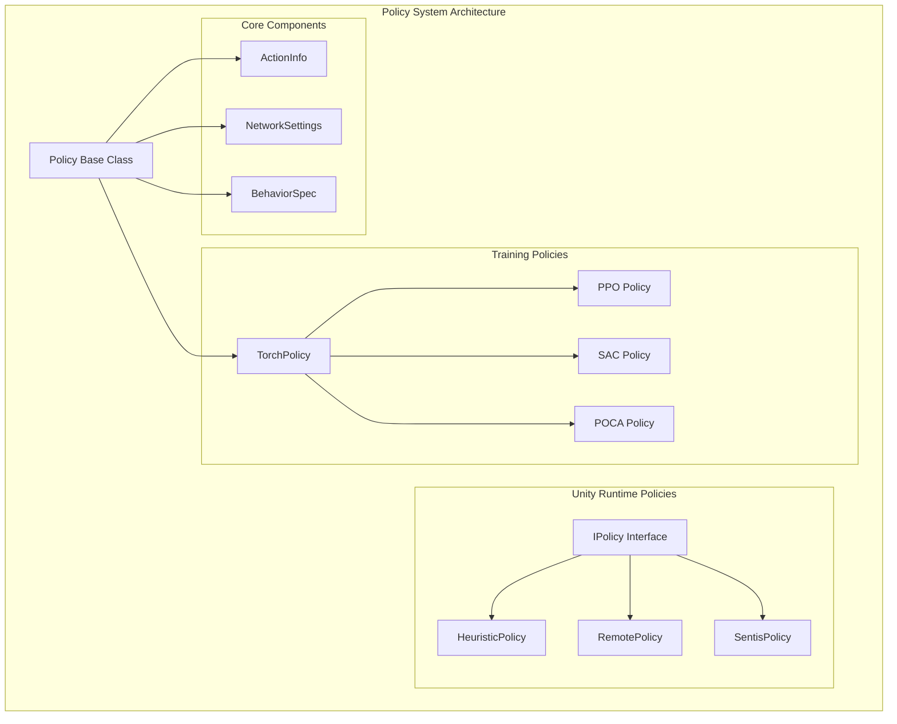
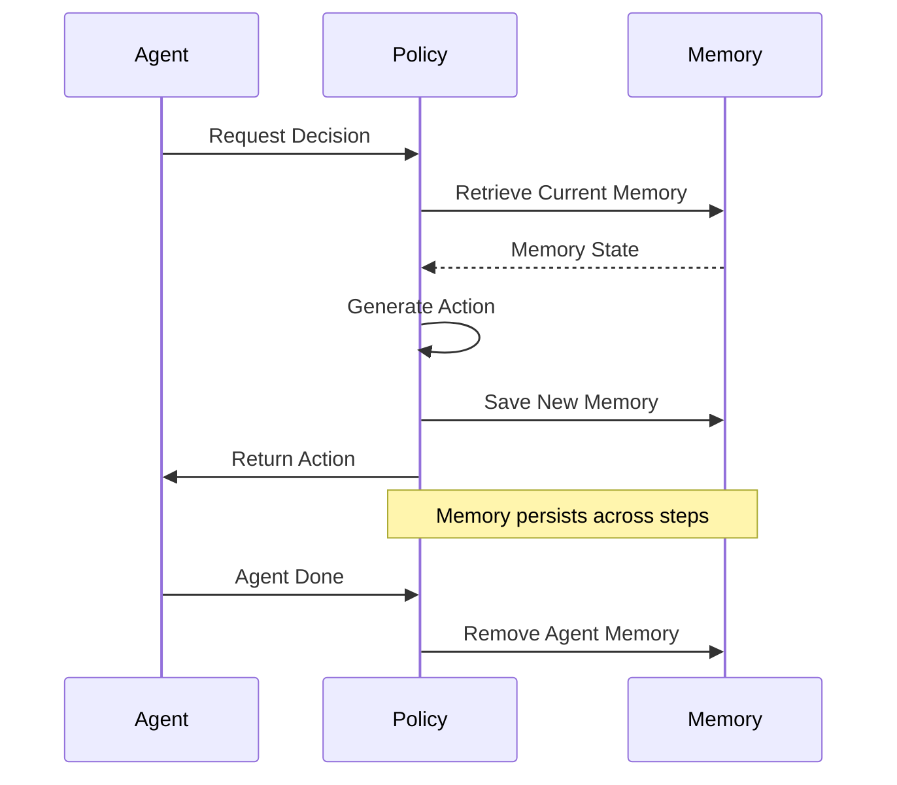
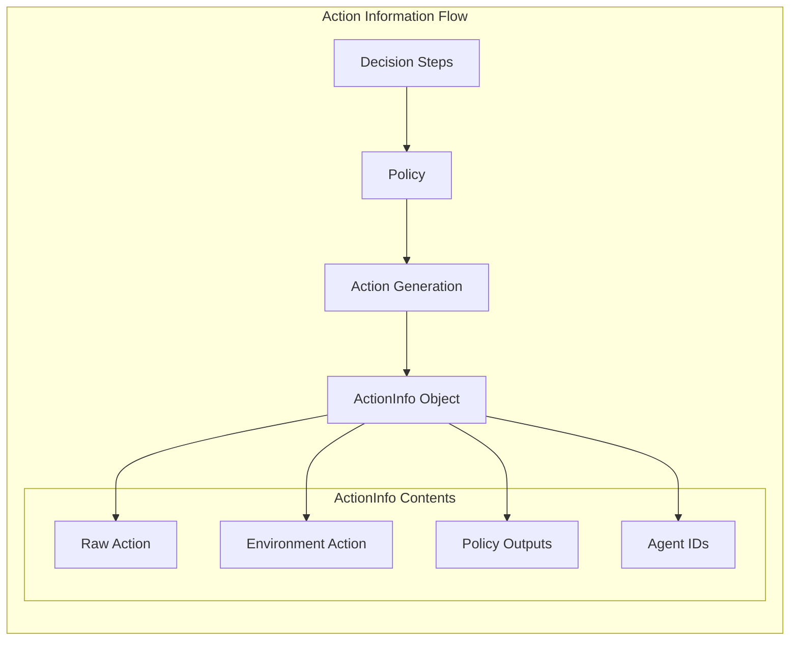
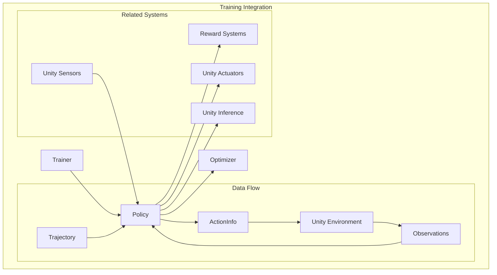

# Policy System Module

The policy_system module is the core decision-making component of the ML-Agents training framework, responsible for managing agent behavior policies and their interactions with the training environment. This module provides the foundational abstractions for all policy implementations, from simple heuristic policies to complex neural network-based policies used in reinforcement learning algorithms.

## Architecture Overview

The policy system operates as a bridge between the training algorithms and the Unity environment, managing agent state, memory, and action generation. It provides a unified interface for different policy types while handling the complexities of multi-agent scenarios, recurrent networks, and action space management.



## Core Components

### Policy Base Class

The `Policy` class serves as the abstract foundation for all policy implementations in the training system. It manages:

- **Agent State Management**: Tracking memory states for recurrent networks
- **Action History**: Maintaining previous actions for temporal dependencies
- **Network Configuration**: Handling neural network settings and normalization
- **Multi-Agent Coordination**: Managing agent IDs and batch processing

#### Key Responsibilities

1. **Memory Management**: For RNN-based policies, maintains current and previous memory states
2. **Action Tracking**: Stores previous actions for policies requiring action history
3. **Agent Lifecycle**: Handles agent creation, removal, and state cleanup
4. **Action Validation**: Ensures generated actions are valid (NaN checking)

### Memory Management System

The policy system implements sophisticated memory management for recurrent neural networks:



### Action Information Flow

The policy system uses `ActionInfo` objects to encapsulate all decision-related data:



## Policy Types and Implementations

### Training Policies

Training policies are implemented through the abstract `Policy` class and are used during the learning process:

#### PPO Policy
- **Algorithm**: Proximal Policy Optimization
- **Type**: On-policy
- **Features**: Shared critic option, GAE advantage estimation
- **Use Case**: General-purpose continuous and discrete control

#### SAC Policy
- **Algorithm**: Soft Actor-Critic
- **Type**: Off-policy
- **Features**: Entropy regularization, continuous action spaces
- **Use Case**: Continuous control with exploration emphasis

#### POCA Policy
- **Algorithm**: Multi-Agent Proximal Policy Optimization Centralized Critic
- **Type**: On-policy multi-agent
- **Features**: Centralized critic, group rewards
- **Use Case**: Cooperative multi-agent scenarios

### Unity Runtime Policies

Unity runtime policies implement the `IPolicy` interface for inference and execution:

#### HeuristicPolicy
- **Purpose**: Manual control and debugging
- **Implementation**: Calls actuator heuristic methods
- **Use Case**: Human control, testing, baseline comparison

#### RemotePolicy
- **Purpose**: Communication with Python training process
- **Implementation**: gRPC-based communication
- **Use Case**: Training mode, remote inference

#### SentisPolicy
- **Purpose**: Local neural network inference
- **Implementation**: Unity Sentis backend
- **Use Case**: Deployed models, standalone inference

## Integration with Training System

The policy system integrates deeply with the broader ML-Agents training infrastructure:



## Memory and State Management

### Recurrent Network Support

The policy system provides comprehensive support for recurrent neural networks:

```python
# Memory initialization
def make_empty_memory(self, num_agents):
    return np.zeros((num_agents, self.m_size), dtype=np.float32)

# Memory persistence across steps
def save_memories(self, agent_ids, memory_matrix):
    # Store current memories as previous
    # Update current memories with new values

# Memory retrieval for inference
def retrieve_memories(self, agent_ids):
    # Return current memory states for agents
```

### Agent Lifecycle Management

The policy handles agent creation, updates, and cleanup:

1. **Agent Registration**: New agents get initialized memory and action states
2. **State Updates**: Memory and action history updated each step
3. **Agent Removal**: Cleanup of agent-specific data when agents are done

## Configuration and Settings

### Network Settings

The policy system uses `NetworkSettings` to configure neural network behavior:

- **Hidden Units**: Number of neurons in hidden layers
- **Number of Layers**: Depth of the neural network
- **Normalization**: Input normalization settings
- **Memory Configuration**: RNN memory size and sequence length
- **Visual Encoding**: Settings for visual observation processing

### Behavior Specification

Policies are configured based on `BehaviorSpec` which defines:

- **Observation Spaces**: Sensor configurations and shapes
- **Action Spaces**: Continuous and discrete action specifications
- **Agent Capabilities**: What the agent can perceive and do

## Error Handling and Validation

The policy system includes robust error handling:

```python
@staticmethod
def check_nan_action(action):
    """Validates actions for NaN values"""
    if action is not None:
        d = np.sum(action.continuous)
        has_nan = np.isnan(d)
        if has_nan:
            raise RuntimeError("Continuous NaN action detected.")
```

## Performance Considerations

### Batch Processing

The policy system is designed for efficient batch processing:

- **Vectorized Operations**: All computations handle multiple agents simultaneously
- **Memory Efficiency**: Reuses memory buffers where possible
- **GPU Compatibility**: Designed to work with PyTorch GPU operations

### Memory Management

- **Lazy Initialization**: Memory allocated only when needed
- **Automatic Cleanup**: Agent data removed when agents complete episodes
- **Efficient Storage**: Uses NumPy arrays for optimal memory layout

## Dependencies and Relationships

The policy_system module has key relationships with:

- **[trainer_abstractions](trainer_abstractions.md)**: Provides the training context and optimization
- **[unity_actuators](unity_actuators.md)**: Receives actions for execution in Unity
- **[unity_sensors](unity_sensors.md)**: Processes observations for decision making
- **[unity_inference](unity_inference.md)**: Handles neural network inference
- **[training_algorithms](training_algorithms.md)**: Implements specific RL algorithms
- **[reward_systems](reward_systems.md)**: Integrates reward signals for learning

## Usage Patterns

### Basic Policy Implementation

```python
class CustomPolicy(Policy):
    def __init__(self, seed, behavior_spec, network_settings):
        super().__init__(seed, behavior_spec, network_settings)
        # Initialize custom components
    
    def get_action(self, decision_requests, worker_id=0):
        # Implement action generation logic
        return ActionInfo(...)
    
    def increment_step(self, n_steps):
        # Update internal step counter
        pass
```

### Memory-Enabled Policy

```python
# For RNN-based policies
if self.use_recurrent:
    # Retrieve previous memories
    memories = self.retrieve_memories(agent_ids)
    
    # Process with RNN
    new_memories = self.forward_with_memory(observations, memories)
    
    # Save updated memories
    self.save_memories(agent_ids, new_memories)
```

## Future Considerations

The policy system is designed to be extensible for:

- **New Algorithm Integration**: Easy addition of new RL algorithms
- **Advanced Memory Models**: Support for more complex memory architectures
- **Multi-Modal Policies**: Handling diverse observation and action types
- **Distributed Training**: Support for distributed policy execution

This modular design ensures the policy system can evolve with advancing ML-Agents capabilities while maintaining backward compatibility and performance.