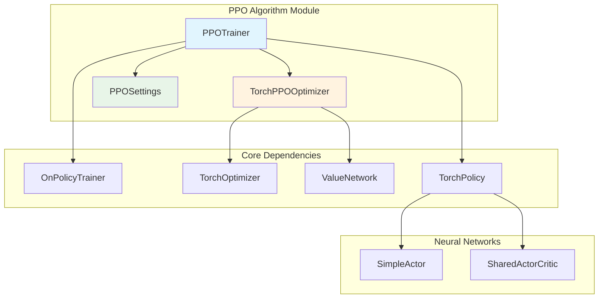
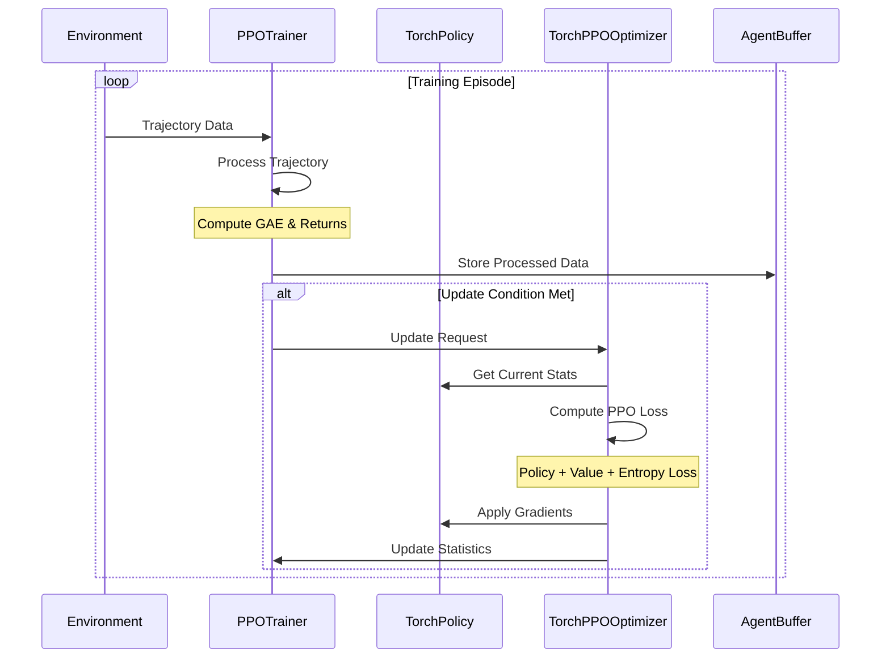
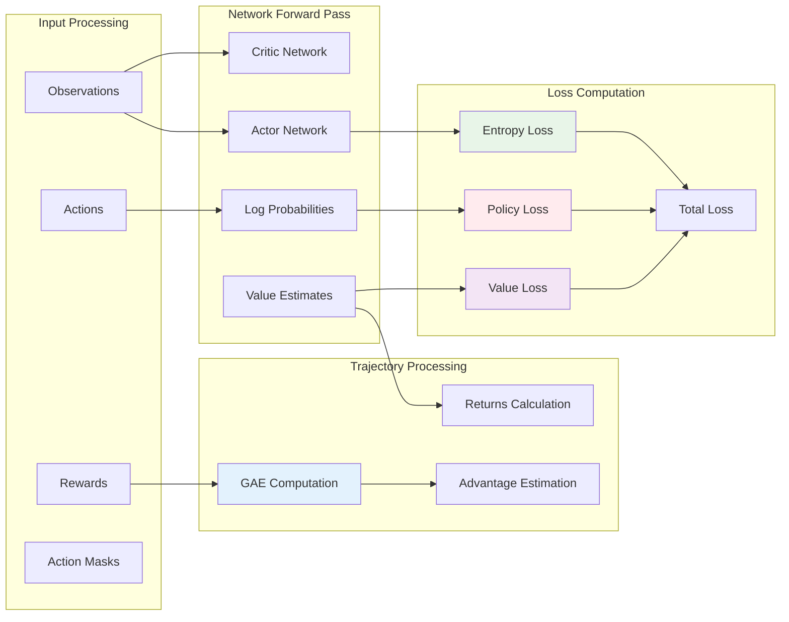
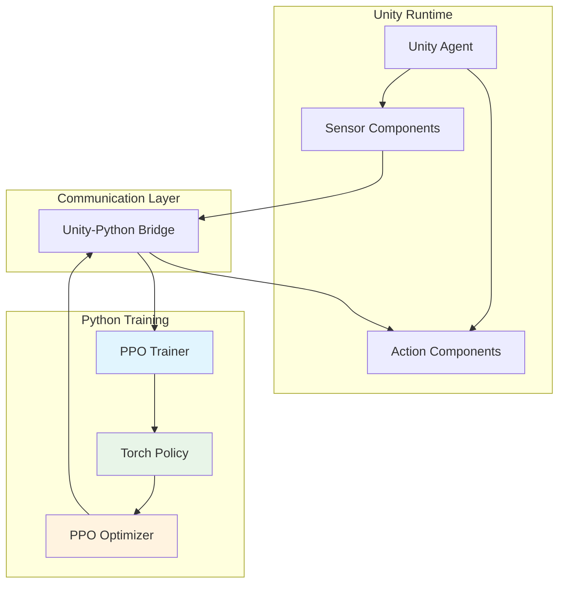

# PPO Algorithm Module

## Overview

The PPO (Proximal Policy Optimization) algorithm module implements one of the most popular and effective reinforcement learning algorithms for training agents in Unity ML-Agents. PPO is an on-policy algorithm that strikes a balance between sample efficiency and implementation simplicity, making it suitable for a wide range of continuous and discrete control tasks.

This module provides a complete implementation of the PPO algorithm as described in the original paper "Proximal Policy Optimization Algorithms" (Schulman et al., 2017), featuring policy gradient optimization with clipped surrogate objectives and value function learning.

## Architecture Overview



## Core Components

### PPOTrainer

The `PPOTrainer` class is the main orchestrator of the PPO training process, inheriting from `OnPolicyTrainer` to leverage common on-policy training functionality.

**Key Responsibilities:**
- **Experience Collection**: Manages the collection and processing of agent trajectories
- **Policy Creation**: Instantiates appropriate neural network architectures (SimpleActor or SharedActorCritic)
- **Trajectory Processing**: Computes advantages and returns using Generalized Advantage Estimation (GAE)
- **Training Coordination**: Coordinates between policy updates and value function learning

**Configuration Options:**
- Support for shared critic architecture for multi-reward scenarios
- Configurable network architectures and hyperparameters
- Integration with reward signal systems

### PPOSettings

The `PPOSettings` class defines the hyperparameters specific to the PPO algorithm, extending the base on-policy hyperparameter settings.

**Key Parameters:**
- `beta` (5.0e-3): Entropy regularization coefficient
- `epsilon` (0.2): Clipping parameter for policy updates
- `lambd` (0.95): GAE lambda parameter for advantage estimation
- `num_epoch` (3): Number of optimization epochs per update
- `shared_critic` (False): Whether to use shared actor-critic architecture

**Scheduling Support:**
- Learning rate scheduling with configurable decay patterns
- Epsilon scheduling for adaptive clipping
- Beta scheduling for entropy regularization adjustment

### TorchPPOOptimizer

The `TorchPPOOptimizer` implements the core PPO optimization logic using PyTorch, handling the mathematical computations for policy and value updates.

**Optimization Features:**
- **Clipped Policy Loss**: Implements the PPO clipped surrogate objective
- **Value Function Loss**: Trust region value loss with clipping
- **Entropy Regularization**: Encourages exploration through entropy bonuses
- **Adaptive Learning**: Dynamic parameter scheduling during training

## Training Process Flow



## Data Flow Architecture



## Integration with ML-Agents Ecosystem

### Training Infrastructure Integration

The PPO algorithm integrates seamlessly with the broader ML-Agents training infrastructure:

- **Trainer System**: Inherits from base trainer classes in [training_core](training_core.md)
- **Policy Framework**: Utilizes PyTorch policies from [training_infrastructure](training_infrastructure.md)
- **Reward Systems**: Compatible with all reward providers in [reward_systems](reward_systems.md)
- **Environment Management**: Works with environment managers from [training_core](training_core.md)

### Unity Runtime Integration



## Algorithm Implementation Details

### Generalized Advantage Estimation (GAE)

The PPO implementation uses GAE for computing advantage estimates, which helps reduce variance in policy gradient estimates:

```
A_t = δ_t + (γλ)δ_{t+1} + (γλ)²δ_{t+2} + ...
where δ_t = r_t + γV(s_{t+1}) - V(s_t)
```

### Clipped Surrogate Objective

The core PPO loss function implements the clipped surrogate objective:

```
L^CLIP(θ) = E_t[min(r_t(θ)A_t, clip(r_t(θ), 1-ε, 1+ε)A_t)]
where r_t(θ) = π_θ(a_t|s_t) / π_{θ_old}(a_t|s_t)
```

### Value Function Learning

The value function is trained using a clipped loss similar to the policy:

```
L^VF(θ) = E_t[max((V_θ(s_t) - V_target)², clip(V_θ(s_t), V_old - ε, V_old + ε) - V_target)²)]
```

## Configuration and Hyperparameters

### Key Hyperparameters

| Parameter | Default | Description | Impact |
|-----------|---------|-------------|---------|
| `learning_rate` | 3e-4 | Base learning rate | Training speed and stability |
| `epsilon` | 0.2 | Clipping parameter | Policy update magnitude |
| `beta` | 5e-3 | Entropy coefficient | Exploration vs exploitation |
| `lambd` | 0.95 | GAE lambda | Bias-variance tradeoff |
| `num_epoch` | 3 | Epochs per update | Sample efficiency |
| `batch_size` | 1024 | Mini-batch size | Training stability |

### Scheduling Options

The PPO implementation supports various scheduling strategies:

- **Linear Decay**: Gradual parameter reduction over training
- **Constant**: Fixed parameters throughout training
- **Custom Schedules**: Configurable decay patterns

## Performance Characteristics

### Computational Complexity

- **Memory Usage**: O(batch_size × sequence_length × observation_size)
- **Training Time**: Linear with batch size and number of epochs
- **Inference Speed**: Fast forward passes suitable for real-time applications

### Scalability Features

- **Multi-Agent Support**: Efficient handling of multiple agents
- **Parallel Environments**: Compatible with vectorized environments
- **GPU Acceleration**: Full PyTorch GPU support for large-scale training

## Best Practices and Usage Guidelines

### When to Use PPO

PPO is recommended for:
- **Continuous Control**: Robotics and physics-based simulations
- **Discrete Actions**: Game AI and decision-making tasks
- **Mixed Action Spaces**: Environments with both continuous and discrete actions
- **Stable Training**: When sample efficiency and training stability are priorities

### Configuration Recommendations

1. **Start with Default Settings**: The default hyperparameters work well for most scenarios
2. **Adjust Learning Rate**: Reduce for unstable training, increase for faster convergence
3. **Tune Epsilon**: Lower values for more conservative updates, higher for aggressive learning
4. **Monitor Entropy**: Ensure adequate exploration throughout training

### Common Issues and Solutions

| Issue | Symptoms | Solution |
|-------|----------|----------|
| Training Instability | High loss variance | Reduce learning rate, increase batch size |
| Poor Exploration | Low entropy values | Increase beta coefficient |
| Slow Convergence | Plateau in rewards | Increase learning rate, adjust epsilon |
| Overfitting | Training/validation gap | Add regularization, reduce model complexity |

## Related Modules

- **[training_core](training_core.md)**: Base trainer infrastructure and environment management
- **[training_infrastructure](training_infrastructure.md)**: Network architectures and optimization utilities
- **[reward_systems](reward_systems.md)**: Reward signal providers and intrinsic motivation
- **[sac_algorithm](sac_algorithm.md)**: Alternative off-policy algorithm for comparison
- **[poca_algorithm](poca_algorithm.md)**: Multi-agent cooperative learning algorithm

## References and Further Reading

1. Schulman, J., et al. "Proximal Policy Optimization Algorithms." arXiv preprint arXiv:1707.06347 (2017)
2. Schulman, J., et al. "High-Dimensional Continuous Control Using Generalized Advantage Estimation." ICLR (2016)
3. Unity ML-Agents Toolkit Documentation: [PPO Training Configuration](https://github.com/Unity-Technologies/ml-agents/blob/main/docs/Training-Configuration-File.md#ppo)