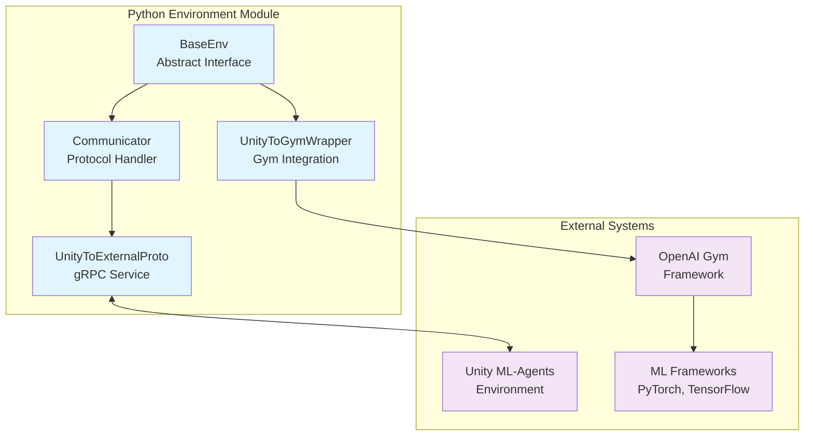
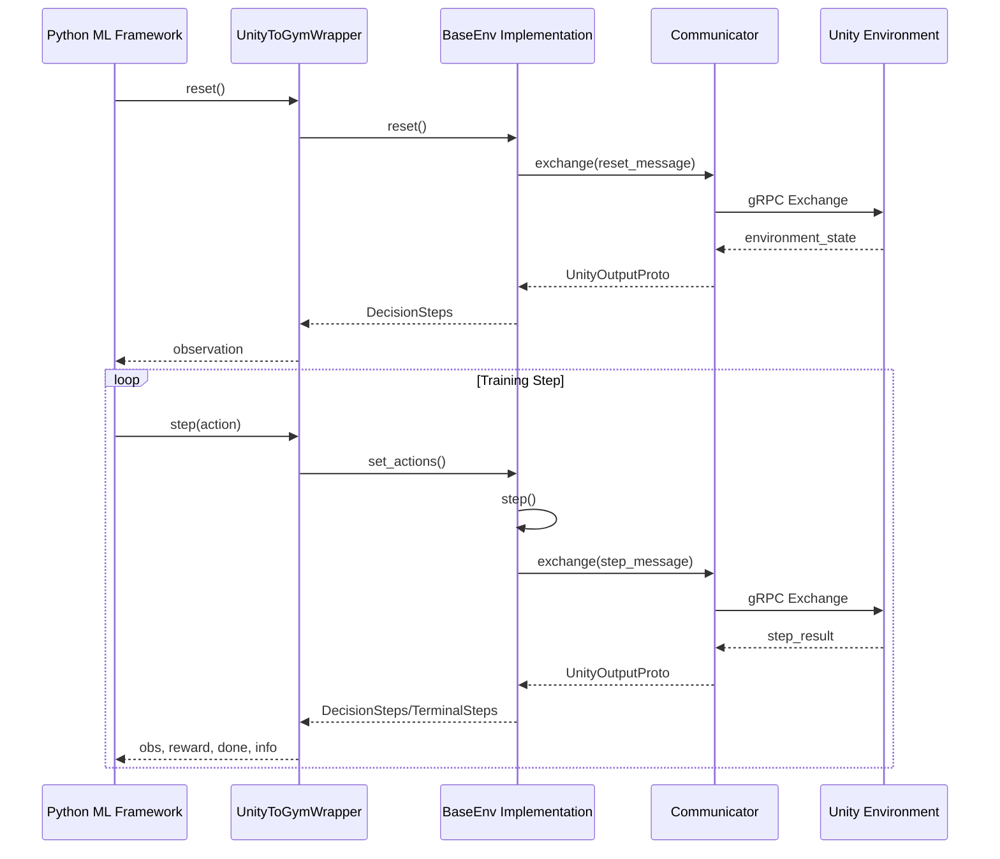
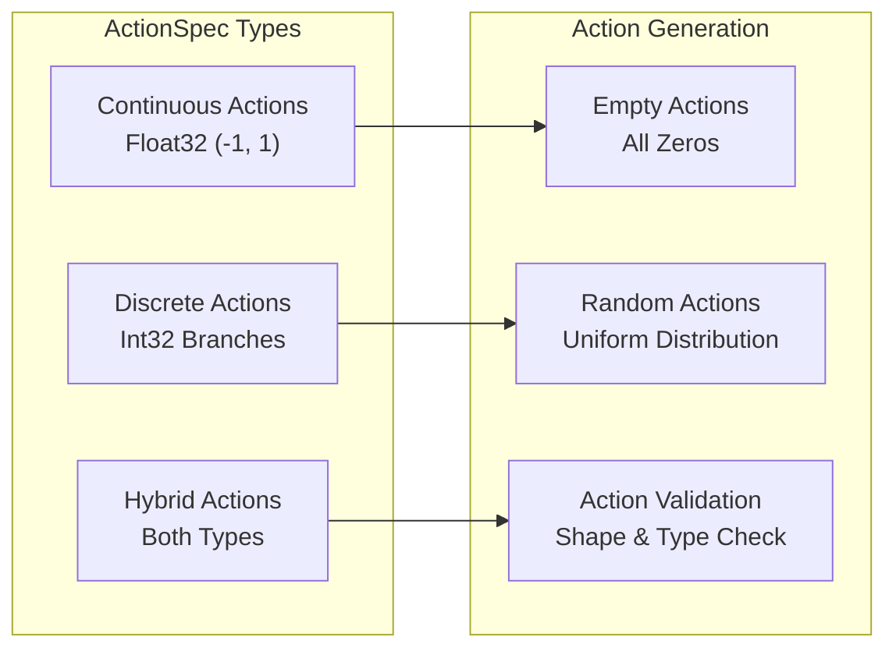
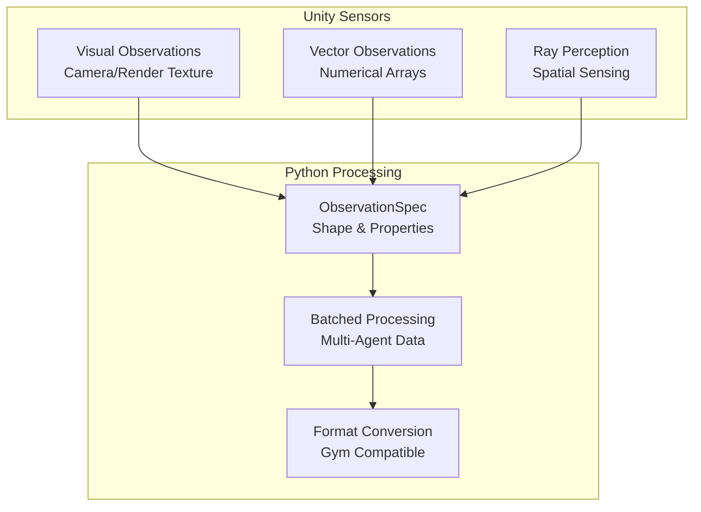

# Python Environment Module

## Overview

The Python Environment module serves as the primary interface between Python-based machine learning frameworks and Unity ML-Agents environments. This module provides a standardized API for environment interaction, communication protocols, and integration with popular ML frameworks like OpenAI Gym.

## Purpose

The python_environment module enables:
- **Environment Abstraction**: Provides a unified interface for interacting with Unity ML-Agents environments
- **Framework Integration**: Seamless integration with popular ML frameworks through standardized APIs
- **Communication Management**: Handles bidirectional communication between Python and Unity environments
- **Data Standardization**: Converts Unity-specific data formats to Python-friendly structures

## Architecture Overview



## Core Components

### BaseEnv - Environment Abstraction Layer
The `BaseEnv` class provides the fundamental abstract interface for all Unity ML-Agents environments:

**Key Responsibilities:**
- Defines standard environment lifecycle methods (`step`, `reset`, `close`)
- Manages agent behavior specifications and action spaces
- Handles batched agent interactions for performance optimization
- Provides data structures for decision and terminal steps

**Data Structures:**
- `DecisionSteps`: Contains observations and rewards for agents requiring decisions
- `TerminalSteps`: Contains final observations and rewards for terminated agents
- `ActionTuple`: Encapsulates continuous and discrete actions
- `BehaviorSpec`: Defines observation and action specifications for agent groups

**Specification Classes:**
- `ActionSpec`: Defines action space configuration with support for:
  - Continuous actions (float values in [-1, 1] range)
  - Discrete actions (integer branches with configurable sizes)
  - Hybrid action spaces combining both types
  - Validation and random action generation utilities
- `ObservationSpec`: Specifies observation characteristics including:
  - Shape dimensions for different observation types
  - Dimension properties (translational equivariance, variable size)
  - Observation type classification (default, goal signal)
  - Sensor naming for identification

### Communicator - Protocol Management
The `Communicator` class manages the communication protocol between Python and Unity:

**Key Features:**
- Handles initialization handshake with Unity environments
- Manages bidirectional message exchange using Protocol Buffers
- Provides connection management with timeout and polling support
- Supports multiple environment instances through worker ID system

### UnityToExternalProto - gRPC Service Interface
Auto-generated gRPC service definitions for Unity-Python communication:

**Functionality:**
- Defines the `Exchange` RPC method for message passing
- Handles serialization/deserialization of Protocol Buffer messages
- Provides both client stub and server servicer implementations
- Enables reliable, high-performance communication channel

### UnityToGymWrapper - Framework Integration
Bridges Unity ML-Agents environments with OpenAI Gym interface:

**Integration Features:**
- Converts Unity observations to Gym-compatible formats
- Handles action space transformations (discrete, continuous, multi-discrete)
- Provides standard Gym methods (`reset`, `step`, `render`, `close`)
- Supports visual and vector observations with flexible configuration

## Data Flow Architecture



## Technical Specifications

### Action Space Configuration



### Observation Data Flow



### Communication Protocol

The module uses Protocol Buffers over gRPC for efficient communication:

**Message Types:**
- `UnityInputProto`: Python → Unity messages containing actions and configuration
- `UnityOutputProto`: Unity → Python messages containing observations and rewards
- Bidirectional exchange through `UnityToExternalProto.Exchange` RPC method

**Connection Management:**
- Base port: 5005 (configurable)
- Worker ID offset for parallel environments
- Timeout handling with optional polling callbacks
- Automatic connection retry and error recovery

## Integration with Other Modules

The python_environment module serves as a critical bridge connecting various system components:

### Unity Runtime Integration
- **Dependency**: [unity_runtime_core](unity_runtime_core.md) - Receives agent decisions and environment state
- **Dependency**: [unity_communication](unity_communication.md) - Uses gRPC protocols for message exchange
- **Dependency**: [unity_side_channels](unity_side_channels.md) - Handles auxiliary communication channels

### Training System Integration
- **Consumer**: [training_core](training_core.md) - Provides environment interface for training algorithms
- **Consumer**: [training_algorithms](training_algorithms.md) - Supplies standardized environment API

### Side Channel Integration
- **Related**: [python_side_channels](python_side_channels.md) - Manages auxiliary data channels for environment configuration

## Key Features

### Multi-Agent Support
- Batched processing of multiple agents for performance optimization
- Agent grouping by behavior specifications
- Individual agent tracking through unique identifiers

### Flexible Observation Handling
- Support for visual observations (camera sensors)
- Vector observations for numerical data
- Mixed observation types with configurable processing

### Action Space Flexibility
- Continuous action spaces for precise control
- Discrete action spaces for categorical decisions
- Multi-discrete (branched) action spaces
- Hybrid action spaces combining continuous and discrete actions

### Framework Compatibility
- Native OpenAI Gym interface support
- Extensible design for other ML framework integrations
- Standardized data formats for broad compatibility

## Configuration and Usage

### Basic Environment Setup
```python
from mlagents_envs.environment import UnityEnvironment
from mlagents_envs.envs.unity_gym_env import UnityToGymWrapper

# Create Unity environment
unity_env = UnityEnvironment(file_name="path/to/environment")

# Wrap for Gym compatibility
gym_env = UnityToGymWrapper(unity_env)

# Standard Gym usage
obs = gym_env.reset()
action = gym_env.action_space.sample()
obs, reward, done, info = gym_env.step(action)
```

### Advanced Configuration Options
```python
# Configure Gym wrapper with advanced options
gym_env = UnityToGymWrapper(
    unity_env,
    uint8_visual=True,           # Visual obs as uint8 (0-255)
    flatten_branched=True,       # Flatten multi-discrete actions
    allow_multiple_obs=True,     # Return list of observations
    action_space_seed=42         # Seed for action space sampling
)

# Multi-environment setup for parallel training
environments = []
for worker_id in range(4):
    env = UnityEnvironment(
        file_name="environment", 
        worker_id=worker_id,
        base_port=5005
    )
    environments.append(UnityToGymWrapper(env))
```

### Direct BaseEnv Usage
```python
from mlagents_envs.environment import UnityEnvironment

# Direct environment interaction
env = UnityEnvironment("environment")
env.reset()

# Get behavior names and specs
behavior_names = list(env.behavior_specs.keys())
behavior_name = behavior_names[0]
spec = env.behavior_specs[behavior_name]

# Environment step loop
while True:
    decision_steps, terminal_steps = env.get_steps(behavior_name)
    
    if len(decision_steps) > 0:
        # Generate actions for decision-requesting agents
        actions = spec.action_spec.random_action(len(decision_steps))
        env.set_actions(behavior_name, actions)
    
    env.step()
    
    if len(terminal_steps) > 0:
        # Handle terminated agents
        break

env.close()
```

### Communication Configuration
- **Base Port**: Default 5005, configurable for multiple environments
- **Worker ID**: Offset for parallel environment instances
- **Timeout Handling**: Configurable polling callbacks for connection management

## Performance Considerations

### Batched Operations
- All agent operations are batched for optimal performance
- Vectorized numpy operations for observation and action processing
- Efficient memory management for large-scale multi-agent scenarios

### Communication Optimization
- Protocol Buffer serialization for compact message format
- gRPC for high-performance, reliable communication
- Connection pooling and reuse for multiple environment instances

### Memory Management
- Lazy initialization of agent-to-index mappings
- Efficient numpy array operations with minimal copying
- Proper resource cleanup on environment closure

## Error Handling

### Exception Types
- `UnityGymException`: Gym wrapper-specific errors
- `UnityActionException`: Action validation and formatting errors
- Connection timeouts and communication failures

### Validation
- Action space validation against behavior specifications
- Agent count verification for single-agent Gym environments
- Observation format consistency checks

### Best Practices
- Always call `env.close()` to properly cleanup resources
- Handle connection timeouts gracefully with polling callbacks
- Validate action dimensions before sending to environment
- Use appropriate data types (float32 for continuous, int32 for discrete)

## Troubleshooting

### Common Issues
1. **Port Conflicts**: Use different base_port values for multiple environments
2. **Action Shape Mismatch**: Ensure actions match the expected dimensions
3. **Connection Timeouts**: Check Unity environment is running and accessible
4. **Memory Leaks**: Always close environments when finished

### Debug Information
- Use `info` parameter from `step()` method for detailed step information
- Check `behavior_specs` for current environment configuration
- Monitor agent counts in `DecisionSteps` and `TerminalSteps`

This module forms the foundation for Python-based interaction with Unity ML-Agents environments, providing the essential infrastructure for machine learning research and development.