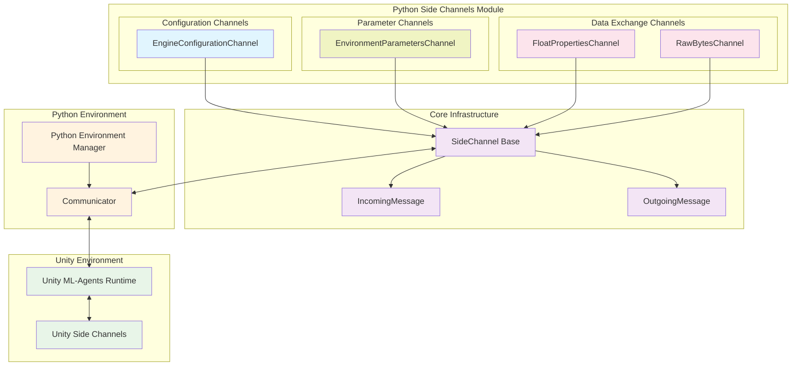
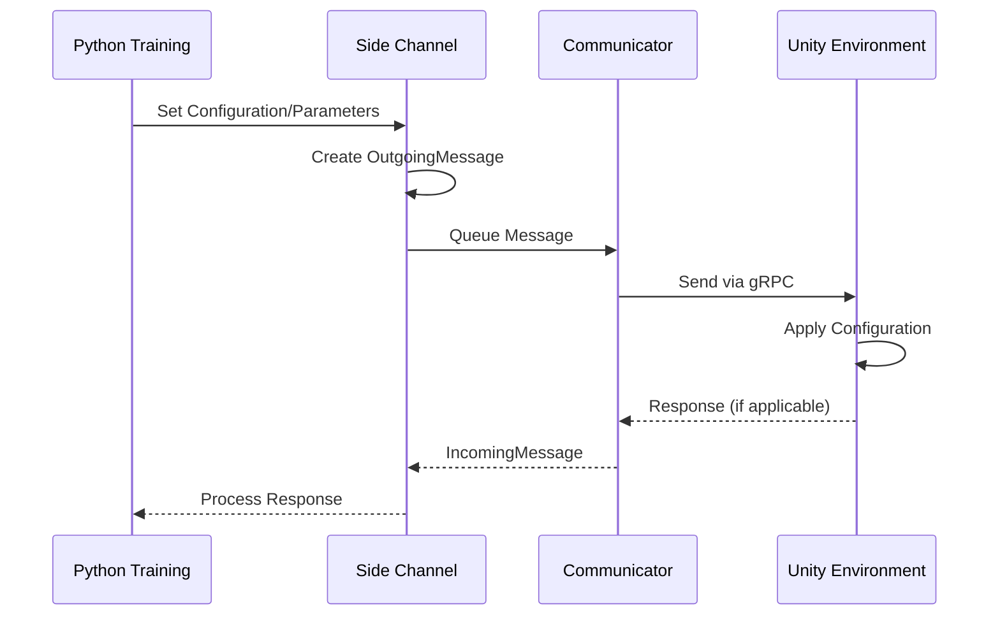

# Python Side Channels Module

## Overview

The `python_side_channels` module provides a comprehensive framework for bidirectional communication between Python training environments and Unity ML-Agents runtime environments. This module enables the exchange of configuration parameters, environment properties, and custom data through specialized communication channels, facilitating dynamic environment control and data sharing during machine learning training sessions.

## Purpose and Core Functionality

The module serves as the Python-side implementation of the side channel communication protocol, allowing:

- **Engine Configuration Management**: Dynamic control of Unity engine parameters such as screen resolution, quality settings, and time scale
- **Environment Parameter Exchange**: Runtime modification of environment variables and parameters
- **Property Management**: Bidirectional sharing of float properties between Python and Unity
- **Raw Data Communication**: General-purpose byte-level data exchange for custom protocols

## Architecture Overview

The python_side_channels module is built around a unified side channel architecture that provides type-safe, structured communication with Unity environments. The module integrates closely with the [python_environment](python_environment.md) module for environment management and the [unity_side_channels](unity_side_channels.md) module for Unity-side communication.



## Module Components

The python_side_channels module is organized into three specialized sub-modules, each handling different aspects of Unity-Python communication:

### Configuration Channels
Handles Unity engine configuration and runtime parameter management. See [Configuration Channels](configuration_channels.md) for detailed documentation.
- **EngineConfigurationChannel**: Manages Unity engine settings including display resolution, quality levels, time scale, and frame rate parameters

### Parameter Channels  
Manages dynamic environment parameter exchange with support for various data types and statistical samplers. See [Parameter Channels](parameter_channels.md) for detailed documentation.
- **EnvironmentParametersChannel**: Handles dynamic environment parameter updates with support for float values and statistical samplers

### Data Exchange Channels
Provides flexible data communication mechanisms for properties and custom protocols. See [Data Exchange Channels](data_exchange_channels.md) for detailed documentation.
- **FloatPropertiesChannel**: Provides bidirectional exchange of named float properties between Python and Unity environments
- **RawBytesChannel**: Enables custom byte-level communication for specialized protocols and data exchange

## Communication Flow



## Integration with Other Modules

The python_side_channels module integrates with several other system modules:

- **[python_environment](python_environment.md)**: Provides the base environment infrastructure and communication layer
- **[unity_side_channels](unity_side_channels.md)**: Unity-side counterpart for message processing and parameter application
- **[unity_communication](unity_communication.md)**: Underlying gRPC communication protocol
- **[training_core](training_core.md)**: Training infrastructure that utilizes side channels for environment control

## Key Features

### Type-Safe Communication
All channels provide strongly-typed interfaces for parameter exchange, ensuring data integrity and preventing communication errors.

### Flexible Parameter Management
Support for various data types including floats, integers, strings, and complex statistical samplers for dynamic environment configuration.

### Bidirectional Data Flow
Channels support both sending data to Unity and receiving responses, enabling interactive parameter negotiation and status reporting.

### Extensible Architecture
The base SideChannel class provides a framework for implementing custom communication protocols for specialized use cases.

## Usage Patterns

### Engine Configuration
```python
# Configure Unity engine parameters
engine_channel = EngineConfigurationChannel()
engine_channel.set_configuration_parameters(
    width=1920, height=1080,
    quality_level=3, time_scale=1.0
)
```

### Environment Parameters
```python
# Set environment parameters with samplers
env_channel = EnvironmentParametersChannel()
env_channel.set_float_parameter("gravity", -9.81)
env_channel.set_uniform_sampler_parameters("wind_speed", 0.0, 10.0, seed=42)
```

### Property Exchange
```python
# Bidirectional property management
props_channel = FloatPropertiesChannel()
props_channel.set_property("difficulty", 0.8)
current_score = props_channel.get_property("score")
```

## Error Handling and Validation

The module implements comprehensive error handling for:
- Invalid parameter combinations (e.g., width without height)
- Communication failures with Unity
- Type validation for all parameter exchanges
- UUID-based channel identification for message routing

This module forms a critical component of the ML-Agents communication infrastructure, enabling dynamic and flexible control of training environments from Python code.