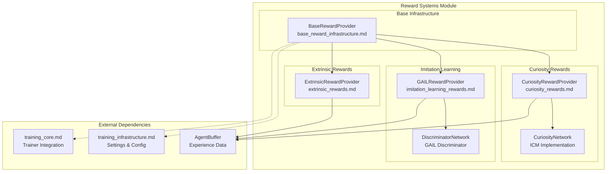
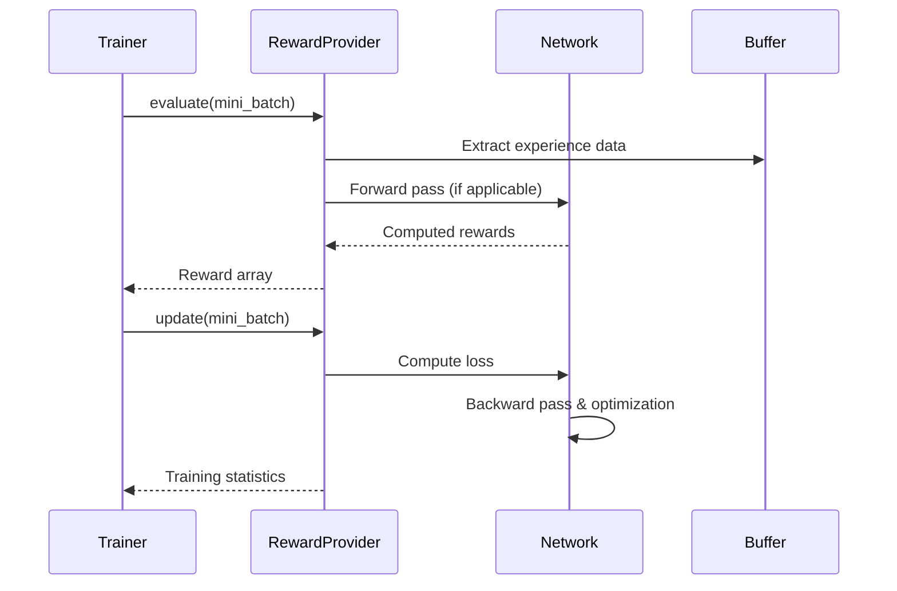

# Reward Systems Module

## Overview

The reward_systems module is a critical component of the ML-Agents training infrastructure that provides flexible and extensible reward signal generation for reinforcement learning agents. This module implements various reward providers that can be used individually or in combination to shape agent behavior during training.

## Purpose

The reward systems module serves several key purposes:

1. **Reward Signal Generation**: Provides different types of reward signals beyond basic environment rewards
2. **Intrinsic Motivation**: Implements curiosity-driven and imitation learning rewards to encourage exploration and learning
3. **Multi-Signal Training**: Enables combining multiple reward sources with configurable strengths and discount factors
4. **Behavioral Shaping**: Allows fine-tuning of agent behavior through sophisticated reward engineering

## Architecture Overview

The reward systems module follows a provider pattern architecture with a clear hierarchy:



## Core Components

The reward_systems module is organized into four main sub-modules, each handling different aspects of reward generation:

### Base Reward Infrastructure
The foundational components that define the reward provider interface and common functionality. See [base_reward_infrastructure](base_reward_infrastructure.md) for detailed information on:
- Abstract base classes and interfaces
- Common configuration management
- Module lifecycle management

### Extrinsic Rewards
Traditional environment-based reward processing for single and multi-agent scenarios. See [extrinsic_rewards](extrinsic_rewards.md) for detailed information on:
- Environment reward integration
- Multi-agent reward aggregation
- POCA cooperative learning support

### Curiosity Rewards
Intrinsic motivation through curiosity-driven exploration using the Intrinsic Curiosity Module (ICM). See [curiosity_rewards](curiosity_rewards.md) for detailed information on:
- Forward and inverse model architecture
- Prediction error-based reward generation
- Exploration encouragement mechanisms

### Imitation Learning Rewards
Generative Adversarial Imitation Learning (GAIL) for learning from expert demonstrations. See [imitation_learning_rewards](imitation_learning_rewards.md) for detailed information on:
- Discriminator network architecture
- Adversarial training procedures
- VAIL (Variational Adversarial Imitation Learning) support

## Data Flow



## Integration with Training System

The reward systems module integrates seamlessly with the broader ML-Agents training infrastructure:

### Training Core Integration
- **Trainer Compatibility**: Works with all trainer types (PPO, SAC, POCA) via the [training_core](training_core.md) module
- **Policy Integration**: Reward signals feed into policy updates through the [training_algorithms](training_algorithms.md)

### Configuration System
- **Settings Management**: Configured through [training_infrastructure](training_infrastructure.md) settings system
- **Hyperparameter Control**: Supports gamma, strength, learning rates, and algorithm-specific parameters

### Buffer System
- **Experience Processing**: Operates on `AgentBuffer` data structures from the training pipeline
- **Multi-Step Processing**: Handles sequential data for temporal reward computation

## Key Features

### Multi-Reward Training
The system supports combining multiple reward providers:
- Each provider has configurable strength multipliers
- Independent discount factors (gamma) per reward type
- Automatic reward normalization and clipping

### Neural Network Integration
- **Modular Design**: Neural components can be saved/loaded independently
- **GPU Support**: Automatic device management for neural network components
- **Optimization**: Dedicated optimizers for each learnable reward provider

### Robust Training
- **Gradient Penalties**: GAIL includes gradient penalty for training stability
- **Normalization**: Automatic feature normalization in discriminator networks
- **Masking Support**: Proper handling of episode boundaries and invalid transitions

## Usage Patterns

### Single Reward Training
```python
# Extrinsic rewards only
reward_signals:
  extrinsic:
    gamma: 0.99
    strength: 1.0
```

### Multi-Reward Training
```python
# Combined extrinsic and curiosity rewards
reward_signals:
  extrinsic:
    gamma: 0.99
    strength: 1.0
  curiosity:
    gamma: 0.99
    strength: 0.02
    learning_rate: 3.0e-4
```

### Imitation Learning
```python
# GAIL-based imitation learning
reward_signals:
  gail:
    gamma: 0.99
    strength: 1.0
    demo_path: "expert_demos.demo"
    learning_rate: 3.0e-4
```

## Performance Considerations

### Computational Overhead
- **Extrinsic Provider**: Minimal overhead, simple array operations
- **Curiosity Provider**: Moderate overhead, requires forward/inverse model training
- **GAIL Provider**: Higher overhead, includes discriminator training and gradient penalties

### Memory Usage
- **Network Storage**: Each provider with neural components requires additional memory
- **Demo Buffer**: GAIL requires storing expert demonstration data
- **Gradient Computation**: GAIL gradient penalty requires additional memory for interpolated samples

## Extension Points

The reward systems module is designed for extensibility:

### Custom Reward Providers
- Inherit from `BaseRewardProvider`
- Implement `evaluate()` and `update()` methods
- Optional: Implement `get_modules()` for neural components

### Network Architectures
- Curiosity and GAIL networks can be customized through network settings
- Support for different encoder architectures and hidden layer sizes
- Configurable activation functions and initialization schemes

## Related Documentation

- [training_core](training_core.md) - Core training abstractions and trainer implementations
- [training_algorithms](training_algorithms.md) - Specific algorithm implementations (PPO, SAC, POCA)
- [training_infrastructure](training_infrastructure.md) - Configuration system and network architectures
- [unity_runtime_core](unity_runtime_core.md) - Unity environment integration
- [python_environment](python_environment.md) - Python environment wrapper and communication

## Summary

The reward_systems module provides a flexible and powerful framework for implementing diverse reward signals in reinforcement learning. Its modular design allows for easy combination of different reward types, while the abstract base class ensures consistent interfaces across all providers. The module's integration with the broader training infrastructure makes it a cornerstone of the ML-Agents learning pipeline, enabling sophisticated behavioral shaping through reward engineering.