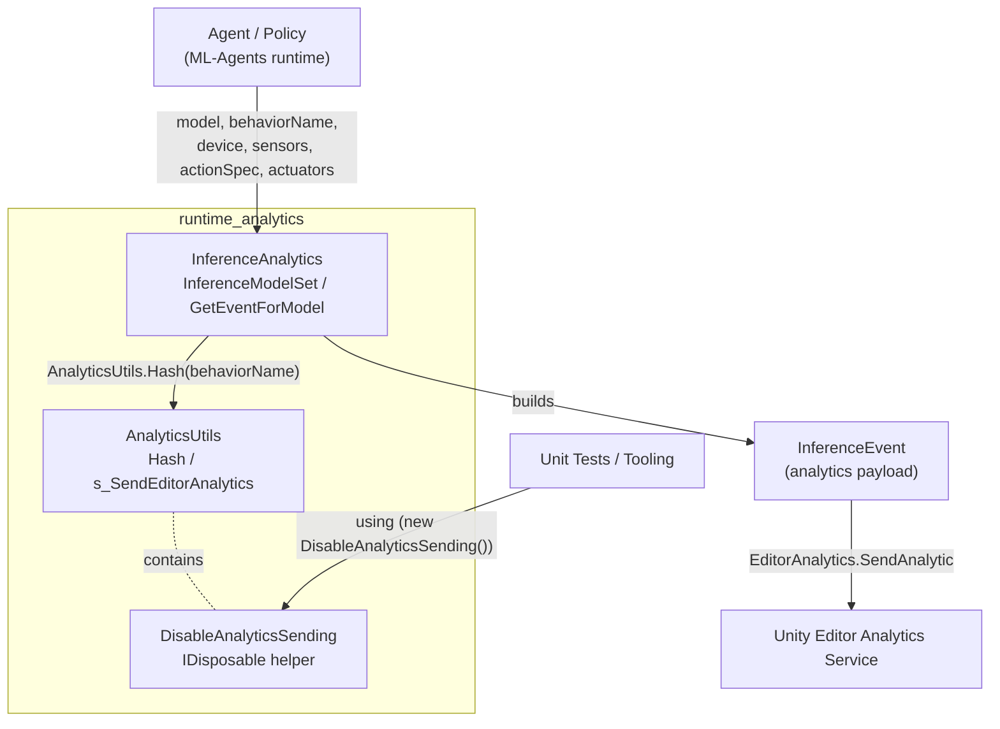
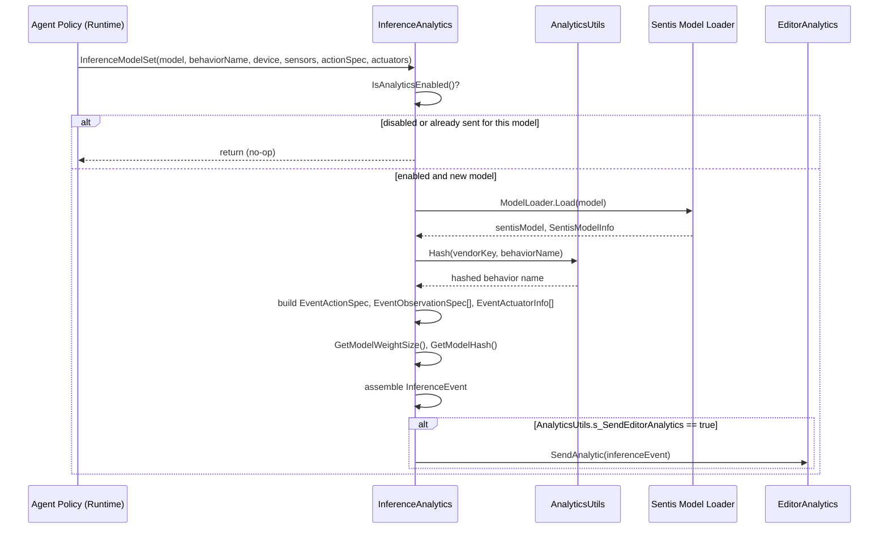
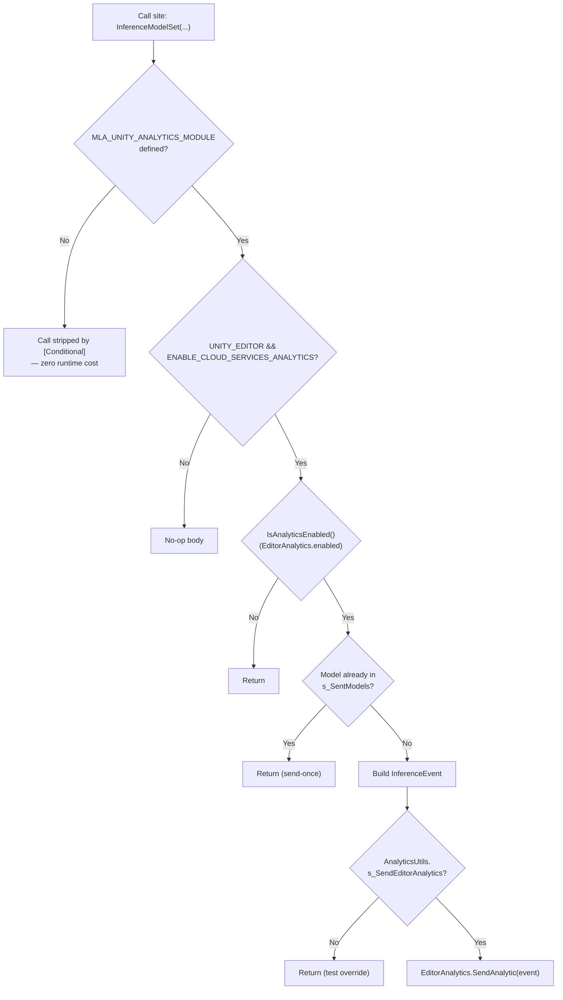

# Runtime Analytics Module

## 1. Purpose

The `runtime_analytics` module provides **opt-in, privacy-preserving telemetry** for the Unity ML-Agents C# runtime. Its sole responsibility is to capture lightweight, non-identifying metadata about how ML-Agents features are used at runtime — most notably, information about the **neural network model** loaded for inference — and forward it to Unity's Editor Analytics service.

Key design goals:

- **Privacy first**: Any potentially sensitive string (such as a user-defined Behavior Name) is HMAC-hashed before being sent, so no personally identifiable information (PII) leaves the machine.
- **Non-intrusive**: Analytics collection is guarded by multiple layers of conditions (compilation symbols, Editor-only checks, and a runtime toggle) so that it has zero cost and zero effect in Player builds or when disabled.
- **Testable**: A small `IDisposable` helper (`DisableAnalyticsSending`) allows unit tests and tooling to deterministically suppress analytics sending without touching global Editor state permanently.
- **Single-fire semantics**: Each distinct model asset triggers at most one analytics event per Editor session, preventing event spam during training/inference loops.

This module lives entirely in the Unity C# runtime package (`com.unity.ml-agents`) and is part of the broader [Unity-Python Bridge & ML Integration](runtime_inference.md) family of runtime concerns, sitting alongside model inference, demonstration recording, and side-channel communication.

## 2. Architecture Overview

The module consists of two small, tightly-coupled files:

| File | Responsibility |
|---|---|
| `AnalyticsUtils.cs` | Cross-cutting utilities: PII-safe hashing (`Hash`) and the global analytics enable/disable switch (`s_SendEditorAnalytics`), exposed via the `DisableAnalyticsSending` test helper. |
| `InferenceAnalytics.cs` | Builds and dispatches the `InferenceEvent` analytics payload describing a loaded inference model, its I/O specs, and the Sentis runtime environment. |



### Data flow for an inference event



## 3. Core Components

### 3.1 `AnalyticsUtils` (internal static class)

Provides shared, low-level analytics infrastructure used by `InferenceAnalytics` (and potentially other future analytics producers):

- **`Hash(string key, string value)`**: Computes an HMAC-SHA256 hash of `value` keyed by `key`, returned as a hex string. Used to anonymize fields like the Behavior Name before transmission — the raw value never leaves the process.
- **`ToHexString(byte[])`**: Private helper converting raw hash bytes into a hex-encoded string.
- **`s_SendEditorAnalytics`** (internal static bool): Global toggle, `true` by default, controlling whether any built event is actually dispatched to `EditorAnalytics`. This is the last checkpoint before network/Editor-analytics I/O occurs.
- **`DisableAnalyticsSending`** (nested `IDisposable`): A scoped guard that flips `s_SendEditorAnalytics` to `false` on construction and restores its previous value on `Dispose()`. Intended usage is a `using` block in tests:

  ```csharp
  using (new AnalyticsUtils.DisableAnalyticsSending())
  {
      // Code under test that would normally trigger analytics
  }
  ```

  This nested/restoring behavior means it is safe to compose multiple `DisableAnalyticsSending` scopes without permanently disabling analytics after the outermost scope exits.

### 3.2 `InferenceAnalytics` (internal static class)

Responsible for constructing and sending the `InferenceEvent` when an Agent's model is set up for inference.

Key members:

- **`EnableAnalytics()`**: Lazily initializes the `s_SentModels` de-duplication set. Only compiles/executes in the Editor with the Unity Analytics module and Cloud Services Analytics enabled; otherwise always returns `false`, effectively disabling all analytics in Player builds.
- **`IsAnalyticsEnabled()`**: Thin wrapper over `EditorAnalytics.enabled` (Editor-only); always `false` outside the Editor.
- **`InferenceModelSet(ModelAsset, string behaviorName, InferenceDevice, IList<ISensor>, ActionSpec, IList<IActuator>)`**: The main entry point, called by the runtime when a model is bound to an Agent for inference. It is decorated with `[Conditional("MLA_UNITY_ANALYTICS_MODULE")]` so calls are stripped entirely when the symbol is undefined. Logic:
  1. Early-out if analytics are disabled or unsupported for this build.
  2. Add the `ModelAsset` to `s_SentModels`; if it was already present, skip (send-once-per-model semantics).
  3. Build the event via `GetEventForModel`.
  4. Send it through `EditorAnalytics.SendAnalytic`, but only if `AnalyticsUtils.s_SendEditorAnalytics` is still `true` (allows test-time suppression even after the above checks pass).
- **`GetEventForModel(...)`**: Pure(-ish) builder that assembles an `InferenceEvent` payload:
  - Loads the Sentis `Model` via `ModelLoader.Load` and wraps it in a `SentisModelInfo` for version/memory metadata (see [runtime_inference](runtime_inference.md) for the model-loading and parameter-validation logic this depends on, e.g. `SentisModelParamLoader`).
  - Hashes `behaviorName` using `AnalyticsUtils.Hash` with a vendor key (`AnalyticsConstants.k_VendorKey`) so the raw name is never transmitted.
  - Records Sentis model version, producer, memory size, and inference device (CPU/GPU).
  - Applies a legacy compatibility shim for old `.nn`/TensorFlow-converted models (producer `"Script"` → labeled as `"NN"` / `tensorflow_to_barracuda.py`).
  - Captures the installed Sentis package version (Editor-only, via `PackageManager.PackageInfo`).
  - Converts the Agent's `ActionSpec` into an `EventActionSpec` (continuous/discrete action counts and branch sizes) and each `ISensor`/`IActuator` into `EventObservationSpec`/`EventActuatorInfo` summaries — these are thin, serializable projections of the sensor/actuator interfaces defined in the [Unity Perception & Sensing](runtime_sensors.md) and [Unity Actuation & Input Integration](runtime_input.md) modules.
  - Computes `GetModelWeightSize` (total bytes across all model constants, mirroring the Sentis inspector's "Total weight size") and `GetModelHash` (a `Hash128`-based fingerprint over the model's constant data, using a subset of weights for performance).
- **`GetModelWeightSize(Model)`**: Sums `lengthBytes` across all constants in the Sentis model.
- **`GetModelHash(Model)`**: Uses the nested `MLAgentsHash128` wrapper to fold each constant's string representation into a single `Hash128`, producing a stable identifier for the model's weight content without transmitting the weights themselves.
- **`MLAgentsHash128`** (private struct): A small compatibility wrapper around Unity's `Hash128` that supports appending `float[]` arrays (using the native `Append` API on Unity 2020.1+, or falling back to per-element hashing on older versions) as well as strings.

## 4. Compilation & Runtime Gating

Analytics code paths are guarded by several nested conditions to guarantee they are inert unless explicitly enabled:



This layered gating ensures:
1. Player builds never include the analytics call bodies (`[Conditional]` attribute strips call sites).
2. Even within the Editor, analytics require the Unity Analytics module and Cloud Services Analytics to be present.
3. A single global flag (`AnalyticsUtils.s_SendEditorAnalytics`) gives tests full control regardless of the above, without needing conditional compilation symbols in test code.

## 5. Relationship to Other Modules

`runtime_analytics` is a leaf, low-coupling module: it *consumes* data structures from other runtime modules but is not depended upon by core gameplay/training logic. It integrates with:

- **[runtime_inference](runtime_inference.md)** — Analytics is invoked when a model is prepared for inference; `SentisModelParamLoader` and related inference machinery validate/load the same `Model`/`ModelAsset` objects that `InferenceAnalytics.GetEventForModel` inspects.
- **[runtime_sensors](runtime_sensors.md)** and **[runtime_input](runtime_input.md)** — the `ISensor`/`IActuator` lists passed into `InferenceModelSet` originate from an Agent's configured sensor and actuator components (camera, ray-perception, grid, input actuators, etc.).
- **Editor tooling** (`editor_core`) — Agent/Behavior Parameter inspectors in the Editor are typically the trigger point that causes a model to be bound and inference to be configured, indirectly leading to `InferenceModelSet` calls.
- **Python-side analytics** — Conceptually parallel to this C#-side inference analytics, the Python trainer stack has its own analytics side channel (`TrainingAnalyticsSideChannel` in [trainers_core](trainers_core.md) and `DefaultTrainingAnalyticsSideChannel` in [envs_sidechannel](envs_sidechannel.md)) that reports training-run metadata from the Python side. The two systems are independent but follow the same privacy-conscious hashing philosophy.

## 6. Usage Notes for Developers

- To add a new analytics event type, follow the `InferenceAnalytics` pattern: define a serializable event struct (see `EventActionSpec`, `EventObservationSpec`, `EventActuatorInfo` in the companion `Events.cs`), gate the public entry point with `[Conditional("MLA_UNITY_ANALYTICS_MODULE")]`, and funnel the final send through `AnalyticsUtils.s_SendEditorAnalytics` so it remains testable.
- Never send raw user-defined strings (behavior names, file paths, etc.) — always route them through `AnalyticsUtils.Hash` first.
- In tests that exercise code paths which may trigger analytics, wrap the test body in `using (new AnalyticsUtils.DisableAnalyticsSending())` to avoid flaky or noisy Editor analytics calls.
