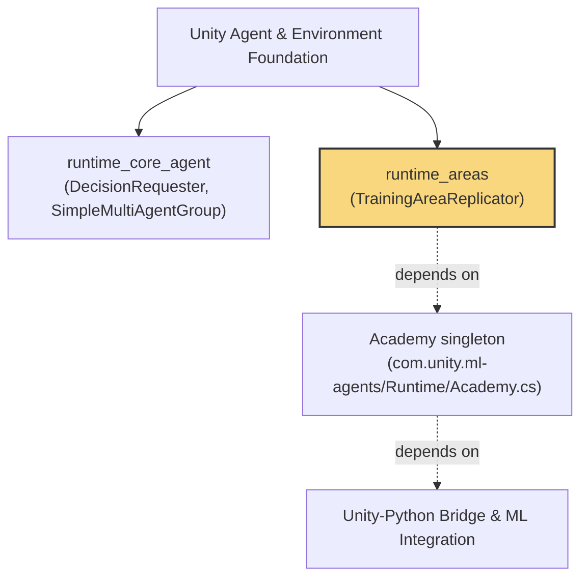
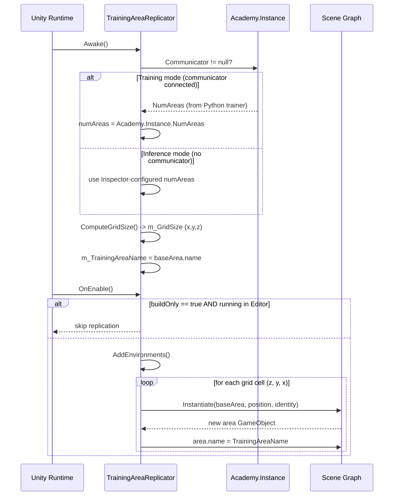
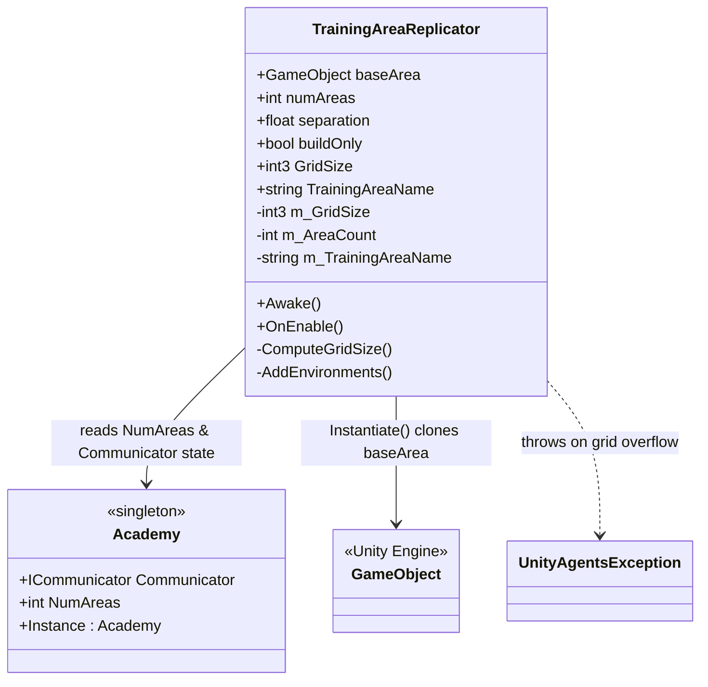
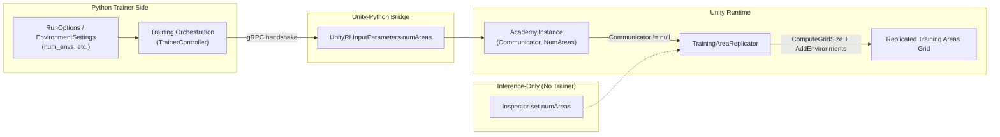
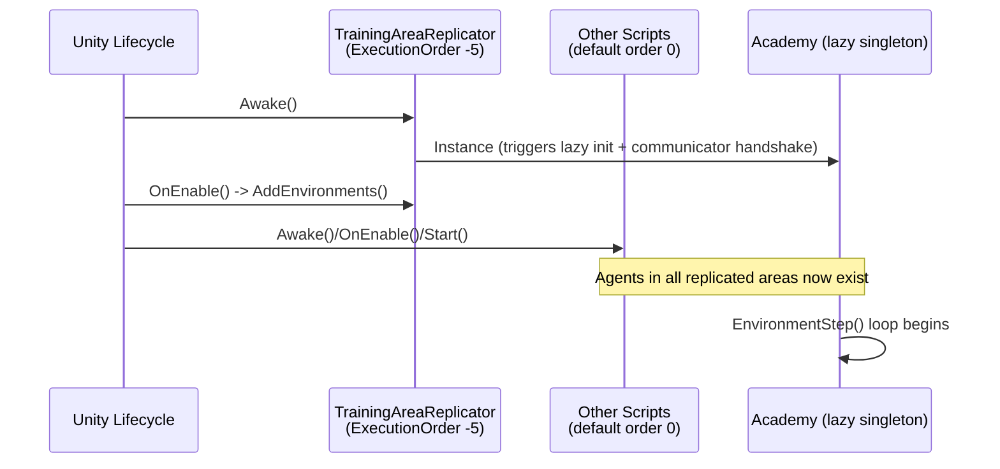

# Runtime Areas

## Introduction

The **Runtime Areas** module is a small but important piece of the Unity ML-Agents runtime that enables **parallel training area replication**. It provides the `TrainingAreaReplicator` component, a `MonoBehaviour` that automatically clones a "base" training area (a `GameObject` typically containing an `Agent`, environment geometry, and reward logic) into a 3D grid of copies at scene startup.

This capability is central to scaling up reinforcement learning throughput in Unity: instead of manually placing dozens of identical training environments in a scene, a designer places a single base area and attaches a `TrainingAreaReplicator` to a parent object. At runtime, the replicator queries the number of parallel environments requested by the connected Python trainer (via the [Unity-Python Bridge & ML Integration](Unity-Python_Bridge_%26_ML_Integration.md) module's `Academy`/communicator) and replicates the base area accordingly, arranging the copies in a spatially separated grid so that physics and rendering do not interfere between areas.

This module is a child of the [Unity Agent & Environment Foundation](Unity_Agent_%26_Environment_Foundation.md) module, sitting alongside core agent/environment primitives such as `DecisionRequester` and `SimpleMultiAgentGroup`.

---

## Module Location in the System

- **Parent module**: [Unity Agent & Environment Foundation](Unity_Agent_%26_Environment_Foundation.md)
- **Sibling module**: `runtime_core_agent` (agent decision-making and multi-agent grouping)
- **External dependency**: `Academy` (part of the core ML-Agents runtime, not itself part of this module tree) which exposes `NumAreas` and `Communicator` state used to drive replication behavior. The `Academy`'s communicator connection is established through the [Unity-Python Bridge & ML Integration](Unity-Python_Bridge_%26_ML_Integration.md) module and ultimately the training-side [Python Environment Interface Layer](Python_Environment_Interface_Layer.md) and [Training Orchestration & Lifecycle Infrastructure](Training_Orchestration_%26_Lifecycle_Infrastructure.md).

---

## Core Component: `TrainingAreaReplicator`

`TrainingAreaReplicator` is a `MonoBehaviour` with `[DefaultExecutionOrder(-5)]`, ensuring it runs its `Awake`/`OnEnable` lifecycle **before** most other scripts in the scene, and critically before the `Academy` begins invoking its per-step events.

### Public Fields & Properties

| Member | Type | Description |
|---|---|---|
| `baseArea` | `GameObject` | The template training area to replicate. |
| `numAreas` | `int` | Desired number of areas. Overridden by `Academy.Instance.NumAreas` when a training communicator is connected. |
| `separation` | `float` | Distance (in world units) between replicated areas along each grid axis. |
| `buildOnly` | `bool` | When `true` (default), replication only occurs in standalone builds, not in the Editor. |
| `GridSize` | `int3` (read-only) | Computed dimensions of the 3D grid used to lay out areas. |
| `TrainingAreaName` | `string` (read-only) | Name assigned to each replicated area (copied from `baseArea.name`). |

### Lifecycle & Behavior

#### 1. `Awake()`
- Computes the replication grid size (`ComputeGridSize`).
- Captures the training area's name from `baseArea.name` for consistent naming of all replicas.

#### 2. `ComputeGridSize()`
- If `Academy.Instance.Communicator != null` (i.e., a Python trainer is connected), `numAreas` is overridden by `Academy.Instance.NumAreas`, which reflects the number of parallel environments requested by the trainer via the RL initialization handshake (`UnityRLInputParameters.numAreas`, see [Unity-Python Bridge & ML Integration](Unity-Python_Bridge_%26_ML_Integration.md)).
- Otherwise (inference mode / no trainer), the Inspector-configured `numAreas` value is used as-is.
- The grid is sized approximately as a cube root of `numAreas`, distributing areas across X, Y, and Z axes as evenly as possible:
  - `gridSize.x = gridSize.y = ceil(numAreas^(1/3))`
  - `gridSize.z = ceil(numAreas / (gridSize.x * gridSize.y))` (minimum 1)

#### 3. `OnEnable()`
- Runs after `Awake()`, ensuring grid computation is complete before instantiation.
- Replication timing is deliberately placed in `OnEnable` so that all replicated areas (and their agents/components) exist **before** `Academy` begins dispatching its per-step events (`AgentPreStep`, `AgentSendState`, `DecideAction`, `AgentAct`), avoiding race conditions where an agent might miss its first decision cycle.
- Respects the `buildOnly` flag:
  - If `true`, replication is wrapped in a `#if UNITY_STANDALONE && !UNITY_EDITOR` guard — areas are only instantiated in standalone builds, allowing single-area editing/debugging in the Editor without duplicate visual clutter.
  - If `false`, replication happens unconditionally, including in the Editor Play mode.

#### 4. `AddEnvironments()`
- Validates that `numAreas` does not exceed grid capacity (`m_GridSize.x * m_GridSize.y * m_GridSize.z`), throwing `UnityAgentsException` otherwise.
- Iterates over the 3D grid (`z`, `y`, `x` nested loops):
  - The **first grid cell** (index 0) is skipped for instantiation since the original `baseArea` already occupies that logical slot.
  - Subsequent cells are filled via `Instantiate(baseArea, position, Quaternion.identity)` until `numAreas` replicas exist.
  - Each new area's position is `(x * separation, y * separation, z * separation)`.
  - Each replica is renamed to match `TrainingAreaName` for consistent identification (e.g., useful for `SimpleMultiAgentGroup` or logging/statistics keyed by area name).

### Architecture Diagram

---

## Data Flow: Training-Time vs. Inference-Time Replication

- **Training mode**: The number of areas originates from the Python trainer's configuration (see [Training Orchestration & Lifecycle Infrastructure](Training_Orchestration_%26_Lifecycle_Infrastructure.md) and `EnvironmentSettings` in `settings.py`), propagated through the gRPC handshake into `UnityRLInputParameters.numAreas` (see [Unity-Python Bridge & ML Integration](Unity-Python_Bridge_%26_ML_Integration.md) → `ICommunicator`), and finally surfaced on `Academy.Instance.NumAreas`.
- **Inference mode**: No communicator is present, so the designer-specified `numAreas` in the Inspector is used directly — useful for demoing a trained model across multiple areas simultaneously without a Python backend.

---

## Execution Order & Integration with Academy

The `[DefaultExecutionOrder(-5)]` attribute ensures `TrainingAreaReplicator.Awake()`/`OnEnable()` execute early relative to default-order scripts. This is essential because:

1. `Academy` is a lazily-initialized singleton — the first access to `Academy.Instance` (which happens in `ComputeGridSize()`) triggers full communicator initialization and handshake if not already done.
2. All replicated areas (and the `Agent`s / sensors / actuators they contain — see [Unity Perception & Sensing](Unity_Perception_%26_Sensing.md) and [Unity Actuation & Input Integration](Unity_Actuation_%26_Input_Integration.md)) must exist in the scene **before** `Academy.EnvironmentStep()` begins firing `AgentPreStep`, `AgentSendState`, `DecideAction`, and `AgentAct` events, otherwise agents in later-instantiated areas would miss the first simulation step.

---

## Usage Pattern (Typical Scene Setup)

1. Author a single training area prefab/GameObject (`baseArea`) containing an `Agent`, its sensors/actuators, and reward/termination logic.
2. Add an empty parent `GameObject` with a `TrainingAreaReplicator` component; assign `baseArea`.
3. Configure `numAreas` (used as a fallback for inference) and `separation` (must be large enough to prevent physics/visual overlap between grid cells).
4. Leave `buildOnly = true` for normal iterative Editor development (single area shown); set to `false` if multi-area testing inside the Editor is desired.
5. At training time, the Python-side `num_envs`/area configuration (via [Training Orchestration & Lifecycle Infrastructure](Training_Orchestration_%26_Lifecycle_Infrastructure.md)) automatically overrides `numAreas`, and the grid is populated accordingly when the standalone build launches.

---

## Related Modules

| Module | Relationship |
|---|---|
| [Unity Agent & Environment Foundation](Unity_Agent_%26_Environment_Foundation.md) | Parent module; sibling `runtime_core_agent` provides `DecisionRequester` and `SimpleMultiAgentGroup` used within each replicated area. |
| [Unity-Python Bridge & ML Integration](Unity-Python_Bridge_%26_ML_Integration.md) | Supplies `UnityRLInputParameters.numAreas` via the communicator handshake, consumed by `Academy.NumAreas`. |
| [Python Environment Interface Layer](Python_Environment_Interface_Layer.md) | Python-side environment/communicator implementation that negotiates area counts during connection setup. |
| [Training Orchestration & Lifecycle Infrastructure](Training_Orchestration_%26_Lifecycle_Infrastructure.md) | Determines the number of parallel environments/areas requested during a training run (`EnvironmentSettings`). |
| [Unity Perception & Sensing](Unity_Perception_%26_Sensing.md) | Sensor components typically present inside each replicated training area. |
| [Unity Actuation & Input Integration](Unity_Actuation_%26_Input_Integration.md) | Actuator components typically present inside each replicated training area. |
| [Unity Editor Tooling](Unity_Editor_Tooling.md) | Provides custom Inspector editors for related Agent/Behavior components (no dedicated editor exists for `TrainingAreaReplicator` itself; it uses the default Inspector). |
