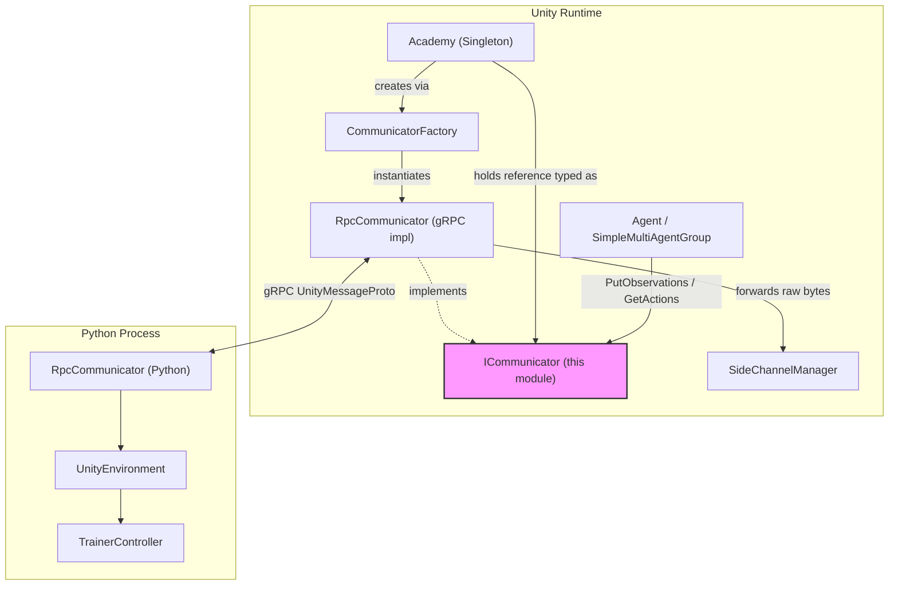
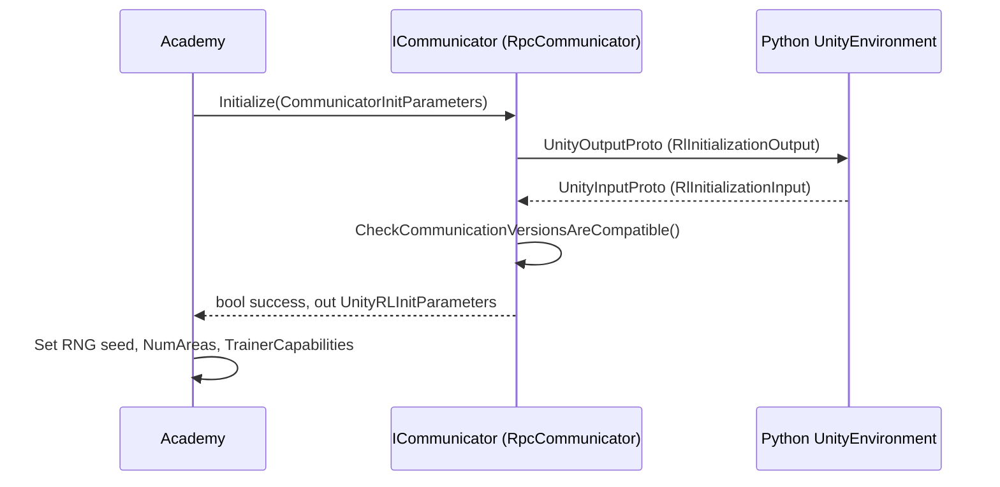
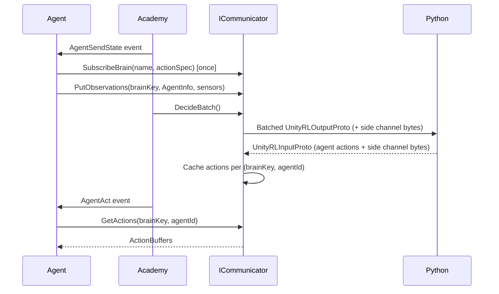
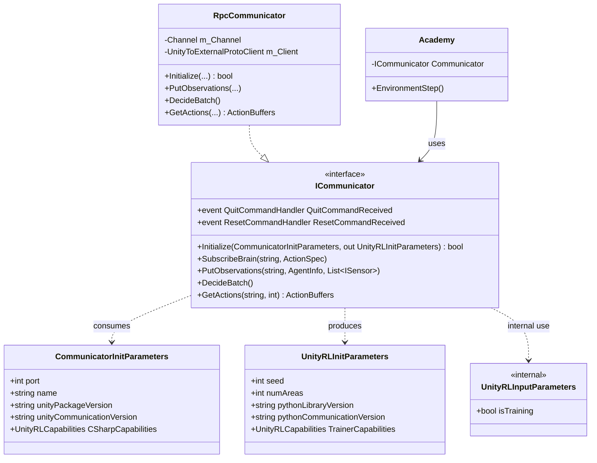

# Runtime Communicator

## Introduction

The **Runtime Communicator** module defines the core contract and data structures that Unity's ML-Agents C# runtime uses to exchange reinforcement-learning (RL) data with an external Python training/inference process. It is the thin abstraction layer that sits between the Unity simulation ([Unity_Agent_&_Environment_Foundation](runtime_core_agent.md)) and the concrete network transport implementation (gRPC-based `RpcCommunicator`), enabling the Unity side to remain agnostic of the underlying wire protocol.

This module is intentionally minimal — it consists of the `ICommunicator` interface, the initialization parameter structs (`CommunicatorInitParameters`, `UnityRLInitParameters`), the internal `UnityRLInputParameters` struct, and a set of delegates used for event-driven communication (quit, reset, and RL input notifications). Together these types form the **protocol boundary** of the Unity↔Python bridge.

---

## Purpose & Responsibilities

| Responsibility | Description |
|---|---|
| **Define the communication contract** | `ICommunicator` specifies the methods any transport implementation must provide: initialization handshake, brain (behavior) registration, observation submission, action decision triggering, and action retrieval. |
| **Carry initialization metadata** | `CommunicatorInitParameters` / `UnityRLInitParameters` transport version info, capabilities, and RNG seeds between Unity and Python during the handshake. |
| **Signal environment-level commands** | `QuitCommandHandler` and `ResetCommandHandler` delegates let the transport notify the `Academy` when Python asks Unity to quit or reset the environment. |
| **Report training state** | `UnityRLInputParameters` (internal) carries the `isTraining` flag sent from Python back to Unity. |

This module does **not** implement networking itself — it is a pure interface/data-contract layer. The actual gRPC transport lives in `RpcCommunicator` (same `Unity.MLAgents` namespace, `com.unity.ml-agents/Runtime/Communicator/RpcCommunicator.cs`), and the Python-side counterpart lives in [Python_Environment_Interface_Layer](envs_core.md) (`RpcCommunicator` / `UnityEnvironment`).

---

## Core Components

### `ICommunicator` (interface)

The central abstraction. Any class that implements `ICommunicator` can serve as the bridge between the `Academy` singleton and an external trainer process.

```csharp
public interface ICommunicator : IDisposable
{
    event QuitCommandHandler QuitCommandReceived;
    event ResetCommandHandler ResetCommandReceived;

    bool Initialize(CommunicatorInitParameters initParameters, out UnityRLInitParameters initParametersOut);
    void SubscribeBrain(string name, ActionSpec actionSpec);
    void PutObservations(string brainKey, AgentInfo info, List<ISensor> sensors);
    void DecideBatch();
    ActionBuffers GetActions(string key, int agentId);
}
```

Key semantics documented in the interface:
- **Exchange is sequential, not simultaneous.** When one side calls "exchange," it sends its current data and receives the *previous* response from the other side — a request/response ping-pong rather than true duplex streaming.
- **Message structure convention**: `UnityMessage` → `Header` + `UnityOutput` (`UnityRLOutput`, `UnityRLInitializationOutput`) + `UnityInput` (`UnityRLInput`, `UnityRLInitializationInput`). "Input" is always External→Unity; "Output" is Unity→External.
- The interface is extensible: `UnityOutput`/`UnityInput` and their RL sub-messages can be extended for functionality beyond core RL.

### `CommunicatorInitParameters` (struct)

Sent from Unity to Python at connection time.

| Field | Purpose |
|---|---|
| `port` | Port to listen for connections on. |
| `name` | Name of the environment. |
| `unityPackageVersion` | Version of the Unity ML-Agents SDK. |
| `unityCommunicationVersion` | Version of the wire protocol. |
| `CSharpCapabilities` | `UnityRLCapabilities` — feature flags supported by the C# side. |

### `UnityRLInitParameters` (struct)

Returned from Python to Unity as the result of `ICommunicator.Initialize`.

| Field | Purpose |
|---|---|
| `seed` | RNG seed sent by the Python trainer. |
| `numAreas` | Number of areas to replicate for [Training Area Replication](runtime_areas.md). |
| `pythonLibraryVersion` | Version string of the Python `mlagents_envs`/trainer library. |
| `pythonCommunicationVersion` | Protocol version used by Python. |
| `TrainerCapabilities` | `UnityRLCapabilities` reported by the trainer. |

### `UnityRLInputParameters` (internal struct)

```csharp
internal struct UnityRLInputParameters
{
    public bool isTraining;
}
```
Carries the single `isTraining` flag sent from Python on each exchange, indicating whether the connected process is actively training (as opposed to pure inference/evaluation).

### Delegates

| Delegate | Fired when | Consumed by |
|---|---|---|
| `QuitCommandHandler` | External communicator signals Unity should quit. | `Academy.OnQuitCommandReceived` |
| `ResetCommandHandler` | External communicator signals a forced environment reset. | `Academy.OnResetCommand` |
| `RLInputReceivedHandler` (internal) | New `UnityRLInputParameters` received. | Internal communicator plumbing. |

---

## Architecture



`ICommunicator` is the seam between the platform-agnostic Unity simulation loop (driven by [`Academy`](runtime_core_agent.md)) and the concrete transport. `RpcCommunicator` is the only production implementation shipped with the package, built conditionally under `MLA_SUPPORTED_TRAINING_PLATFORM`. When no trainer is available (e.g., standalone builds, or no `--mlagents-port` argument), `Academy` simply leaves `Communicator` as `null` and Agents fall back to local model inference.

---

## Data Flow: Initialization Handshake



1. `Academy.InitializeEnvironment()` builds a `CommunicatorInitParameters` struct with the local package/protocol version and capabilities.
2. It calls `ICommunicator.Initialize(...)`, which (in `RpcCommunicator`) performs a gRPC `Exchange` with the Python side.
3. Python responds with its own version info and RL init data, deserialized into `UnityRLInitParameters`.
4. `Academy` uses the returned seed, `numAreas`, and `TrainerCapabilities` to configure the simulation.
5. If versions are incompatible or no trainer is listening, `Initialize` returns `false` and `Academy` proceeds in inference-only mode.

---

## Data Flow: Per-Step Communication



- **`SubscribeBrain`** registers a behavior's `ActionSpec` once so Python knows the action/observation shapes for that behavior.
- **`PutObservations`** is called once per Agent per step, accumulating `AgentInfo` + sensor data into an internal batch.
- **`DecideBatch`** flushes the batch to Python in a single exchange, also piggy-backing [side channel](runtime_sidechannels.md) messages (e.g., environment parameters, engine configuration, stats) via `SideChannelManager`.
- **`GetActions`** retrieves the previously received action for a specific agent so the `Agent` class can apply it during the `AgentAct` phase.

---

## Component Relationships



---

## Relationship to Other Modules

| Module | Relationship |
|---|---|
| [Unity_Agent_&_Environment_Foundation](runtime_core_agent.md) | `Academy` owns the `ICommunicator` instance and drives the step loop that calls `PutObservations`/`DecideBatch`/`GetActions`. |
| `runtime_sidechannels` ([Unity-Python Bridge & ML Integration](runtime_sidechannels.md)) | Side-channel byte payloads are piggy-backed on the same `RpcCommunicator` exchange used for RL data. |
| `runtime_analytics` ([Unity-Python Bridge & ML Integration](runtime_analytics.md)) | `TrainingAnalyticsSideChannel`/`InferenceAnalytics` consume version/capability info exchanged during `Initialize`. |
| [Python_Environment_Interface_Layer](envs_core.md) | The Python-side `RpcCommunicator` and `UnityEnvironment` are the counterpart that speaks the same protobuf protocol defined by the message structure documented in `ICommunicator`. |
| [Training_Orchestration_&_Lifecycle_Infrastructure](trainers_core.md) | `SubprocessEnvManager`/`SimpleEnvManager` on the Python side ultimately drive the same exchange loop from the trainer's perspective. |

---

## Design Notes

- **Interface segregation**: `ICommunicator` exposes only what `Academy` and `Agent` need — registration, observation submission, batched decision, and action retrieval. All wire-format details (protobuf messages, gRPC channels) are hidden inside `RpcCommunicator`.
- **Testability**: Because communication is behind an interface, tests and editor tooling can substitute mock implementations (see `MockCommunicator` in the [Python Environment Interface Layer](envs_core.md) for the analogous Python-side pattern).
- **Versioning safety**: `CommunicatorInitParameters`/`UnityRLInitParameters` carry explicit protocol and package version strings so that `RpcCommunicator.CheckCommunicationVersionsAreCompatible` can detect and warn about mismatched Unity/Python versions before any RL data flows.
- **Graceful degradation**: If `Initialize` fails (no trainer listening, incompatible versions), `Academy` sets `Communicator = null` and the environment runs in local-inference mode using `ModelRunner` instead of requiring a Python process.
