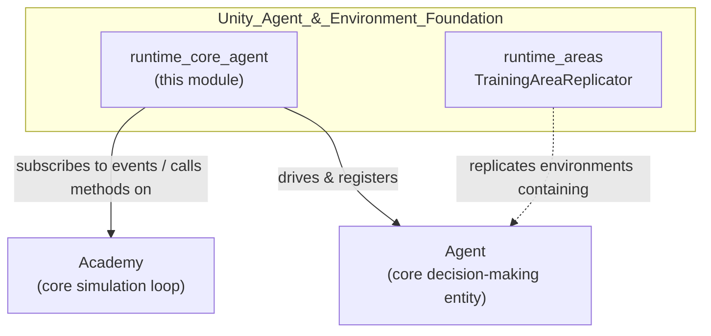
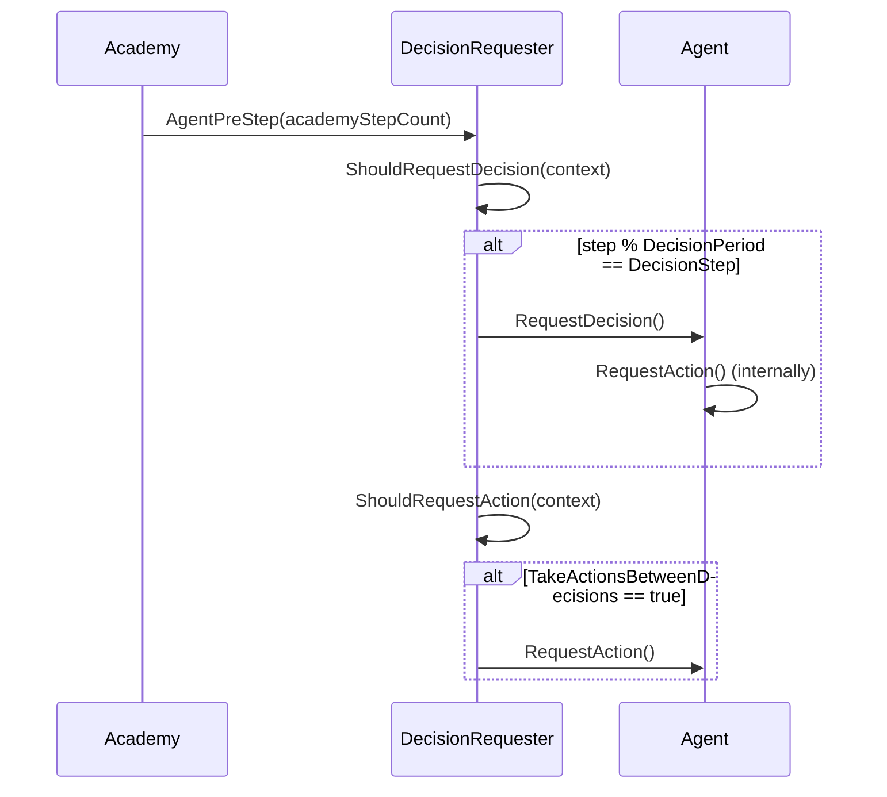
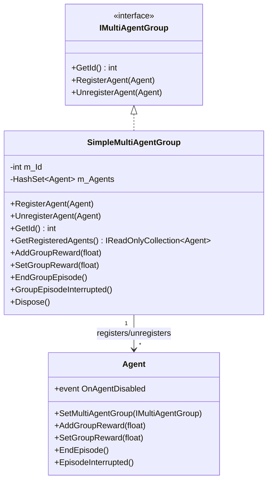
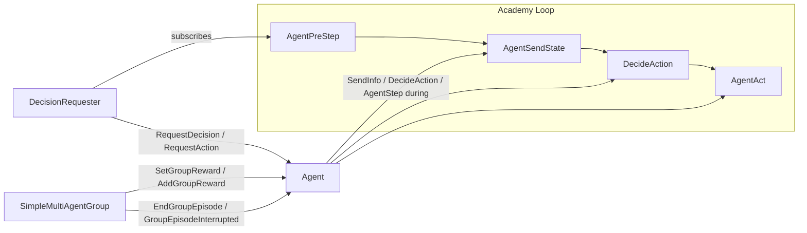

# Runtime Core Agent Module

## 1. Purpose & Overview

The **runtime_core_agent** module provides two small but essential runtime utilities that sit directly on top of the core ML-Agents `Agent` / `Academy` simulation loop:

| Component | File | Responsibility |
|---|---|---|
| `DecisionRequester` | `com.unity.ml-agents/Runtime/DecisionRequester.cs` | A `MonoBehaviour` that automatically drives an `Agent`'s decision/action cadence by subscribing to the `Academy`'s per-step events, removing the need for manual `RequestDecision()`/`RequestAction()` calls. |
| `SimpleMultiAgentGroup` | `com.unity.ml-agents/Runtime/SimpleMultiAgentGroup.cs` | A concrete, ready-to-use implementation of `IMultiAgentGroup` that lets a designer group multiple `Agent` instances together so that group-level rewards and episode-termination signals can be broadcast to every member. |

Both components are thin orchestration layers: they do not implement any ML logic themselves, but they wire designer-facing Unity Editor concepts (a `MonoBehaviour` component and a plain C# helper class) into the lower-level `Agent`/`Academy` event system that governs the simulation step lifecycle.

This module is a child of the broader **Unity_Agent_&_Environment_Foundation** module tree, sitting alongside its sibling `runtime_areas` (see [runtime_areas.md](runtime_areas.md)) which handles training-area replication for parallelized environments.

## 2. Where This Module Fits

* **`Academy`** is the ML-Agents simulation singleton that steps the environment and fires lifecycle events (`AgentPreStep`, `AgentSendState`, `DecideAction`, `AgentAct`, `AgentForceReset`). `DecisionRequester` hooks directly into `Academy.Instance.AgentPreStep`.
* **`Agent`** is the base class representing a trainable entity. Both components in this module operate on `Agent` instances — `DecisionRequester` requires one on the same GameObject, and `SimpleMultiAgentGroup` registers/unregisters `Agent`s to coordinate group rewards.
* Editor-side inspectors for agent configuration (e.g., `AgentEditor`, `BehaviorParametersEditor`) live in the separate `editor_core` documentation (see [editor_core.md](editor_core.md)) and are not part of this module.
* Sensor and actuator components that an `Agent` may use for observations/actions are documented separately in the Unity Perception & Sensing and Unity Actuation & Input Integration module docs.

## 3. Architecture

### 3.1 DecisionRequester — Driving the Decision Cadence

`DecisionRequester` is a `MonoBehaviour` with `[RequireComponent(typeof(Agent))]`, meaning it must live on the same GameObject as an `Agent`. On `Awake()`, it locates the sibling `Agent` component and subscribes `MakeRequests` to `Academy.Instance.AgentPreStep`, an event fired once per environment step *before* agents send their state.

Key configurable fields:
- **`DecisionPeriod`** (1–20): how many Academy steps elapse between decisions.
- **`DecisionStep`** (0 to `DecisionPeriod - 1`): a phase offset so that multiple agents with the same period don't all request decisions on the same tick (useful for load-balancing training).
- **`TakeActionsBetweenDecisions`**: if true, the agent still calls `RequestAction()` (replaying its last decision) on steps where a new decision isn't requested.

`ShouldRequestDecision` and `ShouldRequestAction` are `protected virtual`, so subclasses can override the default modulo-based cadence with custom logic (e.g., event-driven decisions) while still reusing the wiring to the `Academy`.

On `OnDestroy()`, the component defensively unsubscribes from `Academy.Instance.AgentPreStep` only if the Academy singleton is already initialized, avoiding an unwanted re-creation of the Academy during teardown.

### 3.2 SimpleMultiAgentGroup — Coordinating Multi-Agent Rewards

`SimpleMultiAgentGroup` implements `IMultiAgentGroup` (`GetId`, `RegisterAgent`, `UnregisterAgent`) plus `IDisposable`. It maintains an internal `HashSet<Agent>` and a unique group id obtained from `MultiAgentGroupIdCounter`.

Responsibilities:
- **Registration**: `RegisterAgent(agent)` calls `agent.SetMultiAgentGroup(this)`, adds the agent to the internal set, and hooks `agent.OnAgentDisabled` so that the group automatically unregisters an agent if it is disabled — preventing dangling references.
- **Reward broadcasting**: `AddGroupReward(float)` / `SetGroupReward(float)` iterate over every registered agent and call the corresponding internal `Agent.AddGroupReward` / `Agent.SetGroupReward`. Group rewards are tracked separately from individual per-agent rewards inside `Agent`, and are treated distinctly during training (this is central to cooperative multi-agent algorithms such as POCA — see [trainers_poca.md](trainers_poca.md)).
- **Episode control**: `EndGroupEpisode()` and `GroupEpisodeInterrupted()` call `Agent.EndEpisode()` / `Agent.EpisodeInterrupted()` on every member, letting a designer terminate an entire group's episode simultaneously (e.g., when a shared objective is completed or failed).
- **Cleanup**: `Dispose()` unregisters every agent still in the group.

### 3.3 Combined Data/Control Flow

## 4. Usage Patterns

1. **Single-agent decision cadence**: Attach `DecisionRequester` next to an `Agent` component in the Editor (its inspector is documented in [editor_core_agent_inspectors.md](editor_core_agent_inspectors.md) via `AgentEditor`/`BehaviorParametersEditor`), and tune `DecisionPeriod`/`DecisionStep` for performance vs. responsiveness trade-offs.
2. **Cooperative multi-agent training**: Instantiate a `SimpleMultiAgentGroup` in a scene controller script, `RegisterAgent()` each participating `Agent`, and call `AddGroupReward`/`EndGroupEpisode` when group-level events occur (e.g., all agents reach a shared goal). This pattern underlies cooperative algorithms like POCA (`trainers_poca`) that consume the resulting group-reward signal on the Python training side.
3. **Combining both**: A typical cooperative environment attaches a `DecisionRequester` to every `Agent` for consistent step cadence, while a single `SimpleMultiAgentGroup` instance coordinates rewards and episode termination across the whole team.

## 5. Related Modules

- [runtime_areas.md](runtime_areas.md) — `TrainingAreaReplicator`, the sibling module that replicates training areas (each potentially containing agents managed by this module) for parallelized environment instances.
- [editor_core_agent_inspectors.md](editor_core_agent_inspectors.md) — Editor inspectors (`AgentEditor`, `BehaviorParametersEditor`, `BrainParametersDrawer`) that expose `Agent`/`DecisionRequester`-related fields in the Unity Inspector.
- [trainers_poca.md](trainers_poca.md) — The POCA (multi-agent) trainer/optimizer on the Python side that specifically consumes the group-reward signal produced via `SimpleMultiAgentGroup`.
- [trainers_core.md](trainers_core.md) — `AgentManager` and related Python-side infrastructure that receives per-step `AgentInfo` (including `groupId`/`groupReward`) sent from the `Agent`/`Academy` runtime loop that this module helps drive.
