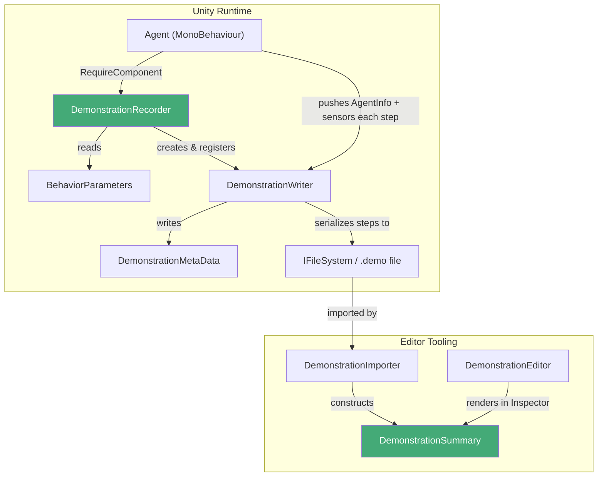
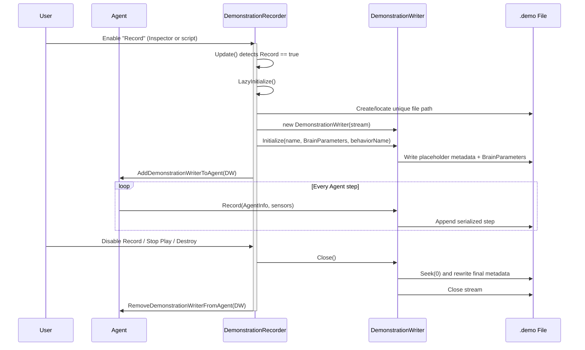
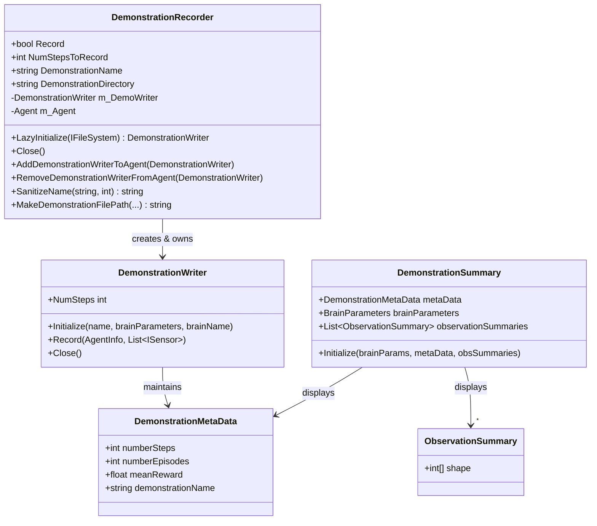
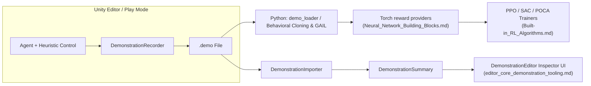

# Runtime Demonstrations Module

## Introduction

The **Runtime Demonstrations** module is part of the [Unity-Python Bridge & ML Integration](Unity-Python_Bridge_&_ML_Integration.md) area of the ML-Agents Unity package (`com.unity.ml-agents/Runtime/Demonstrations/`). It provides the runtime machinery for **recording human/heuristic gameplay as imitation-learning demonstrations** and for **summarizing recorded demonstration files** so they can be inspected inside the Unity Editor.

Demonstrations recorded by this module are consumed by the Python training pipeline (see [Built-in RL Algorithms](Built-in_RL_Algorithms.md), specifically Behavioral Cloning and GAIL reward providers documented in [Neural Network Building Blocks](Neural_Network_Building_Blocks.md)) to bootstrap or guide agent training from expert trajectories.

This module contains two core components:

| Component | File | Responsibility |
|---|---|---|
| `DemonstrationRecorder` | `DemonstrationRecorder.cs` | `MonoBehaviour` attached to an `Agent` GameObject that manages the lifecycle of recording a demonstration to disk. |
| `DemonstrationSummary` | `DemonstrationSummary.cs` | Lightweight `ScriptableObject` data holder used purely for displaying demonstration file metadata in the Unity Inspector. |

## Purpose and Core Functionality

### Recording Demonstrations

`DemonstrationRecorder` is a drop-in component (`[RequireComponent(typeof(Agent))]`) that a developer adds to the same GameObject as an `Agent`. When `Record` is enabled (either in the Inspector or the [Demonstration Recorder Editor](editor_core_demonstration_tooling.md)), the recorder:

1. Lazily creates a `DemonstrationWriter` bound to a file stream, sanitizing and de-duplicating the target file name/path.
2. Registers the writer with the `Agent` (via `Agent.DemonstrationWriters`) so that every step of agent experience (observations + actions + reward) is serialized to the `.demo` file automatically as the agent runs.
3. Monitors the recorded step count against `NumStepsToRecord` and can automatically stop Play Mode / quit the application once the threshold is reached.
4. Cleans up the underlying writer (flushing final metadata such as episode count and mean reward) when recording is closed or the component is destroyed.

### Summarizing Demonstrations

`DemonstrationSummary` is a minimal, serializable data container (not a `MonoBehaviour`) that stores:
- `DemonstrationMetaData` (episode/step counts, mean reward, demonstration name)
- `BrainParameters` (the observation/action specification recorded)
- A list of `ObservationSummary` structs (just the shape of each observation)

It has no runtime "logic" beyond an `Initialize` setter — its sole purpose is to act as an in-memory, Inspector-friendly snapshot of a `.demo` file's header data, produced by editor tooling when a demonstration asset is selected. See [Editor Core – Demonstration Tooling](editor_core_demonstration_tooling.md) for the `DemonstrationImporter`/`DemonstrationEditor` classes that create and render `DemonstrationSummary` instances.

## Architecture Overview

### Recording Sequence

### Class Relationships

## Component Details

### `DemonstrationRecorder`

Key responsibilities and behaviors:

- **Attachment contract**: Requires an `Agent` component on the same GameObject; reads `BehaviorParameters` for the behavior name and brain parameters used to initialize the writer.
- **Configuration fields** (Inspector-editable): `Record`, `NumStepsToRecord`, `DemonstrationName`, `DemonstrationDirectory`.
- **`LazyInitialize(IFileSystem)`**: Idempotent setup that resolves default name/directory, sanitizes the demonstration name (`SanitizeName`, max 16 chars, alphanumeric + space/hyphen only), computes a unique file path (`MakeDemonstrationFilePath`, appending `_0`, `_1`, ... to avoid overwriting existing files), opens the file stream, and constructs the `DemonstrationWriter`. The `IFileSystem` abstraction (from `System.IO.Abstractions`) allows the file system to be mocked in unit tests.
- **`Update()`**: While `Record` is true, ensures initialization has run and, if `NumStepsToRecord` is reached, stops the application (`Application.Quit` / exits Play Mode in the Editor).
- **`AddDemonstrationWriterToAgent` / `RemoveDemonstrationWriterFromAgent`**: Public API allowing other systems to attach *additional* `DemonstrationWriter` instances to the same `Agent` (e.g., for recording multiple simultaneous demonstration streams); the caller remains responsible for closing writers it added itself.
- **`Close()` / `OnDestroy()`**: Detaches and closes the writer, guaranteeing metadata (episode count, mean reward) is flushed even if the component is destroyed mid-recording.

This component has a direct editor-side counterpart, `DemonstrationEditor`/related inspector code, described in [Editor Core – Demonstration Tooling](editor_core_demonstration_tooling.md), which exposes `Record`, file naming, and step-limit controls in the Inspector UI.

### `DemonstrationSummary`

- Marked `internal` and `[Serializable]`; derives from `ScriptableObject` purely so Unity can serialize/display it via `SerializedObject` in a custom Inspector.
- Holds three pieces of data recovered by parsing a `.demo` file's header: `DemonstrationMetaData`, `BrainParameters`, and a list of `ObservationSummary` (just observation tensor shapes — nested arrays can't be serialized directly by Unity, hence the wrapper struct).
- Populated once via `Initialize(...)`; has no further mutating behavior — it is a read-only view model for the Editor.
- Constructed by `DemonstrationImporter` when a `.demo` asset is imported/selected, and rendered by `DemonstrationEditor`. Both live in [Editor Core – Demonstration Tooling](editor_core_demonstration_tooling.md).

## Data Model Dependencies

- **`DemonstrationWriter`** and **`DemonstrationMetaData`** (in the same `Demonstrations` namespace, not part of this module's core component list but essential collaborators) handle the low-level protobuf serialization of each step and the file's binary metadata header. `DemonstrationRecorder` creates and drives a `DemonstrationWriter`; `DemonstrationSummary` mirrors `DemonstrationMetaData`'s fields for display purposes.
- **`BehaviorParameters`** / **`BrainParameters`** (from the Unity_Agent_&_Environment_Foundation / Unity_Editor_Tooling areas) supply the observation/action specification written into the demonstration file header and reflected in `DemonstrationSummary.brainParameters`.
- **`Agent`** (core runtime agent class) is the integration point: it owns the collection of active `DemonstrationWriters` and calls `Record(AgentInfo, sensors)` on each one every step. See sensors and actuators documented in [Unity Perception & Sensing](Unity_Perception_&_Sensing.md) and [Unity Actuation & Input Integration](Unity_Actuation_&_Input_Integration.md) for the observation/action sources that feed into recorded demonstrations.

## How This Module Fits Into the Overall System

Demonstrations produced at runtime by this module are the entry point for imitation learning: they are later consumed on the Python side by trainers that use `BehavioralCloningSettings`/`GAILSettings` (see [Training Orchestration & Lifecycle Infrastructure](Training_Orchestration_&_Lifecycle_Infrastructure.md) and [Neural Network Building Blocks](Neural_Network_Building_Blocks.md)) to pretrain policies or shape rewards from expert data.

## Related Documentation

- [Editor Core – Demonstration Tooling](editor_core_demonstration_tooling.md) — `DemonstrationEditor` (custom Inspector for `DemonstrationRecorder`) and `DemonstrationImporter` (asset importer that produces `DemonstrationSummary` instances from `.demo` files).
- [Unity-Python Bridge & ML Integration](Unity-Python_Bridge_&_ML_Integration.md) — parent module covering side channels, analytics, and inference that, together with this module, bridge Unity runtime and the Python training stack.
- [Unity Agent & Environment Foundation](Unity_Agent_&_Environment_Foundation.md) — core `Agent`/decision infrastructure that this module hooks into.
- [Neural Network Building Blocks](Neural_Network_Building_Blocks.md) — `BCModule` and `GAILRewardProvider` that consume recorded demonstrations during training.
- [Built-in RL Algorithms](Built-in_RL_Algorithms.md) — trainers (PPO, SAC, POCA) that can be configured with `BehavioralCloningSettings`/`GAILSettings` to leverage these demonstrations.
