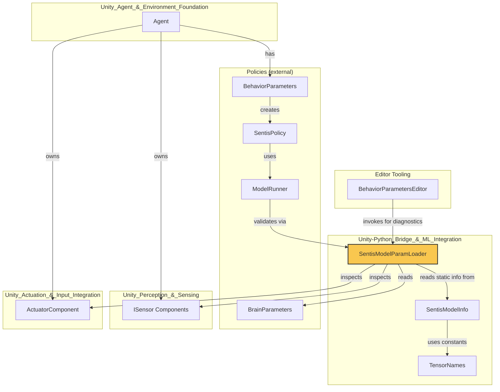
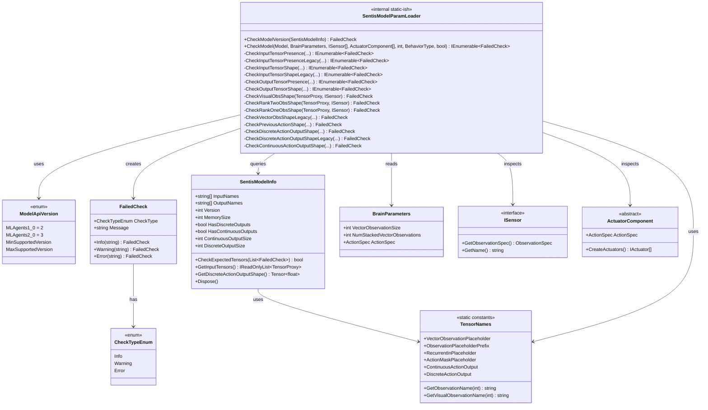
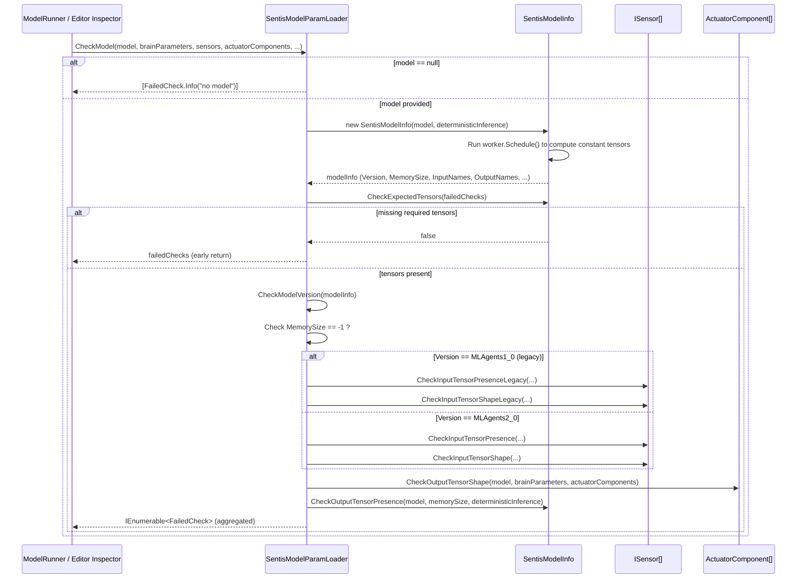
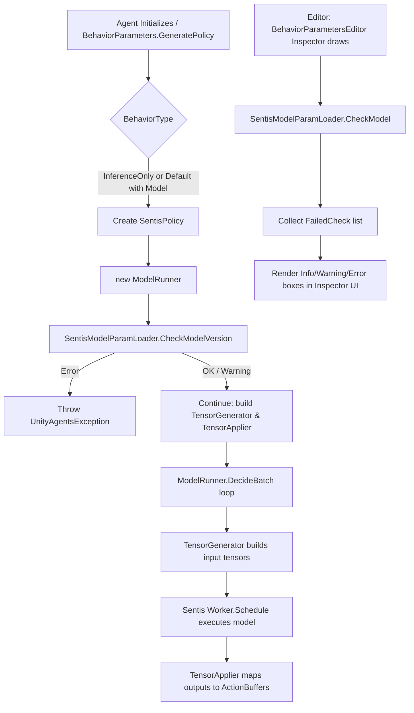
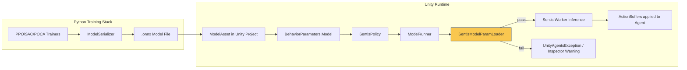

# Runtime Inference Module

## Introduction

The **Runtime Inference** module is a small but critical validation layer inside Unity ML-Agents' C# runtime. Its single core component, `SentisModelParamLoader`, is responsible for verifying that a neural-network model (exported by the Python training pipeline and loaded via Unity's [Sentis](https://docs.unity3d.com/Packages/com.unity.sentis@latest) inference engine) is **compatible** with the Agent's configured `BrainParameters`, attached `ISensor`s, and `ActuatorComponent`s before it is used to drive in-Unity inference.

This module sits at the boundary between:
- **Trained models** produced by the Python training stack (see [Built-in_RL_Algorithms](trainers_ppo.md), [Neural_Network_Building_Blocks](trainers_torch_entities.md) and their `ModelSerializer` export logic), and
- **Unity runtime execution** of Agents driven by those models (see [Unity_Agent_&_Environment_Foundation](runtime_core_agent.md), [Unity_Perception_&_Sensing](runtime_sensors.md), and [Unity_Actuation_&_Input_Integration](runtime_input.md)).

It does not perform inference itself; instead, it acts as a **pre-flight compatibility checker** that produces human-readable diagnostics (`FailedCheck`s) so that developers can quickly identify mismatches between a trained model and their Unity scene configuration (e.g., wrong number of sensors, incompatible action space, missing recurrent state, unsupported model version).

---

## Module Purpose & Core Functionality

| Aspect | Description |
|---|---|
| **Primary Class** | `SentisModelParamLoader` (internal, static-style utility class) |
| **Role** | Validates a Sentis `Model` against Unity-side `BrainParameters`, `ISensor[]`, and `ActuatorComponent[]` |
| **Output** | A collection of `FailedCheck` objects (Info / Warning / Error) describing incompatibilities |
| **Consumers** | `ModelRunner` (inference execution engine), Editor Inspectors (e.g., `BehaviorParametersEditor`) that surface these warnings to developers |
| **Model Versions Supported** | `MLAgents1_0` (legacy) and `MLAgents2_0` (current) tensor naming/layout conventions |

### Key Responsibilities

1. **Model Version Compatibility Check** (`CheckModelVersion`)
   Ensures the model's embedded `version_number` tensor falls within the supported range, and rejects legacy (v1.x) recurrent models that are no longer supported.

2. **Input Tensor Presence Validation** (`CheckInputTensorPresence` / `CheckInputTensorPresenceLegacy`)
   Confirms that the model exposes the expected input placeholders for each attached sensor (`obs_{i}` or legacy `vector_observation` / `visual_observation_{i}`), recurrent memory inputs, and discrete action masks.

3. **Input Tensor Shape Validation** (`CheckInputTensorShape` / `CheckInputTensorShapeLegacy`)
   Verifies that each sensor's `ObservationSpec` shape (rank 1, 2, or 3) matches the shape expected by the corresponding model input tensor.

4. **Output Tensor Presence & Shape Validation** (`CheckOutputTensorPresence`, `CheckOutputTensorShape`)
   Ensures the model produces the expected continuous/discrete action outputs (and recurrent outputs, if applicable) with sizes matching the combined `ActionSpec` from `BrainParameters` and all `ActuatorComponent`s.

5. **Aggregated Entry Point** (`CheckModel`)
   The primary factory-style method that orchestrates all the above checks and returns the full list of `FailedCheck`s for a given model/brain/sensor/actuator configuration.

---

## Architecture

See [runtime_core_agent.md](runtime_core_agent.md) for `Agent` details, [runtime_sensors.md](runtime_sensors.md) for `ISensor` implementations, and [runtime_input.md](runtime_input.md) / [runtime_integrations_match3.md](runtime_integrations_match3.md) for `ActuatorComponent` implementations.

---

## Component Relationships

---

## Data Flow: Model Validation Process

---

## Process Flow: How Checks Are Triggered at Runtime

---

## Key Concepts

### Model API Versions

`SentisModelParamLoader.ModelApiVersion` distinguishes between two generations of exported models:

| Version | Value | Description |
|---|---|---|
| `MLAgents1_0` | 2 | Legacy format: vector/visual observations split into separate placeholders (`vector_observation`, `visual_observation_{i}`); LSTM state handled natively by Sentis via `_c`/`_h` tensors; single combined `action` output. |
| `MLAgents2_0` | 3 | Current format: all observations unified as `obs_{i}`; recurrent state exposed as explicit `recurrent_in` / `recurrent_out` tensors; separate `continuous_actions` / `discrete_actions` outputs (with deterministic variants). |

Models trained with `MLAgents1_0` that also use recurrent networks (LSTM) are explicitly rejected, since Sentis has dropped `_c`/`_h` tensor support going forward.

This directly parallels the model export logic on the Python side — see `ModelSerializer` and `TensorNames` in [Neural_Network_Building_Blocks](trainers_torch_entities.md), which write these same tensor names/versions when serializing trained PyTorch policies to `.onnx`/Sentis-compatible formats.

### FailedCheck Severity Levels

- **Info** — Informational only (e.g., "no model assigned, but training is still possible").
- **Warning** — Indicates a shape/name mismatch that will likely cause incorrect behavior but does not halt initialization at the `CheckModel` level.
- **Error** — Currently reserved for unsupported model versions; raised as a hard `UnityAgentsException` by `ModelRunner` when constructing the inference engine (see `CheckModelVersion` usage in `ModelRunner`).

### Rank-Based Observation Shape Checks

For `MLAgents2_0` models, sensors are matched to model inputs by index (`obs_{i}`) and validated according to the observation's tensor **rank**:
- **Rank 1** → `CheckRankOneObsShape` (vector observations)
- **Rank 2** → `CheckRankTwoObsShape` (e.g., variable-length/buffer observations)
- **Rank 3** → `CheckVisualObsShape` (visual/image observations: width × height × channels)

Legacy `MLAgents1_0` models instead aggregate all rank-1 sensors into a single combined `vector_observation` tensor (`CheckVectorObsShapeLegacy`) and use `visual_observation_{i}` naming for rank-3 sensors.

---

## Dependencies

| Dependency | Relationship |
|---|---|
| `SentisModelInfo` | Wraps the raw Sentis `Model`/`Worker` to extract static metadata (version, memory size, input/output names, output sizes) by executing the model once with dummy zeroed inputs. `SentisModelParamLoader` relies heavily on this class and disposes of it after use. |
| `TensorNames` | Centralized string constants for all well-known input/output tensor names (both current and deprecated), used throughout the presence/shape checks. |
| `BrainParameters` (Policies) | Declares the Agent-level vector observation size, stacking, and `ActionSpec`; compared against the model's declared input/output tensor shapes. |
| `ISensor` (Sensors) | Each attached sensor's `ObservationSpec` (shape/rank) is checked against the corresponding model input tensor. See [runtime_sensors.md](runtime_sensors.md). |
| `ActuatorComponent` (Actuators) | Each attached actuator's `ActionSpec` contributes to the total expected continuous/discrete action output size. See [runtime_input.md](runtime_input.md) and [runtime_integrations_match3.md](runtime_integrations_match3.md). |
| `ModelRunner` (Inference, not part of this module's core components but a primary consumer) | Calls `SentisModelParamLoader.CheckModelVersion` during construction to fail fast on unsupported model versions before building the `TensorGenerator`/`TensorApplier` pipeline. |
| `BehaviorParametersEditor` (Editor Tooling) | Calls `CheckModel` to surface compatibility warnings directly in the Unity Inspector UI, helping developers debug mismatched models before entering Play mode. See [editor_core_agent_inspectors.md](editor_core_agent_inspectors.md). |

---

## Relationship to the Broader ML-Agents System

This module is the **safety net** ensuring that models exported from Python training (see [Built-in_RL_Algorithms](trainers_ppo.md), [trainers_sac.md](trainers_sac.md), [trainers_poca.md](trainers_poca.md), and their shared serialization logic in [Neural_Network_Building_Blocks](trainers_torch_entities.md)) remain usable and correctly wired when imported back into a Unity scene for in-engine inference. Without this validation, mismatches (e.g., changing the number of sensors on an Agent after training, or forgetting to update the model asset) would result in silent tensor shape errors or crashes deep inside the Sentis execution engine, rather than clear, actionable diagnostics.

---

## Related Modules

- [runtime_core_agent.md](runtime_core_agent.md) — `Agent` and `DecisionRequester`, which drive when decisions (and therefore inference) are requested.
- [runtime_sensors.md](runtime_sensors.md) — `ISensor` implementations whose `ObservationSpec`s are validated against model inputs.
- [runtime_input.md](runtime_input.md) / [runtime_integrations_match3.md](runtime_integrations_match3.md) — `ActuatorComponent` implementations whose `ActionSpec`s are validated against model outputs.
- [editor_core_agent_inspectors.md](editor_core_agent_inspectors.md) — `BehaviorParametersEditor`, the primary UI surface for displaying `FailedCheck` diagnostics to developers.
- [trainers_torch_entities.md](trainers_torch_entities.md) — `ModelSerializer` and `TensorNames` (Python-side), which define the export format this module validates against.
- [runtime_analytics.md](runtime_analytics.md) — `InferenceAnalytics`, which may report on inference usage/configuration alongside model validation.
