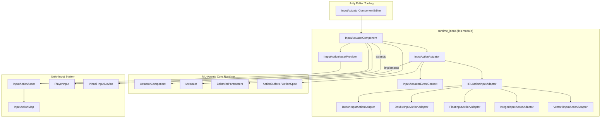
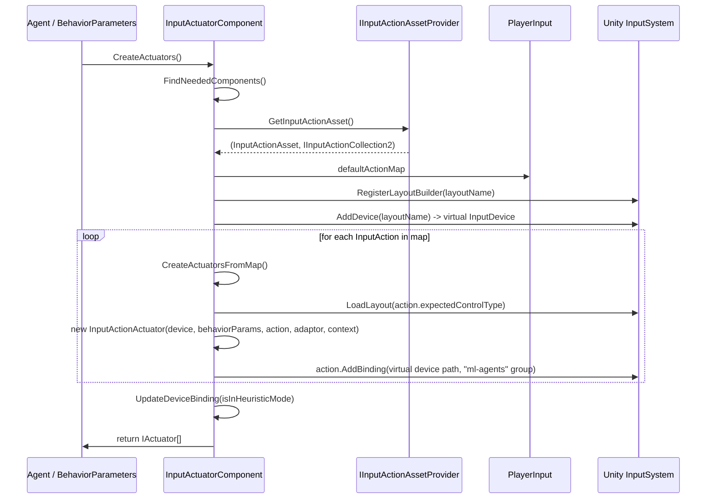
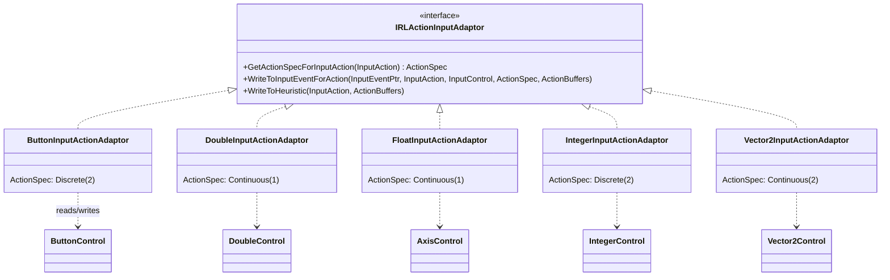

# Runtime Input Module

## Purpose

The `runtime_input` module is the core runtime bridge between Unity's **Input System** package and ML-Agents' **Actuator** framework. It allows a Unity `InputActionAsset` (normally driven by keyboard/gamepad/mouse input) to be transparently driven by a trained neural-network policy or by a human via ML-Agents' heuristic mode.

In practice this module lets a game that was built entirely around Unity's new Input System be turned into an ML-Agents environment **without rewriting any gameplay code**: the module creates a virtual `InputDevice`, and for every `InputAction` in the player's default `InputActionMap` it builds a corresponding ML-Agents `IActuator`. When the agent is being trained/run by a policy, the actuator writes the policy's action values into the virtual device as if a real device had produced them. When the agent is in heuristic (human-control) mode, the flow is reversed: real input is read and converted back into `ActionBuffers` so that recorded demonstrations / heuristics match the semantics of the neural network's action space.

This module is guarded by the `MLA_INPUT_SYSTEM` compilation symbol and is only compiled when the Unity Input System package is present in the project.

## Where this module fits

`runtime_input` is one of two children of the **[Unity_Actuation_&_Input_Integration](runtime_integrations_match3.md)** area of the codebase, the other being the Match-3 integration (`runtime_integrations_match3`, see [runtime_integrations_match3.md](runtime_integrations_match3.md)). Both children provide domain-specific `ActuatorComponent`/`SensorComponent` implementations that plug into the generic ML-Agents `Agent`/`BehaviorParameters` runtime described in [runtime_core_agent.md](runtime_core_agent.md).

The Unity Editor exposes a custom inspector for this module's main component; see **[editor_component_inspectors.md](editor_component_inspectors.md)** (`InputActuatorComponentEditor`) for the editor-side tooling.

## Core Concepts

| Concept | Description |
|---|---|
| `IInputActionAssetProvider` | Interface a `MonoBehaviour` implements to expose the `InputActionAsset` (and its generated `IInputActionCollection2`) that should be simulated. Required alongside `PlayerInput` on the same `GameObject` as `InputActuatorComponent`. |
| `InputActuatorComponent` | The `ActuatorComponent` that discovers all `InputAction`s in the default action map, builds one `InputActionActuator` per action, and creates/manages a virtual `InputDevice` bound with a dedicated `ml-agents` `InputControlScheme`. |
| `InputActionActuator` | An `IActuator`/`IBuiltInActuator` wrapper around a single `InputAction`. Delegates the actual data conversion to an `IRLActionInputAdaptor`. |
| `IRLActionInputAdaptor` | Strategy interface converting between `InputAction`/`InputControl` values and ML-Agents `ActionBuffers`/`ActionSpec`. One concrete adaptor exists per Input System control type. |
| `InputActuatorEventContext` | Helper that batches writes from multiple actuators into a single `InputEventPtr` per frame/tick before queuing it to the Input System, to avoid one event per actuator. |

## Architecture & Data Flow

### Component discovery and setup

### Runtime action flow (policy → game)

When the agent is **not** in heuristic mode (i.e., driven by a trained model or remote policy), each `InputActionActuator.OnActionReceived` call converts the `ActionBuffers` produced by the policy into a raw Input System event:

```mermaid
flowchart LR
    Policy[Trained Policy / Remote Brain] -->|ActionBuffers| Actuator[InputActionActuator.OnActionReceived]
    Actuator --> Adaptor[IRLActionInputAdaptor.WriteToInputEventForAction]
    Adaptor --> EventPtr[InputEventPtr via InputActuatorEventContext]
    EventPtr -->|StateEvent.From / QueueEvent| Device[Virtual InputDevice]
    Device --> InputAction[Bound InputAction fires]
    InputAction --> Game[Game logic subscribed to InputAction]
```

### Heuristic flow (human input → training data)

When running in heuristic mode (e.g. to record demonstrations), the flow is reversed: real device input drives the `InputAction`, and the adaptor reads its current value back into an `ActionBuffers` used by the `Agent.Heuristic` callback:

### Control-type → Adaptor mapping

`InputActuatorComponent.controlTypeToAdaptorType` is a static dictionary mapping the Input System's `InputControl` subclasses to the adaptor responsible for that data type:

| Input System Control | Adaptor | Generated `ActionSpec` |
|---|---|---|
| `Vector2Control` | `Vector2InputActionAdaptor` | Continuous, size 2 (x, y) |
| `ButtonControl` | `ButtonInputActionAdaptor` | Discrete, 1 branch of size 2 (pressed / not pressed) |
| `IntegerControl` | `IntegerInputActionAdaptor` | Discrete, 1 branch of size 2 *(TODO: branch size currently hard-coded)* |
| `AxisControl` | `FloatInputActionAdaptor` | Continuous, size 1 |
| `DoubleControl` | `DoubleInputActionAdaptor` | Continuous, size 1 (cast to/from `double`) |

## Component Reference

### `IInputActionAssetProvider`
*File:* `com.unity.ml-agents/Runtime/Input/IInputActionAssetProvider.cs`

Interface that a `MonoBehaviour` on the same `GameObject` as `InputActuatorComponent` can implement to explicitly hand over the `InputActionAsset` and its generated `IInputActionCollection2` wrapper. This is needed when the project uses the generated C# wrapper class for an `InputActionAsset` (rather than driving everything purely through `PlayerInput`). If not implemented, `InputActuatorComponent` falls back to using the asset referenced by the required `PlayerInput` component.

### `InputActuatorComponent`
*File:* `com.unity.ml-agents/Runtime/Input/InputActuatorComponent.cs`

The primary `ActuatorComponent` of this module (`[RequireComponent(typeof(PlayerInput), typeof(IInputActionAssetProvider))]`). Responsibilities:

- **Discovery** (`FindNeededComponents`): locates `IInputActionAssetProvider`, `PlayerInput`, and `BehaviorParameters` on the `GameObject`, and subscribes to `BehaviorParameters.OnPolicyUpdated` so the device bindings can be reconfigured whenever the Agent switches between heuristic and policy-driven mode.
- **Actuator creation** (`CreateActuators`): for the default `InputActionMap`, registers a dynamic `InputControlLayout` (`RegisterLayoutBuilder`) describing one virtual control per `InputAction`, instantiates a virtual `InputDevice` from that layout, and creates one `InputActionActuator` per action via `CreateActuatorsFromMap`, wiring each `InputAction` to a binding path pointing at the new device under the reserved `ml-agents` control scheme/group.
- **Binding management** (`UpdateDeviceBinding`): toggles whether the `InputActionMap`/`InputActionAsset` should read from the real devices (heuristic mode) or exclusively from the ML-Agents virtual device (policy mode), by adding/removing an `ml-agents` `InputControlScheme` and setting `bindingMask`/`devices` on the collection and action map.
- **Frame batching** (`GetEventForFrame` / `EventProcessedInFrame`): legacy/simple per-frame event batching API kept for backward compatibility; the more general mechanism used by actuators is `InputActuatorEventContext`.
- **Cleanup** (`OnDisable` → `CleanupActionAsset`): removes the registered layout, the virtual device, the `ml-agents` control scheme, and unsubscribes from `BehaviorParameters` events.
- **Editor-time `ActionSpec` preview**: in the Unity Editor (outside Play mode) the `ActionSpec` getter lazily builds actuators once to compute and cache the combined `ActionSpec`, enabling the editor inspector (`InputActuatorComponentEditor`, see [editor_component_inspectors.md](editor_component_inspectors.md)) to display the resulting action space without entering Play mode.

### `InputActionActuator`
*File:* `com.unity.ml-agents/Runtime/Input/InputActionActuator.cs` (referenced dependency)

Implements `IActuator` and `IBuiltInActuator` (`BuiltInActuatorType.InputActionActuator`). Wraps a single `InputAction` plus its `IRLActionInputAdaptor`:

- `OnActionReceived(ActionBuffers)`: only writes to the Input System when `BehaviorParameters.IsInHeuristicMode()` is `false` — i.e., only when a policy is actually driving the agent. Obtains a shared `InputEventPtr` from `InputActuatorEventContext` and delegates the actual value conversion to the adaptor.
- `Heuristic(ActionBuffers)`: delegates to the adaptor's `WriteToHeuristic`, translating the real, currently-read `InputAction` value into the `ActionBuffers` the training pipeline expects (see [trainers_core.md](trainers_core.md) for how heuristics feed into demonstration recording).
- `WriteDiscreteActionMask`: currently a no-op (marked as a `TODO` for editor-driven masking).
- `ResetData`: no-op (input actuators are stateless between steps).

### `InputActuatorEventContext`
*File:* `com.unity.ml-agents/Runtime/Input/InputActuatorEventContext.cs` (referenced dependency)

Implements `IDisposable` and is used to coalesce writes from **all** `InputActionActuator`s of a single device into one `StateEvent`/`InputEventPtr` per "tick" (`NumTimesToProcess`, generally the number of actuators on the device), instead of queuing a separate Input System event per actuator. `GetEventForFrame` lazily allocates the underlying `NativeArray<byte>` buffer via `StateEvent.From`, and `Dispose` (called once per actuator via `using`) increments an internal counter and only calls `InputSystem.QueueEvent` (and disposes the native buffer) once every actuator sharing the context has written its value.

### `IRLActionInputAdaptor` and concrete adaptors
*Files:* `IRLActionInputAdaptor.cs` (interface, referenced dependency) and the five adaptor implementations under `Runtime/Input/Adaptors/`.

Each adaptor is a small, stateless strategy object implementing three responsibilities:

1. `GetActionSpecForInputAction(InputAction)` — declares the `ActionSpec` (continuous vs discrete, and dimensionality) that ML-Agents should expose for this kind of control.
2. `WriteToInputEventForAction(...)` — takes values out of `ActionBuffers` (as produced by a policy) and writes them into a raw `InputEventPtr` for the given `InputControl`, using `InputControl.WriteValueIntoEvent`.
3. `WriteToHeuristic(...)` — reads the current value from the live `InputAction` (`action.ReadValue<T>()`) and writes it into `ActionBuffers` so heuristic/demo-recording code sees the same semantics a trained policy would produce.

| Adaptor | Backing Control | Value type | Notes |
|---|---|---|---|
| `ButtonInputActionAdaptor` | `ButtonControl` | `float` (0/1) | Modeled as a 2-way discrete action; a `TODO` notes that trigger-like continuous buttons need more nuanced handling. |
| `DoubleInputActionAdaptor` | `DoubleControl` | `double` | Continuous, single value; casts between `double` and ML-Agents' `float` buffers. |
| `FloatInputActionAdaptor` | Any `InputControl<float>` (e.g. `AxisControl`) | `float` | Continuous, single value; the simplest 1:1 adaptor. |
| `IntegerInputActionAdaptor` | `IntegerControl` | `int` | Currently hard-codes a discrete branch size of 2; a `TODO` notes branch size should be inferred. |
| `Vector2InputActionAdaptor` | Any `InputControl<Vector2>` | `Vector2` | Continuous, 2 values (x, y). |

All adaptors and the `InputActuatorComponent`/related types carry `[MovedFrom("Unity.MLAgents.Extensions.Input")]` attributes, indicating this functionality was migrated into the core `com.unity.ml-agents` package from a former `Extensions` package while preserving serialization compatibility.

## Compilation & Dependencies

- The entire module is wrapped in `#if MLA_INPUT_SYSTEM ... #endif`, so it only compiles when the Unity Input System package define is present.
- Depends on the ML-Agents Actuator abstractions (`IActuator`, `ActuatorComponent`, `ActionSpec`, `ActionBuffers`, `IBuiltInActuator`) from the core runtime, and `BehaviorParameters`/`Agent` from [runtime_core_agent.md](runtime_core_agent.md) to determine heuristic vs. policy mode.
- Has a corresponding editor inspector, `InputActuatorComponentEditor`, documented in [editor_component_inspectors.md](editor_component_inspectors.md).
- Sibling module [runtime_integrations_match3.md](runtime_integrations_match3.md) follows the same "domain-specific ActuatorComponent + SensorComponent" pattern for Match-3 style games, and is a good reference for comparing integration approaches.
