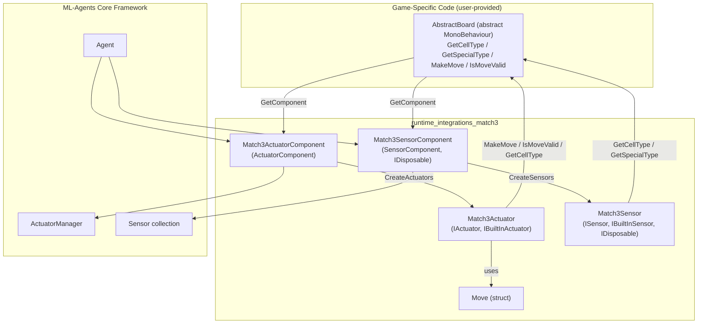
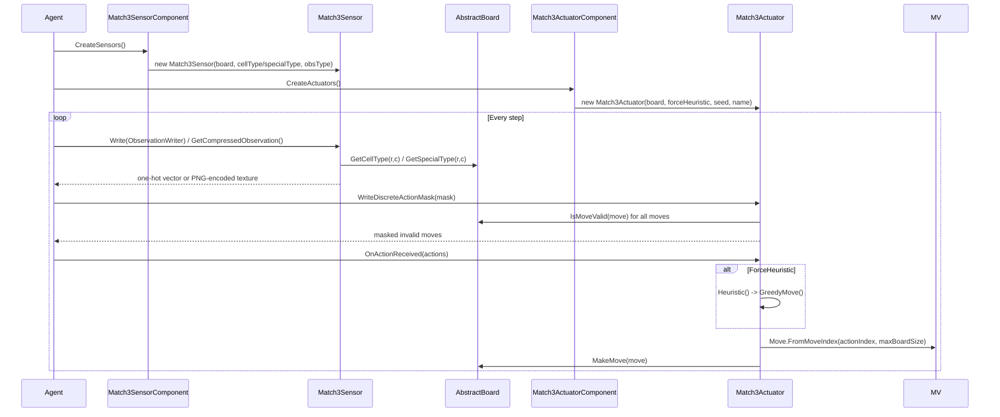

# Runtime Integrations: Match3

## Introduction & Purpose

The **`runtime_integrations_match3`** module provides a ready-made ML-Agents integration for Match-3 style puzzle games (e.g., swap-adjacent-tile matching games). Rather than requiring game developers to write custom `Sensor`/`Actuator` implementations from scratch, this module exposes two drop-in Unity components:

- **`Match3ActuatorComponent`** — turns Agent decisions into board moves.
- **`Match3SensorComponent`** — turns board state into observations for the Agent's neural network.

Both components are declarative wrappers: they are attached to a `GameObject` alongside an implementation of the abstract `AbstractBoard` class (which the *game developer* must supply), and at runtime they instantiate the actual `IActuator`/`ISensor` objects (`Match3Actuator` and `Match3Sensor`) that do the heavy lifting.

This module is a specialized, genre-specific counterpart to the generic [runtime_input](runtime_input.md) module (which integrates Unity's Input System with actuators) — together they form the **Unity_Actuation_&_Input_Integration** group of the wider Unity Editor/Runtime SDK. It is designed to plug into the same `Agent`/`SensorComponent`/`ActuatorComponent` framework documented in the [editor_core_agent_inspectors](editor_core_agent_inspectors.md) and [runtime_core_agent](runtime_core_agent.md) modules.

## Architecture Overview

The Match3 integration follows the standard ML-Agents Sensor/Actuator component pattern: `*Component` classes are `MonoBehaviour`s configured in the Unity Inspector, and they lazily create the actual runtime objects (`Match3Actuator`, `Match3Sensor`) that implement the `IActuator`/`ISensor` interfaces used by the Agent's decision loop.

### Key Design Points

1. **Board abstraction (`AbstractBoard`)**: Game developers implement this abstract class to expose the board's grid dimensions, cell "colors" (`GetCellType`), optional "special" piece types (`GetSpecialType`), move validation (`IsMoveValid`), and move execution (`MakeMove`). The Match3 integration components discover the board via `GetComponent<AbstractBoard>()` on the same `GameObject`.
2. **Move encoding (`Move`)**: A `Move` represents swapping two adjacent cells (identified by row/column + `Direction`). The `Move` struct provides bidirectional conversion between a flat integer `MoveIndex` (used for the discrete action space) and (row, column, direction) triples, plus enumeration helpers (`AllMoves`, `ValidMoves` on `AbstractBoard`).
3. **Lazy creation pattern**: Both components implement `CreateActuators()` / `CreateSensors()`, which are called by the Agent framework once per Agent initialization. If no `AbstractBoard` is present, they return empty arrays, causing the Agent to skip Match3 functionality gracefully.
4. **Disposal**: `Match3SensorComponent` implements `IDisposable` to clean up the internal `Texture2D` used for compressed visual observations (owned by `Match3Sensor`).

## Component Interaction / Data Flow

## Core Components

### `Match3ActuatorComponent`
*File: `com.unity.ml-agents/Runtime/Integrations/Match3/Match3ActuatorComponent.cs`*

A `MonoBehaviour`-derived `ActuatorComponent` that generates a `Match3Actuator` at runtime.

- **Configuration (Inspector-editable via [Match3ActuatorComponentEditor](editor_component_inspectors.md))**:
  - `ActuatorName` — display name for the generated actuator.
  - `RandomSeed` — seed for the actuator's internal `System.Random` (used for tie-breaking in the heuristic); defaults to the `GameObject`'s instance ID if left at `-1`.
  - `ForceHeuristic` — forces the Agent's `Heuristic()`-derived greedy move regardless of the policy's output; intended only for testing/benchmarking.
- **`CreateActuators()`**: Looks up the sibling `AbstractBoard` component. If absent, returns an empty actuator array (no-op). Otherwise constructs a single `Match3Actuator`.
- **`ActionSpec`**: Computed dynamically from the board's `GetMaxBoardSize()` via `Move.NumPotentialMoves(...)`, producing a single discrete branch sized to the total number of legal swap moves on the board.

### `Match3SensorComponent`
*File: `com.unity.ml-agents/Runtime/Integrations/Match3/Match3SensorComponent.cs`*

A `SensorComponent` (also `IDisposable`) that generates one or two `Match3Sensor` instances at runtime.

- **Configuration (Inspector-editable via [Match3SensorComponentEditor](editor_component_inspectors.md))**:
  - `SensorName` — base name; suffixed with `" (cells)"` and `" (special)"` for the generated sensors.
  - `ObservationType` (`Match3ObservationType`) — controls whether observations are emitted as flat vectors, uncompressed visual tensors, or PNG-compressed visual tensors.
- **`CreateSensors()`**: Disposes any previously created sensors, then looks up the sibling `AbstractBoard`. It always creates a **cell-type sensor** (`Match3Sensor.CellTypeSensor`). If the board reports `NumSpecialTypes > 0`, it also creates a **special-type sensor** (`Match3Sensor.SpecialTypeSensor`); otherwise only the cell sensor is returned.
- **`Dispose()`**: Iterates any created `Match3Sensor`s and disposes them (releasing their internal `Texture2D`, if allocated for compressed visual observations).

## Supporting Runtime Types (dependencies, not part of this module's public component surface but essential context)

These types live in the same `Unity.MLAgents.Integrations.Match3` namespace and are directly instantiated/used by the two components above:

| Type | Role |
|---|---|
| `AbstractBoard` | Abstract base class that the **game developer** implements to expose board state and move execution to the ML-Agents framework. Provides move iteration (`AllMoves`, `ValidMoves`), a basic match-validity heuristic (`SimpleIsMoveValid`), and defensive board-size checks (`CheckBoardSizes`). |
| `Match3Actuator` | The actual `IActuator`/`IBuiltInActuator` implementation created by `Match3ActuatorComponent`. Converts discrete action indices to `Move`s, masks invalid moves via `WriteDiscreteActionMask`, and implements a greedy heuristic (`GreedyMove`, overridable `EvalMovePoints`) for baseline/testing behavior. |
| `Match3Sensor` | The actual `ISensor`/`IBuiltInSensor`/`IDisposable` implementation created by `Match3SensorComponent`. Encodes board cell values as one-hot vector observations or (optionally PNG-compressed) visual observations, depending on `Match3ObservationType`. |
| `Move` | Value struct representing a single swap move (row, column, direction) with efficient index-based encoding/decoding (`FromMoveIndex`, `Next`, `FromPositionAndDirection`) used both for the discrete action space and for iterating all possible board moves. |

## Editor Integration

Both components have dedicated custom Inspector editors (`Match3ActuatorComponentEditor`, `Match3SensorComponentEditor`) that surface their serialized fields in the Unity Editor. These are documented as part of the [editor_component_inspectors](editor_component_inspectors.md) sub-module of [Unity Editor Tooling](editor_core.md).

## Relationship to Other Modules

- **[runtime_input](runtime_input.md)** — sibling module in the *Unity_Actuation_&_Input_Integration* group; provides a genre-agnostic actuator driven by Unity's Input System, contrasted with this module's genre-specific (Match-3) actuator/sensor pair.
- **[editor_component_inspectors](editor_component_inspectors.md)** — provides the custom Inspector UI for `Match3ActuatorComponent` and `Match3SensorComponent`.
- **[runtime_core_agent](runtime_core_agent.md)** — the general Agent/decision infrastructure (`DecisionRequester`, multi-agent grouping) that drives when `CreateSensors()`/`CreateActuators()` and their per-step callbacks are invoked.
- **[runtime_sensors](runtime_sensors.md)** — the broader family of built-in `SensorComponent` implementations (visual, spatial, physics, data) that `Match3SensorComponent` follows the same architectural pattern as.

## Usage Pattern

1. Implement `AbstractBoard` on a `MonoBehaviour` attached to your board `GameObject`, providing `GetMaxBoardSize`, `GetCellType`, `GetSpecialType` (if applicable), `IsMoveValid`, and `MakeMove`.
2. Add `Match3SensorComponent` and `Match3ActuatorComponent` to the same `GameObject` (alongside an `Agent`).
3. Configure sensor/actuator names and observation type in the Inspector.
4. The ML-Agents framework automatically creates and drives the sensor/actuator each step through the standard Agent decision loop — no further code is required for basic integration. Override `Match3Actuator.EvalMovePoints` (via subclassing, if extending programmatically) to customize the heuristic's move scoring.
